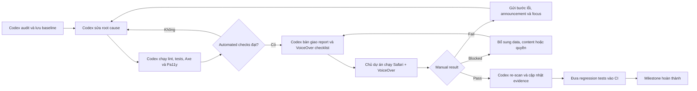

# Kế hoạch triển khai accessibility cho 4 user flow của EduMind

## 1. Mục tiêu và Definition of Done

Áp dụng WCAG 2.2 Level AA cho bốn flow:

1. Discover: Home → Browse Courses → Course Detail
2. Authentication: Login / Signup / Forgot Password / Reset Password
3. Purchase: Cart → Checkout → Success / Failed
4. Learning: My Learning → Course Player

Mỗi flow chỉ được đánh dấu hoàn thành khi:

- Không còn lỗi Axe mức `critical` hoặc `serious` tại các trạng thái được test.
- Không còn lỗi Pa11y thuộc WCAG 2.2 AA trên các URL có thể scan độc lập.
- Tất cả chức năng chính sử dụng được chỉ bằng keyboard.
- Focus indicator luôn nhìn thấy; không có keyboard trap.
- Heading, landmark và accessible name tạo thành accessibility tree hợp lý.
- Form error, loading, success và dynamic update được screen reader thông báo.
- Zoom 200% vẫn sử dụng được; 400% không mất nội dung/chức năng thiết yếu.
- Flow representative hoạt động với Safari + VoiceOver.
- Accessibility regression tests chạy trong CI.
- Có tài liệu audit trước/sau và danh sách giới hạn chưa xử lý.

Không tuyên bố toàn bộ website “WCAG certified”. Chỉ ghi rõ bốn critical journeys được triển khai và kiểm thử theo WCAG 2.2 AA.

## Phân công trách nhiệm và cách phối hợp

Phần lớn công việc kỹ thuật có thể giao cho Codex thực hiện. Tuy nhiên, kết quả chỉ được xem là hoàn chỉnh sau khi người sở hữu dự án thực hiện kiểm thử bằng assistive technology thật và xác nhận nội dung/nghiệp vụ. Không được dùng kết quả Axe, Pa11y hoặc accessibility tree để thay thế cho Safari + VoiceOver.

### Codex chịu trách nhiệm

- Audit source code, route, shared components và các test hiện có.
- Thiết lập ESLint accessibility rules, Pa11y, Axe và Playwright accessibility utilities.
- Chạy baseline scan trước khi sửa và lưu bằng chứng `before`.
- Phân loại issue theo root cause: shared component, page-specific hoặc content/backend limitation.
- Sửa semantic HTML, heading, landmark, accessible name, description, role và state.
- Sửa keyboard interaction và focus management cho route, modal, drawer, tabs, accordion và form validation.
- Sửa loading, error, success, toast và dynamic announcements.
- Viết component tests, Playwright accessibility tests, mocks và deterministic fixtures.
- Chạy lint, unit tests, build, Pa11y, Axe và Playwright sau khi sửa.
- Re-scan và lưu report `after`.
- Tích hợp accessibility regression gate vào CI.
- Viết testing guide, remediation log, known limitations và nội dung kỹ thuật cho portfolio/CV.
- Chuẩn bị checklist Safari + VoiceOver riêng cho từng flow, bao gồm thao tác, kết quả mong đợi và vị trí cần ghi nhận `Pass/Fail`.
- Phân tích kết quả manual test do chủ dự án cung cấp, sửa lỗi và gửi lại checklist để retest.

### Chủ dự án chịu trách nhiệm

- Chạy representative flows bằng Safari + VoiceOver trên macOS theo checklist do Codex cung cấp.
- Xác nhận thứ tự đọc, accessible name, error message và announcements có tự nhiên, dễ hiểu và không bị đọc lặp.
- Xác nhận nội dung nghiệp vụ như payment/refund instructions, alt text và course terminology là chính xác.
- Cung cấp hoặc xác nhận nguồn caption/transcript thực tế cho video; không coi placeholder hoặc caption fixture là production support.
- Chuẩn bị tài khoản/dữ liệu phục vụ manual test khi cần: student account, enrolled course, cart item, reset token và payment sandbox. Không ghi password, token hoặc secret vào tài liệu/repository.
- Thực hiện hoặc phê duyệt các thay đổi ngoài repository khi cần, ví dụ GitHub secrets, branch protection, Vercel, Cloudinary hoặc payment sandbox.
- Xác nhận kết quả manual test cuối cùng trước khi flow được đánh dấu hoàn thành.
- Hiểu và có thể giải thích root cause, giải pháp, WCAG criterion và regression test trước khi sử dụng dự án trong CV/phỏng vấn.

### Phần Codex có thể kiểm tra nhưng không thay thế manual VoiceOver

- Keyboard-only navigation: `Tab`, `Shift+Tab`, `Enter`, `Space`, `Escape`, Arrow keys, `Home` và `End`.
- Focus order, focus restoration, hidden/disabled focus target và keyboard trap.
- Accessibility tree, computed role, accessible name, description và state.
- Responsive viewport, zoom/reflow, focus-visible và một phần contrast/reduced-motion behavior.

Các kiểm tra trên giúp phát hiện và sửa phần lớn lỗi kỹ thuật, nhưng không chứng minh được trải nghiệm nghe thực tế có hợp lý hay không.

### Những việc bắt buộc phải kiểm tra thủ công

1. Safari + VoiceOver:
   - Discover: Home → Browse → Course Detail → Add to Cart.
   - Authentication: submit form lỗi → sửa lỗi → login/reset thành công.
   - Purchase: Cart → Checkout → Success và Cart → Checkout → Failed.
   - Learning: My Learning → Course Player → đổi lesson → Mark Complete.
2. Nội dung:
   - Link/button text có dễ hiểu khi đứng độc lập.
   - Error và recovery instructions có đúng nghiệp vụ.
   - Alt text phản ánh đúng mục đích hình ảnh.
   - Caption/transcript chính xác với nội dung video.
3. Trải nghiệm:
   - Thứ tự đọc hợp lý.
   - Không có thông báo bị đọc hai lần.
   - Chuyển route, mở/đóng dialog và submit lỗi không làm mất ngữ cảnh.
   - Người dùng biết trạng thái loading, success, failure và progress update.

### Handoff sau mỗi milestone

Sau mỗi flow, Codex phải bàn giao:

- Danh sách files/components và hành vi đã thay đổi.
- Root cause và WCAG criterion của từng nhóm issue.
- Kết quả lint, unit tests, build, Axe, Pa11y và Playwright.
- Report `before/after` và các issue chưa xử lý.
- Known limitations và lý do.
- Checklist VoiceOver khoảng 10–20 phút với expected result cho từng bước.

Chủ dự án thực hiện checklist và trả lại một trong ba trạng thái:

- `Pass`: hành vi đúng như expected result.
- `Fail`: ghi bước lỗi, câu VoiceOver đọc được, focus hiện tại và hành vi mong đợi; bổ sung recording nếu thuận tiện.
- `Blocked`: thiếu account, data, caption, sandbox hoặc quyền truy cập.

Khi nhận `Fail`, Codex phải tái hiện nếu có thể, sửa root cause, chạy lại automated regression và gửi checklist retest. Không đánh dấu flow hoàn thành khi manual VoiceOver còn `Fail` hoặc `Blocked`.

### Ma trận trách nhiệm

| Công việc | Codex | Chủ dự án |
|---|---|---|
| Audit source và baseline Axe/Pa11y | Thực hiện | Theo dõi kết quả |
| Sửa shared components và bốn flow | Thực hiện | Review nghiệp vụ |
| Component/Playwright tests | Thực hiện | Không bắt buộc |
| Keyboard và accessibility tree | Thực hiện | Có thể kiểm tra chéo |
| Safari + VoiceOver thật | Chuẩn bị checklist, phân tích và sửa lỗi | Thực hiện và xác nhận |
| Caption/transcript | Xây support và tests | Cung cấp/xác nhận nội dung |
| CI configuration | Thực hiện trong repository | Cấp quyền/secrets nếu cần |
| Before/after report | Thực hiện | Xác nhận manual result |
| Portfolio/CV case study | Soạn bằng chứng kỹ thuật | Chỉ sử dụng nội dung đã hiểu và xác thực |

### Vòng lặp phối hợp



### Điều kiện đóng một flow

Một flow chỉ được đóng khi đồng thời đáp ứng:

- Automated checks đạt Definition of Done.
- Không còn keyboard blocker.
- VoiceOver checklist đã được chủ dự án xác nhận `Pass`.
- Report `before/after` đã được lưu.
- Known limitations đã được ghi rõ và không bị diễn đạt thành tính năng đã hỗ trợ.
- Regression tests đã được thêm vào CI hoặc có task CI được ghi rõ nếu milestone CI chưa bắt đầu.

---

## 2. Phase 0 — Baseline và hạ tầng kiểm thử

### 2.1. Chuẩn hóa công cụ

Bổ sung:

- `@axe-core/playwright`: scan accessibility tại từng state trong Playwright.
- `axe-core`: dùng chung nếu cần scan trong component/integration test.
- `pa11y` và `pa11y-ci`: scan các route ổn định.
- `eslint-plugin-jsx-a11y`: phát hiện lỗi semantic trong React/JSX.
- Không chạy đồng thời Axe và Pa11y cho mọi state; Axe phụ trách interactive/authenticated state, Pa11y phụ trách URL-level smoke scan.

Thêm scripts:

- `npm run lint:a11y`
- `npm run test:a11y`
- `npm run test:a11y:public`
- `npm run test:a11y:auth`
- `npm run test:a11y:purchase`
- `npm run test:a11y:learning`
- `npm run pa11y`
- `npm run test:a11y:report`

### 2.2. Tạo accessibility test utilities

Tạo helper Playwright dùng chung có interface tương đương:

```ts
checkA11y(page, {
  context?: string | Locator;
  include?: string[];
  exclude?: string[];
  tags?: ['wcag2a', 'wcag2aa', 'wcag21a', 'wcag21aa', 'wcag22aa'];
  stateName: string;
});
```

Helper phải:

- Chạy Axe sau khi UI đã ổn định.
- Mặc định scan toàn document.
- Chỉ kiểm tra rules thuộc WCAG A/AA.
- Fail khi có violation `critical` hoặc `serious`.
- In ra rule ID, WCAG tags, selector, HTML snippet và hướng sửa.
- Đính kèm JSON report vào Playwright artifact khi fail.
- Không tự động exclude component chỉ để làm test pass.
- Mọi exclusion phải có comment gồm lý do, issue ID và điều kiện gỡ bỏ.

Tạo helper keyboard:

- Gửi `Tab` và lưu element đang focus.
- Kiểm tra focus không đi vào element ẩn/disabled.
- Phát hiện vòng lặp hoặc keyboard trap.
- Kiểm tra focus visible bằng computed style hoặc screenshot assertion tại các điểm quan trọng.

### 2.3. Cấu hình Pa11y

Scan tối thiểu các public/auth route:

- `/`
- `/courses`
- Một `/courses/:courseSlug` có dữ liệu ổn định
- `/login`
- `/signup`
- `/forgot-password`
- `/reset-password` với invalid/missing token
- `/checkout/success`
- `/checkout/failed`

Cấu hình:

- Standard: `WCAG2AA`.
- Timeout đủ cho React lazy route và API loading.
- Chờ selector đại diện cho page-ready thay vì chỉ `networkidle`.
- Lưu JSON/HTML report làm artifact.
- Không scan production data biến động trong CI; dùng local app và fixtures/mocks ổn định.

### 2.4. Baseline audit

Trước khi sửa:

1. Chạy lint, Pa11y và Axe trên tất cả route trong scope.
2. Thực hiện keyboard smoke test.
3. Ghi nhận issue theo mẫu:

```text
ID
Route / component
State
WCAG criterion
Tool/manual
Severity
Steps to reproduce
Expected behavior
Proposed fix
Before evidence
After evidence
Status
```

4. Gom lỗi có cùng root cause vào shared component.
5. Ưu tiên theo thứ tự:

   - Không thể hoàn thành chức năng bằng keyboard/screen reader.
   - Thiếu accessible name hoặc sai role/state.
   - Focus management.
   - Form validation và dynamic announcements.
   - Heading/landmark.
   - Contrast, zoom và reflow.
   - Cải thiện trải nghiệm không mang tính blocking.

### 2.5. Kiểm tra shared foundation trước các page

Audit và sửa các thành phần được tái sử dụng:

- `MainLayout`, `AuthLayout`: skip link, `header`, `nav`, `main`, `footer`, page title.
- Route navigation: chuyển focus đến `main` hoặc `h1` sau khi chuyển trang; không làm mất focus khi query string thay đổi.
- `Input`, `PasswordInput`, `Select`, `Checkbox`, `Radio`, `Switch`, `Textarea`: label, hint, required, error ID, `aria-invalid`, `aria-describedby`.
- `Button`, `IconButton`: accessible name, disabled/loading semantics.
- `Modal`, `ConfirmDialog`, mobile drawer/cart drawer: dialog label, focus trap, initial focus, Escape, restore focus.
- `Toast`, `Alert`: `role="alert"` hoặc `status` đúng mức độ; tránh announce cùng lỗi hai lần.
- `Tabs`: arrow-key navigation, `aria-selected`, `aria-controls`, active tab focus.
- `ProgressBar`: accessible label, current/min/max value.
- Skeleton/loading overlay: không lọt vào accessibility tree; loading state có `status`.
- Icon: decorative icon dùng `aria-hidden`; informative icon phải có text alternative.
- Card có nhiều click target: tránh nested interactive control và duplicated accessible names.

Acceptance:

- Shared component có unit test cho accessible role/name/state.
- Không sửa page bằng ARIA workaround nếu lỗi thuộc shared component.
- Không dùng `div onClick` thay cho `button` hoặc `a`.

---

## 3. Flow 1 — Home → Browse → Course Detail

### 3.1. HomePage

Audit các trạng thái:

- Initial loading/skeleton.
- Hero và CTA.
- Featured/popular course lists.
- Empty API result.
- API error.
- Desktop và mobile navigation.

Implementation tasks:

- Chỉ có một `h1`; section chính dùng `h2` theo thứ tự.
- CTA điều hướng dùng link; action thay đổi state dùng button.
- Course card có tên link rõ nghĩa, không chỉ “View course”.
- Rating có một accessible description; ẩn các star SVG lặp lại.
- Image có `alt` mô tả mục đích; ảnh trang trí dùng `alt=""`.
- Course list có heading/region name rõ ràng.
- Loading state có text dành cho screen reader.
- Error state có alert và retry button có accessible name.
- Thêm skip link “Skip to main content”.
- Focus order của header/mobile menu hợp lý.

Automated tests:

- Axe: loaded, loading, empty và error state.
- Keyboard: skip link, navigation, hero CTA, course card.
- Kiểm tra mỗi course card có accessible link name chứa course title.
- Kiểm tra page có đúng một `main` và `h1`.

VoiceOver:

- Rotor Landmarks hiển thị header/navigation/main/footer.
- Rotor Headings phản ánh đúng cấu trúc nội dung.
- Đọc course card không bị lặp rating/icon/giá.

### 3.2. BrowseCoursesPage

Audit các trạng thái:

- Danh sách mặc định.
- Search có kết quả/không có kết quả.
- Category, level, price, rating filters.
- Active filters.
- Pagination.
- Mobile filter drawer.
- API loading/error.

Implementation tasks:

- Search input có persistent label; placeholder không thay thế label.
- Search submit/clear có accessible name.
- Filter groups dùng `fieldset/legend` khi phù hợp hoặc group có accessible name.
- Native checkbox/radio được ưu tiên.
- Số kết quả thay đổi được announce bằng `aria-live="polite"`.
- Không announce ở từng keystroke nếu search có debounce; chỉ announce kết quả đã cập nhật.
- Filter drawer có dialog semantics, focus trap, Escape và restore focus.
- Active filter remove button chứa tên filter trong accessible name.
- Pagination có `nav aria-label="Pagination"`; current page dùng `aria-current="page"`.
- Khi đổi page, focus chuyển đến heading/list result, không quay về đầu document.
- Empty state có heading và cách xóa filter.
- Skeleton không được screen reader đọc như content thật.

Automated tests:

- Axe ở trạng thái default, filters mở, mobile drawer mở, empty results.
- Keyboard thao tác toàn bộ filter và đóng drawer bằng Escape.
- Test live-region sau search/filter.
- Test `aria-current` khi đổi pagination.
- Test focus sau Apply filters và đổi page.
- Test viewport mobile và desktop.

VoiceOver:

- Duyệt filter theo form controls.
- Mở/đóng mobile drawer và xác nhận focus không thoát ra nền.
- Xác nhận số kết quả được announce đúng một lần.

### 3.3. CourseDetailPage

Audit các trạng thái:

- Course hợp lệ.
- Loading.
- Not found/404.
- User chưa đăng nhập.
- Đã đăng nhập nhưng chưa mua.
- Đã thêm vào cart.
- Đã enrolled.
- Curriculum accordion.
- Reviews/rating.
- Preview/video modal nếu có.

Implementation tasks:

- Course title là `h1`; metadata không được giả heading.
- Breadcrumb/back link có text rõ nghĩa.
- Thumbnail và instructor image có alt hợp lý.
- Price/discount được đọc theo một câu dễ hiểu, tránh đọc giá cũ và mới thiếu ngữ cảnh.
- Rating stars chỉ expose một accessible value.
- Curriculum accordion dùng button, `aria-expanded` và `aria-controls`.
- “Expand all/Collapse all” cập nhật accessible name/state.
- Lesson locked/free-preview state không chỉ biểu diễn bằng màu/icon.
- Add to cart/enroll/continue learning button phản ánh loading và disabled state.
- Sau add-to-cart: announce success; nếu cart drawer mở thì quản lý focus như dialog.
- Not-found state có `h1`, status thích hợp và link quay lại browse.
- Review list có heading/order hợp lý.

Automated tests:

- Axe cho guest, enrolled, loading, 404, curriculum expanded, cart drawer.
- Keyboard accordion, CTA và dialog.
- Assert `aria-expanded` đồng bộ với content.
- Assert không có nested link/button trong course card/sidebar.
- Assert add-to-cart state được announce.

VoiceOver:

- Course overview được hiểu mà không cần nhìn layout.
- Curriculum đọc được section → lesson → trạng thái.
- Add-to-cart và drawer flow hoàn tất được bằng VoiceOver.

### 3.4. Flow 1 end-to-end acceptance

Playwright scenario:

1. Mở Home.
2. Dùng skip link.
3. Đi đến Browse bằng keyboard.
4. Search và chọn filter.
5. Mở một course.
6. Expand curriculum.
7. Add course vào cart hoặc xác nhận CTA tương ứng.
8. Chạy Axe tại mỗi state quan trọng.

---

## 4. Flow 2 — Authentication

### 4.1. AuthLayout dùng chung

Implementation tasks:

- Có một `main`, page heading phù hợp và logo link có accessible name.
- Decorative background/illustration bị ẩn khỏi accessibility tree.
- Route title riêng cho Login, Signup, Forgot và Reset.
- Focus đến heading khi chuyển giữa các auth route.
- Không tự động focus input nếu làm VoiceOver bỏ qua heading; nếu autofocus thì phải có lý do rõ ràng.

### 4.2. LoginPage

Audit:

- Default.
- Empty submit.
- Invalid email/password.
- Server error.
- Loading.
- Password visibility.
- 2FA state nếu login trả về yêu cầu 2FA.

Implementation tasks:

- Email/username và password có label được liên kết.
- Password toggle là button với name thay đổi “Show password”/“Hide password”.
- Toggle không lấy mất giá trị input hoặc phá tab order.
- Submit loading có `aria-busy`, giữ accessible name ổn định và ngăn double-submit.
- Form-level server error dùng `role="alert"`; không đồng thời announce toast và inline error.
- Khi submit lỗi, focus đến error summary hoặc field invalid đầu tiên.
- Error summary chứa link/focus target đến field tương ứng nếu có nhiều lỗi.
- 2FA code có label, format hint, validation và status announcement.
- Forgot password và Signup là link, không dùng button điều hướng.

Tests:

- Axe default, validation error, server error, loading và 2FA.
- Accessible name/description cho từng input.
- Keyboard hoàn tất login.
- Focus đến invalid field/error summary.
- Password toggle state và name.
- Enter submit hoạt động.
- Error được announce đúng một lần.

### 4.3. SignupPage

Audit:

- Default.
- Tất cả field rỗng.
- Email/username trùng.
- Password không đạt policy.
- Password mismatch.
- Loading và signup success.

Implementation tasks:

- Required fields được thể hiện bằng text và semantic, không chỉ dấu `*`.
- Password requirements tồn tại trước khi lỗi và được nối bằng `aria-describedby`.
- Requirement state không chỉ dùng đỏ/xanh; có text/icon alternative.
- First/last name grouping không làm mất label ở mobile.
- Checkbox Terms nếu có phải có label đầy đủ và link Terms tách biệt nhưng vẫn keyboard-friendly.
- Sau submit lỗi, focus đến error summary/first invalid field.
- Sau success, announce trạng thái trước khi redirect hoặc cung cấp destination rõ ràng.
- Browser autocomplete hợp lý: `username`, `email`, `new-password`, `given-name`, `family-name`, `tel`.

Tests:

- Axe default, multi-error, duplicate account, loading/success.
- Tab order.
- Password requirement accessible description.
- Error association bằng ID.
- Keyboard activation cho checkbox và Terms link.
- Không có input error chỉ được biểu diễn bằng màu.

### 4.4. ForgotPasswordPage

Implementation tasks:

- Email có label và autocomplete.
- Validation/server error được announce đúng một lần.
- Success confirmation dùng `role="status"` hoặc live region `polite`.
- Không tiết lộ email tồn tại hay không nếu backend dùng generic response.
- Resend action có trạng thái disabled/loading và thông báo thời gian chờ nếu có.
- Back-to-login là link.
- Sau success, focus đến confirmation heading/status.

Tests:

- Default, invalid email, API failure và success.
- Axe cho từng state.
- Focus và announcement sau submit.
- Keyboard-only resend/back flow.

### 4.5. ResetPasswordPage

Audit:

- Missing token.
- Invalid/expired token.
- Valid token/default form.
- Password validation.
- Password mismatch.
- Submit loading.
- Reset success.

Implementation tasks:

- Invalid/missing token có heading rõ ràng và link/request-new-reset action.
- New password và confirmation có correct autocomplete.
- Hai password toggle có accessible name độc lập.
- Password policy được nối với field.
- Error summary/focus giống Signup.
- Success state announce và có link Login; không redirect quá nhanh khiến screen reader bỏ lỡ thông báo.

Tests:

- Axe cho mỗi token state.
- Keyboard completion.
- Focus sau invalid token và validation failure.
- Password toggle/requirement semantics.
- Success announcement.

### 4.6. Flow 2 end-to-end acceptance

Playwright scenarios:

- Login success.
- Login failure.
- Login yêu cầu 2FA.
- Signup validation và success.
- Forgot password success/error.
- Reset password invalid-token/valid-token/success.
- Guest truy cập protected route → Login → quay lại destination.
- Axe chạy sau mỗi state transition, không chỉ page load.

VoiceOver manual:

- Hoàn tất Login.
- Sửa một form có nhiều lỗi.
- Bật/tắt password visibility.
- Forgot → Reset flow với test token.
- Xác nhận không có lỗi/toast bị đọc hai lần.

---

## 5. Flow 3 — Cart → Checkout → Success / Failed

### 5.1. Cart UI và cart drawer

Audit:

- Empty cart.
- Cart có một/nhiều item.
- Remove confirmation.
- Update loading/error.
- Cart drawer mở từ header hoặc add-to-cart.

Implementation tasks:

- Cart page có `h1` và số lượng item được đọc tự nhiên.
- Cart item dùng list semantics.
- Course image/name/price không tạo text lặp không cần thiết.
- Remove button có tên chứa course title.
- Quantity control nếu có dùng native controls hoặc button có name đầy đủ.
- Giá gốc, discount và total có label rõ.
- Khi remove item: announce item đã xóa và tổng mới; focus chuyển đến item kế tiếp, heading cart hoặc empty-state heading.
- Cart drawer là dialog có label, focus trap, Escape, close button và restore focus về Add to Cart/cart icon.
- Empty cart có heading và link Browse Courses.
- Checkout CTA disabled state phải giải thích được lý do nếu hiển thị disabled.

Tests:

- Axe empty, populated, remove dialog, update error, drawer open.
- Keyboard add/remove/close drawer.
- Focus restoration sau drawer và remove.
- Live announcement khi count/total thay đổi.
- Không có duplicate interactive targets cho cùng course.

### 5.2. CheckoutPage

Audit:

- Cart checkout.
- Direct checkout.
- Loading.
- Cart/direct item error.
- Payment method selection.
- Submit processing.
- Validation error.
- Backend failure.

Implementation tasks:

- Checkout heading là `h1`; order summary và payment method dùng `h2`.
- Payment methods dùng `fieldset/legend` và native radio.
- Selected state không chỉ dựa vào border/color.
- Order summary dùng semantic list hoặc description structure.
- Total cần accessible label và currency được đọc rõ.
- Terms/confirmation checkbox nếu có label đầy đủ.
- Place order button có loading state, ngăn double-submit nhưng vẫn expose trạng thái.
- Không thay button text bằng spinner không tên.
- Checkout error dùng alert/error summary và đưa focus phù hợp.
- Nếu redirect tới gateway, accessible text phải báo người dùng sắp rời EduMind.
- Nếu direct checkout thiếu item/course, cung cấp recovery action.
- Back button phải là link hoặc button có behavior chuẩn; không phụ thuộc browser history nếu history rỗng.

Tests:

- Axe cart checkout, direct checkout, validation error, processing và API error.
- Radio keyboard: arrow keys đổi payment method.
- Tab order không đi qua order summary không tương tác.
- Enter/Space submit đúng một lần.
- Focus đến error khi payment failure.
- Mock success/failure deterministic; không skip vì cart không có seed data.

### 5.3. CheckoutSuccessPage

Implementation tasks:

- Loading capture dùng `role="status"` và accessible loading text.
- Success dùng `h1`; icon success là decorative.
- Order ID/number có label rõ.
- Next actions là link/button đúng semantics.
- Nếu capture chuyển loading → success, focus/announcement phải giúp screen reader nhận biết state mới.
- Không tự redirect trước khi user đọc trạng thái.
- Error trong capture phải dùng error heading/alert và recovery actions.

Tests:

- Axe loading, success và capture error.
- Announcement khi state đổi.
- Focus đến success/error heading.
- Keyboard vào My Learning/Orders/Retry.

### 5.4. CheckoutFailedPage

Implementation tasks:

- Error icon decorative; không dùng icon/màu làm thông tin duy nhất.
- `h1` khác nhau hợp lý cho cancelled, declined, refunded và manual-refund state.
- Error detail và next steps có structure rõ.
- Retry chỉ hiển thị khi thực sự retry được.
- Refund pending có status text và timeline không phụ thuộc màu.
- Focus đến page heading khi điều hướng từ Checkout.
- Query string error không được render thành unsafe/unbounded technical message.

Tests:

- Axe cho các error code representative:

  - User cancelled.
  - Instrument declined.
  - Retry limit exceeded.
  - Enrollment failed but refunded.
  - Manual refund required.

- Kiểm tra CTA theo từng error code.
- Keyboard retry/back/support.
- Accessible heading/status đúng với error state.

### 5.5. Flow 3 end-to-end acceptance

Deterministic Playwright scenarios:

1. Add course từ Course Detail.
2. Cart drawer mở và đóng bằng keyboard.
3. Cart hiển thị item.
4. Checkout với mocked success.
5. Success page được announce.
6. Chạy lại với mocked payment failure.
7. Failed page có recovery action.
8. Chạy empty-cart và direct-checkout scenarios.
9. Axe tại drawer, cart, payment selection, processing, success và failure.

Không dùng `test.skip()` do thiếu dữ liệu. Fixtures phải seed hoặc mock cart/course/payment state để CI luôn thực thi assertion.

VoiceOver manual:

- Add/remove course.
- Đọc order summary.
- Chọn payment method.
- Hoàn thành cả success và failed flow.
- Xác nhận loading/success/error được announce một lần.

---

## 6. Flow 4 — My Learning → Course Player

### 6.1. MyLearningPage

Audit:

- Loading.
- Empty.
- Enrollment list.
- All/In Progress/Completed tabs.
- Search/sort nếu có.
- Course progress.
- API error.

Implementation tasks:

- Một `h1`; tab list có accessible label.
- Shared Tabs hỗ trợ Left/Right, Home/End và roving `tabIndex`.
- Mỗi tab liên kết đúng tabpanel.
- Đổi tab announce tên filter và số course.
- Enrollment cards dùng list semantics.
- Continue Learning accessible name chứa course title.
- Progress bar có label, `aria-valuemin`, `aria-valuemax`, `aria-valuenow` hoặc text equivalent.
- Completed/in-progress state không chỉ dựa vào màu.
- Empty state thay đổi theo tab và được announce.
- Loading skeleton bị ẩn khỏi accessibility tree.
- Error state có alert và retry.

Tests:

- Axe loading, empty, each tab, populated và error.
- Keyboard tab navigation theo WAI-ARIA tabs pattern.
- Accessible progress value.
- Focus giữ tại tab sau khi đổi filter.
- Continue Learning điều hướng đúng bằng Enter.
- Announcement cho result count.

### 6.2. CoursePlayerPage — structure và navigation

Audit:

- Initial loading.
- Access denied/suspended/dropped.
- Desktop/mobile sidebar.
- Section expanded/collapsed.
- Current/completed/locked lesson.
- Video lesson.
- Text/article lesson.
- Quiz lesson nếu nằm trong scope hiện có.
- Progress update success/error.
- Course completion.

Implementation tasks:

- Có `main` và `h1` là course title; current lesson title ở cấp heading tiếp theo.
- Sidebar là navigation/region có accessible label.
- Mobile sidebar hoạt động như drawer/dialog nếu overlay nội dung.
- Section accordion dùng button, `aria-expanded`, `aria-controls`.
- Lesson list dùng semantic list.
- Current lesson dùng `aria-current="step"` hoặc `"page"`.
- Completed, current và locked state có text alternative, không chỉ icon/màu.
- Locked lesson không focusable nếu không có action; nếu focusable phải giải thích lý do khóa.
- Khi chọn lesson, focus chuyển tới lesson heading/content; thay đổi lesson được announce.
- Exit button và sidebar toggle có accessible names rõ.
- Access-error modal quản lý focus và recovery action.

Tests:

- Axe loading, access error, sidebar open/closed, section expanded và selected lesson.
- Keyboard mở section, chọn lesson, đóng sidebar, exit player.
- Assert `aria-current` và expanded state.
- Focus chuyển đúng khi chọn lesson.
- Mobile drawer không keyboard trap ngoài ý muốn.

### 6.3. CoursePlayerPage — media, content và progress

Implementation tasks:

- Video player phải có accessible controls cho play/pause, seek, volume, mute, fullscreen và elapsed time.
- Không dùng custom control chỉ nhận pointer event.
- Video cần captions khi course data cung cấp caption; nếu chưa có caption pipeline, ghi thành documented limitation thay vì tuyên bố full conformance.
- Cung cấp transcript hoặc placeholder policy nếu sản phẩm chưa hỗ trợ transcript.
- Không autoplay có âm thanh.
- Text lesson giữ semantic heading/list/code structure sau khi render Markdown/HTML.
- Code block có accessible context/language.
- “Mark complete” có trạng thái loading/disabled/name ổn định.
- Sau complete: announce completion và progress mới.
- Auto-advance phải được báo trước; ưu tiên để user chủ động chuyển bài.
- Quiz question dùng `fieldset/legend`; answer dùng radio/checkbox; result được announce.
- Progress save error không chỉ xuất hiện dưới dạng toast ngắn; cần state/retry có thể truy cập.
- Course completion state có heading/status và next action.

Tests:

- Axe cho video, text, quiz, completion và save-error state.
- Keyboard điều khiển video controls.
- Kiểm tra caption track nếu fixture có caption.
- Text lesson semantic assertions.
- Quiz keyboard/validation/result.
- Mark-complete announcement và updated progress.
- Không double-submit completion.
- Progress error có retry/name/status.

### 6.4. Flow 4 end-to-end acceptance

Dùng fixture có course deterministic gồm:

- Ít nhất hai section.
- Một video lesson có caption test.
- Một text lesson.
- Một quiz lesson nếu quiz đã được sản phẩm hỗ trợ.
- Một locked lesson.
- Trạng thái in-progress và completed.

Playwright scenario:

1. Mở My Learning.
2. Dùng keyboard đổi sang In Progress.
3. Chọn Continue Learning.
4. Mở/đóng sidebar.
5. Chuyển giữa ít nhất hai lesson.
6. Điều khiển video bằng keyboard.
7. Mark lesson complete.
8. Xác nhận progress update.
9. Giả lập save failure và retry.
10. Axe scan ở từng state quan trọng.

VoiceOver manual:

- Duyệt danh sách enrolled courses.
- Đổi tabs.
- Vào Course Player.
- Xác định current/completed/locked lesson.
- Chuyển lesson.
- Điều khiển video và bật caption.
- Mark complete và nghe progress update.

---

## 7. Component tests và regression strategy

Bổ sung unit/component tests cho hành vi có logic:

- Input error ID và `aria-describedby`.
- Password visibility toggle.
- Modal initial focus, Escape và restore focus.
- Tabs keyboard navigation.
- Toast/status announcement.
- ProgressBar accessible value.
- Accordion state.
- Cart item remove accessible name.
- Course lesson current/locked/completed state.

Không snapshot toàn bộ accessibility markup. Ưu tiên Testing Library:

- `getByRole`
- `getByLabelText`
- `getByText`
- `toHaveAccessibleName`
- `toHaveAccessibleDescription`
- `toHaveAttribute`
- `toHaveFocus`

Locator bằng class hoặc `data-testid` chỉ dùng khi không có semantic selector hợp lý. Việc test khó bằng role/name được xem là tín hiệu component chưa đủ accessible.

---

## 8. Manual test matrix

Chạy manual test tối thiểu trên:

- Chrome desktop: keyboard-only và 200% zoom.
- Safari macOS + VoiceOver: bốn representative flows.
- Mobile viewport 320 CSS px: reflow và drawer.
- Forced-colors/high-contrast nếu môi trường hỗ trợ.
- Reduced motion: xác nhận animation không cản trở và app tôn trọng `prefers-reduced-motion`.

Checklist keyboard cho mỗi route:

1. Reload page.
2. Tab từ đầu document.
3. Kiểm tra skip link.
4. Ghi lại focus order.
5. Kích hoạt control bằng Enter/Space.
6. Dùng Arrow/Home/End với tabs/radio/menu.
7. Dùng Escape với modal/drawer.
8. Xác nhận focus trở về trigger.
9. Kiểm tra không có control ẩn nhận focus.
10. Kiểm tra focus indicator trên light/dark/gradient backgrounds.

Checklist VoiceOver:

1. Đọc page title.
2. Duyệt Landmarks.
3. Duyệt Headings.
4. Duyệt Links/Form Controls.
5. Hoàn thành happy path.
6. Kích hoạt ít nhất một validation error.
7. Kiểm tra loading, success và error announcements.
8. Xác nhận dynamic update không im lặng hoặc bị đọc hai lần.

---

## 9. CI và reporting

Cập nhật frontend CI theo thứ tự:

1. Install dependencies.
2. Accessibility-aware ESLint.
3. Unit/component tests.
4. Build.
5. Khởi động user app với deterministic fixtures/mocks.
6. Chạy Pa11y public/auth routes.
7. Chạy Playwright accessibility suite cho bốn flow.
8. Upload Axe/Pa11y HTML/JSON report khi job fail.

CI policy:

- PR mới fail nếu tạo Axe violation `critical` hoặc `serious`.
- Pa11y fail theo threshold `0` cho route đã baseline.
- Lỗi `moderate` phải được sửa hoặc ghi issue có owner/reason.
- Không cho phép tăng baseline violation count.
- Accessibility test không được phụ thuộc dữ liệu ngẫu nhiên hoặc skip vì thiếu seed.
- Full visual/manual VoiceOver không chạy CI; lưu checklist và evidence trong PR/audit docs.

---

## 10. Thứ tự triển khai đề xuất

### Milestone 1 — Foundation

- Baseline audit.
- Tooling Axe/Pa11y/ESLint.
- Shared form controls.
- Modal/drawer/toast/tabs/progress.
- Skip link, landmarks và route focus management.

### Milestone 2 — Public discovery

- Home.
- Browse.
- Course Detail.
- Flow 1 E2E và VoiceOver report.

### Milestone 3 — Authentication

- AuthLayout.
- Login/Signup.
- Forgot/Reset.
- Auth state E2E và VoiceOver report.

### Milestone 4 — Purchase

- Cart/cart drawer.
- Checkout.
- Success/Failed states.
- Deterministic payment E2E và VoiceOver report.

### Milestone 5 — Learning

- My Learning.
- Course Player navigation.
- Media/content/progress.
- Learning E2E và VoiceOver report.

### Milestone 6 — CI and portfolio evidence

- Bật accessibility gate trong CI.
- Chạy full regression.
- Lưu before/after reports.
- Viết accessibility README/case study.
- Ghi rõ supported flows, WCAG target, test matrix và known limitations.

Mỗi milestone nên là một PR độc lập hoặc một nhóm commit rõ ràng: baseline → shared fixes → page fixes → automated tests → manual verification.

---

## 11. Deliverables để dùng cho CV/portfolio

Sau khi hoàn thành cần có:

- Accessibility testing guide.
- Audit report trước và sau.
- WCAG issue remediation log.
- Axe/Pa11y reports từ CI.
- Playwright accessibility suites cho bốn flow.
- Manual keyboard + VoiceOver checklist có ngày/browser/version.
- Tài liệu kiến trúc giải thích ba tầng kiểm thử: static, automated browser và assistive technology.
- Known limitations, đặc biệt captions/transcripts và third-party payment/video UI.
- Một sơ đồ flow mô tả scan → classify → fix shared root cause → test → re-scan → CI prevention.

## Assumptions

- Chuẩn mục tiêu là WCAG 2.2 AA.
- Phạm vi chính là React user portal; Angular admin portal chưa nằm trong milestone này.
- Home, Browse và Course Detail vẫn được re-audit dù đã hoàn thành SEO/a11y trước đó.
- Chrome + Axe là automated baseline; Safari + VoiceOver là manual screen-reader baseline.
- Payment và learning tests sử dụng deterministic API mocks/fixtures.
- Caption/transcript cần dữ liệu hoặc backend support; nếu chưa tồn tại sẽ được ghi rõ là limitation, không giả lập là đã compliant.
- Không chặn CI dựa trên Lighthouse accessibility score vì điểm tổng hợp không thay thế rule-level assertions và manual testing.
