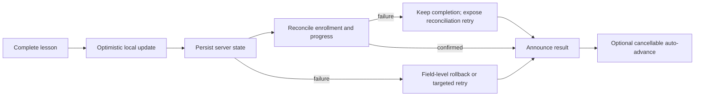
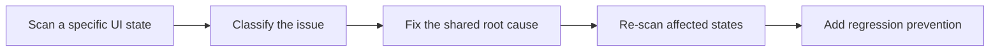
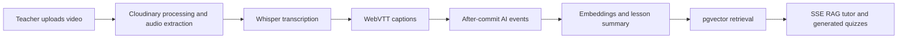
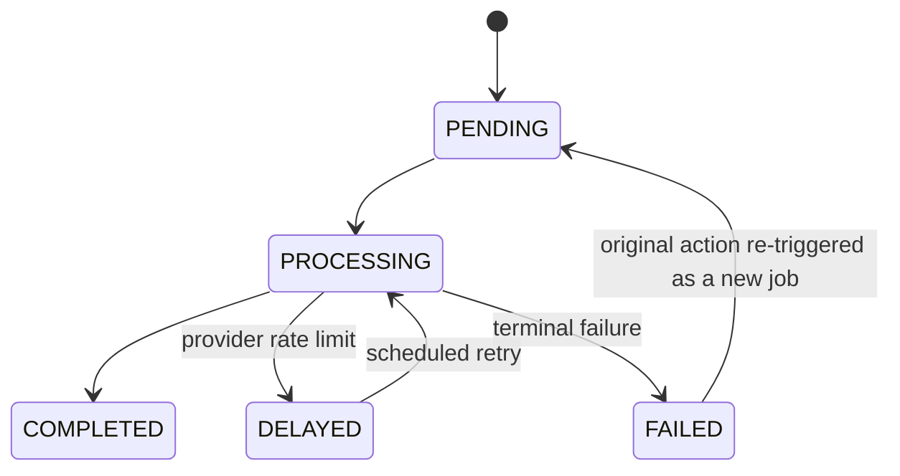
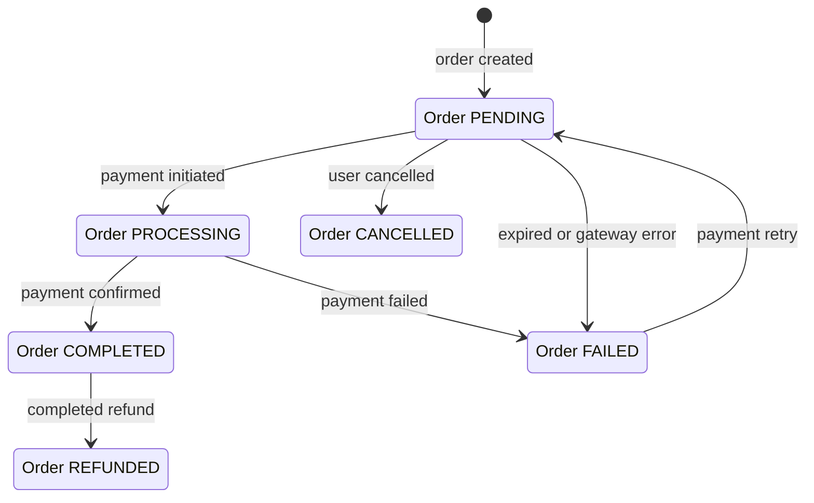
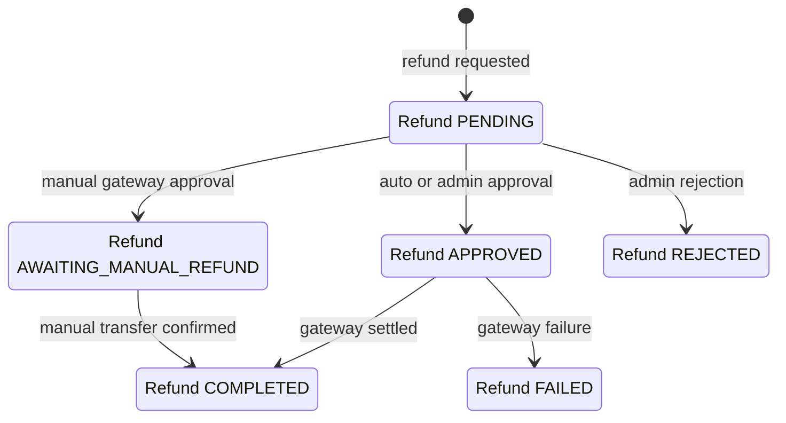
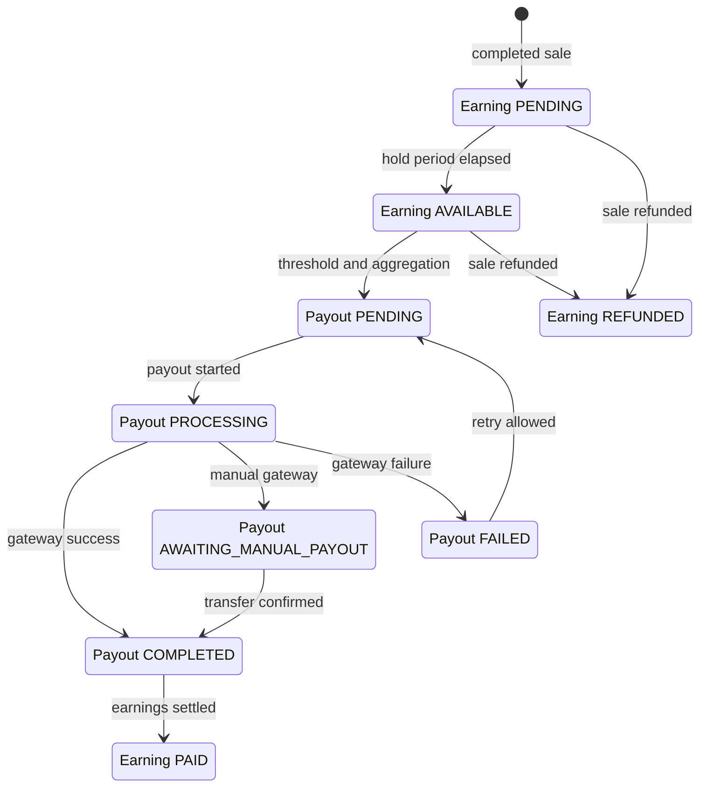
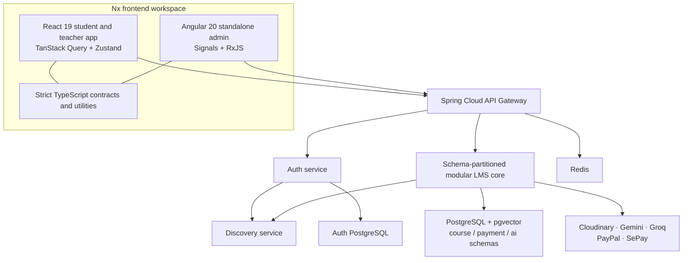

# EduMind

**An AI-powered learning and commerce platform built around reliable learning, inclusive interaction, and production-minded delivery.**

**[Explore the live product ↗](https://edumind.nguyenloc.dev)** &nbsp; · &nbsp; [Watch the video tour](#video-tour)

*A frontend-focused full-stack engineering portfolio demonstrating race-safe React architecture, accessibility automation, streaming AI interfaces, and end-to-end system ownership.*

> **GHI CHÚ — CẦN BỔ SUNG ẢNH HERO:** Thêm ảnh chụp Course Player bản desktop đã được tối ưu dung lượng vào `docs/media/course-player-hero.webp`, kiểm tra ảnh không chứa email, token, ID người dùng hoặc dữ liệu thanh toán, rồi thay ghi chú này bằng ảnh có alt text mô tả rõ giao diện.

## Choose a demo experience

| Role | What to explore | Demo access |
| --- | --- | --- |
| **Student** | Course discovery, checkout, learning runtime, quizzes, captions, and the cited AI tutor | **GHI CHÚ:** Cung cấp URL và tài khoản student demo giới hạn quyền |
| **Teacher** | Course authoring, video processing, analytics, earnings, and payouts | **GHI CHÚ:** Cung cấp URL và tài khoản teacher demo giới hạn quyền |
| **Admin** | Moderation, teacher applications, refunds, and payout operations | **GHI CHÚ:** Cung cấp URL safe admin demo giới hạn quyền |

[](frontend/apps/user)
[](frontend/apps/admin)
[](frontend)
[](frontend)
[](backend)
[](.github/workflows)

**[Engineering highlights](#engineering-highlights)** · **[Architecture](#platform-architecture)** · **[Product tour](#product-tour)**

EduMind combines a React student and teacher experience, an Angular administration console, and a Spring platform for learning, AI, payments, refunds, and instructor settlement. Its engineering focus is not feature count: it is correctness when navigation and network responses race, recovery when external systems fail, accessible interaction across complete journeys, and explicit tradeoffs that fit the project's real operating scale.

This project was independently architected and owned end to end. AI accelerated research, implementation, and verification; architecture, tradeoffs, integration, code review, debugging, and final validation remained personally owned.

## Why this is not another CRUD LMS

| Engineering proof | What makes it difficult |
| --- | --- |
| **Race-resistant learning runtime** | Course, lesson, completion, video-save, focus, and auto-advance state stay consistent through rapid navigation and overlapping requests. |
| **Four-flow accessibility engineering** | Discovery, authentication, purchase, and learning are tested as stateful journeys—not reduced to a page-load score. |
| **Streaming RAG and asynchronous AI jobs** | Transcription, captions, embeddings, retrieval, summaries, quizzes, citations, retry, and cancellation form one lifecycle. |
| **Replay-safe financial workflows** | Checkout, webhooks, refunds, earnings reversal, and payouts use explicit states, idempotency, locking, and reconciliation. |
| **Two frameworks, one Nx platform** | React 19 and Angular 20 share strict TypeScript contracts and utilities while retaining framework-appropriate state models. |
| **Production verification and delivery** | Tests, health-gated rollout, immutable images, Sentry releases, and SEO prerendering are treated as product behavior. |

## Engineering highlights

### 1. Course Player: a race-resistant learning runtime

#### Problem

A course player coordinates remote progress, URL state, local restoration, video time, quiz eligibility, completion, layout, focus, announcements, and navigation. When a learner switches courses or lessons quickly, a valid response can become stale before it arrives. A naive optimistic update can also roll back newer data or auto-advance the wrong lesson.

#### Decisions

- Page orchestration is decomposed into focused hooks for data, layout, navigation, completion, video progress, quiz availability, and auto-advance.
- Monotonic version guards discard responses made obsolete by a course or lesson switch. Course A progress cannot overwrite Course B; Lesson A completion cannot announce, focus, or auto-advance inside Lesson B.
- Manual completion, video end, and quiz pass converge on one completion path. Synchronous refs close the gap in which rapid input could submit twice.
- Completion updates optimistically, then reconciles with server enrollment and progress data. Field-level rollback restores only the failed mutation's fields, preserving newer concurrent progress.
- Persistence failure and reconciliation failure expose different recovery paths. The completed-course UI appears only from server-confirmed enrollment data.
- Video autosave reads live refs, permits one write in flight, and retries the exact failed payload. A failed save remains owned by its original lesson even after navigation.
- URL state, local restoration, and predictive quiz/summary prefetching are coordinated. Navigation also manages the mobile drawer, scroll position, focus, and screen-reader announcements.
- The custom player provides keyboard controls, captions, quality switching, playback-position preservation, and lifecycle cleanup.

#### State and recovery sequence



#### Failure modes handled

- Out-of-order course and lesson responses.
- Double completion from rapid input or overlapping triggers.
- New progress arriving while an older optimistic request fails.
- Navigation during completion, autosave, prefetch, or auto-advance.
- Retry accidentally writing a failed video's time to the new lesson.
- Server persistence succeeding while follow-up reconciliation fails.

#### Evidence

Representative implementation and regression evidence:

- [Course Player orchestration](frontend/apps/user/src/app/pages/learning/course-player/CoursePlayerPage.tsx) and [stale-response protection](frontend/apps/user/src/app/pages/learning/course-player/hooks/useCoursePlayerData.ts)
- [Completion, reconciliation, and field-level rollback](frontend/apps/user/src/app/pages/learning/course-player/hooks/useLessonCompletion.ts)
- [Video autosave and exact-payload retry](frontend/apps/user/src/app/pages/learning/course-player/hooks/useVideoProgress.ts)
- [Course Player component tests](frontend/apps/user/src/app/pages/learning/course-player/CoursePlayerAccessibility.test.tsx) and the [Playwright learning journey](frontend/e2e/tests/user/learning-flow-a11y.spec.ts)

> **GHI CHÚ — CẦN BỔ SUNG GIF:** Quay luồng phát video → tự lưu tiến độ → hoàn thành bài → tự chuyển bài; lưu tại `docs/media/course-player-completion.gif`. Nên che dữ liệu cá nhân và nén file trước khi commit.

> **GHI CHÚ — CẦN BỔ SUNG ẢNH:** Thêm ảnh desktop Course Player thể hiện curriculum, captions và AI tutor tại `docs/media/course-player-desktop.webp`.

> **GHI CHÚ — CẦN BỔ SUNG ẢNH:** Thêm ảnh mobile curriculum drawer với trạng thái bài học hiện tại tại `docs/media/course-player-mobile.webp`.

### 2. Accessibility: complete journeys, not a compliance badge

EduMind targets **WCAG 2.2 Level AA** and concentrates validation on four critical user journeys. This is a target and testing strategy—not a claim of full-site certification.

| Journey | Representative path |
| --- | --- |
| **Discover** | Home → Browse → Course detail |
| **Authentication** | Login → validation, 2FA, or password reset |
| **Purchase** | Cart → Checkout → Success or failure |
| **Learning** | My Learning → Course Player |

#### Three verification layers

| Layer | Evidence |
| --- | --- |
| Static and component | JSX accessibility linting, semantic Testing Library assertions, and component axe scans |
| Browser automation | Stateful Playwright journeys, axe-core, pa11y, keyboard/focus helpers, screenshots, and traces |
| Human validation | Four critical journeys were manually verified with Safari 18.1 + VoiceOver on macOS Sequoia 15.1; cross-cutting checks cover keyboard access, zoom, reflow, contrast, reduced motion, and page titles |

Reusable solutions include skip links, landmarks, route-focus management, shared label/error/description form contracts, focus traps, Escape handling, trigger-focus restoration, WAI-ARIA roving-tabindex tabs, curriculum accordion semantics, and `aria-current="step"`. Live regions report loading, cart, checkout, progress, and completion changes. Video controls are keyboard-accessible, captions are exposed, and quizzes use semantic fieldsets.

Deterministic fixtures make authenticated and error states repeatable. Automated reports are attached to individual UI states instead of scanning only initial page load. Any rule exclusion must identify an issue, a reason, and a removal condition.

> **Validation scope:** The four documented journeys passed their applicable Safari 18.1 + VoiceOver checks on macOS Sequoia 15.1, and the current Pa11y after-remediation scan reports zero issues across 14 deterministic routes. WCAG 2.2 Level AA is the testing target, not a claim of certification or full-site conformance. Windows High Contrast, the Angular admin portal, mobile screen readers, and usability testing with disabled participants remain outside the recorded scope.



> **GHI CHÚ — CẦN BỔ SUNG SỐ LIỆU:** Sau khi đối soát toàn bộ artifact `before/` và `after/`, thêm bảng tóm tắt số lỗi trước/sau. Chỉ dùng số đã kiểm chứng và ghi rõ công cụ, ngày chạy, phạm vi UI state.

> **GHI CHÚ — CẦN BỔ SUNG ẢNH:** Thêm một ảnh artifact lỗi có rule, selector và phần tử bị ảnh hưởng, cùng một ảnh trạng thái keyboard/focus sau khi sửa. Không dùng ảnh chứa thông tin tài khoản thật.

Manual evidence: [Safari + VoiceOver checklist summary](frontend/e2e/manual-a11y-checklists/00-summary.md).

Representative evidence: [accessibility test utilities](frontend/e2e/utils/accessibility.ts) · [four-flow testing guide](frontend/e2e/ACCESSIBILITY_TESTING.md) · [baseline and remediation record](frontend/e2e/BASELINE_ACCESSIBILITY_AUDIT.md)

### 3. End-to-end AI learning pipeline

EduMind's AI layer is a content lifecycle rather than a chat wrapper:



- A custom authenticated SSE client built on Fetch Streams handles incomplete chunks, multi-line events, metadata, server errors, and leading spaces in model tokens. Streams are abortable and emit Sentry breadcrumbs.
- Answers carry source-lesson citations and confidence metadata. Student answers are masked, and role/ownership checks protect teaching assets.
- Long-running generation returns `202 Accepted` and exposes explicit polling states. General AI, Whisper, and SSE work use separate executor pools.
- Processing begins after the database transaction commits. Embeddings use pgvector cosine similarity with an index-backed retrieval path.
- A Groq `429` moves the job to `DELAYED` for scheduled retry. Temporary files are cleaned up, and external-provider failure is isolated from the originating transaction.



> **GHI CHÚ — CẦN BỔ SUNG GIF:** Quay câu trả lời được stream theo thời gian thực, có citation tới lesson nguồn và confidence metadata; lưu tại `docs/media/ai-tutor-stream.gif` sau khi che dữ liệu cá nhân.

Evidence: [frontend SSE parser](frontend/apps/user/src/app/services/ai.service.ts) · [AI workflow](docs/workflows/ai_workflows.md) · [Video workflow](docs/workflows/video_upload_workflows.md)

### 4. Reliable commerce and finance

#### Checkout and payment

The cart removes items optimistically using a cache snapshot, recomputed totals, and rollback. Checkout supports direct purchase, free orders, PayPal redirect with webhook backup confirmation, and coordinated SePay QR polling/webhooks. Idempotency keys, one-active-order constraints, transaction uniqueness, signature verification, explicit order states, expiry, cancellation, and retry reduce duplicate financial side effects. Cart clearing is part of the transaction strategy rather than a detached UI convenience.

#### Refund reversal

Refunds support configurable policies, partial amounts, auto/admin approval, duplicate prevention, and optimistic locking. Guarded transitions coordinate gateway or manual settlement with earnings recovery and enrollment revocation.

#### Instructor settlement

Earnings pass through a hold period before becoming available. Minimum thresholds and aggregation feed monthly or manual payouts; gateway processing, webhook updates, and retry limits govern settlement. PayPal is automated, while SePay refund and payout are intentionally manual-confirmation workflows.

<details>
<summary><strong>View the exact order, refund, earning, and payout state machines</strong></summary>







</details>

Evidence: [payment workflow](docs/workflows/payment_workflows.md) · [refund workflow](docs/workflows/refund_workflows.md) · [payout workflow](docs/workflows/payout_workflows.md) · [webhook integration tests](backend/lms-core-service/src/test/java/com/edumind/lms/modules/payment/integration/WebhookIntegrationTest.java)

## Platform architecture



The student/teacher app and admin console share an Nx platform, strict TypeScript configuration, DTO contracts, constants, and utilities. They intentionally retain different state models: TanStack Query and Zustand fit React's server/client state split, while Signals and RxJS fit Angular's local reactivity and request coordination.

The API Gateway, Auth, and Discovery services are independently deployable. The core course, payment, and AI domains remain modules inside one Spring service with schema-level separation. This avoids paying the operational cost of premature microservices while preserving extraction seams. Module APIs provide in-process boundaries; OpenFeign is used across services.

### Deliberate limitations

- Nx tags do not yet enforce architectural boundaries.
- Zod runtime validation is selected at important boundaries, not universal.
- Some reporting paths still cross intended backend module boundaries.
- Async work is executor- and scheduler-based; there is no Kafka or RabbitMQ.
- SePay in-flight polling/webhook coordination is in memory, while persisted order state remains authoritative.

See the [C4 architecture index](docs/architecture/README.md) and [known limitations](docs/known-limitations.md) for the full rationale and current gaps.

## Security, verification, and delivery

| Area | Implemented evidence |
| --- | --- |
| Authentication | [Shared-promise refresh coordination in React](frontend/apps/user/src/app/services/api-client.service.ts); an [RxJS request queue in Angular](frontend/apps/admin/src/app/core/interceptors/auth.interceptor.ts); HttpOnly refresh cookies; OAuth2, 2FA, and role authorization |
| Application security | AES-GCM protected values, XXE-hardened SVG sanitization, and Redis-backed gateway rate limiting |
| Automated testing | Vitest and Testing Library, Angular TestBed, Playwright, Spring integration tests, and PostgreSQL/pgvector Testcontainers with Flyway-owned schemas |
| Test inventory | **49 frontend app/library test files** plus **13 Playwright E2E specifications** (**62 frontend test/spec files total**), and **77 backend test files** |
| Current frontend CI | Nx affected lint, unit/integration test, production build, accessibility lint, Playwright axe/keyboard journeys, and Pa11y |
| Current backend CI/CD | Maven tests, matrix-built containers, GHCR publishing, dependency-ordered rollout, and post-deployment health verification |
| Accessibility regression | Stateful Playwright, axe-core, Pa11y, and keyboard/focus suites run in the frontend CI accessibility job; reports are uploaded for review |
| Backend delivery | Immutable SHA-tagged images and dependency-ordered, health-gated VPS rollout |
| Observability | Sentry release correlation, browser breadcrumbs, and source-map upload followed by artifact removal |
| Search and sharing | Puppeteer prerendering, canonical URLs, JSON-LD, sitemap generation, and correct 404 semantics |

Counts above are file counts—not test-case totals, pass counts, coverage, proof of a current passing run, or a claim that every suite runs in CI. Recount them when the test inventory changes.

Relevant automation: [frontend CI](.github/workflows/frontend-ci.yml) · [frontend release](.github/workflows/frontend-release.yml) · [backend CI](.github/workflows/backend-ci.yml) · [backend delivery](.github/workflows/backend-cd.yml)

## Product tour

### Student

Discover courses, evaluate course detail, purchase securely, learn through a stateful Course Player, and ask a cited AI tutor.

> **GHI CHÚ — CẦN BỔ SUNG MEDIA:** Thêm ảnh discovery và checkout không trùng với Course Player/AI media ở Engineering highlights. Mỗi file cần alt text mô tả mục đích, không chỉ mô tả màu sắc/giao diện.

### Teacher

Create and moderate course content, upload video for processing and captions, inspect learning analytics, and manage earnings and payouts.

> **GHI CHÚ — CẦN BỔ SUNG MEDIA:** Thêm ảnh course builder, trạng thái xử lý video, analytics và earnings/payout; dùng tài khoản demo không chứa dữ liệu thật.

### Admin

Review teacher applications and courses, moderate the platform, and handle refunds and payout operations through a separate Angular console.

> **GHI CHÚ — CẦN BỔ SUNG MEDIA:** Thêm ảnh moderation, teacher application, refund và payout trong Angular admin; che toàn bộ email, ID giao dịch và thông tin tài chính.

## Live demo

**[Explore the live product ↗](https://edumind.nguyenloc.dev)** · [Watch the video tour](#video-tour)

> **GHI CHÚ — CẦN BỔ SUNG DEMO ACCESS:** Cập nhật bảng role/demo sau hero bằng URL và hướng dẫn truy cập Student, Teacher và Admin. Nếu cung cấp tài khoản mẫu, chỉ dùng credential giới hạn quyền, dùng một lần hoặc chủ động công khai; không commit tài khoản thật hay secret vào repository.

### Video tour

The video tour is the fallback when the live environment is unavailable or a reviewer wants a guided overview before exploring independently.

> **GHI CHÚ — CẦN BỔ SUNG VIDEO:** Thêm URL video tour ngắn ngay cạnh CTA Live Demo ở hero và tại section này. Video nên đi qua Student → Teacher → Admin, ưu tiên Course Player, accessibility, AI streaming và financial workflows; thêm caption và transcript tiếng Anh.

## Documentation

| Area | Entry point |
| --- | --- |
| Frontend platform | [Frontend overview](frontend/README.md) |
| React application | [Student and teacher app](frontend/apps/user/README.md) |
| Angular application | [Admin app](frontend/apps/admin/README.md) |
| Backend platform | [Backend overview](backend/README.md) |
| Architecture | [C4 documentation](docs/architecture/README.md) |
| Authentication | [Authentication workflow](docs/workflows/auth_workflows.md) |
| AI and video | [AI workflow](docs/workflows/ai_workflows.md) · [Video workflow](docs/workflows/video_upload_workflows.md) |
| Commerce | [Payment](docs/workflows/payment_workflows.md) · [Refund](docs/workflows/refund_workflows.md) · [Payout](docs/workflows/payout_workflows.md) |
| Operations | [Production operations](docs/operations/production.md) · [Known limitations](docs/known-limitations.md) |
| Accessibility evidence | [Automated reports](frontend/e2e/accessibility-reports) |

## Run locally

### Frontend-only inspection

Requires Node.js 24 and npm. Run frontend commands from `frontend/`.

```bash
cd frontend
npm ci
cp .env.example apps/user/.env
npm run start:user
```

The React app runs at `http://localhost:3000`; the Angular admin can be started with `npm run start:admin` and runs at `http://localhost:4200`. Configure the API base URL as described in the [frontend setup guide](frontend/README.md).

### Full backend platform

Docker Compose starts Discovery, two PostgreSQL databases, Redis, Auth, LMS Core, and the API Gateway.

```bash
cd backend
cp .env.example .env
docker compose up -d
curl --fail http://localhost:8080/actuator/health
```

Replace required secrets in `.env` before startup. Cloudinary, OAuth, mail, AI, and real payment credentials are optional unless you exercise their features. Do not commit populated environment files. See the [backend setup guide](backend/README.md) for dependency tiers and key generation.

## What this project demonstrates

- Ownership of complex frontend state and asynchronous failure modes.
- Accessible interaction design backed by CI automation and dated, reproducible Safari + VoiceOver records for four critical journeys.
- AI product integration beyond prompt wrappers.
- Financial workflow and data-consistency awareness.
- Architectural decisions shaped by present constraints rather than fashionable topology.
- Production verification, observability, and delivery discipline.
- Effective AI-assisted development with human technical accountability.

---

EduMind is an actively developed engineering portfolio project. Claims in this document are scoped to committed code, workflow documentation, and recorded evidence; known limitations are documented rather than hidden.
