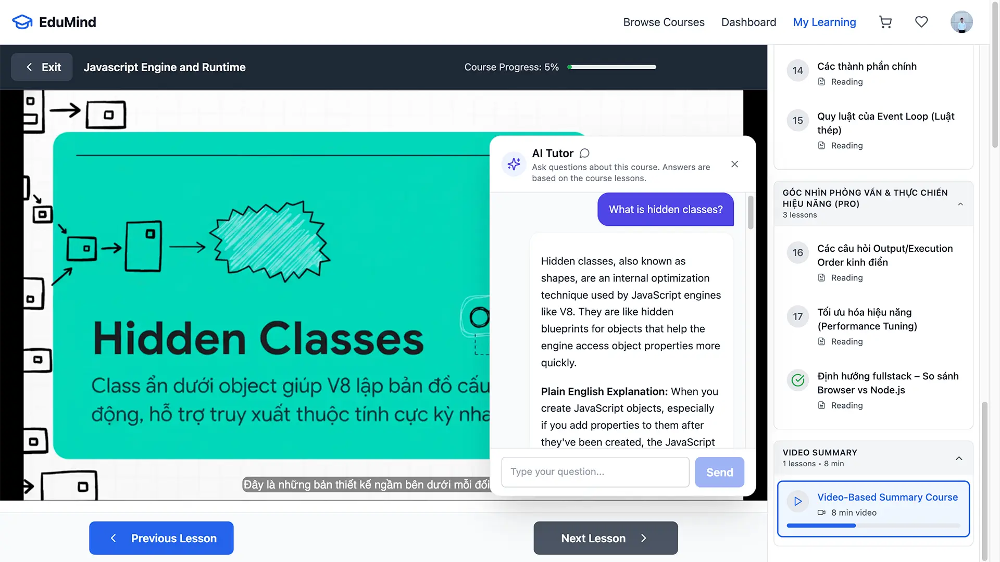
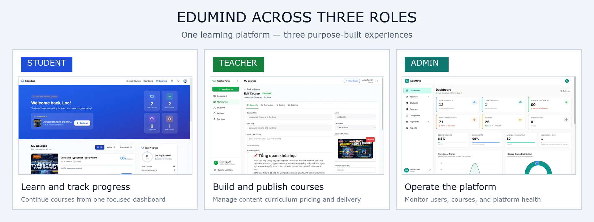
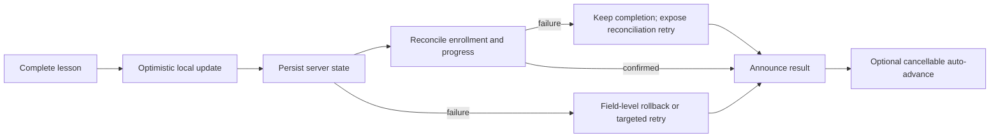
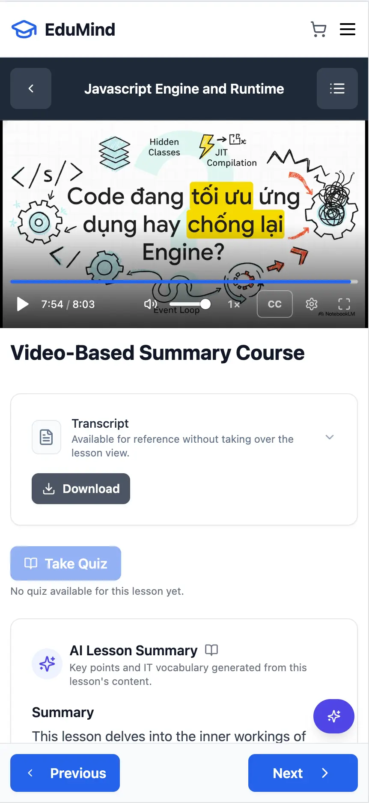
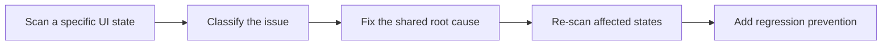
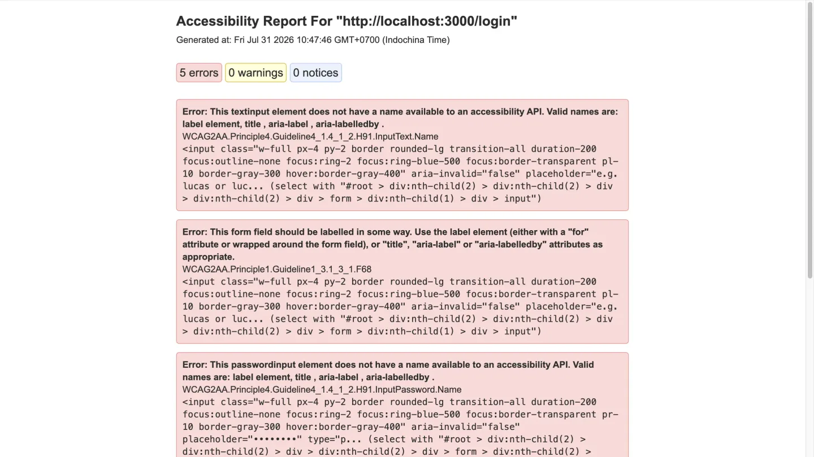
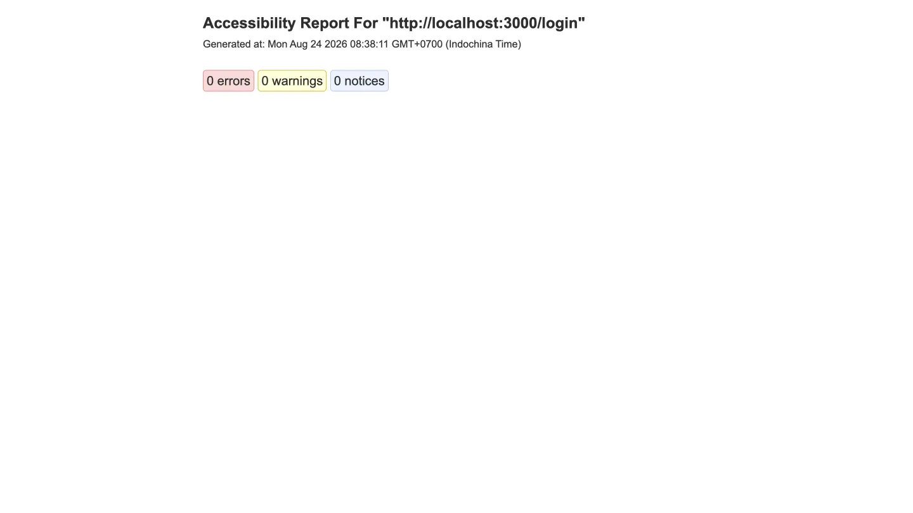
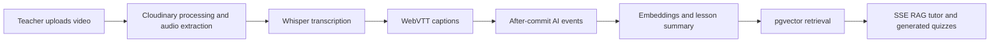
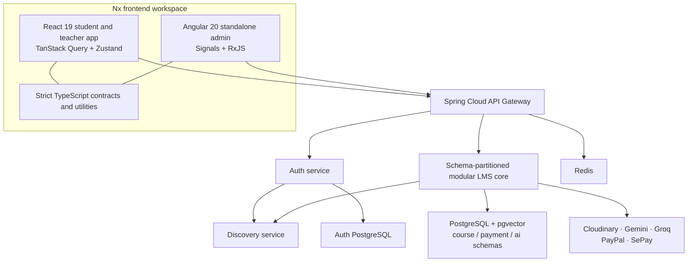

# EduMind

**A frontend-focused full-stack learning platform built around race-safe course playback, accessible user journeys, streaming AI, and replay-safe commerce.**

Students learn and teachers run their courses in one React 19 application, administrators work in an Angular 20 console, and a Spring Boot platform backs both.

**Solo project** — architecture, implementation, and verification owned end to end.<br/>
AI accelerated research and implementation; technical decisions, review, and validation remained personal.

**[Explore the live student experience ↗](https://edumind.nguyenloc.dev/courses?filter=free)** — create an account, enroll in a free course, and open the Course Player and cited AI tutor.



[](frontend/apps/user)
[](frontend/apps/admin)
[](backend)

## Why this is not another CRUD LMS

| Engineering proof | What makes it difficult |
| --- | --- |
| **Race-resistant learning runtime** | Course, lesson, completion, video-save, focus, and auto-advance state stay consistent through rapid navigation and overlapping requests. |
| **Four-flow accessibility engineering** | Discovery, authentication, purchase, and learning are tested as stateful journeys—not reduced to a page-load score. |
| **Streaming RAG and asynchronous AI jobs** | Transcription, captions, embeddings, retrieval, summaries, quizzes, citations, retry, and cancellation form one lifecycle. |
| **Replay-safe financial workflows** | Checkout, webhooks, refunds, earnings reversal, and payouts use explicit states, idempotency, locking, and reconciliation. |
| **Two frameworks, one Nx platform** | React 19 and Angular 20 share strict TypeScript contracts and utilities while retaining framework-appropriate state models. |
| **Production verification and delivery** | Automated checks, health-gated rollout, immutable images, Sentry releases, and SEO prerendering are treated as product behavior. |

## How to evaluate EduMind

| Time | Reviewer path |
| --- | --- |
| **5 minutes** | Read the Course Player highlight below, then open [`useLessonCompletion.ts`](frontend/apps/user/src/app/pages/learning/course-player/hooks/useLessonCompletion.ts) and the [Course Player regression tests](frontend/apps/user/src/app/pages/learning/course-player/CoursePlayerAccessibility.test.tsx). |
| **15 minutes** | Inspect the committed [before/after accessibility artifacts](frontend/e2e/accessibility-reports) and the [Safari + VoiceOver checklist](frontend/e2e/manual-a11y-checklists/00-summary.md). No installation is required. |
| **30 minutes** | Clone the repository, then from `frontend/` run `PUPPETEER_SKIP_DOWNLOAD=true npm ci` followed by `npx vitest run --root apps/user src/app/pages/learning/course-player/CoursePlayerAccessibility.test.tsx src/app/pages/learning/course-player/hooks/useCoursePlayerData.test.ts`. Sign up on the [live app](https://edumind.nguyenloc.dev/courses?filter=free), enroll in a free course, and try the cited AI tutor. |

## Product tour

| Role | Journey to explore | Access |
| --- | --- | --- |
| **Student** | Discover a [free course](https://edumind.nguyenloc.dev/courses?filter=free), enroll, learn in the Course Player, and ask the cited AI tutor. | Live — self-signup |
| **Teacher** | Author content, process video and captions, inspect analytics, and manage earnings. | [Watch the Teacher walkthrough](https://res.cloudinary.com/dvznchhww/video/upload/v1788405423/video_demo_teacher_k2vvzs.mp4) |
| **Admin** | Moderate courses and teacher applications, then operate refunds and payouts. | [Watch the Admin walkthrough](https://res.cloudinary.com/dvznchhww/video/upload/v1788405504/video_demo_admin_hg4mle.mp4) |

Admin and teacher operations are demonstrated through recorded walkthroughs; privileged access is not publicly exposed.



## Engineering deep dive

### Course Player: field-level optimistic recovery

#### Problem

A course player coordinates remote progress, URL state, video time, quiz eligibility, completion, focus, announcements, and navigation. When a learner switches courses or lessons quickly, a valid response can become stale before it arrives. A naive optimistic update can erase newer progress or auto-advance the wrong lesson.

#### Key decision

Completion is optimistic, but rollback is scoped to the course, lesson, request, and field that owns the mutation. A synthetic progress record is removed on failure; a real record preserves fields written by a concurrent autosave and reverts only `isCompleted`.

> **Invariant:** A failed completion request must not erase video progress written by a newer concurrent autosave.

```tsx
if (belongsToCurrentCourse()) {
  onProgressChange((prev) => {
    const existing = prev.find((p) => p.lessonId === lessonId);
    if (!existing) return prev;
    if (existing.id === undefined) {
      return prev.filter((p) => p.lessonId !== lessonId);
    }
    return prev.map((p) =>
      p.lessonId === lessonId ? { ...p, isCompleted: Boolean(snapshot.alreadyCompleted) } : p
    );
  });
}
```



- Monotonic version guards discard course and lesson responses made obsolete by navigation.
- Synchronous refs close the gap in which rapid input could submit completion twice.
- Persistence and reconciliation failures expose distinct, targeted recovery paths.

Evidence: [implementation](frontend/apps/user/src/app/pages/learning/course-player/hooks/useLessonCompletion.ts) · [regression tests](frontend/apps/user/src/app/pages/learning/course-player/CoursePlayerAccessibility.test.tsx) · [Playwright learning journey](frontend/e2e/tests/user/learning-flow-a11y.spec.ts)

**[Watch the Course Player walkthrough ↗](https://res.cloudinary.com/dvznchhww/video/upload/v1788406083/video_demo_course_player_eyn9mb.mp4)** — lesson playback, progress tracking, completion, and curriculum navigation.

<p align="center">
  
</p>

### Accessibility: complete journeys, not a compliance badge

EduMind targets **WCAG 2.2 Level AA** and concentrates validation on four critical user journeys. This is a target and testing strategy—not a claim of full-site certification.

| Journey | Representative path |
| --- | --- |
| **Discover** | Home → Browse → Course detail |
| **Authentication** | Login → validation, 2FA, or password reset |
| **Purchase** | Cart → Checkout → Success or failure |
| **Learning** | My Learning → Course Player |

#### Three verification layers

| Layer | Evidence |
| --- | --- |
| Static and component | JSX accessibility linting, semantic Testing Library assertions, and component axe scans |
| Browser automation | Stateful Playwright journeys, axe-core, pa11y, keyboard/focus helpers, screenshots, and traces |
| Human validation | Four critical journeys were manually verified with Safari 18.1 + VoiceOver on macOS Sequoia 15.1; cross-cutting checks cover keyboard access, zoom, reflow, contrast, reduced motion, and page titles |

Reusable solutions include skip links, landmarks, route-focus management, shared label/error/description form contracts, focus traps, Escape handling, trigger-focus restoration, WAI-ARIA roving-tabindex tabs, curriculum accordion semantics, and `aria-current="step"`. Live regions report loading, cart, checkout, progress, and completion changes. Video controls are keyboard-accessible, captions are exposed, and quizzes use semantic fieldsets.

Deterministic fixtures make authenticated and error states repeatable. Automated reports are attached to individual UI states instead of scanning only initial page load. Any rule exclusion must identify an issue, a reason, and a removal condition.



#### Recorded remediation evidence

| Evidence | Before remediation | After remediation |
| --- | --- | --- |
| Pa11y | 30 issues across 9 deterministic routes (2026-07-31) | 0 issues across 14 deterministic routes (2026-08-24) |
| Axe + keyboard route collector | 2 violations—2 serious nodes—and 11 keyboard-smoke issues across 9 routes (2026-08-08) | 0 violations and 0 keyboard-smoke issues across the same 9 routes (2026-08-25) |
| Safari + VoiceOver and cross-cutting manual checks | Not part of the automated baseline | 268 applicable checks passed, 0 failed, and 19 were recorded as not applicable across 5 test areas (2026-08-22) |

Counts describe the committed deterministic artifacts and dated manual checklists, not every application state or a full-site conformance audit. The Pa11y after-scan adds authenticated cart, checkout, My Learning, Course Player, and SePay QR states beyond the original nine-route baseline, so its route count is intentionally larger.

<table>
  <tr>
    <th scope="col">Before remediation</th>
    <th scope="col">After remediation</th>
  </tr>
  <tr>
    <td width="50%"><a href="docs/media/a11y-before.webp"></a></td>
    <td width="50%"><a href="docs/media/a11y-after.webp"></a></td>
  </tr>
</table>

Manual evidence: [Safari + VoiceOver checklist summary](frontend/e2e/manual-a11y-checklists/00-summary.md).

Representative evidence: [accessibility test utilities](frontend/e2e/utils/accessibility.ts) · [four-flow testing guide](frontend/e2e/ACCESSIBILITY_TESTING.md) · [baseline and remediation record](frontend/e2e/BASELINE_ACCESSIBILITY_AUDIT.md)

### End-to-end AI learning pipeline

EduMind's AI layer is a content lifecycle rather than a chat wrapper:



A token or metadata event can be split across multiple `reader.read()` calls. Dispatching each network chunk directly would lose SSE framing or merge model tokens that begin with a space.

- The authenticated Fetch Streams client buffers incomplete lines, joins multi-line `data:` fields, preserves token whitespace, and aborts the request when the chat panel closes or unmounts.
- Answers carry source-lesson citations, while role and ownership checks protect teaching assets and mask student answers.
- Quiz generation and transcription return `202 Accepted` with pollable jobs. Groq `429` responses move transcription jobs to `DELAYED` for scheduled retry; other AI jobs fail terminally and require an explicit re-trigger.
- Summary and embedding work starts from `AFTER_COMMIT` lesson events, so provider processing is not part of the course-content transaction.

Evidence: [frontend SSE parser](frontend/apps/user/src/app/services/ai.service.ts) · [AI workflow](docs/workflows/ai_workflows.md) · [video workflow](docs/workflows/video_upload_workflows.md)

**[Watch the cited AI tutor walkthrough ↗](https://res.cloudinary.com/dvznchhww/video/upload/v1788405527/video_demo_ai_chat_bbajpv.mp4)** — streaming answers grounded in course content with lesson-level citations.

### Reliable commerce and finance

PayPal can deliver the same successful webhook more than once. Reprocessing it must not repeat the payment-state transition or publish the same completion event again after the order has already recorded that publication.

- The webhook handler skips an order that is already `COMPLETED` with `sideEffectsPublished=true`; a committed order whose event was never marked as published takes a separate re-publication path.
- The browser return path locks the gateway transaction during capture and returns the existing result when that transaction is already successful.
- Refund transitions coordinate partial settlement with earnings reversal and enrollment revocation under duplicate prevention and optimistic locking.
- Held earnings feed threshold-based payouts with bounded retry; PayPal is automated, while SePay refund and payout remain explicit manual-confirmation workflows.

Evidence: [payment workflow](docs/workflows/payment_workflows.md) · [refund workflow](docs/workflows/refund_workflows.md) · [payout workflow](docs/workflows/payout_workflows.md) · [PayPal webhook integration tests](backend/lms-core-service/src/test/java/com/edumind/lms/modules/payment/integration/PayPalWebhookIntegrationTest.java)

## Platform architecture



The React student/teacher app and Angular admin console share an Nx platform, strict TypeScript contracts, constants, and utilities while retaining framework-appropriate state models. Nx tags and ESLint enforce domain and layer boundaries.

The API Gateway, Auth, and Discovery services are independently deployable. Course, payment, and AI remain modules in one Spring service with schema separation, preserving extraction seams without paying the operational cost of premature microservices.

## Delivery and verification

| Area | Implemented evidence |
| --- | --- |
| Authentication | [Shared-promise refresh coordination in React](frontend/apps/user/src/app/services/api-client.service.ts), an [RxJS request queue in Angular](frontend/apps/admin/src/app/core/interceptors/auth.interceptor.ts), HttpOnly refresh cookies, OAuth2, 2FA, and role authorization |
| Application security | AES-GCM protected values, XXE-hardened SVG sanitization, and Redis-backed gateway rate limiting |
| Frontend CI | Nx affected lint, tests and build; accessibility lint plus Playwright axe/keyboard journeys and Pa11y |
| Backend delivery | Maven verification, immutable SHA-tagged images, GHCR publishing, and dependency-ordered health-gated rollout |
| Observability and SEO | Sentry release correlation and source maps; prerendering, canonical URLs, JSON-LD, sitemaps, and correct 404 semantics |

Automation evidence: [frontend CI](.github/workflows/frontend-ci.yml) · [backend CI](.github/workflows/backend-ci.yml) · [backend delivery](.github/workflows/backend-cd.yml)

## Scope, evidence, and known limitations

> **Validation scope:** The four documented journeys passed their applicable Safari 18.1 + VoiceOver checks on macOS Sequoia 15.1, and the current Pa11y after-remediation scan reports zero issues across 14 deterministic routes. WCAG 2.2 Level AA is the testing target, not a claim of certification or full-site conformance. Windows High Contrast, the Angular admin portal, mobile screen readers, and usability testing with disabled participants remain outside the recorded scope.

Dated artifacts describe the deterministic states and environments recorded at that time; they are evidence, not a claim about every application state.

- Some reporting paths still cross intended backend module boundaries.
- Async work is executor- and scheduler-based; there is no Kafka or RabbitMQ.
- SePay in-flight polling/webhook coordination is in memory, while persisted order state remains authoritative.

See [known limitations](docs/known-limitations.md) for the full rationale and current gaps.

## Documentation

- [Architecture](docs/architecture/README.md)
- [Frontend](frontend/README.md)
- [Backend](backend/README.md)
- [Workflows](docs/workflows/ai_workflows.md): AI/video, authentication, payment, refund, and payout
- [Accessibility evidence](frontend/e2e/accessibility-reports): committed automated artifacts and [manual checklists](frontend/e2e/manual-a11y-checklists/00-summary.md)

## Run locally

### Frontend

```bash
cd frontend
npm ci
cp .env.example apps/user/.env
npm run start:user
```

The React app runs at `http://localhost:3000`. See the [frontend setup guide](frontend/README.md) for configuration and the Angular admin command.

### Backend platform

```bash
cd backend
cp .env.example .env
docker compose up -d
curl --fail http://localhost:8080/actuator/health
```

See the [backend setup guide](backend/README.md) for dependency tiers, key generation, and optional provider configuration. Never commit populated environment files.
