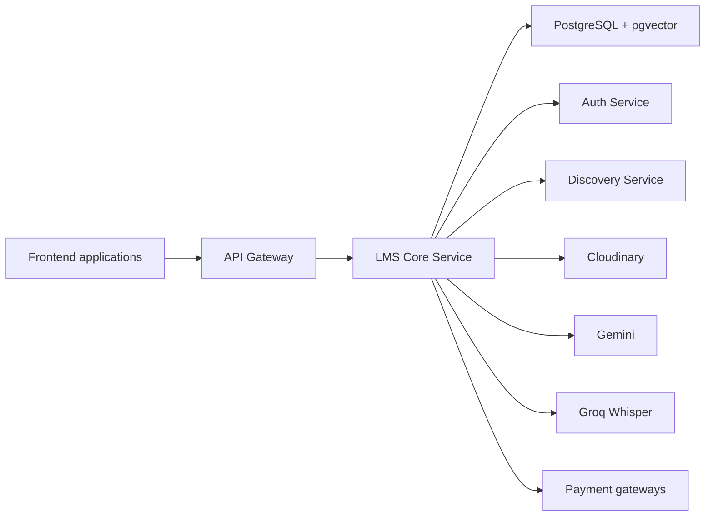
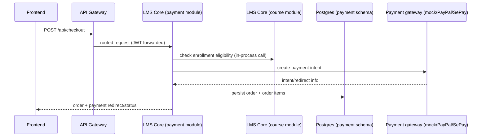

# 🧠 EduMind Platform - Backend

> **Architecture:** Microservices + Modular Monolith
> **Framework:** Spring Boot 3.5.6 + Spring Cloud 2025.0.0
> **Language:** Java 21 (LTS)

Welcome to the **EduMind** backend repository. This project implements a scalable, secure, and high-performance microservices architecture for an AI-powered learning platform.

---

## 🚀 Quick Start

The recommended way to run the backend locally is **Docker Compose** (builds every service from source, no local JDK/Maven required except for editing code).

### 1. Configure environment

```bash
cd backend
cp .env.example .env
```

`.env.example` lists the platform variables used by the services. Before starting, replace the database passwords and fill in `JWT_SECRET`, separate `AUTH_SERVICE_ENCRYPTION_KEY` and `LMS_CORE_SERVICE_ENCRYPTION_KEY` values, plus the Cloudinary settings required by Auth and LMS Core startup. OAuth, mail, AI, and real payment credentials are feature-specific. See [Key Generation](#-development-utilities) below.

### 2. Start the minimum needed to run LMS Core

```bash
docker compose up -d postgres-lms-core discovery-service lms-core-service
```

This starts only what `lms-core-service` needs: its own Postgres/pgvector database and the Eureka registry it heartbeats to. It does **not** start `auth-service`, `postgres-auth`, `redis`, or `api-gateway` — add them if you need the full platform (see "Full stack" below).

### 3. Verify it's up

```bash
curl --fail http://localhost:8083/actuator/health
```

A `200 OK` with `{"status":"UP"}` means `lms-core-service` is healthy and reachable directly.

### 4. Stop / logs

```bash
docker compose stop                          # stop containers, keep data volumes
docker compose down                          # stop and remove containers (volumes persist)
docker compose logs -f lms-core-service      # tail logs for one service
docker compose logs -f                       # tail logs for everything that's running
```

### Full stack (all 7 services)

```bash
docker compose up -d
```

Builds and starts `discovery-service`, `postgres-auth`, `postgres-lms-core`, `redis`, `auth-service`, `lms-core-service`, and `api-gateway`.

### Direct service URLs vs. the Gateway

| Access path | Example | When to use |
| :--- | :--- | :--- |
| **Direct to service** | [http://localhost:8083/actuator/health](http://localhost:8083/actuator/health) | Health checks, local debugging, hitting a service you started standalone (e.g. the minimal LMS Core setup above). |
| **Through API Gateway** | [http://localhost:8080/api/courses](http://localhost:8080/api/courses) | All real API traffic — this is what the frontend calls, and it's the only path with CORS, rate limiting, and routing configured. Always prefer this once `api-gateway` is running. |

### Dependency tiers

| Tier | Services | Why |
| :--- | :--- | :--- |
| **Required to start LMS Core** | `postgres-lms-core` | The service cannot initialize JPA or Flyway without its database. |
| **Platform discovery** | `discovery-service` | Required for normal service discovery and Gateway routing. LMS Core can start while Eureka is temporarily unavailable, but registration-dependent flows remain degraded until it reconnects. |
| **Required for end-to-end flows** | `auth-service`, `postgres-auth`, `api-gateway`, `redis` | Needed once you log in, call through the Gateway, or exercise anything that calls `auth-service` via Feign (course enrollment, teacher checks, etc.). |
| **Feature-specific only** | `GEMINI_API_KEY` (RAG chat, AI summaries, quiz generation), `GROQ_API_KEY` + optional `yt-dlp` binary (Whisper transcription), Cloudinary credentials (media upload), PayPal/SePay credentials (real payment gateways) | The app starts and most endpoints work without these; only the specific feature's endpoints fail until the corresponding key/service is configured. |

### Running services natively (alternative to Docker Compose)

Each service ships its own **Maven Wrapper** — use `./mvnw`, not a globally installed Maven, so everyone builds with the same Maven version:

```bash
cd lms-core-service
./mvnw test
./mvnw spring-boot:run
```

Start order when running natively: `discovery-service` → `auth-service` → `lms-core-service` → `api-gateway`. You still need Postgres/Redis running (via `docker compose up -d postgres-auth postgres-lms-core redis`) and a `.env` sourced or exported into your shell.

> **Building from the `backend/` root:** there is no `mvnw` at the repo root — building from `backend/` uses the **Maven reactor** across all modules via a globally installed `mvn` (3.6+):
> ```bash
> cd backend
> mvn clean install   # builds common-lib, then every service, in dependency order
> ```
> Building a single service (`cd lms-core-service && ./mvnw ...`) is the faster inner-loop option; use the root reactor build when you need to verify the whole tree compiles together (e.g. after changing `common-lib`).

---

## ⚙️ Configuration

All configuration is env-var driven — `.env.example` is the source of truth for every variable each service reads (via `application.yml`). `docker compose` reads `.env` automatically; for native runs, export the same variables into your shell or use `direnv`/`.envrc`.

**Never commit `.env`** (already gitignored) — it holds real credentials in dev, and in production these must come from your platform's **secret manager or runtime environment** (e.g. injected as container env vars from a vault, not baked into an image or a repo file).

### Core variables

| Variable | Required | Default | Sensitive | Purpose |
| :--- | :--- | :--- | :--- | :--- |
| `AUTH_DB_URL` / `LMS_CORE_DB_URL` | Yes | Local default (`localhost:5432`/`5433`) | No | PostgreSQL JDBC URL per service |
| `AUTH_DB_PASSWORD` / `LMS_CORE_DB_PASSWORD` | Yes | None | **Yes** | Database credential |
| `JWT_SECRET` | Yes | None | **Yes** | Signs/validates JWTs across services |
| `AUTH_SERVICE_ENCRYPTION_KEY` / `LMS_CORE_SERVICE_ENCRYPTION_KEY` | Yes | None | **Yes** | AES/GCM key for `EncryptionService` (per-service, not shared) |
| `SPRING_PROFILES_ACTIVE` | No | Empty (dev) | No | Activates a matching profile where present. Currently only `auth-service` commits `application-prod.yml`; other services require deployment-time production overrides. |
| `COOKIE_SECURE` | Production: Yes | `false` | No | Must be `true` in production — refresh-token cookie requires HTTPS |
| `COOKIE_SAME_SITE` | No | `Lax` | No | Refresh-token cookie SameSite policy |
| `FRONTEND_URL` / `GATEWAY_URL` / `ADMIN_URL` | Yes | `localhost:3000` / `:8080` / `:4200` | No | Used for CORS, OAuth redirects, email links |
| `ACTUATOR_HEALTH_DETAILS` | No | `never` | No | API Gateway health-detail exposure; keep restricted in production |
| `GOOGLE_CLIENT_ID` / `GOOGLE_CLIENT_SECRET` | Feature: OAuth login | Empty | **Yes** | Google OAuth2 login |
| `MAIL_USERNAME` / `MAIL_PASSWORD` | Feature: email | Empty | **Yes** | SMTP credentials for verification/reset emails |
| `CLOUDINARY_CLOUD_NAME` / `_API_KEY` / `_API_SECRET` | Feature: media upload & Whisper (Cloudinary path) | Empty | **Yes** | Media storage/delivery |
| `GEMINI_API_KEY` | Feature: AI (RAG, summaries, quizzes) | Empty | **Yes** | Gemini chat + embeddings |
| `GROQ_API_KEY` | Feature: transcription | Empty | **Yes** | Whisper transcription |
| `YTDLP_PATH` | Feature: YouTube-caption fallback | `yt-dlp` (on PATH) | No | Path to the `yt-dlp` binary |
| `VIDEO_HLS_ENABLED` | No | `false` | No | Enables HLS video delivery |

### Payment configuration

| Variable | Required | Default | Sensitive | Purpose |
| :--- | :--- | :--- | :--- | :--- |
| `PAYMENT_GATEWAY` | No | `mock` | No | Default gateway (`mock` \| `paypal` \| `sepay`) |
| `PAYMENT_MOCK_ENABLED` | No | `true` | No | Enables the mock gateway — **must be `false` in production** |
| `PAYMENT_PAYPAL_ENABLED` | Feature: PayPal | `false` | No | Enables PayPal gateway |
| `PAYPAL_CLIENT_ID` / `PAYPAL_CLIENT_SECRET` / `PAYPAL_WEBHOOK_ID` | Feature: PayPal | Empty | **Yes** | PayPal API credentials |
| `PAYPAL_MODE` | Feature: PayPal | `sandbox` | No | `sandbox` \| `live` |
| `PAYPAL_RETURN_BASE_URL` | Feature: PayPal | Empty | No | Must be a publicly reachable URL |
| `PAYMENT_SEPAY_ENABLED` | Feature: SePay | `false` | No | Enables SePay (Vietnam QR) gateway |
| `SEPAY_API_KEY` / `SEPAY_SECRET_KEY` / `SEPAY_WEBHOOK_SECRET` | Feature: SePay | Empty | **Yes** | SePay API credentials |
| `SEPAY_MERCHANT_ID`, `SEPAY_BASE_URL`, `SEPAY_BANK_CODE`, `SEPAY_BANK_ACCOUNT`, `SEPAY_ACCOUNT_NAME` | Feature: SePay | See `.env.example` | No (bank account/name are business info, not secrets, but avoid using real production account details in shared/dev files) | SePay merchant + bank routing info shown on generated QR codes |
| `PAYMENT_REFUND_AUTO_APPROVE_DAYS` / `_MAX_DAYS` / `_PARTIAL_THRESHOLD` | No | `7` / `30` / `50` | No | Refund policy thresholds |
| `PAYMENT_PAYOUT_MINIMUM_AMOUNT` / `_HOLD_PERIOD` / `_SCHEDULE_DAY` / `_SCHEDULE_HOUR` / `_MAX_RETRIES` | No | See `.env.example` | No | Instructor payout schedule and retry policy |

### App async / executor / certificate configuration

| Variable | Required | Default | Sensitive | Purpose |
| :--- | :--- | :--- | :--- | :--- |
| `APP_BASE_URL` | No | `http://localhost:8080` | No | Base URL used in generated links |
| `APP_CERTIFICATE_REQUIRE_PAID_COURSE` | No | `true` | No | Gate certificate issuance to paid courses only |
| `APP_ASYNC_CORE_POOL_SIZE` / `_MAX_POOL_SIZE` / `_QUEUE_CAPACITY` | No | `10` / `20` / `50` | No | General-purpose async executor sizing |
| `AI_CORE_POOL_SIZE` / `AI_MAX_POOL_SIZE` / `AI_QUEUE_CAPACITY` | No | `2` / `5` / `50` | No | AI job executor sizing (Gemini pool) |
| `WHISPER_QUEUE_CAPACITY` | No | `10` | No | Whisper job queue depth (executor itself is fixed at 1 worker to respect Groq's rate limit) |
| `REVIEW_AUTO_APPROVE_ENABLED` / `_THRESHOLD` | No | `true` / `0` | No | Course review auto-moderation |
| `CORS_ALLOWED_ORIGINS` | Yes | `localhost:3000,localhost:4200` | No | Allowed frontend origins |

Full, current values live in [`.env.example`](.env.example) — treat this section as a map of *what each variable does and why it's required*, not a copy to keep in sync manually.

`docker-compose.prod.yml` additionally reads `GITHUB_REPOSITORY_OWNER` and `IMAGE_TAG` to select GHCR images. Use an immutable release or commit tag in production instead of relying on `latest`.

---

## 🛠 Technology Stack

We use a modern Java ecosystem designed for enterprise-grade scalability.

| Domain | Technnology | version |
| :--- | :--- | :--- |
| **Framework** | Spring Boot | v3.5.6 |
| **Cloud** | Spring Cloud | v2025.0.0 |
| **Discovery** | Netflix Eureka | - |
| **Gateway** | Spring Cloud Gateway | - |
| **Database** | PostgreSQL | v16 |
| **Caching** | Redis | v7 |
| **Security** | Spring Security + JWT | - |
| **Migration** | Flyway | v10.x |
| **Build** | Maven | 3.6+ |
| **AI / LLM** | Spring AI + Google Gemini | 1.1.2 |
| **Vector DB** | pgvector (PostgreSQL extension) | 0.8+ |
| **Transcription** | Groq Whisper API (`whisper-large-v3-turbo`) | - |

---

## 🏗 Architecture

> For C4-model diagrams (context, container, component levels), see [docs/architecture/README.md](../docs/architecture/README.md). This section covers the reasoning behind the structure, not a full diagram set.

The system follows a hybrid microservices architecture:

1.  **Microservices**: For infrastructure/cross-cutting concerns (Gateway, Auth, Discovery).
2.  **Modular Monolith (`lms-core-service`)**: Hosts core business logic to **minimize deployment costs** and operational overhead. Separate database schemas (`course`, `payment`, `ai`, with reserved future schemas) establish domain ownership, while a small number of reporting paths still have known cross-module repository coupling to remove before independent extraction.



### Why a modular monolith for `lms-core-service`

`course`, `payment`, and `ai` are the three domains with the most cross-cutting reads (a course page needs enrollment status, price, and AI summary availability at once). Splitting them into separate services this early would mean every one of those reads becomes a network call, without a corresponding scaling need — LMS Core's load doesn't yet justify independent deployment. Instead, each domain gets its **own Postgres schema** (`course`, `payment`, `ai`, plus reserved-but-unimplemented `assessment`, `gamification`, `notification`) so the boundary is enforced at the data layer today, and extraction into a standalone service later is a matter of moving a schema + its module, not re-designing the domain.

### Module boundaries and how they communicate

- **In-process (synchronous)**: primary business flows use Java module APIs rather than HTTP — for example, payment invokes course query/command interfaces for enrollment and course data. Some reporting implementations (`DashboardServiceImpl` and `TeacherAnalyticsServiceImpl`) still query payment repositories directly; these are documented coupling points, not examples of the target boundary.
- **Cross-service (synchronous)**: `lms-core-service` → `auth-service` calls happen over **OpenFeign** (e.g. `UserClient`), routed through Eureka (`lb://AUTH-SERVICE`), with the caller's JWT propagated via `FeignConfig`.
- **Asynchronous, in-process**: AI work (embeddings, summaries, quiz generation, Whisper transcription) runs on dedicated `@Async` executor pools inside `lms-core-service` (see `ai.executor.*` config) rather than blocking the request thread — the controller returns `202 Accepted` immediately and the client polls for job status.
- **No message broker today**: there is no Kafka/RabbitMQ in this system; "asynchronous" here means async servlet threads and scheduled pollers (e.g. `TranscriptionRetryScheduler`), not event streaming between services.

### Example flow: checkout (synchronous)



Quiz generation and Whisper transcription return `202 Accepted { jobId }`, then clients poll `GET /api/ai/jobs/{id}`. Embeddings and summaries are event-driven internal jobs, while RAG chat responds directly or over SSE. See [AI workflows](../docs/workflows/ai_workflows.md) for the complete job and transcription flows.

For deeper per-service internals, see the per-service READMEs (`lms-core-service/README.md`, `api-gateway/README.md`).

### Service Landscape

| Service | Port | Description |
| :--- | :--- | :--- |
| **Discovery Service** | `8761` | Service Registry (Eureka). |
| **API Gateway** | `8080` | Entry point, Rate Limiting, Routing. |
| **Auth Service** | `8081` | Identity, OAuth2, 2FA, JWT issuance. |
| **LMS Core Service** | `8083` | Core business logic (Courses, Payments, AI, future Assessments/Gamification). |

*(Note: `common-lib` provides shared DTOs, utilities, and security configuration for `auth-service` and `lms-core-service`. `api-gateway` and `discovery-service` do not depend on it.)*

---

### Databases & Storage

The backend uses two PostgreSQL databases plus Redis:

- **Auth DB (`postgres-auth`, port 5432)**  
  - Database: `edumind_auth`  
  - Schema: `public`  
  - Purpose: users, roles, user-role mappings, refresh tokens, verification tokens, password reset tokens.

- **LMS Core DB (`postgres-lms-core`, port 5433)**  
  - Database: `edumind_core`  
  - Schemas:
    - `course`: courses, sections, lessons, enrollments, categories, reviews, wishlists
    - `payment`: cart items, orders, order items, invoices, earnings, payouts, refunds, platform config
    - `ai` **(active)**: AI job logs, lesson embeddings, lesson summaries, generated quizzes, quiz attempts, AI rate limits
    - `assessment`, `gamification`, `notification` **(reserved only)**: schemas exist from the initial migration but have no corresponding Java modules/entities yet — not implemented

- **Redis (`redis`, port 6379)**  
  - Rate limiting for API Gateway (IP-based).  
  - Ready for future caching use cases.

- **pgvector (PostgreSQL extension)**  
  - Lives **inside the LMS Core database** (`edumind_core`, port 5433) — not a separate/external vector database or service.
  - Used in `ai.lesson_embeddings` for semantic search / RAG.  
  - Vectors stored as `vector(768)` with ivfflat index (`vector_cosine_ops`).

### Service Responsibilities

- **Discovery Service (`discovery-service`)**
  - Eureka registry – all other services register here.
  - Gateway uses logical service names (`lb://AUTH-SERVICE`, `lb://LMS-CORE-SERVICE`).

- **API Gateway (`api-gateway`)**
  - Single public entry point on `8080`.
  - Responsibilities:
    - Routing to backend services via Eureka.
    - IP-based rate limiting using Redis.
    - CORS configuration for `localhost:3000` (React user app) and `localhost:4200` (Angular admin app).
    - Request/response logging and health checks.
  - Key routes (see `api-gateway/src/main/resources/application.yml` for exact rules):
    - `/api/auth/**`, `/api/auth/oauth2/**`, `/api/auth/login/oauth2/**` → `auth-service`
    - `/api/admin/**` (incl. `/api/admin/dashboard/**`, `/api/admin/enrollment-reports/**`) → `auth-service` (admin endpoints)
    - `/api/users/**`, `/api/upload/**`, `/api/teacher-application/**` → `auth-service`
    - `/api/courses/**`, `/api/categories/**`, `/api/sections/**`, `/api/lessons/**` → `lms-core-service`
    - `/api/enrollments/**`, `/api/certificates/**`, `/api/progress/**` → `lms-core-service`
    - `/api/reviews/**`, `/api/wishlist/**` → `lms-core-service`
    - `/api/cart/**`, `/api/checkout/**`, `/api/orders/**`, `/api/invoices/**` → `lms-core-service`
    - `/api/teacher/earnings/**`, `/api/teacher/analytics/**` → `lms-core-service`
    - `/api/payments/refunds/**`, `/api/payments/webhook/**`, `/api/instructors/payouts/**` → `lms-core-service`
    - `/api/ai/**` → `lms-core-service`

- **Auth Service (`auth-service`)**
  - User registration, login, and profile management.
  - JWT issuance (access + refresh), token rotation on refresh.
  - OAuth2 login (e.g. Google) and 2FA (TOTP).
  - Email verification and password reset flows.
  - Encrypts sensitive data (2FA secrets, OAuth tokens) via `EncryptionService`.

- **LMS Core Service (`lms-core-service`)**
  - Modular monolith implementing the main LMS domains:
    - **Course module (`course` schema)**: courses, sections, lessons, enrollments, reviews, wishlists.
    - **Payment module (`payment` schema)**: cart, checkout, orders, invoices, earnings, payouts, refunds.
    - **AI module (`ai` schema)**: RAG chat, lesson embeddings, AI summaries, quiz generation & attempts, rate limits, Groq Whisper transcription.
    - **Not yet implemented**: `assessment`, `gamification`, `notification` — schemas reserved by migration, no Java module exists for them yet.
  - Follows strict layering per module: **Controller → Service → Repository → Entity**, with DTOs at the edges.
  - Integrates with:
    - Auth Service via OpenFeign (`UserClient`, etc.) and shared JWT validation.
    - Cloudinary for media uploads (course thumbnails, lesson assets, etc.).

### Shared Library: `common-lib`

`auth-service` and `lms-core-service` depend on `common-lib` for cross-cutting concerns (`api-gateway` and `discovery-service` do not):

- **API contracts**
  - `ApiResponse<T>` – standard success wrapper.
  - `PagedResponse<T>` – pagination wrapper.
  - `ErrorResponse`, `MessageResponse` – standard error / message formats.

- **Error handling**
  - `GlobalExceptionHandler` (`@RestControllerAdvice`) – centralizes error mapping.
  - Shared exception types (`ResourceNotFoundException`, `BadRequestException`, etc.).

- **Security utilities**
  - `EncryptionService` – AES/GCM encryption; each service uses its own encryption key.
  - JWT helpers used consistently across services.

- **Constants & utilities**
  - `ErrorCode`, `ResponseStatus`, and other reusable constants.
  - Cloudinary integration helpers.

### AI & RAG Overview (Backend Perspective)

The AI feature set (`ai` module in `lms-core-service`) is fully **optional at startup** — the app runs without `GEMINI_API_KEY`/`GROQ_API_KEY`; only the AI/transcription endpoints themselves fail until the relevant key is set.

- **RAG chat**: lesson content is chunked and embedded with Gemini (`gemini-embedding-001`, 768 dims); queries run a pgvector cosine-distance similarity search, classified HIGH/MEDIUM/GAP by distance threshold. Responds as JSON or SSE streaming. Capped at **20 requests/day/user** (hardcoded, enforced via an atomic Postgres UPSERT).
- **Summaries & quizzes**: summaries are generated by internal event-driven jobs after lesson content changes; quiz generation is instructor-triggered and returns a pollable `jobId`. Both send lesson content to Gemini.
- **Whisper transcription**: instructors submit a lesson video URL and an optional `language`; only `en` and `vi` are accepted, with `en` as the default. Audio is resolved from Cloudinary (production path) or YouTube captions/audio (dev-only fallback) and sent to Groq. A Groq `429` delays and retries the job indefinitely; any other failure goes to terminal `FAILED` with no automatic retry.
- Model names (`gemini-2.5-flash-lite`, `gemini-embedding-001`, `whisper-large-v3-turbo`) are `application.yml`/env-var properties, not hardcoded — swappable via config.
- **Data leaving the platform**: lesson text/chunks, student questions and conversation history go to Gemini; transcription audio goes to Groq. Profile fields are not intentionally added, but this free-form content may contain personal data and is not automatically redacted before submission.

Full implementation detail — source resolution, caption generation, retry/executor configuration, provider data handling, and all other AI flows — lives in [AI workflows](../docs/workflows/ai_workflows.md).

---

## 📦 Project Structure

```text
backend/
├── api-gateway/            # 🚪 System Entry Point (Routing, Rate Limiting)
├── auth-service/           # 🔐 Identity & Access Management
├── discovery-service/      # 🗺️ Service Registry (Eureka)
├── lms-core-service/       # 🧠 Core Business Logic (Modular Monolith)
├── common-lib/             # 📚 Shared Code (DTOs, Exceptions, Utils)
├── scripts/                # 🛠️ Utility Scripts (Key generation, etc)
├── docker-compose.yml      # 🐳 Infrastructure (Postgres, Redis)
└── pom.xml                 # 📄 Parent POM
```

---

## 🚀 Getting Started

See [Quick Start](#-quick-start) above for the fastest path. This section covers prerequisites and details not needed for the happy path.

### Prerequisites

- **Docker**: to run the recommended Compose-based setup (no local JDK/Maven needed for this path).
- **JDK 21+** and a globally installed **Maven 3.6+**: only needed if you build from the `backend/` root reactor (`mvn clean install`). Running a single service via its own `./mvnw` does not require a global Maven install.
- **yt-dlp** *(optional)*: only required for the YouTube-caption fallback path of Whisper transcription — the recommended Cloudinary transcription path has no CLI dependency.
  ```bash
  brew install yt-dlp          # macOS
  pip install yt-dlp           # Linux/Windows (pip)
  ```

For more Docker Compose detail (build vs. prebuilt-image files, healthchecks, volumes), see **[DOCKER.md](DOCKER.md)**.

### Production

```bash
cd backend
IMAGE_TAG=<short-sha> docker compose -f docker-compose.prod.yml up -d
# runs prebuilt GHCR images (ghcr.io/<owner>/edumind-<service>:<tag>) instead of building from source
```

Production deployment steps, the configuration checklist (mock-gateway guard, missing prod profiles, actuator exposure, graceful shutdown, DB password fallback), migration policy, deployment verification, secrets policy, rate-limit behavior, and temp-file/upload handling are documented in **[docs/production-operations.md](../docs/production-operations.md)** — read it before a real deployment.

---

## 🔒 Security & Standards

- **Authentication**: Stateless JWT Authentication.
- **Authorization**: Role-Based Access Control (RBAC).
- **Encryption**: Sensitive data encrypted at rest using `EncryptionService`.
- **Communication**: Inter-service communication via Feign Clients (REST) with JWT propagation via a shared `FeignConfig`.
- **API Standards**:
    - Unified `ApiResponse<T>` wrapper.
    - Global Exception Handling (`common-lib`).

---

## 🛠 Development Utilities

### Key Generation
Generate secure keys for JWT and Encryption (never use these in prod):

```bash
./scripts/generate-all-service-keys.sh
```

### Database Operations (Flyway CLI)

Run from `auth-service/` or `lms-core-service/` (the `flyway-maven-plugin` is configured per-service) with `.env` loaded:

| Command | Purpose |
| :--- | :--- |
| `mvn flyway:migrate` | Apply pending migrations |
| `mvn flyway:info` | Show applied/pending/failed migration status |
| `mvn flyway:validate` | Validate applied migrations against local files |
| `mvn flyway:repair` | Fix checksum/metadata after a manually-corrected migration |
| `mvn flyway:clean` | **Destructive** — drops the configured schemas. Local/dev only, see [migration policy](../docs/production-operations.md#database-migration-policy) |

Connection errors usually mean `.env` isn't loaded (`source ../.env`), Docker containers aren't running (`docker compose ps`), or local DB credentials don't match `pom.xml` defaults.

---

## 📚 API Documentation

All requests should be routed through the **API Gateway** ([http://localhost:8080](http://localhost:8080)) — see [Direct service URLs vs. the Gateway](#direct-service-urls-vs-the-gateway). Route groups by domain and owning service:

| Route group | Owning service | Access |
| :--- | :--- | :--- |
| `/api/auth/**`, `/api/auth/oauth2/**`, `/api/auth/login/oauth2/**` | `auth-service` | Public (login/signup/refresh/OAuth2) |
| `/api/admin/**` (incl. dashboard, enrollment-reports) | `auth-service` / `lms-core-service` | ADMIN only |
| `/api/users/**`, `/api/upload/**`, `/api/teacher-application/**` | `auth-service` | Authenticated (roles vary by endpoint) |
| `/api/courses/**`, `/api/categories/**`, `/api/sections/**`, `/api/lessons/**` | `lms-core-service` | Mostly public reads; writes require active TEACHER/ADMIN |
| `/api/enrollments/**`, `/api/certificates/**`, `/api/progress/**` | `lms-core-service` | STUDENT (own data) / TEACHER / ADMIN |
| `/api/reviews/**`, `/api/wishlist/**` | `lms-core-service` | Public reads; STUDENT writes |
| `/api/cart/**`, `/api/checkout/**`, `/api/orders/**`, `/api/invoices/**` | `lms-core-service` | Active STUDENT/TEACHER |
| `/api/teacher/earnings/**`, `/api/teacher/analytics/**` | `lms-core-service` | Active TEACHER |
| `/api/payments/refunds/**`, `/api/instructors/payouts/**` | `lms-core-service` | Active STUDENT/TEACHER; `/admin/**` sub-paths are ADMIN only |
| `/api/payments/webhook/**` | `lms-core-service` | Public (verified by gateway signature, not JWT) |
| `/api/ai/**` | `lms-core-service` | Authenticated; RAG chat, summaries, quizzes, Whisper transcription |

This is a routing-level summary — exact filters live in `api-gateway/src/main/resources/application.yml`.

For **exact, per-endpoint detail** — HTTP method, path, required role, response type, and status code for every controller — see **[API.md](API.md)**. It also documents:
- The `ApiResponse<T>` / `PagedResponse<T>` response envelope used by nearly every endpoint.
- Validation-error and authentication-error response shapes (sample JSON).
- Which endpoints are public vs. STUDENT/TEACHER/ADMIN-gated.
- The **SSE event format** for RAG chat streaming (`POST /api/ai/chat/courses/{courseId}/stream`).
- The **async job polling contract** for AI features (`202 Accepted` + `GET /api/ai/jobs/{id}`).

There is no OpenAPI/Swagger UI yet — `API.md` is hand-maintained against the controllers; see the note at the bottom of that file if you want to add `springdoc-openapi` instead.

---

## 🧪 Testing

### What's actually covered

The suite is organized by test type, not just by service:

| Type | What it exercises | Example |
| :--- | :--- | :--- |
| **Unit** | Service logic in isolation, no Spring context | `CheckoutServiceTest`, `AuthServiceTest` |
| **Controller / security** | `@WebMvcTest` + `MockMvc`, request validation and role-based access | `AuthControllerTest`, `CheckoutControllerTest` |
| **Repository** | `@DataJpaTest` against a real Postgres via Testcontainers | `UserRepositoryTest`, `OrderRepositoryTest` |
| **Integration** | Full `@SpringBootTest` across a real flow | `CheckoutIntegrationTest`, `AuthIntegrationTest` |
| **Concurrent checkout** | Race conditions under simultaneous requests for the same course/order, backed by real pessimistic locking | `CheckoutConcurrentIntegrationTest` |
| **Webhook** | Payment webhook signature verification and event processing | `WebhookControllerTest`, `PayPalWebhookIntegrationTest`, `SepayWebhookIntegrationTest` |

This is a description of what exists, not a coverage percentage — no coverage tool (JaCoCo or otherwise) is configured in any `pom.xml` or in CI, so no test-count or coverage number is quoted here. If one is added to the pipeline later, this section should link to the generated report rather than restate a number.

### Docker is a prerequisite

Repository and integration tests use **Testcontainers**, which needs a running Docker daemon (or Docker-compatible runtime) on the machine running the tests — including in CI. Tests fail to start (not just fail assertions) if Docker isn't available.

- `lms-core-service` tests start `pgvector/pgvector:pg16` (needed for AI/embedding features under test).
- `auth-service` tests start plain `postgres:16-alpine` (no vector extension needed).

### Running tests

```bash
# Full suite, all backend modules (from backend/)
cd backend
mvn test

# Full suite for one service only
cd lms-core-service
./mvnw test

# A single test class
mvn test -pl lms-core-service -Dtest=CheckoutServiceTest
# or, from inside the service directory:
./mvnw test -Dtest=CheckoutConcurrentIntegrationTest
```

### CI

[`.github/workflows/backend-ci.yml`](../.github/workflows/backend-ci.yml) runs `mvn test` for the whole backend reactor on every PR/push touching `backend/**`, and publishes JUnit results (not coverage) as a GitHub check via `dorny/test-reporter`. There is currently no static analysis, formatting, or dependency/security scan step in this pipeline — this section will be updated if one is added, rather than describing tooling that doesn't run yet.

For the testing patterns used in this codebase (Testcontainers setup, base test classes, and mocking conventions), see **[TESTING_GUIDE.md](TESTING_GUIDE.md)**. This is the canonical backend testing guide.

## 📐 Coding Conventions

- Follow the standard Spring layering: **Controller → Service → Repository → Entity**.
- Use DTOs for request/response, never expose JPA entities directly over the wire.
- Always return `ApiResponse<T>` or `PagedResponse<T>` from controllers (via `common-lib`).
- Throw exceptions and rely on `GlobalExceptionHandler` instead of manual error responses.

For deeper backend implementation details, see the per-service READMEs (especially `lms-core-service/README.md` and `api-gateway/README.md`).

---

## 💳 Payments

Three gateways exist behind a common `PaymentGateway` interface, selected by `PAYMENT_GATEWAY` and gated individually by `PAYMENT_{MOCK,PAYPAL,SEPAY}_ENABLED` (see [Payment configuration](#payment-configuration) above). All three are **implemented**, not planned — they differ in how much of the flow is automated end-to-end:

| Gateway | Checkout | Refund | Payout | Notes |
| :--- | :--- | :--- | :--- | :--- |
| **Mock** | Simulated in-memory | Simulated | Simulated | Dev/test only — `PAYMENT_MOCK_ENABLED` **must be `false` in production** |
| **PayPal** | Real PayPal Orders API | Real PayPal Refunds API call | Real PayPal Payouts API call (polled to completion) | Fully automated; sandbox or live via `PAYPAL_MODE` |
| **SePay** | Real QR generation + real transaction-list API polling | **Manual**: gateway returns `MANUAL_REFUND_REQUIRED`; an admin transfers funds out-of-band and confirms it in the app | **Manual**: same pattern, `MANUAL_PAYOUT_REQUIRED` | SePay has no refund/payout API — this is a deliberate business-flow fallback, not a stub |

- **Idempotency**: `CheckoutRequest.idempotencyKey` is optional. When supplied, a repeat checkout with the same key for the same user returns the existing order instead of creating a new one, backed by a unique partial index on `orders.idempotency_key`. When omitted, nothing prevents duplicate concurrent checkouts — see [known limitations](../docs/known-limitations.md).
- **Webhook signature verification**: PayPal webhooks fail closed when `PAYPAL_WEBHOOK_ID`, the signature, or required verification headers are missing, and valid requests are checked through PayPal's Verify Webhook Signature API. Unsigned synthetic payloads are enabled only by explicit test-profile configuration. SePay verifies a static shared-secret header (not an HMAC of the payload), enforced by default via `payment.sepay.enforce-signature`.
- **Duplicate webhook handling**: there's no dedicated webhook-event-ID table; duplicate delivery is absorbed by checking order/transaction status before applying an effect (e.g. skip if already `COMPLETED`/`REFUNDED`).
- **Transaction boundaries**: order creation itself is not wrapped in one top-level `@Transactional` method (DB writes use `TransactionTemplate` internally); `capturePayment`, `processRefund`, and `processPayout` **are** `@Transactional` and call the external gateway inside that transaction, with a pessimistic row lock on capture and optimistic locking (`@Version`) reconciliation on the order elsewhere — this is what the concurrent-checkout test exercises.
- **Currency**: orders default to `USD`. PayPal supports `USD, EUR, GBP, CAD, AUD, JPY, SGD` (no VND). SePay settles in `VND` (with `USD`→`VND` conversion at a configured rate for both checkout and payout).

Deeper, flow-level detail (sequence diagrams, state machines) lives in [docs/workflows/payment_workflows.md](../docs/workflows/payment_workflows.md), [docs/workflows/refund_workflows.md](../docs/workflows/refund_workflows.md), and [docs/workflows/payout_workflows.md](../docs/workflows/payout_workflows.md).

---

## ⚠️ Known Limitations

A running list of gaps and edge cases in the current implementation that are worth knowing before you build on top of them or deploy — payment webhook trust-boundary caveats, in-memory state that doesn't survive a restart, the checkout idempotency race window, and the state of test/CI tooling. See **[docs/known-limitations.md](../docs/known-limitations.md)**.

---

## 📖 Related Documentation

| Doc | Covers |
| :--- | :--- |
| [API.md](API.md) | Per-endpoint reference: method, path, role, response shape |
| [DOCKER.md](DOCKER.md) | Docker Compose file variants, healthchecks, volumes |
| [TESTING_GUIDE.md](TESTING_GUIDE.md) | Canonical testing patterns and Testcontainers setup used in this codebase |
| [docs/architecture/](../docs/architecture/README.md) | C4-model diagrams (context, container, component) |
| [docs/workflows/ai_workflows.md](../docs/workflows/ai_workflows.md) | AI architecture, workflows, transcription, provider data handling, and operational limits |
| [docs/production-operations.md](../docs/production-operations.md) | Deployment, migrations, secrets, prod checklist |
| [docs/known-limitations.md](../docs/known-limitations.md) | Known gaps and edge cases |
| [docs/workflows/](../docs/workflows/) | Per-domain workflow docs (auth, payment, refund, payout, video upload, AI) |
