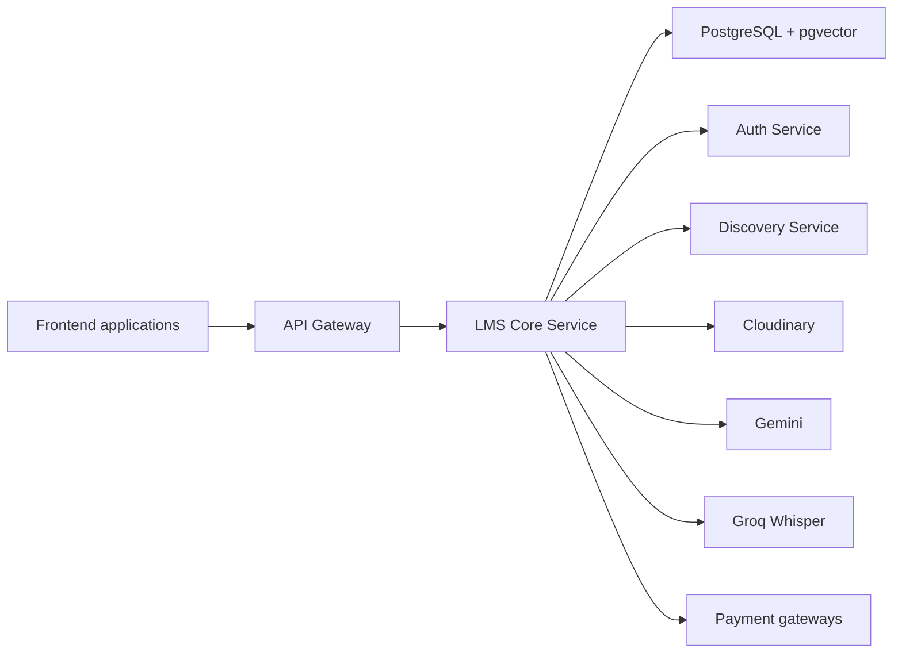
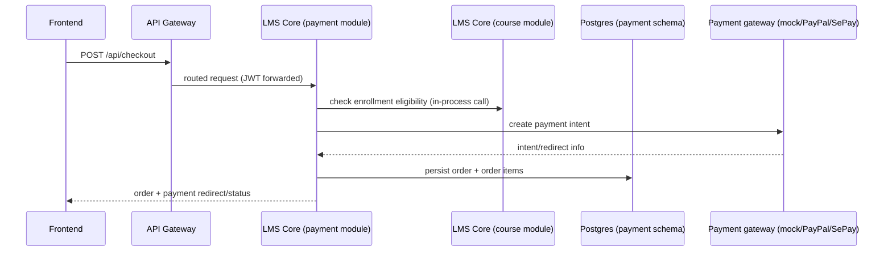
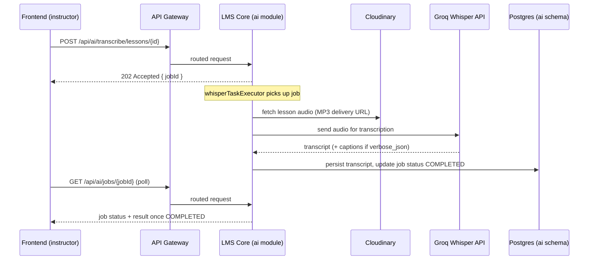

# 🧠 EduMind Platform - Backend

> **Architecture:** Microservices + Modular Monolith
> **Framework:** Spring Boot 3.5.6 + Spring Cloud 2025.0.0
> **Language:** Java 21 (LTS)

Welcome to the **EduMind** backend repository. This project implements a scalable, secure, and high-performance microservices architecture for an AI-powered learning platform.

---

## 🚀 Quick Start

The recommended way to run the backend locally is **Docker Compose** (builds every service from source, no local JDK/Maven required except for editing code).

### 1. Configure environment

```bash
cd backend
cp .env.example .env
```

`.env.example` lists the platform variables used by the services. Before starting, replace the database passwords and fill in `JWT_SECRET`, separate `AUTH_SERVICE_ENCRYPTION_KEY` and `LMS_CORE_SERVICE_ENCRYPTION_KEY` values, plus the Cloudinary settings required by Auth and LMS Core startup. OAuth, mail, AI, and real payment credentials are feature-specific. See [Key Generation](#-development-utilities) below.

### 2. Start the minimum needed to run LMS Core

```bash
docker compose up -d postgres-lms-core discovery-service lms-core-service
```

This starts only what `lms-core-service` needs: its own Postgres/pgvector database and the Eureka registry it heartbeats to. It does **not** start `auth-service`, `postgres-auth`, `redis`, or `api-gateway` — add them if you need the full platform (see "Full stack" below).

### 3. Verify it's up

```bash
curl --fail http://localhost:8083/actuator/health
```

A `200 OK` with `{"status":"UP"}` means `lms-core-service` is healthy and reachable directly.

### 4. Stop / logs

```bash
docker compose stop                          # stop containers, keep data volumes
docker compose down                          # stop and remove containers (volumes persist)
docker compose logs -f lms-core-service      # tail logs for one service
docker compose logs -f                       # tail logs for everything that's running
```

### Full stack (all 7 services)

```bash
docker compose up -d
```

Builds and starts `discovery-service`, `postgres-auth`, `postgres-lms-core`, `redis`, `auth-service`, `lms-core-service`, and `api-gateway`.

### Direct service URLs vs. the Gateway

| Access path | Example | When to use |
| :--- | :--- | :--- |
| **Direct to service** | `http://localhost:8083/actuator/health` | Health checks, local debugging, hitting a service you started standalone (e.g. the minimal LMS Core setup above). |
| **Through API Gateway** | `http://localhost:8080/api/courses` | All real API traffic — this is what the frontend calls, and it's the only path with CORS, rate limiting, and routing configured. Always prefer this once `api-gateway` is running. |

### Dependency tiers

| Tier | Services | Why |
| :--- | :--- | :--- |
| **Required to start LMS Core** | `postgres-lms-core` | The service cannot initialize JPA or Flyway without its database. |
| **Platform discovery** | `discovery-service` | Required for normal service discovery and Gateway routing. LMS Core can start while Eureka is temporarily unavailable, but registration-dependent flows remain degraded until it reconnects. |
| **Required for end-to-end flows** | `auth-service`, `postgres-auth`, `api-gateway`, `redis` | Needed once you log in, call through the Gateway, or exercise anything that calls `auth-service` via Feign (course enrollment, teacher checks, etc.). |
| **Feature-specific only** | `GEMINI_API_KEY` (RAG chat, AI summaries, quiz generation), `GROQ_API_KEY` + optional `yt-dlp` binary (Whisper transcription), Cloudinary credentials (media upload), PayPal/SePay credentials (real payment gateways) | The app starts and most endpoints work without these; only the specific feature's endpoints fail until the corresponding key/service is configured. |

### Running services natively (alternative to Docker Compose)

Each service ships its own **Maven Wrapper** — use `./mvnw`, not a globally installed Maven, so everyone builds with the same Maven version:

```bash
cd lms-core-service
./mvnw test
./mvnw spring-boot:run
```

Start order when running natively: `discovery-service` → `auth-service` → `lms-core-service` → `api-gateway`. You still need Postgres/Redis running (via `docker compose up -d postgres-auth postgres-lms-core redis`) and a `.env` sourced or exported into your shell.

> **Building from the `backend/` root:** there is no `mvnw` at the repo root — building from `backend/` uses the **Maven reactor** across all modules via a globally installed `mvn` (3.6+):
> ```bash
> cd backend
> mvn clean install   # builds common-lib, then every service, in dependency order
> ```
> Building a single service (`cd lms-core-service && ./mvnw ...`) is the faster inner-loop option; use the root reactor build when you need to verify the whole tree compiles together (e.g. after changing `common-lib`).

---

## ⚙️ Configuration

All configuration is env-var driven — `.env.example` is the source of truth for every variable each service reads (via `application.yml`). `docker compose` reads `.env` automatically; for native runs, export the same variables into your shell or use `direnv`/`.envrc`.

**Never commit `.env`** (already gitignored) — it holds real credentials in dev, and in production these must come from your platform's **secret manager or runtime environment** (e.g. injected as container env vars from a vault, not baked into an image or a repo file).

### Core variables

| Variable | Required | Default | Sensitive | Purpose |
| :--- | :--- | :--- | :--- | :--- |
| `AUTH_DB_URL` / `LMS_CORE_DB_URL` | Yes | Local default (`localhost:5432`/`5433`) | No | PostgreSQL JDBC URL per service |
| `AUTH_DB_PASSWORD` / `LMS_CORE_DB_PASSWORD` | Yes | None | **Yes** | Database credential |
| `JWT_SECRET` | Yes | None | **Yes** | Signs/validates JWTs across services |
| `AUTH_SERVICE_ENCRYPTION_KEY` / `LMS_CORE_SERVICE_ENCRYPTION_KEY` | Yes | None | **Yes** | AES/GCM key for `EncryptionService` (per-service, not shared) |
| `SPRING_PROFILES_ACTIVE` | No | Empty (dev) | No | Activates a matching profile where present. Currently only `auth-service` commits `application-prod.yml`; other services require deployment-time production overrides. |
| `COOKIE_SECURE` | Production: Yes | `false` | No | Must be `true` in production — refresh-token cookie requires HTTPS |
| `COOKIE_SAME_SITE` | No | `Lax` | No | Refresh-token cookie SameSite policy |
| `FRONTEND_URL` / `GATEWAY_URL` / `ADMIN_URL` | Yes | `localhost:3000` / `:8080` / `:4200` | No | Used for CORS, OAuth redirects, email links |
| `ACTUATOR_HEALTH_DETAILS` | No | `never` | No | API Gateway health-detail exposure; keep restricted in production |
| `GOOGLE_CLIENT_ID` / `GOOGLE_CLIENT_SECRET` | Feature: OAuth login | Empty | **Yes** | Google OAuth2 login |
| `MAIL_USERNAME` / `MAIL_PASSWORD` | Feature: email | Empty | **Yes** | SMTP credentials for verification/reset emails |
| `CLOUDINARY_CLOUD_NAME` / `_API_KEY` / `_API_SECRET` | Feature: media upload & Whisper (Cloudinary path) | Empty | **Yes** | Media storage/delivery |
| `GEMINI_API_KEY` | Feature: AI (RAG, summaries, quizzes) | Empty | **Yes** | Gemini chat + embeddings |
| `GROQ_API_KEY` | Feature: transcription | Empty | **Yes** | Whisper transcription |
| `YTDLP_PATH` | Feature: YouTube-caption fallback | `yt-dlp` (on PATH) | No | Path to the `yt-dlp` binary |
| `VIDEO_HLS_ENABLED` | No | `false` | No | Enables HLS video delivery |

### Payment configuration

| Variable | Required | Default | Sensitive | Purpose |
| :--- | :--- | :--- | :--- | :--- |
| `PAYMENT_GATEWAY` | No | `mock` | No | Default gateway (`mock` \| `paypal` \| `sepay`) |
| `PAYMENT_MOCK_ENABLED` | No | `true` | No | Enables the mock gateway — **must be `false` in production** |
| `PAYMENT_PAYPAL_ENABLED` | Feature: PayPal | `false` | No | Enables PayPal gateway |
| `PAYPAL_CLIENT_ID` / `PAYPAL_CLIENT_SECRET` / `PAYPAL_WEBHOOK_ID` | Feature: PayPal | Empty | **Yes** | PayPal API credentials |
| `PAYPAL_MODE` | Feature: PayPal | `sandbox` | No | `sandbox` \| `live` |
| `PAYPAL_RETURN_BASE_URL` | Feature: PayPal | Empty | No | Must be a publicly reachable URL |
| `PAYMENT_SEPAY_ENABLED` | Feature: SePay | `false` | No | Enables SePay (Vietnam QR) gateway |
| `SEPAY_API_KEY` / `SEPAY_SECRET_KEY` / `SEPAY_WEBHOOK_SECRET` | Feature: SePay | Empty | **Yes** | SePay API credentials |
| `SEPAY_MERCHANT_ID`, `SEPAY_BASE_URL`, `SEPAY_BANK_CODE`, `SEPAY_BANK_ACCOUNT`, `SEPAY_ACCOUNT_NAME` | Feature: SePay | See `.env.example` | No (bank account/name are business info, not secrets, but avoid using real production account details in shared/dev files) | SePay merchant + bank routing info shown on generated QR codes |
| `PAYMENT_REFUND_AUTO_APPROVE_DAYS` / `_MAX_DAYS` / `_PARTIAL_THRESHOLD` | No | `7` / `30` / `50` | No | Refund policy thresholds |
| `PAYMENT_PAYOUT_MINIMUM_AMOUNT` / `_HOLD_PERIOD` / `_SCHEDULE_DAY` / `_SCHEDULE_HOUR` / `_MAX_RETRIES` | No | See `.env.example` | No | Instructor payout schedule and retry policy |

### App async / executor / certificate configuration

| Variable | Required | Default | Sensitive | Purpose |
| :--- | :--- | :--- | :--- | :--- |
| `APP_BASE_URL` | No | `http://localhost:8080` | No | Base URL used in generated links |
| `APP_CERTIFICATE_REQUIRE_PAID_COURSE` | No | `true` | No | Gate certificate issuance to paid courses only |
| `APP_ASYNC_CORE_POOL_SIZE` / `_MAX_POOL_SIZE` / `_QUEUE_CAPACITY` | No | `10` / `20` / `50` | No | General-purpose async executor sizing |
| `AI_CORE_POOL_SIZE` / `AI_MAX_POOL_SIZE` / `AI_QUEUE_CAPACITY` | No | `2` / `5` / `50` | No | AI job executor sizing (Gemini pool) |
| `WHISPER_QUEUE_CAPACITY` | No | `10` | No | Whisper job queue depth (executor itself is fixed at 1 worker to respect Groq's rate limit) |
| `REVIEW_AUTO_APPROVE_ENABLED` / `_THRESHOLD` | No | `true` / `0` | No | Course review auto-moderation |
| `CORS_ALLOWED_ORIGINS` | Yes | `localhost:3000,localhost:4200` | No | Allowed frontend origins |

Full, current values live in [`.env.example`](.env.example) — treat this section as a map of *what each variable does and why it's required*, not a copy to keep in sync manually.

`docker-compose.prod.yml` additionally reads `GITHUB_REPOSITORY_OWNER` and `IMAGE_TAG` to select GHCR images. Use an immutable release or commit tag in production instead of relying on `latest`.

---

## 🛠 Technology Stack

We use a modern Java ecosystem designed for enterprise-grade scalability.

| Domain | Technnology | version |
| :--- | :--- | :--- |
| **Framework** | Spring Boot | v3.5.6 |
| **Cloud** | Spring Cloud | v2025.0.0 |
| **Discovery** | Netflix Eureka | - |
| **Gateway** | Spring Cloud Gateway | - |
| **Database** | PostgreSQL | v16 |
| **Caching** | Redis | v7 |
| **Security** | Spring Security + JWT | - |
| **Migration** | Flyway | v10.x |
| **Build** | Maven | 3.6+ |
| **AI / LLM** | Spring AI + Google Gemini | 1.1.2 |
| **Vector DB** | pgvector (PostgreSQL extension) | 0.8+ |
| **Transcription** | Groq Whisper API (`whisper-large-v3-turbo`) | - |

---

## 🏗 Architecture

The system follows a hybrid microservices architecture:

1.  **Microservices**: For infrastructure/cross-cutting concerns (Gateway, Auth, Discovery).
2.  **Modular Monolith (`lms-core-service`)**: Hosts core business logic to **minimize deployment costs** and operational overhead. Separate database schemas (`course`, `payment`, `ai`, with reserved future schemas) establish domain ownership, while a small number of reporting paths still have known cross-module repository coupling to remove before independent extraction.



### Why a modular monolith for `lms-core-service`

`course`, `payment`, and `ai` are the three domains with the most cross-cutting reads (a course page needs enrollment status, price, and AI summary availability at once). Splitting them into separate services this early would mean every one of those reads becomes a network call, without a corresponding scaling need — LMS Core's load doesn't yet justify independent deployment. Instead, each domain gets its **own Postgres schema** (`course`, `payment`, `ai`, plus reserved-but-unimplemented `assessment`, `gamification`, `notification`) so the boundary is enforced at the data layer today, and extraction into a standalone service later is a matter of moving a schema + its module, not re-designing the domain.

### Module boundaries and how they communicate

- **In-process (synchronous)**: primary business flows use Java module APIs rather than HTTP — for example, payment invokes course query/command interfaces for enrollment and course data. Some reporting implementations (`DashboardServiceImpl` and `TeacherAnalyticsServiceImpl`) still query payment repositories directly; these are documented coupling points, not examples of the target boundary.
- **Cross-service (synchronous)**: `lms-core-service` → `auth-service` calls happen over **OpenFeign** (e.g. `UserClient`), routed through Eureka (`lb://AUTH-SERVICE`), with the caller's JWT propagated via `FeignConfig`.
- **Asynchronous, in-process**: AI work (embeddings, summaries, quiz generation, Whisper transcription) runs on dedicated `@Async` executor pools inside `lms-core-service` (see `ai.executor.*` config) rather than blocking the request thread — the controller returns `202 Accepted` immediately and the client polls for job status.
- **No message broker today**: there is no Kafka/RabbitMQ in this system; "asynchronous" here means async servlet threads and scheduled pollers (e.g. `TranscriptionRetryScheduler`), not event streaming between services.

### Example flow: checkout (synchronous)



### Example flow: AI transcription job (async job pattern)



RAG chat follows the same request path but responds over **SSE** instead of polling — see [API documentation](#-api-documentation) for the event format.

For deeper per-service internals, see the per-service READMEs (`lms-core-service/README.md`, `api-gateway/README.md`).

### Service Landscape

| Service | Port | Description |
| :--- | :--- | :--- |
| **Discovery Service** | `8761` | Service Registry (Eureka). |
| **API Gateway** | `8080` | Entry point, Rate Limiting, Routing. |
| **Auth Service** | `8081` | Identity, OAuth2, 2FA, JWT issuance. |
| **LMS Core Service** | `8083` | Core business logic (Courses, Payments, AI, future Assessments/Gamification). |

*(Note: `common-lib` provides shared DTOs, utilities, and security configuration for `auth-service` and `lms-core-service`. `api-gateway` and `discovery-service` do not depend on it.)*

---

### Databases & Storage

The backend uses two PostgreSQL databases plus Redis:

- **Auth DB (`postgres-auth`, port 5432)**  
  - Database: `edumind_auth`  
  - Schema: `public`  
  - Purpose: users, roles, user-role mappings, refresh tokens, verification tokens, password reset tokens.

- **LMS Core DB (`postgres-lms-core`, port 5433)**  
  - Database: `edumind_core`  
  - Schemas:
    - `course`: courses, sections, lessons, enrollments, categories, reviews, wishlists
    - `payment`: cart items, orders, order items, invoices, earnings, payouts, refunds, platform config
    - `ai` **(active)**: AI job logs, lesson embeddings, lesson summaries, generated quizzes, quiz attempts, AI rate limits
    - `assessment`, `gamification`, `notification` **(reserved only)**: schemas exist from the initial migration but have no corresponding Java modules/entities yet — not implemented

- **Redis (`redis`, port 6379)**  
  - Rate limiting for API Gateway (IP-based).  
  - Ready for future caching use cases.

- **pgvector (PostgreSQL extension)**  
  - Lives **inside the LMS Core database** (`edumind_core`, port 5433) — not a separate/external vector database or service.
  - Used in `ai.lesson_embeddings` for semantic search / RAG.  
  - Vectors stored as `vector(768)` with ivfflat index (`vector_cosine_ops`).

### Service Responsibilities

- **Discovery Service (`discovery-service`)**
  - Eureka registry – all other services register here.
  - Gateway uses logical service names (`lb://AUTH-SERVICE`, `lb://LMS-CORE-SERVICE`).

- **API Gateway (`api-gateway`)**
  - Single public entry point on `8080`.
  - Responsibilities:
    - Routing to backend services via Eureka.
    - IP-based rate limiting using Redis.
    - CORS configuration for `localhost:3000` (React user app) and `localhost:4200` (Angular admin app).
    - Request/response logging and health checks.
  - Key routes (see `api-gateway/src/main/resources/application.yml` for exact rules):
    - `/api/auth/**`, `/api/auth/oauth2/**`, `/api/auth/login/oauth2/**` → `auth-service`
    - `/api/admin/**` (incl. `/api/admin/dashboard/**`, `/api/admin/enrollment-reports/**`) → `auth-service` (admin endpoints)
    - `/api/users/**`, `/api/upload/**`, `/api/teacher-application/**` → `auth-service`
    - `/api/courses/**`, `/api/categories/**`, `/api/sections/**`, `/api/lessons/**` → `lms-core-service`
    - `/api/enrollments/**`, `/api/certificates/**`, `/api/progress/**` → `lms-core-service`
    - `/api/reviews/**`, `/api/wishlist/**` → `lms-core-service`
    - `/api/cart/**`, `/api/checkout/**`, `/api/orders/**`, `/api/invoices/**` → `lms-core-service`
    - `/api/teacher/earnings/**`, `/api/teacher/analytics/**` → `lms-core-service`
    - `/api/payments/refunds/**`, `/api/payments/webhook/**`, `/api/instructors/payouts/**` → `lms-core-service`
    - `/api/ai/**` → `lms-core-service`

- **Auth Service (`auth-service`)**
  - User registration, login, and profile management.
  - JWT issuance (access + refresh), token rotation on refresh.
  - OAuth2 login (e.g. Google) and 2FA (TOTP).
  - Email verification and password reset flows.
  - Encrypts sensitive data (2FA secrets, OAuth tokens) via `EncryptionService`.

- **LMS Core Service (`lms-core-service`)**
  - Modular monolith implementing the main LMS domains:
    - **Course module (`course` schema)**: courses, sections, lessons, enrollments, reviews, wishlists.
    - **Payment module (`payment` schema)**: cart, checkout, orders, invoices, earnings, payouts, refunds.
    - **AI module (`ai` schema)**: RAG chat, lesson embeddings, AI summaries, quiz generation & attempts, rate limits, Groq Whisper transcription.
    - **Not yet implemented**: `assessment`, `gamification`, `notification` — schemas reserved by migration, no Java module exists for them yet.
  - Follows strict layering per module: **Controller → Service → Repository → Entity**, with DTOs at the edges.
  - Integrates with:
    - Auth Service via OpenFeign (`UserClient`, etc.) and shared JWT validation.
    - Cloudinary for media uploads (course thumbnails, lesson assets, etc.).

### Shared Library: `common-lib`

`auth-service` and `lms-core-service` depend on `common-lib` for cross-cutting concerns (`api-gateway` and `discovery-service` do not):

- **API contracts**
  - `ApiResponse<T>` – standard success wrapper.
  - `PagedResponse<T>` – pagination wrapper.
  - `ErrorResponse`, `MessageResponse` – standard error / message formats.

- **Error handling**
  - `GlobalExceptionHandler` (`@RestControllerAdvice`) – centralizes error mapping.
  - Shared exception types (`ResourceNotFoundException`, `BadRequestException`, etc.).

- **Security utilities**
  - `EncryptionService` – AES/GCM encryption; each service uses its own encryption key.
  - JWT helpers used consistently across services.

- **Constants & utilities**
  - `ErrorCode`, `ResponseStatus`, and other reusable constants.
  - Cloudinary integration helpers.

### AI & RAG Overview (Backend Perspective)

The AI feature set is implemented inside `lms-core-service` (under the `ai` module):

- **RAG Chat**
  - Lesson content is chunked and embedded using Google Gemini embeddings (`gemini-embedding-001`, 768 dimensions).
  - Queries embed into the same space and perform vector similarity search via pgvector cosine distance.
  - Confidence classification (HIGH / MEDIUM / GAP) based on distance thresholds; low-confidence queries are logged as knowledge gaps.
  - Supports both standard JSON responses and SSE streaming for token-by-token responses.

- **Lesson Summaries & Quizzes**
  - Summaries: async jobs generate structured summaries (text, key points, vocabulary) per lesson.
  - Quizzes: instructor-triggered quiz generation → multiple-choice questions with explanations; students only see options until submission.
  - All AI generation follows an **async job pattern**: `202 Accepted` with `jobId`, then `GET /api/ai/jobs/{id}` to poll status.

- **Groq Whisper Transcription**
  - Instructors submit a lesson video URL; the service resolves the audio source, sends it to Groq's Whisper API, and writes the transcript back as the lesson's article content.
  - **Supported sources (recommended → fallback):**
    - **Cloudinary (recommended, production path)** – the video's Cloudinary URL is rewritten to an MP3 delivery URL (`vc_none,ac_mp3,br_32k` transformation) and downloaded as a temp file. No CLI dependency; works reliably on any deployment target, including VPS.
    - **YouTube (supported, not recommended for VPS production)** – `yt-dlp --write-auto-sub` fetches existing auto-captions first (free, skips Groq entirely); if none are found, falls back to `yt-dlp -x --audio-format mp3` to download and transcribe the audio. Requires the `yt-dlp` binary on PATH and is subject to YouTube-side throttling/IP blocking, so it's better suited to local/dev use than a production VPS.
  - **Caption generation & upload**: when transcribing an audio file via Groq (not the YouTube-caption shortcut), the response is requested as `verbose_json` to get segment timestamps, which are converted into a WebVTT file and uploaded to Cloudinary (`captions/` folder, raw resource type). The resulting caption URL is persisted on the lesson (`LessonWriteService.updateCaptionUrl`) for use by the video player. Caption upload failure is non-fatal — the transcript itself is still saved.
  - **25 MB limit** enforced before sending to Groq.
  - Uses the same **async job pattern** (`202 Accepted` + `jobId`). Job states: `PENDING → PROCESSING → COMPLETED | FAILED | DELAYED`.
  - **`DELAYED`** state: a Groq HTTP 429 sets `nextRetryAt` (`now + ai.groq.retry-delay-seconds`, default 60 s) and job status `DELAYED`. `TranscriptionRetryScheduler` polls every 30 s for jobs past their `nextRetryAt` and re-queues them.
  - Configured via `GROQ_API_KEY` (optional — app starts without it, but transcription endpoints fail until it's set) and `YTDLP_PATH` (optional, defaults to `yt-dlp` on PATH).
  - Dedicated executor, isolated from the Gemini pool: `whisperTaskExecutor` (core=1, max=1 — deliberately serialized to respect Groq's rate limit; queue capacity via `WHISPER_QUEUE_CAPACITY`, default 10).

- **AI Rate Limiting & Safety**
  - Per-user daily limits (e.g., RAG chat requests) backed by Postgres with atomic UPSERTs.
  - Async executors configured via `application.yml` + env vars (`AI_CORE_POOL_SIZE`, etc.).
  - AI configuration is conditional: `GEMINI_API_KEY` for Gemini features, `GROQ_API_KEY` for transcription; the app starts without either but the respective AI endpoints will not work.

---

## 📦 Project Structure

```text
backend/
├── api-gateway/            # 🚪 System Entry Point (Routing, Rate Limiting)
├── auth-service/           # 🔐 Identity & Access Management
├── discovery-service/      # 🗺️ Service Registry (Eureka)
├── lms-core-service/       # 🧠 Core Business Logic (Modular Monolith)
├── common-lib/             # 📚 Shared Code (DTOs, Exceptions, Utils)
├── scripts/                # 🛠️ Utility Scripts (Key generation, etc)
├── docker-compose.yml      # 🐳 Infrastructure (Postgres, Redis)
└── pom.xml                 # 📄 Parent POM
```

---

## 🚀 Getting Started

See [Quick Start](#-quick-start) above for the fastest path. This section covers prerequisites and details not needed for the happy path.

### Prerequisites

- **Docker**: to run the recommended Compose-based setup (no local JDK/Maven needed for this path).
- **JDK 21+** and a globally installed **Maven 3.6+**: only needed if you build from the `backend/` root reactor (`mvn clean install`). Running a single service via its own `./mvnw` does not require a global Maven install.
- **yt-dlp** *(optional)*: only required for the YouTube-caption fallback path of Whisper transcription — the recommended Cloudinary transcription path has no CLI dependency.
  ```bash
  brew install yt-dlp          # macOS
  pip install yt-dlp           # Linux/Windows (pip)
  ```

For more Docker Compose detail (build vs. prebuilt-image files, healthchecks, volumes), see **[DOCKER.md](DOCKER.md)**.

### Production

`docker-compose.prod.yml` runs the platform from **prebuilt images published to GitHub Container Registry (GHCR)** instead of building from source:

```bash
cd backend
IMAGE_TAG=<short-sha> docker compose -f docker-compose.prod.yml up -d
# IMAGE_TAG defaults to "latest" if not set
# Images: ghcr.io/<owner>/edumind-{discovery-service,auth-service,lms-core-service,api-gateway}:<tag>
```

Differences from the local compose file:
- Application services (`discovery-service`, `auth-service`, `lms-core-service`, `api-gateway`) pull GHCR images instead of building a `Dockerfile` from `context: .`.
- Every service (including the two Postgres containers and Redis) has a `healthcheck`, and app services `depends_on` their dependencies with `condition: service_healthy`.
- `postgres-auth-data`, `postgres-lms-core-data`, and `redis-data` are named Docker volumes, so data survives container restarts/recreation.
- `.env` still supplies secrets (`JWT_SECRET`, `GEMINI_API_KEY`, `GROQ_API_KEY`, Cloudinary/OAuth/mail credentials, etc.) — never bake secrets into the image.

### ⚠️ Production configuration checklist

These are gaps or defaults in the current codebase that **must** be addressed before a real production deployment — this is a checklist of what to verify/change, not a description of what's already handled.

- **Never run the mock payment gateway in production.** `PAYMENT_GATEWAY` defaults to `mock` and `PAYMENT_MOCK_ENABLED` defaults to `true` (`lms-core-service/src/main/resources/application.yml`) with **no code-level guard** preventing mock in production — you must explicitly set `PAYMENT_GATEWAY=paypal` (or `sepay`) and `PAYMENT_MOCK_ENABLED=false` via env vars.
- **Set `SPRING_PROFILES_ACTIVE=prod` on `auth-service`.** It has an `application-prod.yml` that quiets `org.hibernate.SQL` from `DEBUG`→`INFO` and hides actuator details (`show-details: never`). **`lms-core-service`, `api-gateway`, and `discovery-service` have no `application-prod.yml` at all** — `lms-core-service` in particular still ships `org.hibernate.SQL: DEBUG` / `BasicBinder: TRACE` and `management.endpoint.health.show-details: always` regardless of profile. Until a prod profile is added for these services, override the equivalent properties via env vars / a mounted config at deploy time.
- **`/actuator/metrics` already requires `ROLE_ADMIN`** on `auth-service` and `lms-core-service` (enforced in each service's `SecurityConfig`) — only `/actuator/health` and `/actuator/info` are public. **`discovery-service` and `api-gateway` have no such restriction** on `/actuator/**` — treat their actuator endpoints as internal-network-only (don't expose them publicly) until access control is added.
- **Readiness/liveness**: use `/actuator/health` per service as both probes for now — there's no separate readiness/liveness split configured (no Kubernetes-specific health groups). `docker-compose.prod.yml` already wires `healthcheck` + `depends_on: condition: service_healthy` for orchestration-level readiness.
- **Graceful shutdown is not configured anywhere in the codebase** (no `server.shutdown` / `spring.lifecycle.timeout-per-shutdown-phase` in any `application.yml`). In-flight requests can be cut off on redeploy/restart — add `server.shutdown: graceful` and a `spring.lifecycle.timeout-per-shutdown-phase` before relying on rolling deploys without dropped requests.
- **Log collection**: services log to `logs/<service>.log` locally (rolling, 10MB/30 files) — this is not sufficient in production. Ship container stdout/stderr (or the log files) to a centralized collector (e.g. your platform's log driver, Loki, CloudWatch) rather than relying on tailing files on the container filesystem.
- **Docker Compose has a hardcoded weak DB password fallback**: `docker-compose.yml` / `docker-compose.prod.yml` default `POSTGRES_PASSWORD`/`AUTH_DB_PASSWORD`/`LMS_CORE_DB_PASSWORD` to `postgres` if the env var is unset (`${AUTH_DB_PASSWORD:-postgres}`). Always set real `AUTH_DB_PASSWORD` / `LMS_CORE_DB_PASSWORD` in production — do not rely on the fallback.

### Database migration policy

- **Forward-only**: Flyway migrations only move forward (`baseline-on-migrate: true`, `flyway:migrate`). Never edit or delete a migration file that has already shipped/run anywhere outside your own machine.
- **Fix forward, don't rewrite history**: if a released migration has a bug, ship a new migration that corrects it — do not modify the checksummed file (Flyway will reject a changed checksum on next run; `flyway:repair` is for fixing metadata after a manual DB fix, not for condoning migration edits).
- **Backup before any migration that touches production data materially** (schema changes affecting existing rows, backfills, drops) — take a database snapshot/backup immediately before running `flyway:migrate` in production.
- **Rollback = new migration, not `flyway:clean`/`undo`**: `flyway:clean` is destructive (drops all configured schemas — see [Database Operations](#-development-utilities) below) and must never run against production. If a migration causes a problem in production, roll forward with a corrective migration in the next release rather than attempting to revert the applied one.

### Deployment verification checklist

After deploying a new version, verify in order:
1. `curl --fail http://<host>:<port>/actuator/health` returns `200` for every service (`discovery-service:8761`, `auth-service:8081`, `lms-core-service:8083`, `api-gateway:8080`).
2. New service instances appear in the Eureka dashboard (`http://<discovery-host>:8761`).
3. `flyway:info` (or the equivalent startup log) shows no pending/failed migrations.
4. A real request through the Gateway succeeds end-to-end (e.g. `GET /api/courses` returns `200` with an `ApiResponse` payload).
5. Logs show no repeated connection errors to Postgres/Redis/Eureka in the minutes after startup.

### Secrets policy

- Production secrets (`JWT_SECRET`, DB passwords, encryption keys, OAuth/mail/Cloudinary/Gemini/Groq/PayPal/SePay credentials) must come from a **secret manager or the runtime environment** (e.g. your cloud provider's secrets store, injected as container env vars), never from a file committed to the repo or baked into a Docker image.
- `.env` and `.env.prod` are gitignored — keep it that way, and don't paste real credentials into PRs, issues, or chat when sharing config.
- Rotate `JWT_SECRET` and the per-service `*_ENCRYPTION_KEY`s independently; they are not shared between `auth-service` and `lms-core-service` by design.

### Rate limiting & external API failure behavior

- The API Gateway rate-limits by client IP via Redis (`RequestRateLimiter`, key resolver in `RateLimiterConfig`). Limits are currently **hardcoded per route** in `api-gateway/application.yml` (not env-configurable), e.g. auth routes `10 req/s` (burst `20`), course/catalog routes `20 req/s` (burst `40`), payment webhooks `50 req/s` (burst `100`), AI routes `15 req/s` (burst `30`). Adjust these directly in the gateway's route config if production traffic needs different limits.
- **Gemini/Groq failures don't take down the app** — AI features are configured conditionally; if `GEMINI_API_KEY`/`GROQ_API_KEY` are unset or the upstream call fails, only the AI/transcription endpoints return errors (or, for Groq `429`s, jobs move to `DELAYED` and are retried by `TranscriptionRetryScheduler` every 30s). Non-AI endpoints are unaffected.

### Temporary file & upload handling

- **Whisper transcription temp audio files** are written to the JVM temp directory (`java.io.tmpdir`) with UUID names and are always deleted in a `finally` block (`Files.deleteIfExists`) after transcription — whether the job succeeds or fails. Deletion errors are swallowed (non-fatal), so don't rely on this path for disk-space accounting under repeated failures; monitor `java.io.tmpdir` usage if transcription volume is high.
- **Upload limits**: `auth-service` and `lms-core-service` cap multipart uploads at **10MB** (`max-file-size` / `max-request-size`). `api-gateway` has no multipart size override, so it defers to Spring's default.
- **Groq's own 25MB limit** is enforced in application code before the API call (`GROQ_MAX_BYTES = 25 * 1024 * 1024`) — an audio file over 25MB fails fast locally with a clear error instead of being rejected by Groq after upload.

---

## 🔒 Security & Standards

- **Authentication**: Stateless JWT Authentication.
- **Authorization**: Role-Based Access Control (RBAC).
- **Encryption**: Sensitive data encrypted at rest using `EncryptionService`.
- **Communication**: Inter-service communication via Feign Clients (REST) with JWT propagation via a shared `FeignConfig`.
- **API Standards**:
    - Unified `ApiResponse<T>` wrapper.
    - Global Exception Handling (`common-lib`).

---

## 🛠 Development Utilities

### Key Generation
Generate secure keys for JWT and Encryption (never use these in prod):

```bash
./scripts/generate-all-service-keys.sh
```

### Database Operations (Flyway CLI)

We have configured the `flyway-maven-plugin` to allow direct CLI control. Ensure your `.env` variables are loaded before running these commands.

#### 1. Migrate (Apply pending changes)
```bash
# Auth Service
cd auth-service
mvn flyway:migrate

# LMS Core Service
cd lms-core-service
mvn flyway:migrate
```

#### 2. Clean / Reset (Drop all tables)
**⚠️ Destructive Operation:** Drops the configured schemas to give you a clean slate.

```bash
mvn flyway:clean
```

#### 3. Info (Status Check)
See which migrations are applied, pending, or failed.

```bash
mvn flyway:info
```

#### 4. Repair (Fix Metadata)
Use this if a migration failed and you've manually fixed the SQL, but Flyway is complaining about checksums or failed versions.

```bash
mvn flyway:repair
```

#### 5. Validate (Check Integrity)
Validates applied migrations against local files.

```bash
mvn flyway:validate
```

---

#### 💡 Troubleshooting
If you see connection errors:
1. Ensure `.env` is loaded (`source ../.env`).
2. Verify Docker containers are running (`docker-compose ps`).
3. Check defaults in `pom.xml` match your local DB credentials.

---

## 📚 API Documentation

All requests should be routed through the **API Gateway** (`http://localhost:8080`) — see [Direct service URLs vs. the Gateway](#direct-service-urls-vs-the-gateway). Route groups by domain and owning service:

| Route group | Owning service | Access |
| :--- | :--- | :--- |
| `/api/auth/**`, `/api/auth/oauth2/**`, `/api/auth/login/oauth2/**` | `auth-service` | Public (login/signup/refresh/OAuth2) |
| `/api/admin/**` (incl. dashboard, enrollment-reports) | `auth-service` / `lms-core-service` | ADMIN only |
| `/api/users/**`, `/api/upload/**`, `/api/teacher-application/**` | `auth-service` | Authenticated (roles vary by endpoint) |
| `/api/courses/**`, `/api/categories/**`, `/api/sections/**`, `/api/lessons/**` | `lms-core-service` | Mostly public reads; writes require active TEACHER/ADMIN |
| `/api/enrollments/**`, `/api/certificates/**`, `/api/progress/**` | `lms-core-service` | STUDENT (own data) / TEACHER / ADMIN |
| `/api/reviews/**`, `/api/wishlist/**` | `lms-core-service` | Public reads; STUDENT writes |
| `/api/cart/**`, `/api/checkout/**`, `/api/orders/**`, `/api/invoices/**` | `lms-core-service` | Active STUDENT/TEACHER |
| `/api/teacher/earnings/**`, `/api/teacher/analytics/**` | `lms-core-service` | Active TEACHER |
| `/api/payments/refunds/**`, `/api/instructors/payouts/**` | `lms-core-service` | Active STUDENT/TEACHER; `/admin/**` sub-paths are ADMIN only |
| `/api/payments/webhook/**` | `lms-core-service` | Public (verified by gateway signature, not JWT) |
| `/api/ai/**` | `lms-core-service` | Authenticated; RAG chat, summaries, quizzes, Whisper transcription |

This is a routing-level summary — exact filters live in `api-gateway/src/main/resources/application.yml`.

For **exact, per-endpoint detail** — HTTP method, path, required role, response type, and status code for every controller — see **[API.md](API.md)**. It also documents:
- The `ApiResponse<T>` / `PagedResponse<T>` response envelope used by nearly every endpoint.
- Validation-error and authentication-error response shapes (sample JSON).
- Which endpoints are public vs. STUDENT/TEACHER/ADMIN-gated.
- The **SSE event format** for RAG chat streaming (`POST /api/ai/chat/courses/{courseId}/stream`).
- The **async job polling contract** for AI features (`202 Accepted` + `GET /api/ai/jobs/{id}`).

There is no OpenAPI/Swagger UI yet — `API.md` is hand-maintained against the controllers; see the note at the bottom of that file if you want to add `springdoc-openapi` instead.

---

## 🧪 Testing & Conventions (Backend-wide)

- **Testing**
  - Each service has its own test suite (`mvn test` from service root).
  - LMS Core uses Testcontainers for Postgres + pgvector in AI and repository tests.
  - Coverage reports can be generated with `mvn test jacoco:report` (where configured).

- **Coding Patterns**
  - Follow the standard Spring layering: **Controller → Service → Repository → Entity**.
  - Use DTOs for request/response, never expose JPA entities directly over the wire.
  - Always return `ApiResponse<T>` or `PagedResponse<T>` from controllers (via `common-lib`).
  - Throw exceptions and rely on `GlobalExceptionHandler` instead of manual error responses.

For deeper backend implementation details, see the per-service READMEs (especially `lms-core-service/README.md` and `api-gateway/README.md`).
