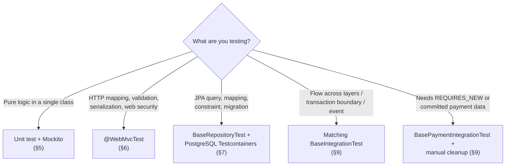

# Backend Testing Guide

This is the single source of truth for backend testing in EduMind. Everything below has been verified against the actual test code, Maven dependencies, test profiles, and base classes currently implemented in the repository — not aspirational or planned behavior.

## Quick Start

> ⚠️ **Docker is required** for repository, integration, and context tests in `auth-service` and `lms-core-service`.

```bash
# Run the complete backend test suite (from backend/)
mvn test

# Run one fast unit-test class (from its module)
cd auth-service
./mvnw -Dtest=AuthServiceTest test
```

Test classes must end in `Test` or `Tests`. Start with the [test-type decision guide](#11-choosing-a-test-type) when you are unsure which kind of test to write.

## Table of Contents

1. [Current Stack and Strategy](#1-current-stack-and-strategy)
2. [Test Locations](#2-test-locations)
3. [Running Tests](#3-running-tests)
4. [General Conventions](#4-general-conventions)
5. [Unit Tests with JUnit 5 and Mockito](#5-unit-tests-with-junit-5-and-mockito)
6. [Controller Tests with WebMvcTest](#6-controller-tests-with-webmvctest)
7. [Repository Tests with PostgreSQL Testcontainers](#7-repository-tests-with-postgresql-testcontainers)
8. [Testcontainers and Flyway Configuration](#8-testcontainers-and-flyway-configuration)
9. [Integration Tests](#9-integration-tests)
10. [Async and Concurrency Tests](#10-async-and-concurrency-tests)
11. [Choosing a Test Type](#11-choosing-a-test-type)
12. [Troubleshooting](#12-troubleshooting)
13. [Pre-Merge Checklist](#13-pre-merge-checklist)
14. [Reference Files](#14-reference-files)

## Testing Pyramid

The project favors many small, fast unit tests and fewer full integration tests. Controller and repository tests are focused Spring slices: they provide more confidence than a pure unit test without loading every application component.

```text

                       /\
                      /  \
                     /    \
                    /      \
                   /        \
                  /   Full   \
                 / integration\       Fewest; slowest
                /--------------\
               / Controller and \
              / repository slices\    Focused Spring behavior
             /--------------------\
            /      Unit tests      \   Most; fastest
           /    JUnit + Mockito     \
          /__________________________\
```

| Level | What it proves | Typical dependencies | Relative speed |
|---|---|---|---|
| Unit | Business logic in one class | Mockito mocks | Fastest |
| Controller slice | HTTP mapping, validation, serialization, selected security behavior | MockMvc + mocked collaborators | Fast |
| Repository slice | JPA mapping, queries, constraints, and migrations | Real PostgreSQL via Testcontainers | Medium |
| Integration | Wiring and behavior across multiple real layers | Full Spring context + PostgreSQL | Slowest |

## 1. Current Stack and Strategy

- Java 21, Spring Boot 3.5.6, Maven multi-module reactor (`discovery-service`, `api-gateway`, `auth-service`, `common-lib`, `lms-core-service`), JUnit 5.
- Mockito for unit tests — no Spring context, no Docker required.
- `@WebMvcTest` + MockMvc for controller (web-slice) tests; the service layer is mocked.
- `@DataJpaTest` + Testcontainers for repository tests against a **real PostgreSQL** instance.
- `@SpringBootTest` + Testcontainers + MockMvc for integration tests.
- Flyway owns the test schema; Hibernate uses `ddl-auto: none`.
- Database tests use PostgreSQL through Testcontainers; do not write new database tests assuming H2.

| Test type | Pattern in use | Spring context | Database | Docker required |
|---|---|---|---|---|
| Unit / service | `@ExtendWith(MockitoExtension.class)` | None | Mocked repository | No |
| Controller | `@WebMvcTest(...)` | Web slice | None (`@MockBean` service) | No |
| Repository | extends `BaseRepositoryTest` | JPA slice | Real PostgreSQL (Testcontainers) | Yes |
| Integration | extends the matching base integration class | Full context | Real PostgreSQL (Testcontainers) | Yes |
| Context smoke test | `@SpringBootTest` (e.g. `*ApplicationTests`) | Full context | Depends on service | Yes for auth-service / lms-core-service |

> ℹ️ **Implementation note — H2:** `h2` remains declared with test scope in the auth and LMS POM files, but the current repository/integration base classes set `AutoConfigureTestDatabase.Replace.NONE` and inject PostgreSQL. Removing the unused dependency should be handled and verified as a separate maintenance change.

## 2. Test Locations

Tests live next to each Maven module in the standard layout:

```text
backend/<module>/
├── src/main/java/...
├── src/main/resources/...
├── src/test/java/...
└── src/test/resources/application-test.yml   # auth-service, lms-core-service
```

Class names must end in `Test` or `Tests` for Maven Surefire to auto-discover them, e.g. `AuthServiceTest`, `OrderRepositoryTest`, `LmsCoreServiceApplicationTests`.

## 3. Running Tests

### Prerequisites

- JDK 21.
- Maven, or the Maven Wrapper inside the module you're running.
- A running Docker daemon whenever the target module has repository, integration, or context tests (auth-service, lms-core-service).
- Docker must be able to pull `postgres:16-alpine` and `pgvector/pgvector:pg16` on first run.

From the `backend/` directory:

```bash
# Entire backend reactor
mvn test

# A single module; -am also builds the internal dependencies it needs
mvn -pl auth-service -am test
mvn -pl lms-core-service -am test
```

To run a single class, a single method, or a subset of classes, run from inside the module itself — running `-Dtest=...` from the reactor root can silently apply the filter to the wrong module:

```bash
cd auth-service
./mvnw -Dtest=AuthServiceTest test
./mvnw -Dtest=AuthServiceTest#login_WithValidCredentials_ShouldReturnToken test

cd ../lms-core-service
./mvnw -Dtest=CartServiceTest,OrderServiceTest test
```

Do not assume `jacoco:report` is available — the repository has no JaCoCo plugin configured in any `pom.xml`. Do not pass `-DskipTests` when the goal is to verify a change.

## 4. General Conventions

### Arrange–Act–Assert

Use Arrange–Act–Assert (or Given–When–Then), and name tests to describe behavior and expected outcome:

```java
@Test
void findByEmail_WhenUserExists_ShouldReturnUser() {
    // Arrange
    when(userRepository.findByEmail("user@example.com"))
            .thenReturn(Optional.of(user));

    // Act
    User result = userService.findByEmail("user@example.com");

    // Assert
    assertEquals(user, result);
    verify(userRepository).findByEmail("user@example.com");
}
```

Principles:

- Each test verifies exactly one observable behavior.
- Cover the happy path, validation failures, business errors, authorization, and meaningful boundary conditions.
- Only stub dependencies that are actually invoked; verify side effects that matter.
- Never call email, Cloudinary, a payment gateway, an AI provider, or any other external API in an automated test.
- Never depend on test execution order or on data left behind by another test.
- Prefer assertions specific to response, state, and interaction over merely checking "no exception was thrown."

### JUnit 5 lifecycle

```java
class ExampleTest {

    @BeforeAll
    static void setUpOnce() {
        // Runs once before all tests in this class.
    }

    @BeforeEach
    void setUp() {
        // Runs before every test; create fresh test data here.
    }

    @Test
    @DisplayName("Returns the user when the account exists")
    void findUser_WhenAccountExists_ShouldReturnUser() {
        // Arrange, Act, Assert
    }

    @AfterEach
    void tearDown() {
        // Release resources not managed by Spring/Mockito.
    }
}
```

Use `@Nested` to group several scenarios for the same method or use case. Lifecycle methods should prepare infrastructure, not hide the behavior being tested.

### Common assertions

| Intent | JUnit 5 assertion |
|---|---|
| Values are equal | `assertEquals(expected, actual)` |
| Condition is true/false | `assertTrue(condition)` / `assertFalse(condition)` |
| Value is present | `assertNotNull(value)` |
| Code throws an expected error | `assertThrows(ExpectedException.class, () -> action())` |
| Code completes safely | `assertDoesNotThrow(() -> action())` |
| Several related checks | `assertAll(...)` |

## 5. Unit Tests with JUnit 5 and Mockito

> ✅ **No Spring context · No Docker · Fastest feedback**

Service-layer unit tests use the Mockito extension with `@Mock` and `@InjectMocks`:

```java
@ExtendWith(MockitoExtension.class)
class UserServiceTest {

    @Mock
    private UserRepository userRepository;

    @InjectMocks
    private UserService userService;

    @Test
    void getUser_WhenMissing_ShouldThrowResourceNotFoundException() {
        when(userRepository.findById(99L)).thenReturn(Optional.empty());

        assertThrows(ResourceNotFoundException.class,
                () -> userService.getUser(99L));
        verify(userRepository).findById(99L);
    }
}
```

Do not add `@SpringBootTest` to a unit test. For complex arguments, use `ArgumentCaptor`; for branches that must never execute, use `verify(..., never())` or `verifyNoInteractions(...)`.

### Mockito essentials

| Need | Pattern |
|---|---|
| Return a value | `when(repository.findById(id)).thenReturn(Optional.of(entity))` |
| Throw an error | `when(client.call()).thenThrow(new RuntimeException())` |
| Stub a `void` method | `doNothing().when(emailService).send(any())` |
| Match an argument type | `any(User.class)`, `anyLong()`, `anyString()` |
| Verify a call | `verify(repository).save(any(User.class))` |
| Verify no call | `verify(repository, never()).delete(any())` |
| Inspect a saved value | `ArgumentCaptor<User>` |

Mock boundaries, not the class under test. A unit test must not connect to a database or invoke an external service.

## 6. Controller Tests with `@WebMvcTest`

> ✅ **Focused Spring web slice · No Docker · Mock service dependencies**

Controller tests load only the web slice and use MockMvc. Real pattern from the codebase:

```java
@WebMvcTest(AuthController.class)
class AuthControllerTest {

    @Autowired
    private MockMvc mockMvc;

    @MockBean
    private AuthService authService;

    @Test
    void login_WithInvalidPayload_ShouldReturnBadRequest() throws Exception {
        mockMvc.perform(post("/api/auth/login")
                        .contentType(MediaType.APPLICATION_JSON)
                        .content("{}"))
                .andExpect(status().isBadRequest());
    }
}
```

Notes based on the actual code:

- Current controller tests use `@MockBean`; follow the existing convention when adding a test.
- Some LMS controller tests (e.g. `CourseControllerTest`, `EnrollmentControllerTest`, `CheckoutControllerTest`, `CartControllerTest`) disable the security filter chain with `@AutoConfigureMockMvc(addFilters = false)`. When filters are disabled, the test does not prove the filter chain or method-level security actually works — authorization for those endpoints needs to be verified separately (e.g. in an integration test).
- When the security filter chain is kept active, use `spring-security-test` (`@WithMockUser`, request post-processors, CSRF token if the endpoint requires it).
- Assert HTTP status, content type, and the JSON fields that matter via `jsonPath`.

> ℹ️ **Implementation note — mock annotations:** Spring Boot 3.4+ deprecates `@MockBean` in favor of `@MockitoBean`. The repository has not migrated yet. Keep the current convention until a dedicated, repository-wide migration is performed.

## 7. Repository Tests with PostgreSQL Testcontainers

> ⚠️ **Docker required · Real PostgreSQL · Automatic transaction rollback**

Never annotate a new test class with `@DataJpaTest` directly. Extend the base class for the module instead:

```java
class UserRepositoryTest extends BaseRepositoryTest {

    @Autowired
    private UserRepository userRepository;

    @Test
    void findByEmail_WhenPersisted_ShouldReturnUser() {
        User saved = userRepository.saveAndFlush(testUser);

        Optional<User> result = userRepository.findByEmail(saved.getEmail());

        assertTrue(result.isPresent());
        assertEquals(saved.getId(), result.get().getId());
    }
}
```

The two base classes are implemented at:

- `auth-service/src/test/java/com/edumind/auth/config/BaseRepositoryTest.java`
- `lms-core-service/src/test/java/com/edumind/lms/config/BaseRepositoryTest.java`

They are already configured with:

- `@DataJpaTest`.
- `@AutoConfigureTestDatabase(replace = Replace.NONE)`, so Spring does not swap in H2.
- `@ContextConfiguration` wired to the singleton Testcontainer's initializer.
- `@ActiveProfiles("test")`.
- Transaction rollback after every test, which is `@DataJpaTest`'s default behavior.
- The LMS version additionally imports `JpaAuditingConfig` (so `@CreatedDate`/`@LastModifiedDate` work), exposes a protected `EntityManager`, and provides a `cleanupActiveOrders()` helper scoped specifically to leftover `PENDING`/`PROCESSING` payment orders — not a general-purpose cleanup method.

Use `saveAndFlush()` / `entityManager.flush()` when you need a constraint violation to surface at a precise point. Repository tests exist to validate real queries, mappings, constraints, and PostgreSQL/Flyway behavior — never mock the repository in this test tier.

## 8. Testcontainers and Flyway Configuration

> ⚠️ **Docker required · Flyway owns the schema · Never hardcode container ports**

| Configuration | `auth-service` | `lms-core-service` |
|---|---|---|
| Container image | `postgres:16-alpine` | `pgvector/pgvector:pg16` |
| Database | `auth_test` | `lms_test` |
| Flyway schemas | `public` | `course`, `assessment`, `gamification`, `payment`, `notification`, `ai`, `public` |
| Migration location | `classpath:db/migration` | `classpath:db/migration` |
| Hibernate schema action | `ddl-auto: none` | `ddl-auto: none` |
| Container lifecycle | Singleton per test JVM | Singleton per test JVM |

The LMS image includes `pgvector`, which is required by AI-related Flyway migrations. In both modules, the initializer injects the JDBC URL and credentials into the Spring context.

Do not replace the LMS image with plain PostgreSQL while migrations still depend on `pgvector`. Never hardcode the container port — always read the JDBC URL/credentials from the container object.

Both `application-test.yml` files disable service discovery/cloud integrations, provide fake test secrets/config, and let the initializer decide the datasource. Never put production credentials into a test profile.

`withReuse(true)` only takes effect when the local Testcontainers environment also has reuse enabled (`testcontainers.reuse.enable=true` in `~/.testcontainers.properties`); tests must not assume the container is actually reused across separate JVM runs (e.g. CI, where reuse is typically off).

## 9. Integration Tests

> ⚠️ **Docker required · Full Spring context · Slowest test tier**

Choose the base class by module and transaction behavior:

| Base class | Use case | Transaction | Test isolation |
|---|---|---|---|
| `com.edumind.auth.config.BaseIntegrationTest` | Auth flows | `@Transactional` | Automatic rollback |
| `com.edumind.lms.modules.payment.BaseIntegrationTest` | Normal LMS payment flows | `@Transactional` | Automatic rollback |
| `com.edumind.lms.modules.payment.BasePaymentIntegrationTest` | Payment flows requiring `REQUIRES_NEW` or committed data | Non-transactional | Manual `@AfterEach` cleanup |

All three load the full Spring context on a random port, configure MockMvc, and use PostgreSQL with Flyway.

### Example: auth-service

Extend `com.edumind.auth.config.BaseIntegrationTest`. The base class loads the full context on a random port, configures MockMvc, uses PostgreSQL/Flyway, and applies `@Transactional` to roll back after every test.

```java
class AuthIntegrationTest extends BaseIntegrationTest {

    @Test
    void signup_WithValidRequest_ShouldCreateUser() throws Exception {
        mockMvc.perform(post("/api/auth/signup")
                        .contentType(MediaType.APPLICATION_JSON)
                        .content(objectMapper.writeValueAsString(request)))
                .andExpect(status().isCreated());
    }
}
```

### LMS payment transaction choice

Choose the base class based on transaction semantics:

- `com.edumind.lms.modules.payment.BaseIntegrationTest`: has class-level `@Transactional`, suited to flows where rollback after the test is fine.
- `com.edumind.lms.modules.payment.BasePaymentIntegrationTest`: has **no** class-level transaction, for flows that need to observe `REQUIRES_NEW` propagation or truly committed data. This base class deletes test data manually in `@AfterEach`, in foreign-key-safe order (invoices → transactions → earnings → order items → orders → cart items → carts → enrollments → courses → categories).

Do not extend the non-transactional base class casually — only when the test genuinely needs to see data committed by a nested `REQUIRES_NEW` transaction. If you add an entity/repository to the payment flow, update that cleanup list, or later tests will leak data and fail intermittently.

All external gateways in the test profile must run in mock/synthetic mode. For example, payment tests use a mock gateway, PayPal remote verification is disabled for test payloads, and SePay uses a test secret.

## 10. Async and Concurrency Tests

> ⚠️ **Use bounded waits; never wait indefinitely**

`lms-core-service` already depends on Awaitility and has integration tests for async/concurrent payment flows (e.g. `CheckoutConcurrentIntegrationTest`, `PayPalWebhookIntegrationTest`, `SepayWebhookIntegrationTest`, `EarningIntegrationTest`). For background processing:

```java
await().atMost(Duration.ofSeconds(5))
        .untilAsserted(() -> assertEquals(expected, repository.findById(id).orElseThrow().getStatus()));
```

Do not use `Thread.sleep()` to wait for an asynchronous state change. Existing repository tests use very short sleeps only to create a timestamp gap; prefer an injected `Clock` when production code supports it. For concurrency tests, create independent inputs, synchronize the starting point only when necessary, and assert the final invariant (no double charge, no duplicate active order, valid final state) — never assert on thread execution order.

## 11. Choosing a Test Type



| Behavior to prove | Test type | Docker |
|---|---|---|
| Business logic in one class | Unit test + Mockito | No |
| HTTP contract or validation | `@WebMvcTest` | No |
| JPA/PostgreSQL behavior | `BaseRepositoryTest` | Yes |
| Flow across real layers | Matching `BaseIntegrationTest` | Yes |
| Committed/`REQUIRES_NEW` payment behavior | `BasePaymentIntegrationTest` | Yes |

Prefer the smallest test tier that still proves the behavior correctly. Only move up to an integration test when you genuinely need Spring wiring, a transaction boundary, real Flyway/PostgreSQL behavior, or multiple real layers together.

## 12. Troubleshooting

### Cannot connect to Docker

Common symptoms: `Could not connect to Docker daemon`, a Docker socket error, or the container failing to start.

- Start Docker Desktop / the Docker daemon.
- Run `docker info` to confirm the client can reach the daemon.
- On CI, check that the runner has access to the Docker socket.
- Do not "fix" this by falling back to H2.

### Migration or schema errors

- Read the first failing migration in the Flyway log — later errors are usually consequences of the first one.
- Confirm `lms-core-service` is using `pgvector/pgvector:pg16`, not plain Postgres.
- When adding a new schema, update both the schema-creation migration and the `SCHEMAS` list in the LMS test container config.
- Never use `ddl-auto=create` to paper over a migration failure.

### Context fails to load because of an external integration

- Provide safe fake config in `application-test.yml`.
- Mock the bean, or disable the auto-configuration for the out-of-scope integration.
- Never make a real network call from the test suite.

### A test passes alone but fails as part of the full suite

- Look for static mutable state, uncleaned data, un-reset mocks, or an order dependency.
- For repository/transactional integration tests, rely on rollback — check whether `@Transactional` is actually being applied.
- For tests extending `BasePaymentIntegrationTest`, check whether the manual cleanup list needs another repository added.

## 13. Pre-Merge Checklist

- Correct test tier and base class chosen for the module.
- The new test passes both in isolation and as part of the full module run.
- Docker-dependent tests actually run against PostgreSQL/pgvector, not accidentally against H2.
- No real network calls or production credentials anywhere in the test.
- Assertions cover the output, state, and side effects that matter — not just "did not throw."
- Transaction rollback or manual cleanup guarantees isolation from other tests.
- If an entity/schema changed, the Flyway migration and the repository/integration tests were updated together.
- If a controller changed, validation, status codes, response shape, and any related security behavior are covered.

## 14. Reference Files

- `auth-service/src/test/java/com/edumind/auth/config/PostgresTestContainerConfig.java`
- `auth-service/src/test/java/com/edumind/auth/config/BaseRepositoryTest.java`
- `auth-service/src/test/java/com/edumind/auth/config/BaseIntegrationTest.java`
- `auth-service/src/test/resources/application-test.yml`
- `lms-core-service/src/test/java/com/edumind/lms/config/PostgresTestContainerConfig.java`
- `lms-core-service/src/test/java/com/edumind/lms/config/BaseRepositoryTest.java`
- `lms-core-service/src/test/java/com/edumind/lms/modules/payment/BaseIntegrationTest.java`
- `lms-core-service/src/test/java/com/edumind/lms/modules/payment/BasePaymentIntegrationTest.java`
- `lms-core-service/src/test/resources/application-test.yml`

When this document and the implementation disagree, the running implementation is the evidence to trust first — then update both the code and this guide in the same change, instead of creating another parallel "updated" document.
