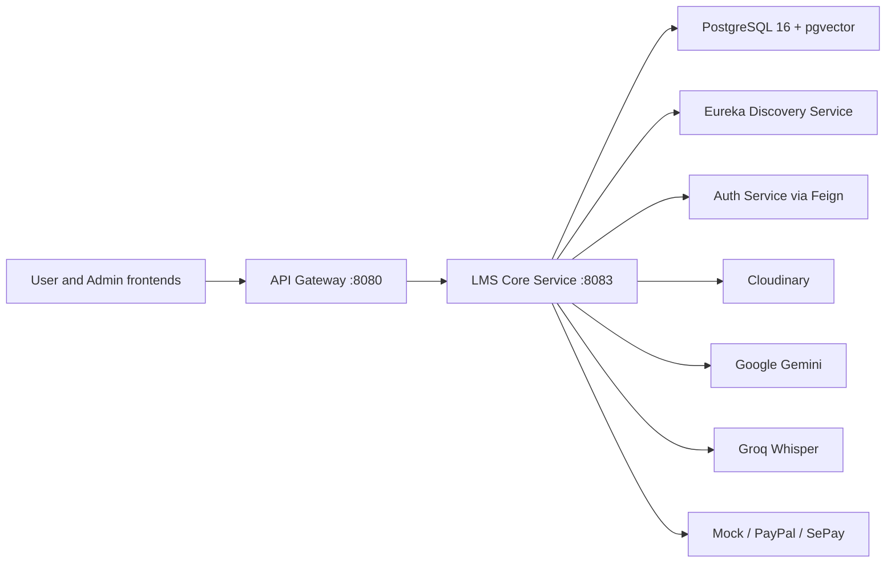
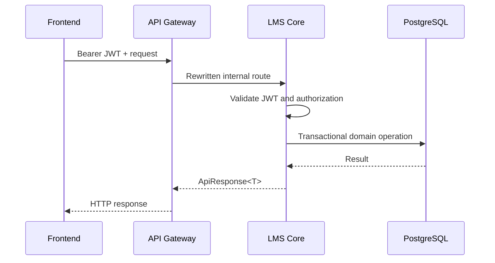
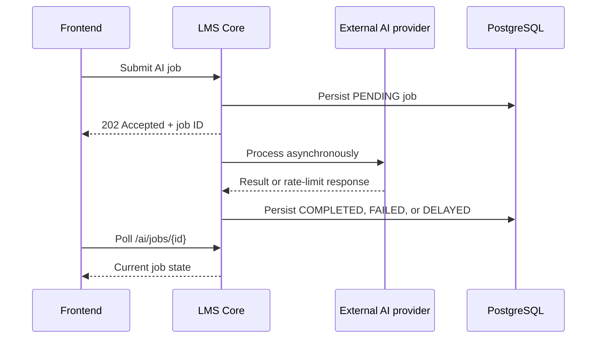

# LMS Core Service

Core teaching, learning, commerce, and AI capabilities for the EduMind platform. The service is a Spring Boot modular monolith with three implemented business modules: `course`, `payment`, and `ai`. It is deployed as one application while keeping domain logic and database schemas separated by module.

Schemas for `assessment`, `gamification`, and `notification` are reserved by Flyway for future modules; they do not currently contain domain tables.

## Contents

- [Capabilities](#capabilities)
- [Quick start](#quick-start)
- [Architecture](#architecture)
- [Local development](#local-development)
- [Configuration](#configuration)
- [Database migrations](#database-migrations)
- [API and security](#api-and-security)
- [Testing](#testing)
- [Production operations](#production-operations)
- [Troubleshooting](#troubleshooting)
- [Related documentation](#related-documentation)

## Capabilities

### Course and learning

- Categories, courses, sections, lessons, reviews, and wishlists.
- Instructor course-authoring and publishing workflows.
- Enrollment lifecycle, lesson access control, progress tracking, and certificates.
- Public catalog and course-discovery endpoints.

### Payments

- Cart, checkout, orders, transactions, invoices, refunds, instructor earnings, and payouts.
- Idempotent order creation and optimistic locking for concurrent payment operations.
- Pluggable mock, PayPal, and SePay gateways.
- Gateway webhook processing and duplicate-event protection.

PayPal and SePay integrations are implemented but disabled by default. The mock gateway is intended only for development and automated tests.

### AI-assisted learning

- Gemini-generated lesson summaries and quizzes.
- Student quiz attempts with server-side scoring.
- Course-scoped RAG chat backed by PostgreSQL and pgvector.
- SSE streaming for incremental chat responses.
- Lesson embeddings and knowledge-gap logging.
- Groq Whisper transcription from Cloudinary or YouTube sources.
- Asynchronous jobs, rate limiting, and delayed retry scheduling.

## Quick start

The recommended local workflow uses Docker Compose. Commands in this section run from the repository root.

### Requirements

- Docker with Docker Compose.
- A populated `backend/.env`; start from [the environment template](../.env.example).
- At minimum, set strong values for `LMS_CORE_DB_PASSWORD`, `JWT_SECRET`, `LMS_CORE_SERVICE_ENCRYPTION_KEY`, and the Cloudinary variables required by application startup. The encryption key must be a Base64-encoded AES key (32 decoded bytes for AES-256).
- Add `GEMINI_API_KEY` or `GROQ_API_KEY` only when testing their respective AI features.

```bash
cd backend
cp .env.example .env
docker compose up -d postgres-lms-core discovery-service lms-core-service
docker compose ps
curl --fail http://localhost:8083/actuator/health
```

Expected health response:

```json
{"status":"UP"}
```

Follow the service logs:

```bash
cd backend
docker compose logs -f lms-core-service
```

Stop the local stack without deleting database volumes:

```bash
cd backend
docker compose stop lms-core-service discovery-service postgres-lms-core
```

The service is available directly at `http://localhost:8083`. Frontend applications normally access it through the API Gateway at `http://localhost:8080/api/...`.

> `docker compose down -v` deletes persisted database volumes. Do not use it unless resetting local data is intentional.

## Architecture



### Why a modular monolith

Course access, checkout, enrollment, and AI learning workflows share transactional data and frequently coordinate with one another. A modular monolith keeps those operations in one deployable service while preserving explicit domain boundaries. This reduces distributed-transaction overhead without merging all business logic into a single undifferentiated package.

### Module boundaries

| Module | Schema | Owns | Collaborates through |
|---|---|---|---|
| `course` | `course` | Catalog, content, enrollment, progress, reviews, certificates | Module service APIs and domain events |
| `payment` | `payment` | Cart, checkout, orders, transactions, invoices, refunds, earnings, payouts | Course query/command APIs and payment events |
| `ai` | `ai` | AI jobs, quizzes, attempts, summaries, embeddings, rate limits, knowledge gaps | Course query/write APIs and lesson events |

Shared security, configuration, Feign clients, exceptions, and cross-cutting DTOs live under `config/` and `shared/`. Module APIs and domain events are the preferred cross-module contracts. A few reporting paths still access payment repositories from the course module (`DashboardServiceImpl` and `TeacherAnalyticsServiceImpl`); these are known coupling points to remove before extracting modules into independent services.

```text
src/main/java/com/edumind/lms
├── config/             # Security, Feign, async, Jackson, MVC, and persistence configuration
├── modules/
│   ├── course/         # Course and learning domain
│   ├── payment/        # Commerce and settlement domain
│   └── ai/             # AI-assisted learning domain
└── shared/             # Shared clients, events, exceptions, entities, and DTOs
```

### Runtime flows

Synchronous request flow:



Asynchronous AI flow:



## Local development

### Requirements

- Java 21.
- Docker for PostgreSQL and Testcontainers.
- PostgreSQL 16 with pgvector when Docker Compose is not used.
- Eureka on `http://localhost:8761` for discovery-dependent flows.
- Auth Service and API Gateway for end-to-end frontend flows.
- `yt-dlp` and FFmpeg only for YouTube transcription outside the provided container image.

The repository includes a Maven Wrapper, so a global Maven installation is not required.

### Start dependencies

From the repository root:

```bash
cd backend
docker compose up -d postgres-lms-core discovery-service
```

The Compose database uses `pgvector/pgvector:pg16`, exposes port `5433`, and creates the `edumind_core` database. A stock PostgreSQL image is insufficient for the embedding migration unless pgvector is installed separately.

### Load environment variables

Docker Compose reads `backend/.env`. Spring Boot and Maven do not load that file automatically. When running the application from `backend/lms-core-service`, load it explicitly:

```bash
set -a
source ../.env
set +a
```

Do not commit `.env` or real credentials.

### Build, test, and run

From `backend/lms-core-service`:

```bash
./mvnw clean verify
./mvnw spring-boot:run
```

Package and run the executable JAR:

```bash
./mvnw clean package
java -jar target/lms-core-service-1.0.0-SNAPSHOT.jar
```

If the sibling `common-lib` artifact is not already available locally, build through the backend reactor from `backend/`:

```bash
./lms-core-service/mvnw -f pom.xml -pl lms-core-service -am clean verify
```

Verify the process:

```bash
curl --fail http://localhost:8083/actuator/health
curl --fail http://localhost:8083/actuator/info
```

## Configuration

Runtime values are defined in `src/main/resources/application.yml`. The table below documents every environment variable consumed directly by this service.

Legend: **Required** means the application configuration has no default value. Feature-specific credentials may be left blank only when that integration is not invoked.

### Core and infrastructure

| Variable | Required | Default | Sensitive | Purpose |
|---|---:|---|---:|---|
| `LMS_CORE_SERVICE_PORT` | No | `8083` | No | HTTP port |
| `LMS_CORE_DB_URL` | No | `jdbc:postgresql://localhost:5433/edumind_core` | No | JDBC URL |
| `LMS_CORE_DB_USERNAME` | No | `postgres` | No | Database user |
| `LMS_CORE_DB_PASSWORD` | Yes | — | Yes | Database password |
| `LMS_CORE_DB_DRIVER` | No | `org.postgresql.Driver` | No | JDBC driver |
| `EUREKA_DEFAULT_ZONE` | No | `http://localhost:8761/eureka/` | No | Eureka registry URL, no credentials |
| `EUREKA_USERNAME` / `EUREKA_PASSWORD` | No | `eureka` / `eureka` | Yes | Registry credentials, sent as an `Authorization` header |
| `JWT_SECRET` | Yes | — | Yes | Shared HS256 verification secret |
| `JWT_EXPIRATION` | No | `900000` | No | Token lifetime metadata in milliseconds |
| `APP_BASE_URL` | No | `http://localhost:8080` | No | Public gateway/base URL |
| `FRONTEND_URL` | No | `http://localhost:3000` | No | User frontend URL |
| `LMS_CORE_SERVICE_ENCRYPTION_KEY` | Yes | — | Yes | Base64-encoded AES key; use 32 decoded bytes for AES-256 |
| `CLOUDINARY_CLOUD_NAME` | Yes | — | No | Cloudinary account name |
| `CLOUDINARY_API_KEY` | Yes | — | Yes | Cloudinary API key |
| `CLOUDINARY_API_SECRET` | Yes | — | Yes | Cloudinary API secret |
| `VIDEO_HLS_ENABLED` | No | `false` | No | Enables HLS-related video behavior |

### AI and asynchronous processing

| Variable | Required | Default | Sensitive | Purpose |
|---|---:|---|---:|---|
| `GEMINI_API_KEY` | Feature-specific | Empty | Yes | Chat, embeddings, summaries, and quizzes |
| `GROQ_API_KEY` | Feature-specific | Empty | Yes | Whisper transcription |
| `YTDLP_PATH` | No | `yt-dlp` | No | YouTube downloader executable |
| `AI_CORE_POOL_SIZE` | No | `2` | No | AI executor core threads |
| `AI_MAX_POOL_SIZE` | No | `5` | No | AI executor maximum threads |
| `AI_QUEUE_CAPACITY` | No | `50` | No | AI executor queue capacity |
| `WHISPER_QUEUE_CAPACITY` | No | `10` | No | Transcription queue capacity |
| `APP_ASYNC_CORE_POOL_SIZE` | No | `10` | No | General async executor core threads |
| `APP_ASYNC_MAX_POOL_SIZE` | No | `20` | No | General async executor maximum threads |
| `APP_ASYNC_QUEUE_CAPACITY` | No | `50` | No | General async executor queue capacity |

### Course policies

| Variable | Required | Default | Purpose |
|---|---:|---|---|
| `REVIEW_AUTO_APPROVE_ENABLED` | No | `true` | Automatically approve eligible reviews |
| `REVIEW_AUTO_APPROVE_THRESHOLD` | No | `0` | Auto-approval threshold |
| `APP_CERTIFICATE_REQUIRE_PAID_COURSE` | No | `true` | Restricts certificate issuance to paid courses |

### Payment gateways

| Variable | Required | Default | Sensitive | Purpose |
|---|---:|---|---:|---|
| `PAYMENT_GATEWAY` | No | `mock` | No | Default gateway: `mock`, `paypal`, or `sepay` |
| `PAYMENT_MOCK_ENABLED` | No | `true` | No | Registers the development mock gateway |
| `PAYMENT_PAYPAL_ENABLED` | No | `false` | No | Registers the PayPal gateway |
| `PAYPAL_CLIENT_ID` | With PayPal | Empty | Yes | PayPal client ID |
| `PAYPAL_CLIENT_SECRET` | With PayPal | Empty | Yes | PayPal client secret |
| `PAYPAL_MODE` | No | `sandbox` | No | `sandbox` or `live` |
| `PAYPAL_WEBHOOK_ID` | With PayPal webhooks | Empty | Yes | PayPal webhook identifier |
| `PAYPAL_RETURN_BASE_URL` | With PayPal | Empty | No | Browser return/cancel base URL |
| `PAYMENT_SEPAY_ENABLED` | No | `false` | No | Registers the SePay gateway |
| `SEPAY_API_KEY` | With SePay | Empty | Yes | SePay API key |
| `SEPAY_MERCHANT_ID` | With SePay | Empty | Yes | SePay merchant ID |
| `SEPAY_SECRET_KEY` | With SePay | Empty | Yes | SePay signing secret |
| `SEPAY_BASE_URL` | No | `https://my.sepay.vn` | No | SePay API base URL |
| `SEPAY_WEBHOOK_SECRET` | With SePay webhooks | Empty | Yes | Webhook verification secret |
| `SEPAY_BANK_CODE` | With SePay | Empty | No | Receiving bank code |
| `SEPAY_BANK_ACCOUNT` | With SePay | Empty | Yes | Receiving bank account |
| `SEPAY_ACCOUNT_NAME` | With SePay | Empty | Yes | Receiving account name |

### Refund and payout policies

| Variable | Default | Purpose |
|---|---|---|
| `PAYMENT_REFUND_AUTO_APPROVE_DAYS` | `7` | Auto-approval window after purchase |
| `PAYMENT_REFUND_MAX_DAYS` | `30` | Maximum refund eligibility window |
| `PAYMENT_REFUND_PARTIAL_THRESHOLD` | `50` | Course-access percentage threshold |
| `PAYMENT_PAYOUT_MINIMUM_AMOUNT` | `50` | Minimum payout amount |
| `PAYMENT_PAYOUT_HOLD_PERIOD` | `30` | Earning hold period in days |
| `PAYMENT_PAYOUT_SCHEDULE_DAY` | `1` | Monthly payout processing day |
| `PAYMENT_PAYOUT_SCHEDULE_HOUR` | `2` | Payout processing hour |
| `PAYMENT_PAYOUT_MAX_RETRIES` | `3` | Failed payout retry limit |

For production, inject secrets through the deployment platform or a secret manager. Do not bake them into the image, commit them to Git, or place them in documentation examples.

## Database migrations

Flyway runs automatically on application startup with `ddl-auto: validate`. Migration files live under `src/main/resources/db/migration` and currently cover the `course`, `payment`, `ai`, and supporting schemas.

Use the wrapper from `backend/lms-core-service` after loading the database variables:

```bash
./mvnw flyway:info
./mvnw flyway:migrate
```

Create new migrations using the immutable naming convention:

```text
V{next_version}__Short_description.sql
```

Never edit a migration that has already been applied to a shared environment. Add a forward-fix migration instead. `flyway:clean` is intentionally omitted from normal instructions because it destroys managed schemas and must never run against production.

## API and security

### Routing

Controllers expose internal paths directly from this service. The API Gateway exposes corresponding `/api/...` routes and rewrites them before forwarding.

| Domain | Direct service | Through API Gateway |
|---|---|---|
| Courses | `/courses/**` | `/api/courses/**` |
| Enrollments | `/enrollments/**` | `/api/enrollments/**` |
| AI | `/ai/**` | `/api/ai/**` |
| Cart | `/cart/**` | `/api/cart/**` |
| Checkout | `/checkout/**` | `/api/checkout/**` |
| Orders | `/orders/**` | `/api/orders/**` |
| Refunds | `/payments/refunds/**` | `/api/payments/refunds/**` |
| Webhooks | `/payments/webhook/**` | `/api/payments/webhook/**` |
| Payouts | `/instructors/payouts/**` | `/api/instructors/payouts/**` |

Frontend clients should use the Gateway routes. Direct paths are useful for service tests and internal diagnostics.

### Authentication and authorization

The service is stateless. It validates bearer JWTs issued by the Auth Service and uses method-level authorization for role and ownership checks.

| Access level | Examples |
|---|---|
| Public | Course discovery/detail, categories, approved reviews, preview lessons, certificate verification, webhook callbacks, actuator health/info |
| Authenticated | Enrollment and progress, cart, checkout, orders, AI job polling, student quizzes, course RAG chat |
| Teacher or admin | Course authoring, quiz generation/maintenance, analytics, earnings, eligible refund/payout operations |
| Admin | AI reindex operations, moderation, protected actuator endpoints such as metrics |

Public webhook routes are authenticated by gateway-specific verification in the payment layer rather than by an EduMind JWT.

### Response envelope

Most JSON endpoints return `ApiResponse<T>`:

```json
{
  "status": 200,
  "success": true,
  "message": "Success",
  "data": {},
  "timestamp": "2026-08-12T10:00:00"
}
```

Common status codes:

| Status | Meaning |
|---:|---|
| `200` | Successful query or command |
| `201` | Resource created |
| `202` | Asynchronous job accepted |
| `400` | Validation or malformed request |
| `401` | Missing, invalid, or expired JWT |
| `403` | Authenticated principal lacks permission |
| `404` | Domain resource not found |
| `409` | Duplicate resource or invalid state transition |

For the complete route catalog, use [the backend API reference](../API.md) and the controller source under `com.edumind.lms.modules.*.controller`.

### Asynchronous AI jobs

AI generation and transcription commands return `202 Accepted` with a job ID. Poll the owner-protected endpoint until a terminal state is reached:

```text
PENDING -> PROCESSING -> COMPLETED
                      -> FAILED
                      -> DELAYED -> PROCESSING
```

Example direct-service workflow:

```http
POST /ai/transcribe/lessons/{lessonId}
Authorization: Bearer <token>
Content-Type: application/json

{"videoUrl":"https://res.cloudinary.com/.../video.mp4","language":"en"}
```

```http
GET /ai/jobs/{jobId}
Authorization: Bearer <token>
```

Groq HTTP 429 responses move transcription jobs to `DELAYED`. The retry scheduler checks eligible jobs every 30 seconds; the default retry delay is 60 seconds.

### SSE chat

`POST /ai/chat/courses/{courseId}/stream` produces `text/event-stream`. Answer chunks are followed by metadata containing `sourceLessons`, nullable `confidenceTier`, and `questionScope` (`IN_SCOPE_IT` or `OFF_TOPIC`). Off-topic questions skip retrieval and return no sources. Clients must handle incremental data, connection closure, authentication failure, and reconnection at the application level. The non-streaming alternative is `POST /ai/chat/courses/{courseId}`.

## Testing

Docker must be running for integration tests because the shared test configuration starts `pgvector/pgvector:pg16` through Testcontainers.

From `backend/lms-core-service`:

```bash
./mvnw test
```

Run one test class:

```bash
./mvnw -Dtest=CheckoutServiceTest test
```

The suite contains controller/security, service, repository, integration, webhook, and concurrent-checkout coverage. Reports are written to `target/surefire-reports`.

The repository CI definition is [backend-ci.yml](../../.github/workflows/backend-ci.yml).

## Production operations

The default `application.yml` is development-oriented. In particular, application and Hibernate logging are verbose and actuator health details are always enabled. Do not deploy those defaults unchanged.

### Required production overrides

- Set `PAYMENT_MOCK_ENABLED=false`; enable only the real gateway being used.
- Use unique, rotated database, JWT, encryption, Cloudinary, AI-provider, and payment-provider secrets.
- Set application and Hibernate log levels to `INFO` or stricter; never log SQL bind values containing user or payment data.
- Change actuator health details from `always` to `when_authorized` or `never`.
- Keep `/actuator/health` and `/actuator/info` minimal; `/actuator/metrics` is protected by the `ADMIN` role in `SecurityConfig`.
- Configure graceful shutdown and platform termination grace periods before production rollout.
- Configure explicit readiness and liveness probes appropriate to the deployment platform.
- Send stdout/stderr and structured application logs to centralized log storage. Container-local log files are not durable.
- Use TLS at the ingress and restrict direct access to port `8083`.
- Configure resource limits for the JVM, async executors, temporary media processing, and database connections.
- Verify `yt-dlp` and FFmpeg availability when YouTube transcription is enabled; they are included in the service Docker image.

These are documented requirements, not claims that a production Spring profile already exists. The service currently has no committed `application-prod.yml`; production values must be supplied by the deployment environment or by adding a reviewed profile.

### Deployment checklist

1. Back up the database and review pending Flyway migrations.
2. Confirm pgvector is installed and the deployment user has only the required privileges.
3. Validate required secrets without printing their values.
4. Build the immutable image and run automated tests.
5. Deploy with production logging, actuator, payment, and resource overrides.
6. Verify `/actuator/health`, Eureka registration, database migrations, and one authenticated smoke test.
7. Monitor error rate, latency, database pool saturation, async queue saturation, and external-provider failures.

### Migration and rollback policy

- Apply backward-compatible, forward-only database migrations before code that requires them.
- Do not use `flyway:clean` outside disposable local/test databases.
- Roll back the application image only when the previous version remains compatible with the migrated schema.
- Correct released schema problems with a new migration and restore from a verified backup only when forward recovery is unsafe.

### External-provider failure behavior

- Gemini and Groq are feature dependencies, not general health dependencies; missing keys allow startup but their endpoints fail when invoked.
- Groq rate limits use delayed job retries. Repeated failures remain visible through AI job status.
- Payment gateway callbacks must be idempotent and signature/secret verification must remain enabled in production.
- Transcription uses temporary files and enforces a 25 MB Groq audio limit. Monitor disk usage and cleanup failures when processing large workloads.

## Troubleshooting

### Database or Flyway startup failure

- Confirm `postgres-lms-core` is healthy and port `5433` is reachable for host-based development.
- Verify `LMS_CORE_DB_URL`, username, and password.
- Confirm the target database exists and supports `CREATE EXTENSION vector`.
- Run `./mvnw flyway:info` after loading the same database variables as the application.
- Never repair or clean a shared database without reviewing the migration history and taking a backup.

### JWT validation failure

- Confirm `JWT_SECRET` matches the Auth Service secret.
- Check the token expiry and server clock.
- Ensure the request uses `Authorization: Bearer <token>`.

### Eureka registration failure

- Verify the Discovery Service health at `http://localhost:8761`.
- Check `EUREKA_DEFAULT_ZONE` and container-network hostnames.

### Cloudinary failure

- Verify the cloud name, API key, and API secret.
- Check account quota and the requested asset transformation.

### YouTube transcription failure

- Confirm `yt-dlp` and FFmpeg are installed or use the provided Docker image.
- Set `YTDLP_PATH` when the executable is not on `PATH`.
- Inspect the AI job error message; Cloudinary transcription does not require `yt-dlp`.

### Transcription remains delayed

- Check Groq quota and rate limits.
- Confirm `GROQ_API_KEY` is set; an empty key does not prevent startup but fails at provider call time.
- Review `WHISPER_QUEUE_CAPACITY` and executor saturation.

## Related documentation

- [Backend overview](../README.md)
- [Backend API reference](../API.md)
- [Docker guide](../DOCKER.md)
- [Architecture documentation](../../docs/architecture/README.md)
- [Spring Boot](https://spring.io/projects/spring-boot)
- [Spring Security](https://spring.io/projects/spring-security)
- [Flyway](https://documentation.red-gate.com/fd)
- [PostgreSQL](https://www.postgresql.org/docs/)
