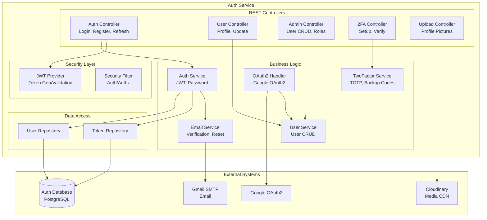
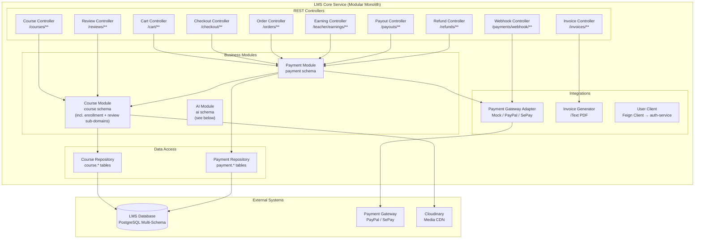

# EduMind Platform - C4 Model: Component Diagrams

> **Level 3 - Component Diagrams**
> Zooms into individual containers to show the major components and their interactions.

---

## Auth Service Components

### Key Components

| Component | Responsibility |
|-----------|----------------|
| **Auth Controller** | Handles login, registration, token refresh, and logout. |
| **User Controller** | Profile retrieval and updates. |
| **Admin Controller** | User management, role assignment, application review. |
| **2FA Controller** | Two-factor authentication setup and verification. |
| **JWT Provider** | Generates and validates JWT access/refresh tokens. |
| **OAuth2 Handler** | Manages Google OAuth2 login flow and user linking. |
| **Email Service** | Sends verification, password reset, and notification emails. |

---

## LMS Core Service Components

### Key Modules

| Module | Database Schema | Responsibility |
|--------|-----------------|----------------|
| **Course Module** | `course` | CRUD for Courses, Sections, Lessons, Categories, plus the enrollment and review sub-domains (progress tracking, completion, ratings, instructor replies) — these are packages inside the single `course` module, not separate top-level modules. |
| **Payment Module** | `payment` | Shopping cart, checkout, orders, invoices, instructor earnings, payouts, refunds. |
| **AI Module** | `ai` | RAG chat, lesson embeddings, summaries, quiz generation, transcription — see [AI Module Components](#ai-module-components-lms-core-service) below. |

### Key Design Pattern: Payment Gateway Adapter

The payment system uses the **Strategy Pattern** to support multiple gateways:
- **MockGateway**: For local development and testing.
- **PayPalGateway**: For production payments (configurable).
- **SepayGateway**: For Vietnam-specific payments (configurable).

---

## AI Module Components (LMS Core Service)

```mermaid
flowchart TB
    subgraph AIModule["AI Module (ai schema, inside LMS Core Service)"]
        AiCtrl["AI Controller<br/>/api/ai/**"]

        subgraph Services["Core Services"]
            JobSvc["AiJobService<br/>Job state machine"]
            RagSvc["RagService<br/>Chat + SSE stream"]
            EmbedSvc["EmbeddingService<br/>Chunk + embed lessons"]
            SummarySvc["AiSummaryService<br/>Structured summaries"]
            QuizSvc["AiQuizService<br/>Quiz generation + scoring"]
            WhisperSvc["WhisperTranscriptionService<br/>whisperTaskExecutor"]
            RateLimit["RateLimitHelper<br/>ai_rate_limits, 20/day"]
        end

        subgraph AsyncProc["Async Processors (aiTaskExecutor)"]
            AsyncEmbed["AsyncEmbeddingProcessor"]
            AsyncSummary["AsyncSummaryProcessor"]
            AsyncQuiz["AsyncQuizProcessor"]
        end

        subgraph Transcription["Transcription Helpers"]
            SourceResolver["TranscriptionSourceResolver"]
            CloudExtractor["CloudinaryAudioExtractor"]
            YtDownloader["YtDlpAudioDownloader"]
            YtTranscript["YouTubeTranscriptExtractor"]
            RetryScheduler["TranscriptionRetryScheduler<br/>polls every 30s"]
        end

        subgraph Scheduling["Scheduling & Events"]
            ReindexSched["ReindexScheduler"]
            AiListener["AiEventListener<br/>LessonContentUpdatedEvent<br/>LessonDeletedEvent"]
        end

        subgraph Persistence["Data Access (ai schema)"]
            JobLogs[("ai_job_logs")]
            Embeddings[("lesson_embeddings<br/>VECTOR(768), ivfflat")]
            Summaries[("lesson_summaries")]
            Quizzes[("generated_quizzes")]
            Attempts[("quiz_attempts")]
            RateLimits[("ai_rate_limits")]
            GapQuestions[("knowledge_gap_questions")]
        end
    end

    subgraph External["External Systems"]
        Gemini["Google Gemini<br/>ChatClient + EmbeddingModel"]
        Groq["Groq<br/>Whisper REST API"]
        Cloud["Cloudinary<br/>Lesson video/audio"]
        YtDlp["yt-dlp CLI<br/>YouTube audio"]
    end

    AiCtrl --> JobSvc
    AiCtrl --> RagSvc
    AiCtrl --> EmbedSvc
    AiCtrl --> SummarySvc
    AiCtrl --> QuizSvc
    AiCtrl --> WhisperSvc

    RagSvc --> RateLimit
    RagSvc --> Embeddings
    RagSvc --> GapQuestions
    RagSvc --> Gemini

    EmbedSvc --> AsyncEmbed
    SummarySvc --> AsyncSummary
    QuizSvc --> AsyncQuiz
    AsyncEmbed --> Embeddings
    AsyncEmbed --> Gemini
    AsyncSummary --> Summaries
    AsyncSummary --> Gemini
    AsyncQuiz --> Quizzes
    AsyncQuiz --> Attempts
    AsyncQuiz --> Gemini

    WhisperSvc --> SourceResolver
    SourceResolver --> CloudExtractor
    SourceResolver --> YtTranscript
    YtTranscript --> YtDownloader
    CloudExtractor --> Cloud
    YtDownloader --> YtDlp
    WhisperSvc --> Groq
    WhisperSvc --> RetryScheduler
    WhisperSvc --> JobLogs

    ReindexSched --> EmbedSvc
    ReindexSched --> SummarySvc
    AiListener --> EmbedSvc
    AiListener --> SummarySvc
```

### Implemented AI Features

| Feature | Description | Status |
|---------|-------------|--------|
| **RAG Chat Assistant** | Vector search over lesson embeddings, context-aware answers streamed via SSE (or sync). Rate-limited to 20 queries/day/user; low-confidence answers logged as knowledge gaps. | ✅ Active |
| **Lesson Embeddings** | Auto-triggered by `LessonContentUpdatedEvent`. Splits content into 500-word chunks (50-word overlap), embeds via Gemini `gemini-embedding-001` (768 dims), stores in `ai.lesson_embeddings` with an ivfflat index. | ✅ Active |
| **Lesson Summaries** | Generates structured JSON summaries (summary text, key points, vocabulary), upserted into `ai.lesson_summaries`. | ✅ Active |
| **Quiz Generation** | Async job generates multiple-choice questions; students receive questions without `correctIndex`/`explanation`, full answers returned after submission with scoring. | ✅ Active |
| **Transcription** | Groq Whisper (`whisper-large-v3-turbo`) transcribes Cloudinary lesson video/audio or YouTube sources (auto-captions first, falls back to `yt-dlp` audio download). Rate-limit hits set job to `DELAYED`, retried by `TranscriptionRetryScheduler`. | ✅ Active |

---

## Navigation

-   [← Level 1: System Context](./c4-context.md)
-   [← Level 2: Container Diagram](./c4-container.md)
