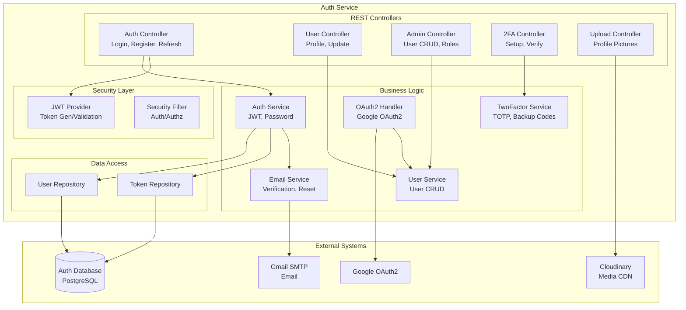
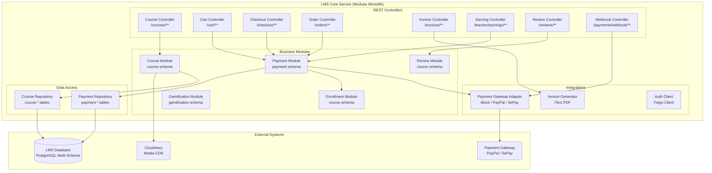
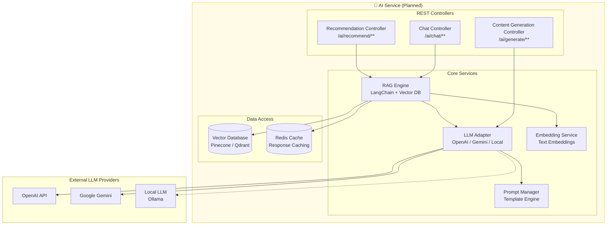

# EduMind Platform - C4 Model: Component Diagrams

> **Level 3 - Component Diagrams**
> Zooms into individual containers to show the major components and their interactions.

---

## Auth Service Components

### Key Components

| Component | Responsibility |
|-----------|----------------|
| **Auth Controller** | Handles login, registration, token refresh, and logout. |
| **User Controller** | Profile retrieval and updates. |
| **Admin Controller** | User management, role assignment, application review. |
| **2FA Controller** | Two-factor authentication setup and verification. |
| **JWT Provider** | Generates and validates JWT access/refresh tokens. |
| **OAuth2 Handler** | Manages Google OAuth2 login flow and user linking. |
| **Email Service** | Sends verification, password reset, and notification emails. |

---

## LMS Core Service Components

### Key Modules

| Module | Database Schema | Responsibility |
|--------|-----------------|----------------|
| **Course Module** | `course` | CRUD for Courses, Sections, Lessons, Categories. |
| **Enrollment Module** | `course` | Student enrollments, progress tracking, completion. |
| **Review Module** | `course` | Course reviews, ratings, instructor replies. |
| **Payment Module** | `payment` | Shopping cart, checkout, orders, invoices, instructor earnings. |
| **Gamification Module** | `gamification` | (Future) Badges, points, leaderboards. |

### Key Design Pattern: Payment Gateway Adapter

The payment system uses the **Strategy Pattern** to support multiple gateways:
- **MockGateway**: For local development and testing.
- **PayPalGateway**: For production payments (configurable).
- **SePayGateway**: For Vietnam-specific payments (configurable).

---

## AI Service Components (🚧 Planned)

### Planned AI Features

| Feature | Description | Status |
|---------|-------------|--------|
| **AI Chat Assistant** | Conversational AI for learning assistance | 🚧 Planned |
| **Course Recommendations** | ML-powered personalized suggestions | 🚧 Planned |
| **Content Generation** | AI-assisted course descriptions, quizzes | 🚧 Planned |
| **RAG (Retrieval Augmented Generation)** | Context-aware answers from course content | 🚧 Planned |

---

## Navigation

-   [← Level 1: System Context](./c4-context.md)
-   [← Level 2: Container Diagram](./c4-container.md)
