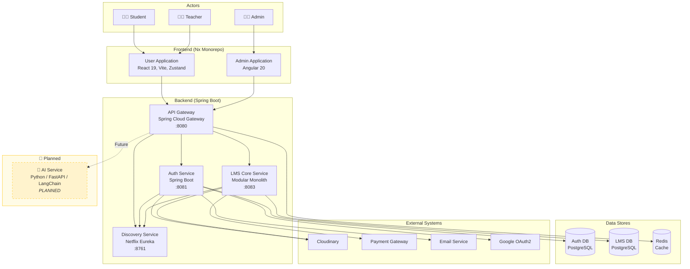

# EduMind Platform - C4 Model: Container Diagram

> **Level 2 - Container Diagram**
> Shows the high-level technology choices and how containers (applications/services) communicate.

---

## Diagram

---

## Container Descriptions

### Frontend Containers

| Container | Technology | Description |
|-----------|------------|-------------|
| **User Application** | React 19, Vite 7, Zustand, TanStack Query | Primary portal for Students and Teachers. Handles browsing, enrollment, learning, and course creation. |
| **Admin Application** | Angular 20, RxJS | Dashboard for Administrators. Manages users, teacher applications, categories, and content moderation. |

### Backend Containers

| Container | Technology | Port | Status | Description |
|-----------|------------|------|--------|-------------|
| **API Gateway** | Spring Cloud Gateway | 8080 | ✅ Active | Single entry point. Handles routing, CORS, rate limiting (Redis). |
| **Discovery Service** | Netflix Eureka | 8761 | ✅ Active | Service registry for dynamic service discovery. |
| **Auth Service** | Spring Boot 3.5 | 8081 | ✅ Active | Identity management: JWT, OAuth2, 2FA, RBAC, Email Verification. |
| **LMS Core Service** | Spring Boot 3.5 (Modular Monolith) | 8083 | ✅ Active | Core business logic separated by schemas: `course`, `payment`, `gamification`. |
| **AI Service** | Python / FastAPI / LangChain | TBD | 🚧 **Planned** | LLM-powered recommendations, content generation, learning assistance, RAG. |

### Data Stores

| Store | Technology | Purpose |
|-------|------------|---------|
| **Auth Database** | PostgreSQL | Persists users, roles, tokens, teacher applications. |
| **LMS Database** | PostgreSQL | Persists courses, sections, lessons, enrollments, orders, invoices, reviews. |
| **Redis** | Redis 7 | Rate limiting counters, session caching. |

---

## Key Design Decisions

1.  **Modular Monolith for LMS Core**: Chosen to **minimize deployment costs** while using **separate database schemas** (course, payment, gamification) for future microservice extraction.
2.  **API Gateway for Centralization**: All client traffic enters through a single point, simplifying security (rate limiting, CORS) and observability.
3.  **Eureka for Discovery**: Enables dynamic scaling and failover without hardcoded service addresses.
