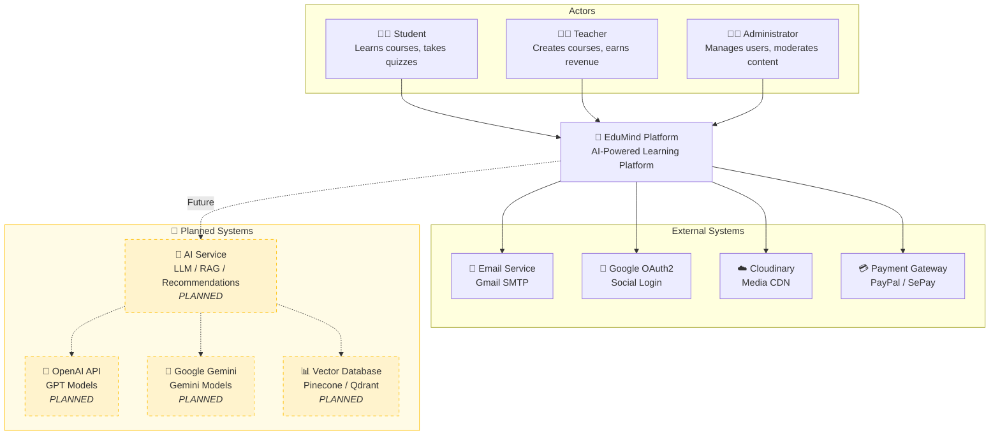

# EduMind Platform - C4 Model: System Context

> **Level 1 - System Context Diagram**
> Shows the EduMind Platform as a black box and its relationships with users and external systems.

---

## Diagram

---

## Actors

| Actor | Description |
|-------|-------------|
| **Student** | End-user who browses courses, enrolls, learns, and leaves reviews. |
| **Teacher** | Content creator who publishes courses, manages lessons, and earns revenue from sales. |
| **Administrator** | Platform operator who manages users, reviews teacher applications, and moderates content. |

---

## External Systems

| System | Technology | Purpose | Status |
|--------|------------|---------|--------|
| **Email Service** | Gmail SMTP | Sends verification, password reset, and notification emails. | ✅ Active |
| **Google OAuth2** | OpenID Connect | Provides social login for faster onboarding. | ✅ Active |
| **Cloudinary** | Cloud Media CDN | Stores profile pictures, course thumbnails, and lesson videos. | ✅ Active |
| **Payment Gateway** | PayPal / SePay | Processes course purchases and handles payouts to instructors. | ✅ Active |
| **AI Service** | Internal Microservice | Orchestrates AI features (RAG, recommendations, content generation). | 🚧 **Planned** |
| **OpenAI API** | GPT-4 / GPT-4o | External LLM provider for chat and content generation. | 🚧 **Planned** |
| **Google Gemini** | Gemini Pro / Ultra | Alternative LLM provider (multi-modal capabilities). | 🚧 **Planned** |
| **Vector Database** | Pinecone / Qdrant | Stores embeddings for RAG (Retrieval Augmented Generation). | 🚧 **Planned** |

---

## Narrative

The EduMind Platform is an **AI-Powered Learning Management System (LMS)**. It provides a marketplace for instructors to sell courses and for students to purchase and learn.

**Key Interactions:**
1.  **Students** browse the course catalog, enroll (free or paid), consume video lessons, complete assessments, and leave reviews.
2.  **Teachers** apply for an instructor account, create course content (sections, lessons, quizzes), set pricing, and receive earnings from sales.
3.  **Administrators** review teacher applications, manage user accounts, and ensure platform integrity.
4.  The platform integrates with **external systems** for email delivery, social authentication, media hosting, and payment processing.
5.  **(Planned)** The AI Service will provide intelligent features like course recommendations, learning assistance chatbots, and AI-generated content.
