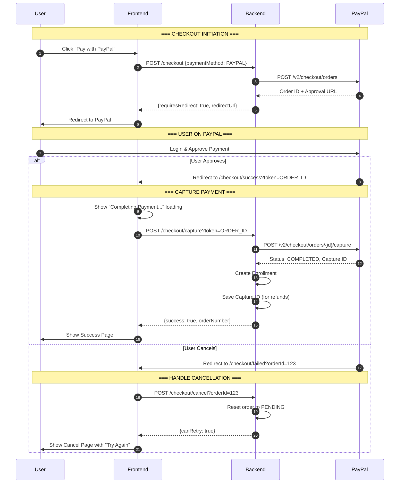

# PayPal Payment Flow Diagram

## Complete Flow

```
┌─────────────────────────────────────────────────────────────────────────────────────────┐
│                                    HAPPY PATH (Success)                                  │
└─────────────────────────────────────────────────────────────────────────────────────────┘

┌──────────┐       ┌──────────┐       ┌──────────┐       ┌──────────┐
│  User    │       │ Frontend │       │ Backend  │       │  PayPal  │
└────┬─────┘       └────┬─────┘       └────┬─────┘       └────┬─────┘
     │                  │                  │                  │
     │  1. Click "Pay"  │                  │                  │
     │─────────────────>│                  │                  │
     │                  │                  │                  │
     │                  │ 2. POST /checkout│                  │
     │                  │  {paymentMethod: │                  │
     │                  │   PAYPAL}        │                  │
     │                  │─────────────────>│                  │
     │                  │                  │                  │
     │                  │                  │ 3. Create Order  │
     │                  │                  │  POST /v2/orders │
     │                  │                  │─────────────────>│
     │                  │                  │                  │
     │                  │                  │ 4. Order ID +    │
     │                  │                  │    Approval URL  │
     │                  │                  │<─────────────────│
     │                  │                  │                  │
     │                  │ 5. {success:false│                  │
     │                  │    requiresRedirect:true            │
     │                  │    redirectUrl: "paypal.com/..."}   │
     │                  │<─────────────────│                  │
     │                  │                  │                  │
     │ 6. Redirect to   │                  │                  │
     │    PayPal        │                  │                  │
     │<─────────────────│                  │                  │
     │                  │                  │                  │
     │─────────────────────────────────────────────────────>│
     │                  │                  │                  │
     │         7. User logs in & approves payment            │
     │                  │                  │                  │
     │<─────────────────────────────────────────────────────│
     │ 8. Redirect back │                  │                  │
     │    /checkout/success?token=ORDER_ID                   │
     │                  │                  │                  │
     │─────────────────>│                  │                  │
     │                  │                  │                  │
     │                  │ 9. POST /checkout/capture          │
     │                  │    ?token=ORDER_ID                 │
     │                  │─────────────────>│                  │
     │                  │                  │                  │
     │                  │                  │10. Capture Order │
     │                  │                  │ POST /v2/orders/ │
     │                  │                  │ {id}/capture     │
     │                  │                  │─────────────────>│
     │                  │                  │                  │
     │                  │                  │11. COMPLETED +   │
     │                  │                  │    Capture ID    │
     │                  │                  │<─────────────────│
     │                  │                  │                  │
     │                  │                  │12. Create        │
     │                  │                  │    Enrollment    │
     │                  │                  │    (internal)    │
     │                  │                  │                  │
     │                  │13. {success:true │                  │
     │                  │    orderNumber}  │                  │
     │                  │<─────────────────│                  │
     │                  │                  │                  │
     │ 14. Show Success │                  │                  │
     │     Page         │                  │                  │
     │<─────────────────│                  │                  │
     │                  │                  │                  │
     ▼                  ▼                  ▼                  ▼


┌─────────────────────────────────────────────────────────────────────────────────────────┐
│                              CANCEL PATH (User Cancels on PayPal)                        │
└─────────────────────────────────────────────────────────────────────────────────────────┘

┌──────────┐       ┌──────────┐       ┌──────────┐       ┌──────────┐
│  User    │       │ Frontend │       │ Backend  │       │  PayPal  │
└────┬─────┘       └────┬─────┘       └────┬─────┘       └────┬─────┘
     │                  │                  │                  │
     │  ... (Steps 1-6 same as above) ...                    │
     │                  │                  │                  │
     │─────────────────────────────────────────────────────>│
     │                  │                  │                  │
     │         7. User clicks "Cancel" on PayPal             │
     │                  │                  │                  │
     │<─────────────────────────────────────────────────────│
     │ 8. Redirect back │                  │                  │
     │    /checkout/failed?orderId=123                       │
     │                  │                  │                  │
     │─────────────────>│                  │                  │
     │                  │                  │                  │
     │                  │ 9. POST /checkout/cancel           │
     │                  │    ?orderId=123  │                  │
     │                  │─────────────────>│                  │
     │                  │                  │                  │
     │                  │                  │10. Reset order   │
     │                  │                  │    to PENDING    │
     │                  │                  │    (internal)    │
     │                  │                  │                  │
     │                  │11. {success:false│                  │
     │                  │    canRetry:true}│                  │
     │                  │<─────────────────│                  │
     │                  │                  │                  │
     │ 12. Show Cancel  │                  │                  │
     │     Page with    │                  │                  │
     │     "Try Again"  │                  │                  │
     │<─────────────────│                  │                  │
     │                  │                  │                  │
     ▼                  ▼                  ▼                  ▼
```

## Sequence Diagram (Mermaid)



## State Diagram

```
                                    ┌─────────────┐
                                    │   START     │
                                    └──────┬──────┘
                                           │
                                           ▼
                                    ┌─────────────┐
                    ┌───────────────│   PENDING   │───────────────┐
                    │               └──────┬──────┘               │
                    │                      │                      │
                    │         POST /checkout                      │
                    │                      │                      │
                    │                      ▼                      │
                    │               ┌─────────────┐               │
                    │               │ PROCESSING  │               │
                    │               │ (on PayPal) │               │
                    │               └──────┬──────┘               │
                    │                      │                      │
          User cancels            User approves          Payment fails
          on PayPal               on PayPal              on gateway
                    │                      │                      │
                    ▼                      ▼                      ▼
             ┌─────────────┐       ┌─────────────┐       ┌─────────────┐
             │   PENDING   │       │  COMPLETED  │       │   FAILED    │
             │ (can retry) │       │  (success)  │       │             │
             └─────────────┘       └─────────────┘       └─────────────┘
                    │                                           │
                    │                                           │
                    └──────────────── Retry ────────────────────┘
```

## Key Endpoints

| Endpoint | Method | Purpose |
|----------|--------|---------|
| `/checkout` | POST | Start checkout, create PayPal order |
| `/checkout/capture` | POST | Capture payment after PayPal approval |
| `/checkout/cancel` | POST | Handle user cancellation |

## Key Query Parameters

| Page | Parameter | Source | Purpose |
|------|-----------|--------|---------|
| `/checkout/success` | `token` | PayPal | PayPal Order ID for capture |
| `/checkout/success` | `order` | Direct | Order number (non-redirect payments) |
| `/checkout/failed` | `orderId` | Backend | Order ID for cancellation tracking |
| `/checkout/failed` | `error` | Backend | Error message to display |

## Important Notes

1. **Capture ID vs Order ID**: PayPal Order ID is used for capture, but the Capture ID (returned after capture) is needed for refunds.

2. **Idempotency**:
   - Capture endpoint checks if already captured before calling PayPal
   - Uses pessimistic locking to prevent race conditions

3. **Transaction Flow**:
   ```
   Transaction Status: PENDING → SUCCESS (after capture)
                              → FAILED (if capture fails or user cancels)
   ```

4. **Refund Flow** (separate):
   ```
   POST /payments/refund
   Uses Capture ID (not Order ID!)
   ```
