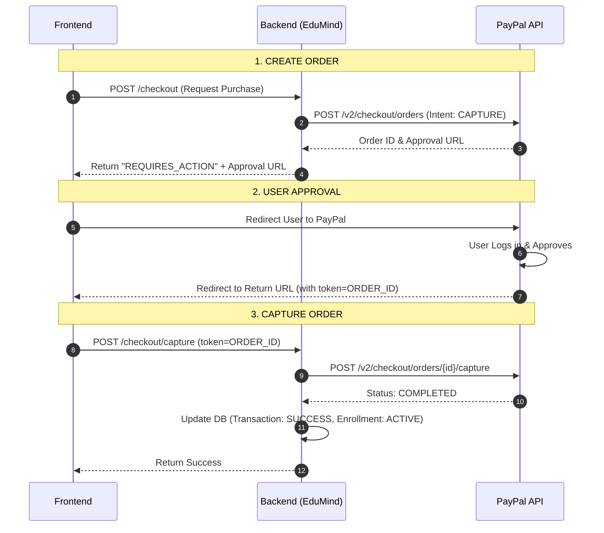

# PayPal Integration Guide

This document details the technical implementation of PayPal into the EduMind LMS. It covers the architecture, code changes, and verification steps.

## 1. Architecture Flow

We utilize the **PayPal REST API v2** (Smart Payment Buttons flow) involving a 3-step process:



## 2. Implementation Details

### Dependency
Added to `lms-core-service/pom.xml`:
```xml
<dependency>
    <groupId>com.paypal.sdk</groupId>
    <artifactId>checkout-sdk</artifactId>
    <version>2.0.0</version>
</dependency>
```

### Gateway Layer (`PayPalGateway.java`)
Located in `com.edumind.lms.modules.payment.gateway.impl`.

1.  **`processPayment`**:
    *   Creates an order with `checkoutPaymentIntent("CAPTURE")`.
    *   Returns a `GatewayPaymentResult` with status `REQUIRES_ACTION` and the PayPal `approve` link.

2.  **`capturePayment`**:
    *   Uses `OrdersCaptureRequest` to finalize the transaction.
    *   Returns success only if PayPal status is `COMPLETED`.

3.  **`refund`**:
    *   Uses `CapturesRefundRequest` to issue a refund for a specific **Capture ID**.

### Service Layer (`CheckoutServiceImpl.java`)
*   **`capturePayment(Long userId, String gatewayOrderId)`**:
    *   New method added to handle the post-redirect flow.
    *   Verifies the `gatewayTransactionId` exists in our `transaction` table.
    *   Calls `gateway.capturePayment()`.
    *   On success, completes the order and enrolls the student.

### API Layer (`CheckoutController.java`)
*   **`POST /checkout/capture`**:
    *   New public endpoint accepting `?token={orderId}`.
    *   invokes `checkoutService.capturePayment`.

## 3. Setup & Configuration

Ensure your `.env` file is configured correctly:

```bash
# Payment Gateway Selection
PAYMENT_GATEWAY=paypal

# PayPal Credentials (Sandbox)
PAYPAL_CLIENT_ID=ATxxxxxxxxxxxxxxxxxxxxxxxxxxxxxxxxxxxxxxxxxxxx
PAYPAL_CLIENT_SECRET=EExxxxxxxxxxxxxxxxxxxxxxxxxxxxxxxxxxxxxxxxxxxx
PAYPAL_MODE=sandbox
```

## 4. Verification Steps

### Purchase Flow
1.  **Login**: Login as a student.
2.  **Purchase**: Add course to cart and checkout.
    *   *Verify*: You are redirected to `sandbox.paypal.com`.
3.  **Approve**: Login with a Sandbox Personal Account and click "Pay Now".
4.  **Redirect**: You are returned to the app.
    *   *Verify*: Backend receives the capture request.
    *   *Verify*: Enrollment is created and Order status becomes `COMPLETED`.

### Refund Flow
1.  **Backend**: Call refund API (usually Admin/Instructor dashboard):
    ```bash
    POST /payments/refund
    {
        "transactionId": "PAYPAL-CAPTURE-ID",
        "amount": 10.00,
        "reason": "Student request"
    }
    ```
2.  **Backend**: Calls PayPal Refund API.
3.  **Result**: Returns refund details and updates local transaction status.
