# AI Module Workflows

This document describes all AI-driven workflows implemented in the EduMind LMS system. The AI module provides four core features: **Lesson Embeddings**, **Lesson Summaries**, **Quiz Generation**, and **RAG Chat** — all built on Spring AI with Google Gemini.

---

## 1. AI Module Architecture Overview

```mermaid
graph TB
    subgraph API["API Layer — AiController (/api/ai/**)"]
        direction LR
        C1["/chat/courses/{id}"]
        C2["/quizzes/generate"]
        C3["/summaries/lesson/{id}"]
        C4["/jobs/{id}"]
        C5["/admin/reindex-embeddings"]
    end

    subgraph Services["Service Layer"]
        RagSvc["RagServiceImpl<br>(RAG Chat)"]
        QuizSvc["AiQuizServiceImpl<br>(Quiz Gen)"]
        SumSvc["AiSummaryServiceImpl<br>(Summary)"]
        EmbSvc["EmbeddingServiceImpl<br>(Embedding)"]
        JobSvc["AiJobService<br>(Job Tracking)"]
        RateLimit["RateLimitHelper<br>(Rate Limiting)"]
    end

    subgraph AsyncLayer["Async Processors (@Async)"]
        EmbProc["AsyncEmbeddingProcessor"]
        SumProc["AsyncSummaryProcessor"]
        QuizProc["AsyncQuizProcessor"]
    end

    subgraph Gemini["Google Gemini (Spring AI)"]
        ChatModel["gemini-2.5-flash-lite<br>temp=0.3, max=4096 tokens"]
        EmbModel["gemini-embedding-001<br>768 dimensions"]
    end

    subgraph DB["PostgreSQL — ai schema"]
        JobLog["ai.ai_job_logs"]
        Embeddings["ai.lesson_embeddings<br>(pgvector)"]
        Summaries["ai.lesson_summaries"]
        Quizzes["ai.generated_quizzes"]
        Attempts["ai.quiz_attempts"]
        RateDB["ai.ai_rate_limits"]
        GapDB["ai.knowledge_gap_questions"]
    end

    subgraph Events["Event-Driven"]
        Event["LessonContentUpdatedEvent<br>(@TransactionalEventListener<br>AFTER_COMMIT)"]
    end

    C1 --> RagSvc
    C2 --> QuizSvc
    C3 --> SumSvc
    C4 --> JobSvc
    C5 --> EmbSvc

    Event --> EmbSvc
    Event --> SumSvc

    RagSvc --> RateLimit --> RateDB
    RagSvc --> EmbModel
    RagSvc --> ChatModel
    RagSvc --> Embeddings
    RagSvc --> GapDB

    QuizSvc --> JobSvc --> JobLog
    SumSvc --> JobSvc
    EmbSvc --> JobSvc

    QuizSvc --> QuizProc
    SumSvc --> SumProc
    EmbSvc --> EmbProc

    QuizProc --> ChatModel
    QuizProc --> Quizzes
    SumProc --> ChatModel
    SumProc --> Summaries
    EmbProc --> EmbModel
    EmbProc --> Embeddings
```

### Key Design Principles

- **Async Job Pattern**: All generation tasks (`EMBEDDING`, `LESSON_SUMMARY`, `QUIZ_GENERATION`) return `202 Accepted` immediately with a `jobId`. Clients poll `GET /api/ai/jobs/{id}` for status.
- **Event-Driven Triggers**: Embedding and summary generation fire automatically after lesson content is committed to the database via `@TransactionalEventListener(AFTER_COMMIT)`.
- **ACL Enforcement**: Every endpoint validates enrollment (student) or course ownership (instructor) via cross-module API contracts — never direct repository imports.
- **Graceful Degradation**: `GEMINI_API_KEY` is optional at startup. The `ChatClient` and `EmbeddingModel` beans are `@ConditionalOnProperty` — the application boots without them, returning errors only when AI endpoints are called.

---

## 2. Async Job State Machine

All AI generation operations share a unified job tracking system (`ai.ai_job_logs`).

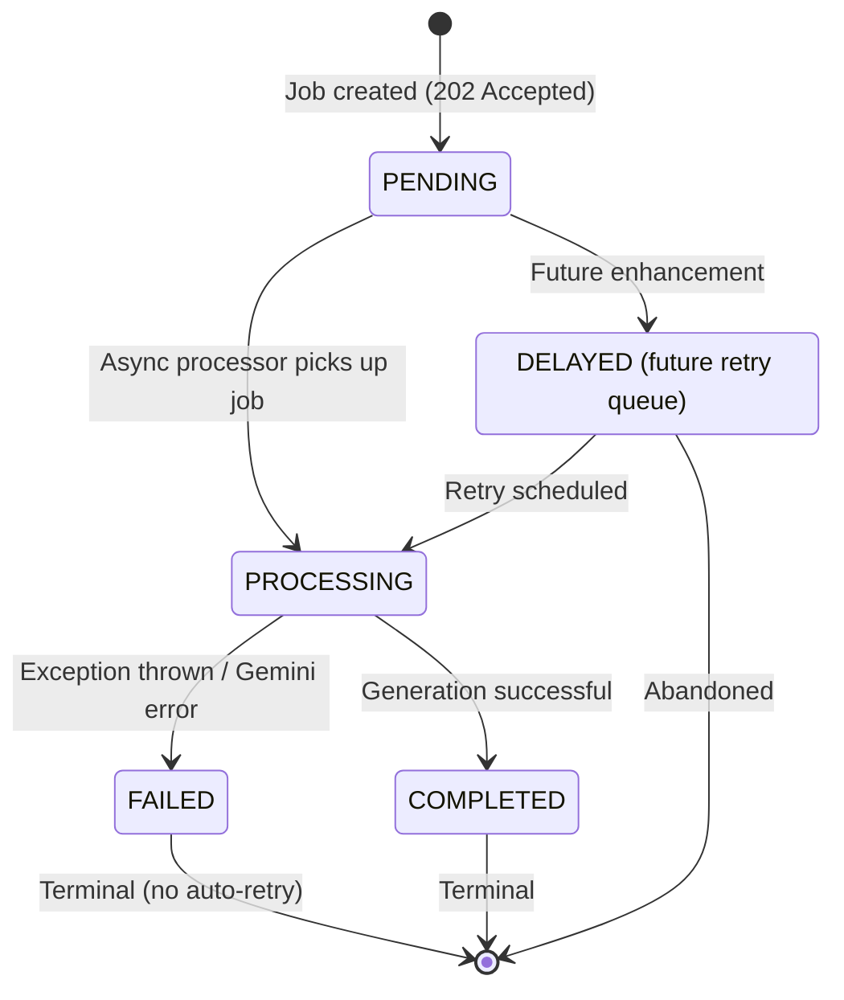

| Status | Description |
|--------|-------------|
| `PENDING` | Job created, waiting for async thread |
| `PROCESSING` | Async processor started, Gemini call in progress |
| `COMPLETED` | Generation finished, result persisted |
| `FAILED` | Exception occurred; `errorMessage` field populated |
| `DELAYED` | Reserved for future retry queue (not yet active) |

**Job ownership**: `GET /api/ai/jobs/{id}` validates the requesting user matches `AiJobLog.userId`. Cross-user access returns `403 Forbidden`.

**Retry policy**: Spring AI retry is disabled (`max-attempts: 1`). Each processor catches exceptions, persists the error message to `AiJobLog`, and marks the job `FAILED`. Retrying requires re-triggering the original action.

---

## 3. Workflow 1 — Lesson Embedding

Lesson embeddings power the RAG Chat feature. They are generated automatically whenever lesson content changes and stored as 768-dimensional vectors in `ai.lesson_embeddings` using the `pgvector` extension.

### 3.1 Trigger Flow — Event-Driven Embedding

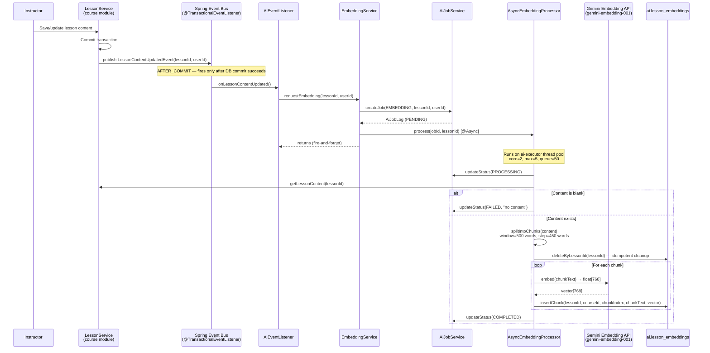

### 3.2 Chunking Strategy

The chunking algorithm ensures context continuity at chunk boundaries through overlapping windows.

```
Lesson Content (word array):
┌─────────────────────────────────────────────────────────────────┐
│ word[0] ... word[449] | word[450] ... word[499] | word[500] ... │
└───────────────────────────────────────────────────────────────┬─┘
                                                                │
chunk_0: word[0]   → word[499]   (500 words)                   │
chunk_1: word[450] → word[949]   (500 words, 50-word overlap)  │
chunk_2: word[900] → word[1399]  (500 words, 50-word overlap)  │
                ...                                             │
```

- **Window size**: 500 words
- **Step size**: 450 words (50-word backward overlap)
- **Purpose**: Prevents important concepts at chunk boundaries from losing context

### 3.3 Vector Storage (Native SQL)

Spring Data JPA does not natively support `pgvector` column types. The repository uses raw SQL for all vector operations:

```sql
-- Insert (LessonEmbeddingRepository.insertChunk)
INSERT INTO ai.lesson_embeddings (lesson_id, course_id, chunk_index, chunk_text, embedding)
VALUES (:lessonId, :courseId, :chunkIndex, :chunkText, CAST(:vector AS vector))

-- Index definition (V32 migration)
CREATE INDEX ON ai.lesson_embeddings
    USING ivfflat (embedding vector_cosine_ops) WITH (lists = 100);
```

### 3.4 Admin Manual Reindex

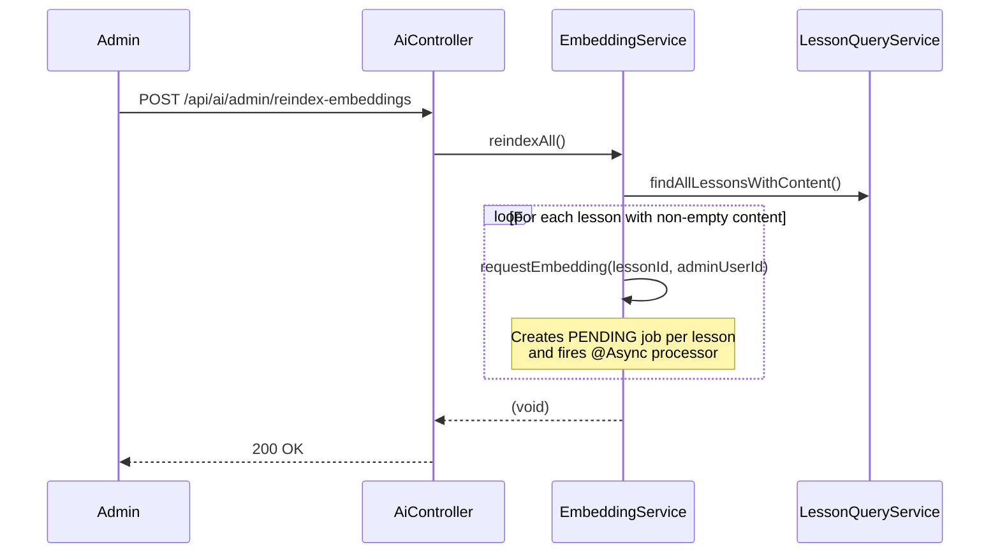

**Use case**: Run after initial deployment to backfill embeddings for existing lessons, or after a bulk content migration.

---

## 4. Workflow 2 — Lesson Summary Generation

Lesson summaries provide structured learning aids (`summaryText`, `keyPoints[]`, `vocabulary[]`). They are co-triggered by the same `LessonContentUpdatedEvent` as embeddings, running in parallel on separate async threads.

### 4.1 Trigger Flow

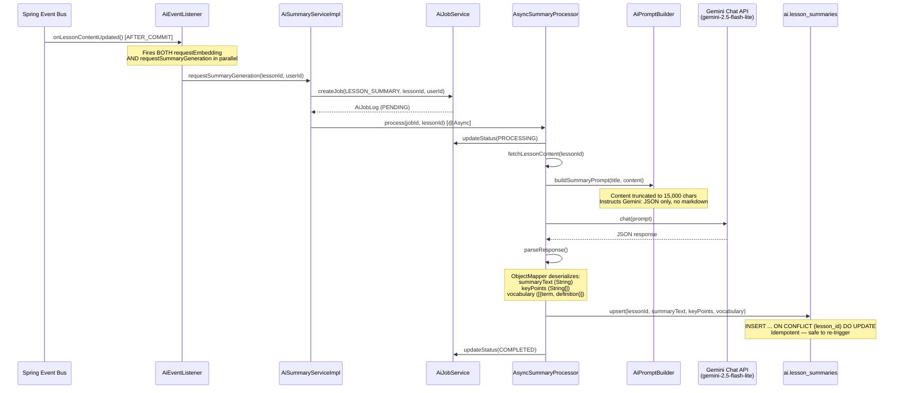

### 4.2 Gemini Prompt Structure

```
System: You are an educational content expert. Analyze the following lesson content
        and generate a structured summary in strict JSON format. No markdown. No explanation.

User:   Lesson: {lessonTitle}
        Content: {content (max 15,000 chars)}

        Return exactly this JSON structure:
        {
          "summaryText": "2-3 paragraph summary...",
          "keyPoints": ["Point 1", "Point 2", ...],
          "vocabulary": [
            {"term": "...", "definition": "..."}
          ]
        }
```

### 4.3 Summary Retrieval

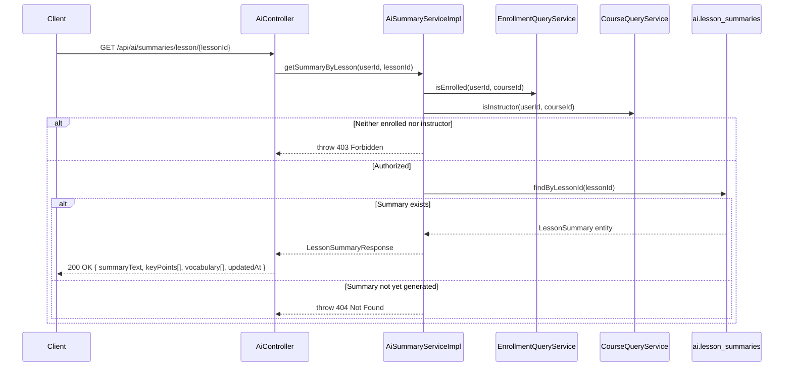

---

## 5. Workflow 3 — Quiz Generation & Attempts

Instructors generate multiple-choice quizzes from lesson content. Students take the quiz without seeing answers; correct answers and explanations are revealed only after submission.

### 5.1 Quiz Generation Flow (Instructor)

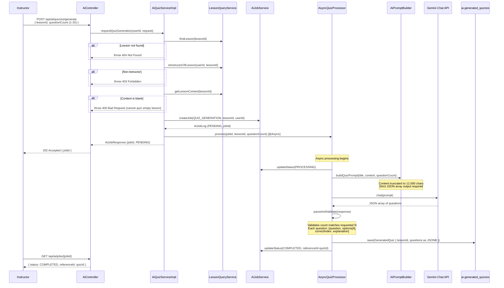

### 5.2 Student Quiz Flow

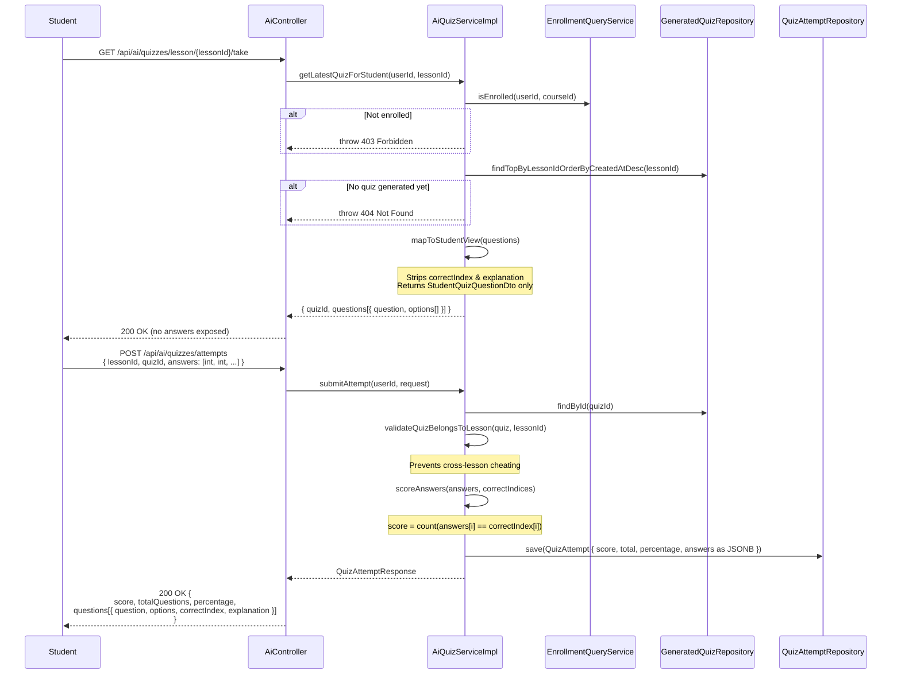

### 5.3 Instructor Quiz Review

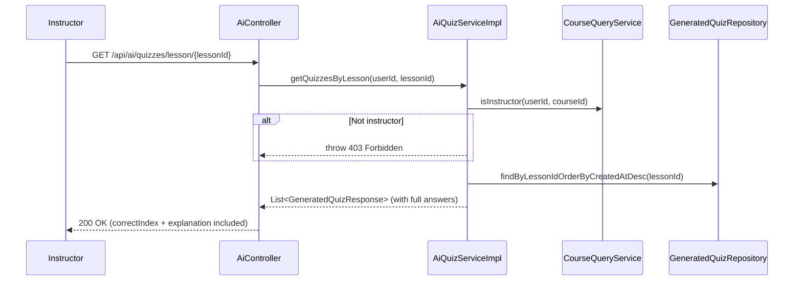

### 5.4 Answer Masking Strategy

| Field | Student View (`/take`) | Post-Submission (`/attempts`) | Instructor View |
|-------|----------------------|-------------------------------|-----------------|
| `question` | ✅ | ✅ | ✅ |
| `options[]` | ✅ | ✅ | ✅ |
| `correctIndex` | ❌ hidden | ✅ revealed | ✅ |
| `explanation` | ❌ hidden | ✅ revealed | ✅ |

---

## 6. Workflow 4 — RAG Chat (Synchronous & SSE Streaming)

The Retrieval-Augmented Generation chat allows students and instructors to ask natural-language questions about course material. The system retrieves the most semantically relevant lesson chunks, classifies answer confidence, and generates a grounded response using Gemini.

### 6.1 Full RAG Pipeline

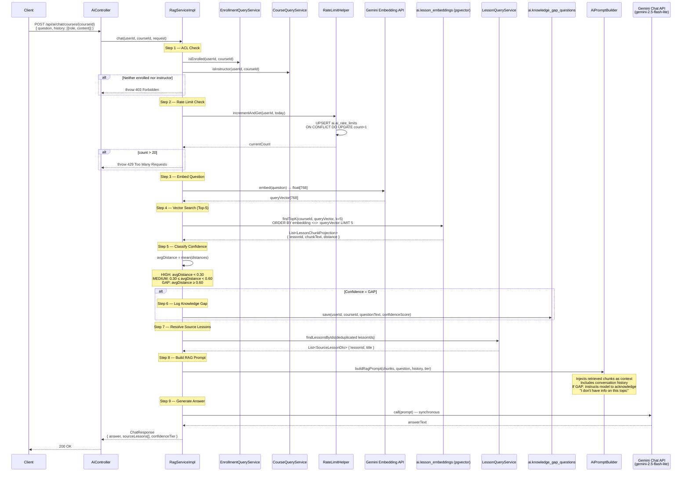

### 6.2 SSE Streaming Flow

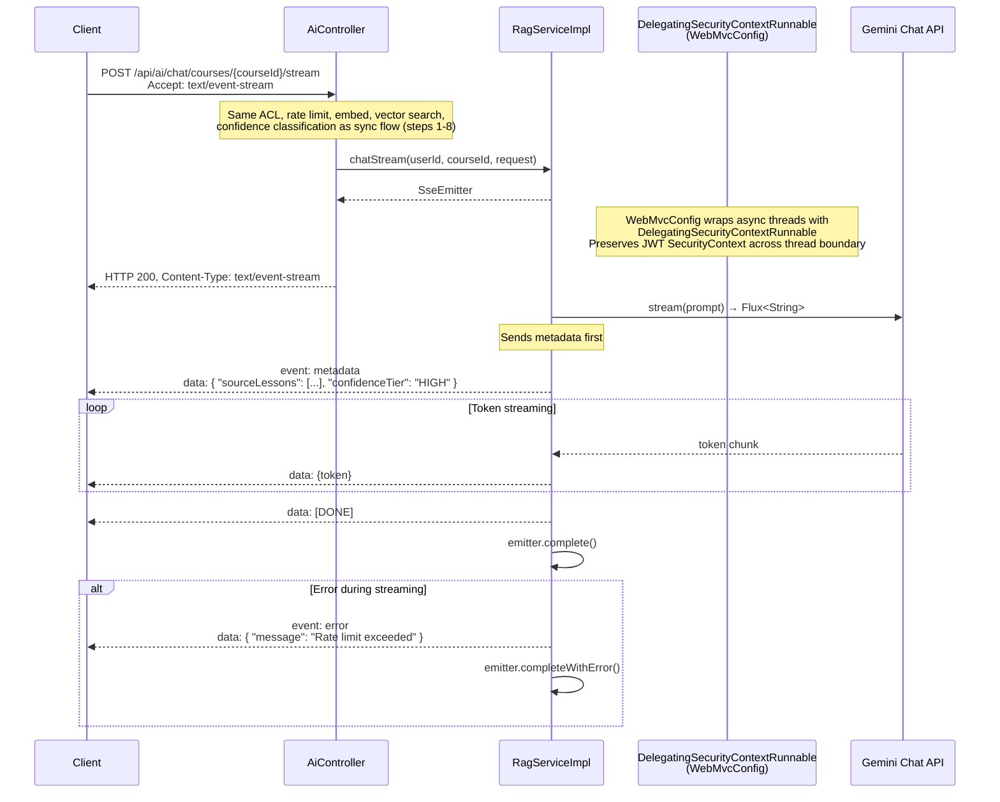

### 6.3 Confidence Tier Classification

Confidence is determined by the average cosine distance of the top-5 retrieved chunks. Cosine distance is in the range `[0, 2]` where `0` = identical vectors.

```
avgDistance = mean(chunk.distance for top-5 chunks)

┌─────────────────┬────────────────────┬───────────────────────────────────────┐
│ Tier            │ Condition          │ Behaviour                             │
├─────────────────┼────────────────────┼───────────────────────────────────────┤
│ HIGH            │ avgDistance < 0.30 │ Strong semantic match; answer is      │
│                 │                    │ grounded in course material            │
├─────────────────┼────────────────────┼───────────────────────────────────────┤
│ MEDIUM          │ 0.30 ≤ dist < 0.60 │ Partial match; answer may be relevant │
│                 │                    │ but user is warned                     │
├─────────────────┼────────────────────┼───────────────────────────────────────┤
│ GAP             │ avgDistance ≥ 0.60 │ No relevant content found; question   │
│                 │                    │ logged to knowledge_gap_questions;     │
│                 │                    │ Gemini told to acknowledge the gap     │
└─────────────────┴────────────────────┴───────────────────────────────────────┘
```

### 6.4 Rate Limiting Detail

Rate limiting is enforced per user per day using a PostgreSQL UPSERT — atomic and race-condition-free.

```sql
-- RateLimitHelper.incrementAndGet()
INSERT INTO ai.ai_rate_limits (user_id, limit_date, message_count)
VALUES (:userId, CURRENT_DATE, 1)
ON CONFLICT (user_id, limit_date)
DO UPDATE SET message_count = ai.ai_rate_limits.message_count + 1
RETURNING message_count;
```

| Setting | Value |
|---------|-------|
| Daily limit | 20 queries / user / day |
| Reset | Midnight (new `limit_date` row) |
| Enforcement | Pre-call; increments before Gemini call |
| Error | `429 Too Many Requests` |

### 6.5 SSE Security Context Propagation

Spring async threads do not inherit the `SecurityContext` from the request thread by default. This causes `NullPointerException` when `RagServiceImpl` calls `SecurityContextHolder.getContext()` inside the SSE thread.

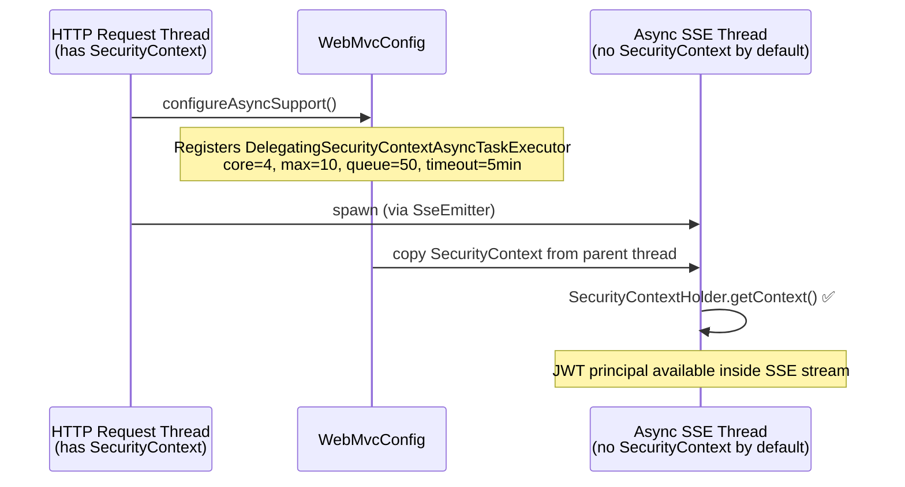

---

## 7. Cross-Cutting Concerns

### 7.1 ACL Enforcement Matrix

| Feature | Endpoint | Instructor | Enrolled Student | Notes |
|---------|----------|:----------:|:----------------:|-------|
| Generate quiz | `POST /quizzes/generate` | ✅ | ❌ | Must own the lesson's course |
| View all quizzes (with answers) | `GET /quizzes/lesson/{id}` | ✅ | ❌ | Full `correctIndex` + `explanation` |
| Take latest quiz | `GET /quizzes/lesson/{id}/take` | ❌ | ✅ | Answers stripped |
| Submit attempt | `POST /quizzes/attempts` | ❌ | ✅ | Returns answers after scoring |
| View my attempts | `GET /quizzes/lesson/{id}/my-attempts` | ❌ | ✅ | Own attempts only |
| Get lesson summary | `GET /summaries/lesson/{id}` | ✅ | ✅ | Either role |
| RAG chat (sync) | `POST /chat/courses/{id}` | ✅ | ✅ | Rate-limited |
| RAG chat (stream) | `POST /chat/courses/{id}/stream` | ✅ | ✅ | Rate-limited |
| Poll job status | `GET /jobs/{id}` | ✅ | — | Job owner only |
| Reindex embeddings | `POST /admin/reindex-embeddings` | — | — | Admin role |

All ACL checks use cross-module API interfaces (`LessonQueryService`, `EnrollmentQueryService`, `CourseQueryService`) — no direct imports of other modules' repositories.

### 7.2 Thread Pool Configuration

```yaml
# application.yml — AI async executor
ai:
  executor:
    core-pool-size: 2      # Base threads always alive
    max-pool-size: 5       # Max concurrent AI generation jobs
    queue-capacity: 50     # Job queue depth before rejection

# WebMvcConfig — SSE async executor
WebMvcConfig:
  core: 4
  max: 10
  queue: 50
  timeout: 300_000ms       # 5 minutes max SSE connection
```

### 7.3 Gemini Configuration

```yaml
# application.yml
spring:
  ai:
    google:
      genai:
        api-key: ${GEMINI_API_KEY:}       # Optional at startup
        chat:
          model: gemini-2.5-flash-lite
          temperature: 0.3               # Low temperature for factual accuracy
          max-output-tokens: 4096
        embedding:
          model: gemini-embedding-001
          dimensions: 768
    retry:
      max-attempts: 1                    # No auto-retry; processors handle failures
```

---

## 8. Database Schema

### `ai.lesson_embeddings`

```sql
CREATE TABLE ai.lesson_embeddings (
    id          BIGSERIAL PRIMARY KEY,
    lesson_id   BIGINT NOT NULL,
    course_id   BIGINT NOT NULL,
    chunk_index INT NOT NULL,
    chunk_text  TEXT NOT NULL,
    embedding   vector(768),
    created_at  TIMESTAMP DEFAULT now()
);

-- pgvector IVFFlat index for approximate nearest-neighbour search
CREATE INDEX ON ai.lesson_embeddings
    USING ivfflat (embedding vector_cosine_ops) WITH (lists = 100);
```

### `ai.ai_rate_limits`

```sql
CREATE TABLE ai.ai_rate_limits (
    id            BIGSERIAL PRIMARY KEY,
    user_id       BIGINT NOT NULL,
    limit_date    DATE NOT NULL,
    message_count INT DEFAULT 0,
    UNIQUE (user_id, limit_date)        -- Enforces one row per user per day
);
```

### `ai.ai_job_logs`

```sql
CREATE TABLE ai.ai_job_logs (
    id            UUID PRIMARY KEY,
    job_type      VARCHAR,              -- EMBEDDING, LESSON_SUMMARY, QUIZ_GENERATION, TRANSCRIPTION
    status        VARCHAR,              -- PENDING, PROCESSING, COMPLETED, FAILED, DELAYED
    user_id       BIGINT,
    reference_id  BIGINT,              -- lessonId on create; updated to quizId on quiz completion
    error_message TEXT,
    retry_count   INT DEFAULT 0,
    started_at    TIMESTAMP,
    completed_at  TIMESTAMP,
    created_at    TIMESTAMP DEFAULT now()
);
```

### `ai.knowledge_gap_questions`

```sql
CREATE TABLE ai.knowledge_gap_questions (
    id               BIGSERIAL PRIMARY KEY,
    user_id          BIGINT NOT NULL,
    course_id        BIGINT NOT NULL,
    question_text    TEXT NOT NULL,
    confidence_score DOUBLE PRECISION,  -- avgDistance at time of query
    asked_at         TIMESTAMP DEFAULT now()
);
```

### `ai.lesson_summaries`

```sql
CREATE TABLE ai.lesson_summaries (
    id           BIGSERIAL PRIMARY KEY,
    lesson_id    BIGINT UNIQUE NOT NULL,   -- UNIQUE enables upsert idempotency
    summary_text TEXT,
    key_points   JSONB,                    -- String[]
    vocabulary   JSONB,                    -- [{term: String, definition: String}]
    updated_at   TIMESTAMP DEFAULT now()
);
```

### `ai.generated_quizzes`

```sql
CREATE TABLE ai.generated_quizzes (
    id         UUID PRIMARY KEY,
    lesson_id  BIGINT NOT NULL,
    job_id     UUID,                       -- Reference back to the triggering job
    questions  JSONB,                      -- QuizQuestionDto[]
    created_at TIMESTAMP DEFAULT now()
);
```

### `ai.quiz_attempts`

```sql
CREATE TABLE ai.quiz_attempts (
    id           BIGSERIAL PRIMARY KEY,
    quiz_id      UUID NOT NULL,
    lesson_id    BIGINT NOT NULL,
    student_id   BIGINT NOT NULL,
    answers      JSONB,                    -- int[] (selected option indices)
    score        INT,
    total        INT,
    percentage   DOUBLE PRECISION,
    attempted_at TIMESTAMP DEFAULT now()
);
```

---

## 9. API Reference

All endpoints are under `/api/ai/**` (proxied through API Gateway on port 8080).

### Job Management

| Method | Path | Auth | Response | Description |
|--------|------|------|----------|-------------|
| `GET` | `/ai/jobs/{id}` | Job owner | `AiJobResponse` | Poll async job status |

### Embeddings (Admin)

| Method | Path | Auth | Response | Description |
|--------|------|------|----------|-------------|
| `POST` | `/ai/admin/reindex-embeddings` | Admin | `200 OK` | Backfill embeddings for all lessons |

### Lesson Summaries

| Method | Path | Auth | Response | Description |
|--------|------|------|----------|-------------|
| `GET` | `/ai/summaries/lesson/{lessonId}` | Enrolled / Instructor | `LessonSummaryResponse` | Retrieve generated summary |

### Quiz Generation & Attempts

| Method | Path | Auth | Response | Description |
|--------|------|------|----------|-------------|
| `POST` | `/ai/quizzes/generate` | Instructor | `202 { jobId }` | Request quiz generation |
| `GET` | `/ai/quizzes/lesson/{lessonId}` | Instructor | `List<GeneratedQuizResponse>` | All quizzes with answers |
| `GET` | `/ai/quizzes/lesson/{lessonId}/take` | Student | `StudentQuiz` (no answers) | Latest quiz for student |
| `POST` | `/ai/quizzes/attempts` | Student | `QuizAttemptResponse` | Submit answers, get scored results |
| `GET` | `/ai/quizzes/lesson/{lessonId}/my-attempts` | Student | `List<QuizAttemptResponse>` | Student's attempt history |

### RAG Chat

| Method | Path | Auth | Response | Description |
|--------|------|------|----------|-------------|
| `POST` | `/ai/chat/courses/{courseId}` | Enrolled / Instructor | `ChatResponse` | Synchronous RAG Q&A |
| `POST` | `/ai/chat/courses/{courseId}/stream` | Enrolled / Instructor | `text/event-stream` | SSE streaming RAG Q&A |

---

## 10. Error Scenarios

### Job Processing Errors

| Error | Cause | Outcome |
|-------|-------|---------|
| Lesson content is blank | Lesson has no text content | Job → `FAILED("no content")` |
| Gemini API key missing | `GEMINI_API_KEY` not set | `AsyncEmbeddingProcessor` guards with null check; Job → `FAILED` |
| Gemini API error | Network or quota issue | Exception caught; Job → `FAILED(errorMessage)` |
| JSON parse failure | Gemini returns malformed JSON | `AiResponseParseException` thrown; Job → `FAILED` |
| Quiz count mismatch | Gemini returns fewer questions than requested | Validation throws; Job → `FAILED` |

### RAG Chat Errors

| Error | Cause | HTTP Status |
|-------|-------|-------------|
| User not enrolled and not instructor | ACL check fails | `403 Forbidden` |
| Daily rate limit exceeded | `message_count > 20` | `429 Too Many Requests` |
| Gemini embedding fails | API error on question embed | `500 Internal Server Error` |
| No embeddings for course | Lessons have never been indexed | GAP tier response (not an error) |

### Quiz Attempt Errors

| Error | Cause | HTTP Status |
|-------|-------|-------------|
| Quiz not found | Invalid `quizId` | `404 Not Found` |
| Quiz-lesson mismatch | `quizId` does not belong to `lessonId` | `400 Bad Request` |
| Student not enrolled | ACL check fails | `403 Forbidden` |

---

## 11. Key Implementation Details

### Idempotency

- **Embeddings**: `AsyncEmbeddingProcessor` calls `deleteByLessonId()` before re-inserting chunks. Re-triggering the same lesson is safe.
- **Summaries**: `LessonSummaryRepository.upsert()` uses `INSERT ... ON CONFLICT (lesson_id) DO UPDATE`. Re-triggering overwrites with the latest result.
- **Quizzes**: Each generation creates a new `GeneratedQuiz` row. Multiple generations accumulate; students always receive the most recent one.

### Security Context in Async Threads

All async AI threads (SSE streaming via `SseEmitter`) require access to the JWT `SecurityContext` to call cross-module services that check the current user. `WebMvcConfig` registers a `DelegatingSecurityContextAsyncTaskExecutor` that copies the parent thread's context into each spawned thread.

### Cross-Module API Contracts

The AI module never imports internal classes from the `course` module. It depends exclusively on interfaces in `course/api/`:

```
modules/course/api/
  ├── LessonQueryService       (getLessonContent, findLesson, isInstructorOfLesson)
  ├── EnrollmentQueryService   (isEnrolled)
  └── CourseQueryService       (isInstructor, findCourse)
```

Implementations live in `course/api/impl/` — hidden behind the interface boundary.

### pgvector Cosine Similarity Query

```sql
-- LessonEmbeddingRepository.findTopK()
SELECT id, lesson_id, course_id, chunk_index, chunk_text,
       (embedding <=> CAST(:queryVector AS vector)) AS distance
FROM   ai.lesson_embeddings
WHERE  course_id = :courseId
ORDER  BY embedding <=> CAST(:queryVector AS vector)
LIMIT  :k
```

The `<=>` operator computes cosine distance (not similarity). A lower value = more similar. The ivfflat index with `lists=100` provides approximate nearest-neighbour search at scale.

---

**Last Updated**: Based on implementation in `modules/ai/` — `feature/ai-module` branch
**Status**: Core functionality complete (Embedding, Summary, Quiz, RAG Chat)
