# AI Module Workflows

This document describes all AI-driven workflows implemented in the EduMind LMS system. The AI module provides five core features: **Lesson Embeddings**, **Lesson Summaries**, **Quiz Generation**, **RAG Chat**, and **Auto-Transcription** — built on Spring AI with Google Gemini and Groq Whisper API.

---

## 1. AI Module Architecture Overview

```mermaid
graph TB
    subgraph API["API Layer — AiController (/api/ai/**)"]
        direction LR
        C1["/chat/courses/{id}"]
        C2["/quizzes/generate"]
        C3["/summaries/lesson/{id}"]
        C4["/jobs/{id}"]
        C5["/admin/reindex-embeddings"]
        C7["/admin/reindex-summaries"]
        C6["/transcribe/lessons/{id}"]
    end

    subgraph Services["Service Layer"]
        RagSvc["RagServiceImpl<br>(RAG Chat)"]
        QuizSvc["AiQuizServiceImpl<br>(Quiz Gen)"]
        SumSvc["AiSummaryServiceImpl<br>(Summary)"]
        EmbSvc["EmbeddingServiceImpl<br>(Embedding)"]
        JobSvc["AiJobService<br>(Job Tracking)"]
        RateLimit["RateLimitHelper<br>(Rate Limiting)"]
        TransSvc["WhisperTranscriptionServiceImpl<br>(Transcription)"]
    end

    subgraph AsyncLayer["Async Processors (@Async)"]
        EmbProc["AsyncEmbeddingProcessor"]
        SumProc["AsyncSummaryProcessor"]
        QuizProc["AsyncQuizProcessor"]
        TransProc["WhisperTranscriptionServiceImpl<br>@Async whisperTaskExecutor<br>size=1, queue=10"]
    end

    subgraph Gemini["Google Gemini (Spring AI)"]
        ChatModel["gemini-2.5-flash-lite<br>temp=0.3, max=4096 tokens"]
        EmbModel["gemini-embedding-001<br>768 dimensions"]
    end

    subgraph Groq["Groq Whisper API"]
        GroqAPI["whisper-large-v3-turbo<br>25 MB application limit"]
    end

    subgraph SourceResolvers["Transcription Source Resolvers"]
        Resolver["TranscriptionSourceResolver<br>(Strategy Pattern)"]
        CldExt["CloudinaryAudioExtractor<br>on-the-fly vc_none,ac_mp3,br_32k"]
        YtExt["YouTubeTranscriptExtractor<br>auto-captions first (free)"]
        YtDlp["YtDlpAudioDownloader<br>fallback (yt-dlp binary)"]
    end

    subgraph DB["PostgreSQL — ai schema"]
        JobLog["ai.ai_job_logs"]
        Embeddings["ai.lesson_embeddings<br>(pgvector)"]
        Summaries["ai.lesson_summaries"]
        Quizzes["ai.generated_quizzes"]
        Attempts["ai.quiz_attempts"]
        RateDB["ai.ai_rate_limits"]
        GapDB["ai.knowledge_gap_questions"]
    end

    subgraph Events["Event-Driven"]
        Event["LessonContentUpdatedEvent<br>(@TransactionalEventListener<br>AFTER_COMMIT)"]
    end

    C1 --> RagSvc
    C2 --> QuizSvc
    C3 --> SumSvc
    C4 --> JobSvc
    C5 --> EmbSvc
    C6 --> TransSvc

    Event --> EmbSvc
    Event --> SumSvc

    RagSvc --> RateLimit --> RateDB
    RagSvc --> EmbModel
    RagSvc --> ChatModel
    RagSvc --> Embeddings
    RagSvc --> GapDB

    QuizSvc --> JobSvc --> JobLog
    SumSvc --> JobSvc
    EmbSvc --> JobSvc
    TransSvc --> JobSvc

    QuizSvc --> QuizProc
    SumSvc --> SumProc
    EmbSvc --> EmbProc
    TransSvc --> TransProc

    QuizProc --> ChatModel
    QuizProc --> Quizzes
    SumProc --> ChatModel
    SumProc --> Summaries
    EmbProc --> EmbModel
    EmbProc --> Embeddings

    TransProc --> Resolver
    Resolver --> CldExt
    Resolver --> YtExt
    YtExt --> YtDlp
    CldExt --> GroqAPI
    YtDlp --> GroqAPI
    GroqAPI --> Caption["WebVTT builder +<br>Cloudinary raw upload<br>lesson.video_caption_url"]
    TransProc --> Event
```

**Note on `GroqAPI --> Caption`**: this edge only fires when Groq is actually invoked (the `AudioFile` path — Cloudinary videos or YouTube-audio-fallback). The YouTube auto-caption fast path (`YtExt` returning `DirectText` directly) never calls Groq and therefore never produces a WebVTT caption — only plain transcript text. See §3.1.2.

### Key Design Principles

- **Async Job Pattern — not uniform across features**: All four job types (`EMBEDDING`, `LESSON_SUMMARY`, `QUIZ_GENERATION`, `TRANSCRIPTION`) are tracked in `ai.ai_job_logs` through the same state machine, but the *client-facing contract* differs:
  - **Client-initiated & pollable** — `QUIZ_GENERATION` and `TRANSCRIPTION`: the triggering request returns `202 Accepted` with a `jobId`, and the caller polls `GET /api/ai/jobs/{id}`.
  - **Event-driven, internal tracking only** — `EMBEDDING` and `LESSON_SUMMARY`: a job row is created and state-machined the same way, but **no endpoint ever returns that per-lesson jobId to a caller**. The only client-facing surface is the admin bulk-reindex endpoints (`/admin/reindex-embeddings`, `/admin/reindex-summaries`), which return a plain count string, not job IDs. A caller who wants to know "is this lesson's summary ready yet" has to poll `GET /ai/summaries/lesson/{id}` and treat `404` as "not ready", not a real job-status check.
  - **No job concept at all** — RAG chat (sync or SSE): a direct synchronous response or stream, nothing written to `ai_job_logs`.
- **Event-Driven Triggers**: Embedding and summary generation fire automatically after lesson content is committed to the database via `@TransactionalEventListener(AFTER_COMMIT)`. Three sources publish `LessonContentUpdatedEvent`: (1) lesson creation with non-blank `articleContent`, (2) lesson update when `articleContent` changes, and (3) transcription completion via `LessonWriteService`.
- **ACL Enforcement**: Every endpoint validates enrollment (student) or course ownership (instructor) via cross-module API contracts — never direct repository imports.
- **Graceful Degradation**: `GEMINI_API_KEY` is optional at startup. The `ChatClient` and `EmbeddingModel` beans are `@ConditionalOnProperty` — the application boots without them. Similarly, `GROQ_API_KEY` is optional; transcription endpoint returns errors only when called.
- **Sequential Transcription**: `whisperTaskExecutor` (size=1, queue=10) serializes Groq API calls to stay within the 20 req/min rate limit. Groq 429 responses flip the job to `DELAYED`; `TranscriptionRetryScheduler` re-queues every 30 seconds.
- **Retry policy is transcription-specific, not universal**: `DELAYED` + scheduled retry only exists for `TRANSCRIPTION` (Groq 429s). `AsyncQuizProcessor` and `AsyncEmbeddingProcessor`/`AsyncSummaryProcessor` make a single attempt each — any exception (including a missing `EmbeddingModel` bean) goes straight to `FAILED`, with no automatic re-attempt. Recovery requires re-triggering the original action (re-save the lesson, regenerate the quiz, or run the admin reindex).

---

## 2. Async Job State Machine

All AI generation operations share a unified job tracking system (`ai.ai_job_logs`).

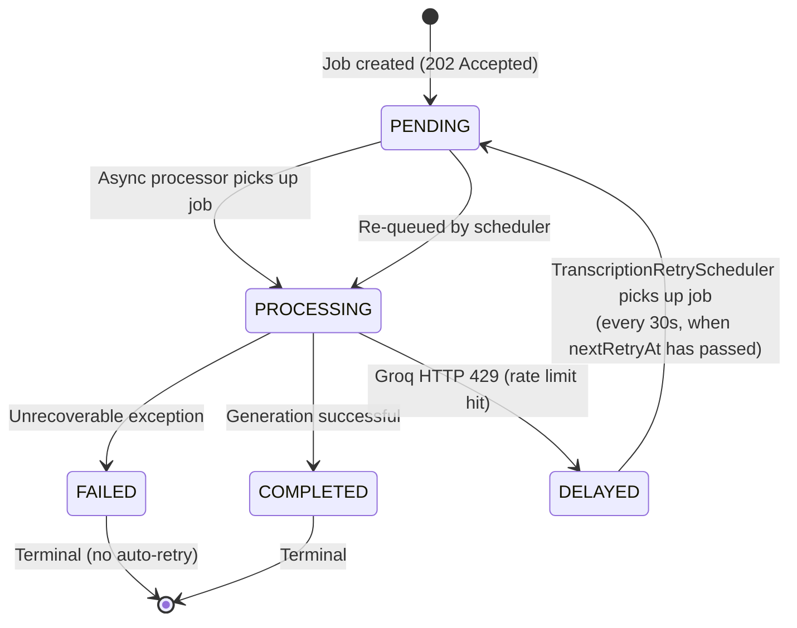

| Status | Description |
|--------|-------------|
| `PENDING` | Job created, waiting for async thread |
| `PROCESSING` | Async processor started, API call in progress |
| `COMPLETED` | Generation finished, result persisted |
| `FAILED` | Unrecoverable exception; `errorMessage` field populated |
| `DELAYED` | Groq rate limit hit (HTTP 429); `nextRetryAt` set to `now + retryDelaySeconds (60s)` |

**Job ownership**: `GET /api/ai/jobs/{id}` validates the requesting user matches `AiJobLog.userId`. Cross-user access returns `403 Forbidden`.

**Retry policy for non-transcription jobs**: Spring AI retry is disabled (`max-attempts: 1`). Each processor catches exceptions, persists the error message to `AiJobLog`, and marks the job `FAILED`. Retrying requires re-triggering the original action.

**Retry policy for `TRANSCRIPTION` jobs**: `GroqRateLimitException` (HTTP 429) transitions the job to `DELAYED` with `nextRetryAt = now + 60s`. `TranscriptionRetryScheduler` polls every 30 seconds, picks up all `DELAYED` jobs whose `nextRetryAt` has passed, resets them to `PENDING`, and re-submits to `whisperTaskExecutor`. If the queue is full, the job stays `DELAYED` with `nextRetryAt = now + 30s`.

---

## 3. Workflow 1 — Auto-Transcription (Groq Whisper)

Teachers upload a lesson video to Cloudinary (or, less commonly, paste a YouTube URL — see [Appendix A](#appendix-a--historical-strategy-youtube-extraction)) and select the spoken language. The request accepts only `en` or `vi`; omitting `language` uses `en`. Bean validation rejects any other value before a transcription job is created. The system extracts a transcript, writes it into the lesson's `articleContent`, generates a WebVTT caption file from Groq's per-segment timestamps, and publishes `LessonContentUpdatedEvent` — automatically triggering embedding and summary generation.

**Why Groq instead of local Whisper**: the target VPS has approximately 600 MB of RAM available after the Spring Boot services are running. Hosting Whisper locally was therefore not operationally viable: the medium model needs roughly 2 GB of memory, while even the base model needs around 500 MB and leaves too little headroom for stable application traffic. Groq-hosted Whisper avoids that VPS memory cost and, in project testing, completed transcription substantially faster than local inference. This was the deciding trade-off: depend on an external provider so the existing low-memory deployment can support transcription reliably. Provider pricing, quotas, retention, and service limits remain external dependencies and may change independently of this repository.

**Why Cloudinary upload-first is the current production path**: an earlier iteration let teachers paste an arbitrary YouTube URL and relied on `yt-dlp` to fetch captions or audio server-side. On the VPS this hits YouTube's anti-bot/IP-reputation blocking and `yt-dlp` can fail silently or time out. The reliable path teachers actually use in production is: upload the video file to Cloudinary via the existing signed chunked-upload pipeline (see [`docs/workflows/video_upload_workflows.md`](./video_upload_workflows.md)), then transcribe from the resulting `res.cloudinary.com` URL. The code still fully supports YouTube URLs — the `TranscriptionSourceResolver` strategy pattern and `yt-dlp` integration are unmodified and reachable through the same endpoint — but that path is now the fallback/historical option, documented in the appendix.

### 3.1 Current Production Workflow (Cloudinary Upload-First)

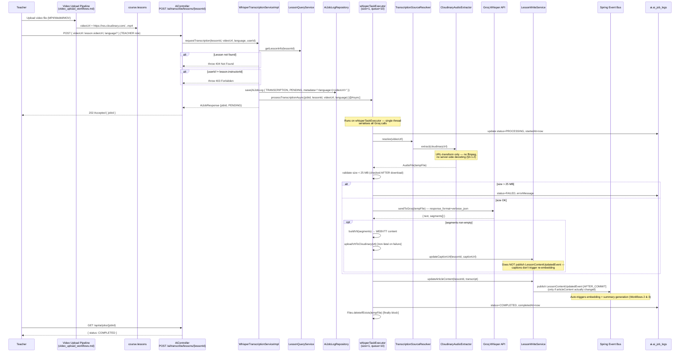

#### 3.1.1 Cloudinary Audio Extraction

Cloudinary supports server-side media transformation via URL parameters. `CloudinaryAudioExtractor` inserts transformation parameters right after `/upload/` — **no ffmpeg, no server-side decoding, no VPS RAM usage**. The transformed URL is downloaded (plain `java.net.URL` stream, not Cloudinary's SDK) to a local temp file and returned as `TranscriptionInput.AudioFile`.

```
Original:   https://res.cloudinary.com/demo/video/upload/sample.mp4
Transformed: https://res.cloudinary.com/demo/video/upload/vc_none,ac_mp3,br_32k/sample.mp3
                                                          ───────────────────────
                                                          vc_none  = strip video
                                                          ac_mp3   = audio codec mp3
                                                          br_32k   = bitrate 32 kbps → ~14 MB/hour
```

#### 3.1.2 Groq API Call

Groq's API is OpenAI-compatible (`/openai/v1/audio/transcriptions`). The `RestClient` bean is pre-configured with `Authorization: Bearer <GROQ_API_KEY>` via `GroqClientConfig`. The 25 MB size check happens **after** the audio has already been downloaded/extracted — a large file is fetched first, then rejected if it exceeds the Groq limit.

```
POST https://api.groq.com/openai/v1/audio/transcriptions
Content-Type: multipart/form-data

file            = <audio file>
model           = whisper-large-v3-turbo
language        = <per-request value: "vi" or "en"; falls back to ai.groq.language config (default "en")>
response_format = verbose_json

Response: {
  "text": "transcribed content...",
  "segments": [
    { "start": 0.0, "end": 4.2, "text": "Welcome to this lesson..." },
    { "start": 4.2, "end": 9.8, "text": "Today we will cover..." }
  ]
}
```

`response_format=verbose_json` is requested specifically to get per-segment timestamps — the plain `text` field alone would not be enough to build captions.

The API validates `language` as `en` or `vi`. A missing value defaults to `en`; unsupported values return a request-validation error and are not submitted to Groq.

**HTTP 429 handling**: The `RestClient` status handler detects `429 Too Many Requests` and throws `GroqRateLimitException`. The async processor catches it, sets `status=DELAYED`, and stores `nextRetryAt = now + 60s`.

#### 3.1.3 WebVTT Caption Generation

This is real, shipped code (added after the initial transcription feature, via migration `V37__Add_video_caption_url_to_lessons.sql`) — not just a documented aspiration:

1. `sendToGroq` extracts the `segments` array from the Groq response.
2. `buildVtt(segments)` / `formatVttTime(...)` construct a standard `WEBVTT` file with `HH:MM:SS.mmm --> HH:MM:SS.mmm` cue timing, one cue per segment, skipping blank-text segments.
3. `uploadVttToCloudinary(vttContent)` uploads the VTT bytes as a Cloudinary **raw** resource (`folder=captions`, `public_id=lesson_{lessonId}_caption`, `overwrite=true`), returning `secure_url`.
4. `lessonWriteService.updateCaptionUrl(lessonId, captionUrl)` persists the URL to `lesson.video_caption_url`.

**Important caveats**:
- This path only exists when Groq is actually invoked. The YouTube auto-caption fast path (Appendix A) returns a `DirectText` transcript with no timestamps and never produces a VTT file.
- Caption upload failure is **non-fatal** — it's caught, logged as a warning, and does not affect the transcript/`articleContent` save, which succeeds or fails independently.
- `updateCaptionUrl` deliberately does **not** publish `LessonContentUpdatedEvent` — captions are a presentation-layer artifact and don't trigger re-embedding/re-summarization.

#### 3.1.4 Post-Transcription Event Chain

When transcription completes successfully, `LessonWriteService.updateArticleContent()` is called. This:

1. Persists the transcript to `lesson.article_content`
2. Detects content changed (old ≠ new)
3. Publishes `LessonContentUpdatedEvent` after the transaction commits (only if content actually changed)
4. `AiEventListener` picks up the event on the `taskExecutor` thread
5. Triggers **embedding generation** and **summary generation** sequentially inside the listener (both are fire-and-forget from the listener's perspective — see §1 for why neither returns a jobId the caller can poll)

```
transcription COMPLETED
  └─→ LessonWriteService.updateArticleContent(lessonId, transcript)
        └─→ [AFTER_COMMIT] LessonContentUpdatedEvent
              └─→ AiEventListener.onLessonContentUpdated()
                    ├─→ AiSummaryService.requestSummaryGeneration(lesson)  [Workflow 3]
                    └─→ EmbeddingService.requestEmbedding(lesson)          [Workflow 2]
```

#### 3.1.5 File Lifecycle & Disk Safety

All temp files created during transcription are deleted in `finally` blocks to prevent disk leaks. The WebVTT content itself is never written to a temp file — it's built as a string and uploaded directly to Cloudinary.

| File | Created by | Deleted in |
|------|-----------|------------|
| Cloudinary-extracted MP3 | `CloudinaryAudioExtractor` | `WhisperTranscriptionServiceImpl.processTranscriptionAsync` finally |
| `ytdlp_sub_*_*.en.vtt` (Appendix A only) | `YouTubeTranscriptExtractor` | `YouTubeTranscriptExtractor.extract` finally |
| `ytdlp_audio_*.mp3` (Appendix A only) | `YtDlpAudioDownloader` | `WhisperTranscriptionServiceImpl.processTranscriptionAsync` finally |

#### 3.1.6 Rate Limit & Retry Scheduler

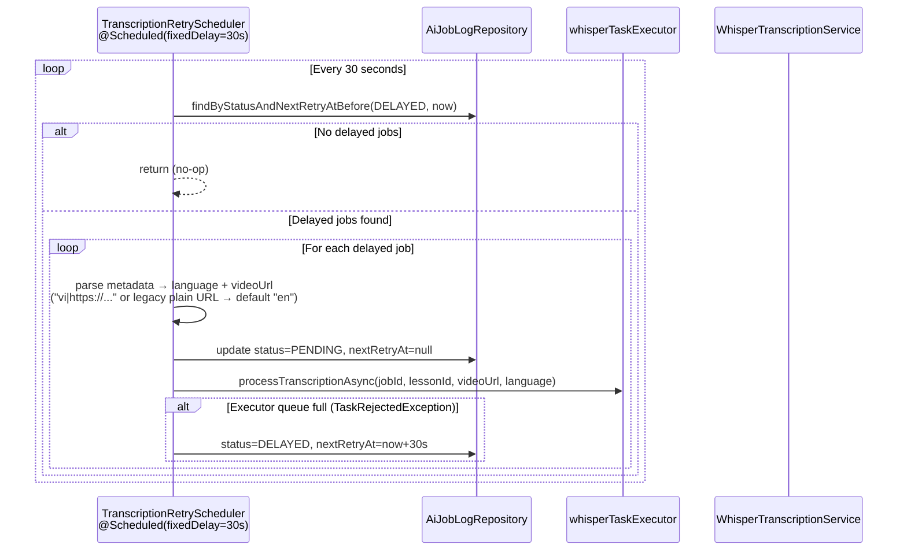

This is the *only* automatic retry mechanism anywhere in the AI module — it exists solely because Groq's rate limit is easy to hit with real usage. Quiz generation, embedding, and summary generation have no equivalent (see §1).

#### 3.1.7 Concurrency & Thread Pool

```yaml
ai:
  executor:
    whisper-queue-capacity: ${WHISPER_QUEUE_CAPACITY:10}  # Max queued transcription jobs
  groq:
    retry-delay-seconds: 60   # Seconds to wait before retrying after Groq 429
```

`whisperTaskExecutor` is configured as **size=1** (single thread). This serialises all Groq API calls, avoiding concurrent requests that would quickly exhaust the 20 req/min Groq rate limit. The queue holds up to 10 pending jobs; additional requests beyond queue capacity trigger `TaskRejectedException` and are kept `DELAYED` for the scheduler.

### 3.2 Path Comparison

| Path | Status | Notes |
|------|--------|-------|
| Cloudinary URL (`res.cloudinary.com`) | **Current production path** | Reliable; Cloudinary on-the-fly audio extraction; generates WebVTT captions |
| YouTube URL (`youtube.com`, `youtu.be`) | Historical / optional, see [Appendix A](#appendix-a--historical-strategy-youtube-extraction) | Anti-bot blocking on VPS; `yt-dlp` may fail silently; no VTT captions on the auto-caption fast path |

The full strategy pattern remains in code (`TranscriptionSourceResolver`, `YouTubeTranscriptExtractor`, `YtDlpAudioDownloader`) and can be used again if the deployment environment changes (e.g., residential IP, proxy, or a YouTube-approved API key).

---

## 4. Workflow 2 — Lesson Embedding

Lesson embeddings power the RAG Chat feature. They are generated automatically whenever lesson content is available — on creation (if `articleContent` is supplied) or on update (when content changes) — and stored as 768-dimensional vectors in `ai.lesson_embeddings` using the `pgvector` extension.

> **No client-facing job endpoint for this feature.** An `AiJobLog` row is created and state-machined per lesson (§2), but there is no per-lesson HTTP endpoint that returns that jobId to a caller — this is purely internal bookkeeping for the event-driven pipeline below. The only client-visible trigger is the admin bulk endpoint `POST /admin/reindex-embeddings` (§4.4), which returns a count, not job IDs.

### 4.1 Trigger Flow — Event-Driven Embedding

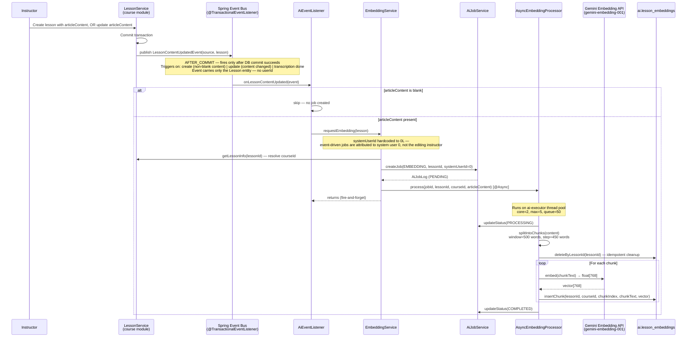

### 4.2 Chunking Strategy

The chunking algorithm ensures context continuity at chunk boundaries through overlapping windows.

```
Lesson Content (word array):
┌─────────────────────────────────────────────────────────────────┐
│ word[0] ... word[449] | word[450] ... word[499] | word[500] ... │
└───────────────────────────────────────────────────────────────┬─┘
                                                                │
chunk_0: word[0]   → word[499]   (500 words)                   │
chunk_1: word[450] → word[949]   (500 words, 50-word overlap)  │
chunk_2: word[900] → word[1399]  (500 words, 50-word overlap)  │
                ...                                             │
```

- **Window size**: 500 words
- **Step size**: 450 words (50-word backward overlap)
- **Purpose**: Prevents important concepts at chunk boundaries from losing context

### 4.3 Vector Storage (Native SQL)

Spring Data JPA does not natively support `pgvector` column types. The repository uses raw SQL for all vector operations:

```sql
-- Insert (LessonEmbeddingRepository.insertChunk)
INSERT INTO ai.lesson_embeddings (lesson_id, course_id, chunk_index, chunk_text, embedding)
VALUES (:lessonId, :courseId, :chunkIndex, :chunkText, CAST(:vector AS vector))

-- Index definition (V32 migration)
CREATE INDEX ON ai.lesson_embeddings
    USING ivfflat (embedding vector_cosine_ops) WITH (lists = 100);
```

### 4.4 Admin Manual Reindex

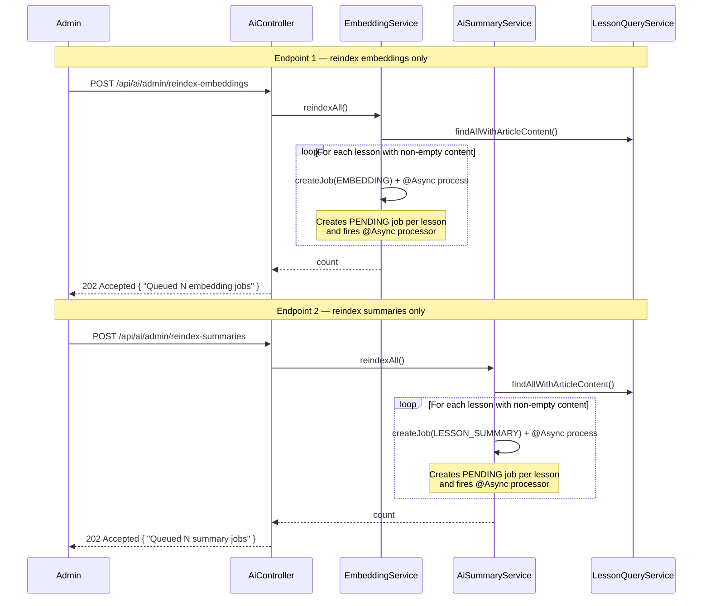

**Use case**: Run after initial deployment to backfill embeddings and summaries for existing lessons, or after a bulk content migration.

### 4.5 Lesson Deletion Cleanup

`AiEventListener` also handles `LessonDeletedEvent` (published by the course module, `@TransactionalEventListener(AFTER_COMMIT)` + `@Async("taskExecutor")`):

```
LessonDeletedEvent(lesson)
  → AiEventListener.onLessonDeleted(event)
     → lessonEmbeddingRepository.deleteByLessonId(lessonId)
     → lessonSummaryRepository.deleteByLessonId(lessonId)
```

Deleting a lesson removes its `ai.lesson_embeddings` chunks and `ai.lesson_summaries` row, preventing stale AI data (and RAG search hits) for a lesson that no longer exists. Generated quizzes and quiz attempts are not cleaned up by this listener.

---

## 5. Workflow 3 — Lesson Summary Generation

Lesson summaries provide structured learning aids (`summaryText`, `keyPoints[]`, `vocabulary[]`). They are co-triggered by the same `LessonContentUpdatedEvent` as embeddings: `AiEventListener.onLessonContentUpdated()` calls `requestSummaryGeneration()` then `requestEmbedding()` sequentially, but each dispatches its `@Async` processor immediately and returns, so the two generations effectively run concurrently on the `aiTaskExecutor` thread pool.

> **No client-facing trigger endpoint at all.** Unlike quiz generation and transcription, there is no `POST` endpoint to request a summary on demand — generation only happens via the event above, or in bulk via the admin `POST /admin/reindex-summaries` endpoint (§4.4). The only read endpoint is `GET /ai/summaries/lesson/{lessonId}` (§5.3), which returns `404` until the async job finishes — a caller has no way to distinguish "still generating" from "will never be generated" without a job-status endpoint.

### 5.1 Trigger Flow

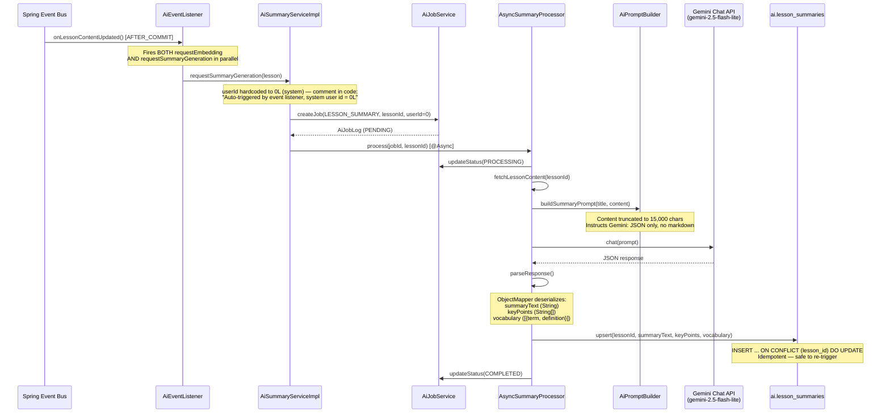

### 5.2 Gemini Prompt Structure

```
System: You are an educational content expert. Analyze the following lesson content
        and generate a structured summary in strict JSON format. No markdown. No explanation.

User:   Lesson: {lessonTitle}
        Content: {content (max 15,000 chars)}

        Return exactly this JSON structure:
        {
          "summaryText": "2-3 paragraph summary...",
          "keyPoints": ["Point 1", "Point 2", ...],
          "vocabulary": [
            {"term": "...", "definition": "..."}
          ]
        }
```

### 5.3 Summary Retrieval

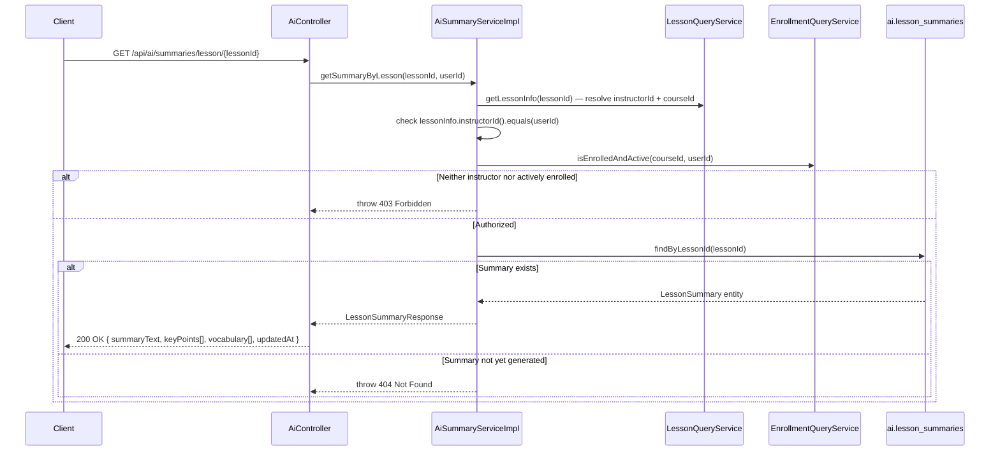

---

## 6. Workflow 4 — Quiz Generation & Attempts

Instructors generate multiple-choice quizzes from lesson content. Students take the quiz without seeing answers; correct answers and explanations are revealed only after submission.

### 6.1 Quiz Generation Flow (Instructor)

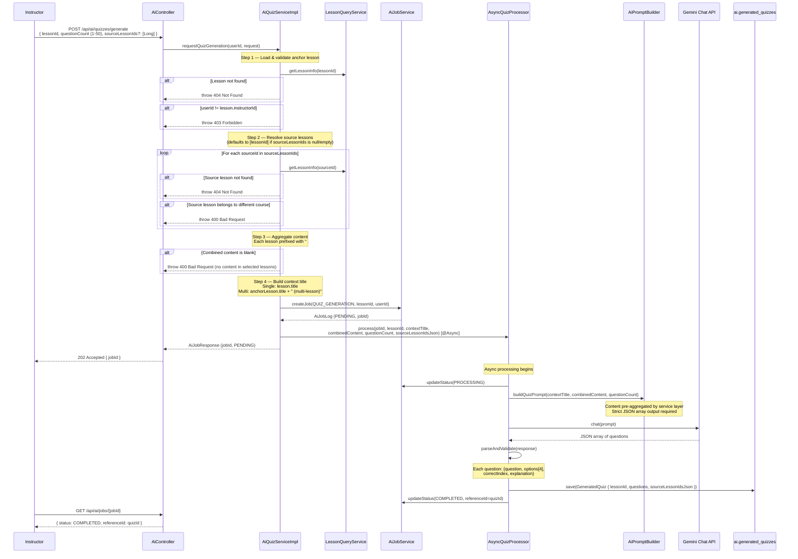

**Multi-lesson behavior**: When `sourceLessonIds` is provided, content from all specified lessons is concatenated with `## {lessonTitle}` section headers before being sent to Gemini. The quiz is still stored under the anchor `lessonId` — allowing students to access it via `GET /api/ai/quizzes/lesson/{lessonId}/take`. All source lesson IDs are persisted in `source_lesson_ids_json` for traceability. All source lessons must belong to the same course as the anchor lesson.

### 6.2 Student Quiz Flow

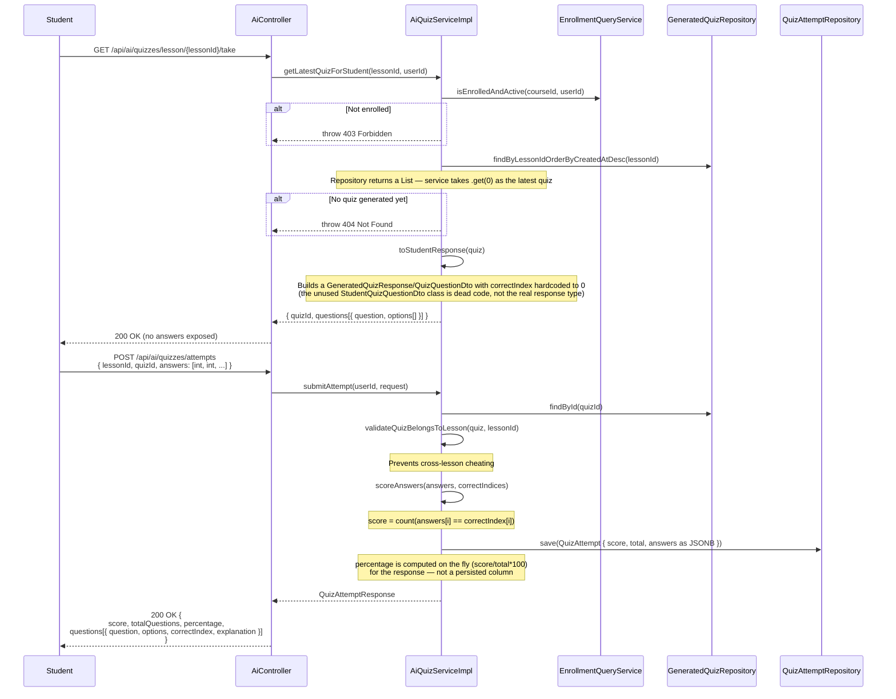

### 6.3 Instructor Quiz Review

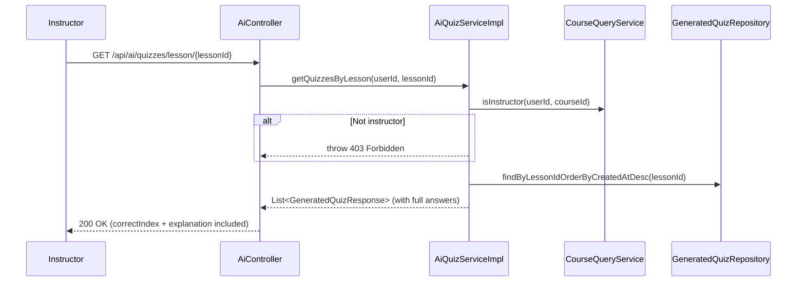

### 6.4 Answer Masking Strategy

| Field | Student View (`/take`) | Post-Submission (`/attempts`) | Instructor View |
|-------|----------------------|-------------------------------|-----------------|
| `question` | ✅ | ✅ | ✅ |
| `options[]` | ✅ | ✅ | ✅ |
| `correctIndex` | ❌ hidden | ✅ revealed | ✅ |
| `explanation` | ❌ hidden | ✅ revealed | ✅ |

> **Implementation note**: `AiQuizServiceImpl.toStudentResponse()` masks answers by rebuilding each question with `correctIndex=0` — a real index value, not a `null`/`-1` "no answer" sentinel. This is a real (code-commented) footgun: a client that naively trusts `correctIndex` from the `/take` response rather than treating it as always-masked could be misled into thinking option 0 is correct. The frontend must ignore `correctIndex` entirely until the post-submission response.

---

## 7. Workflow 5 — RAG Chat (Synchronous & SSE Streaming)

The Retrieval-Augmented Generation chat allows students and instructors to ask natural-language questions about course material. The system retrieves the most semantically relevant lesson chunks, classifies answer confidence, and generates a grounded response using Gemini.

### 7.1 Full RAG Pipeline

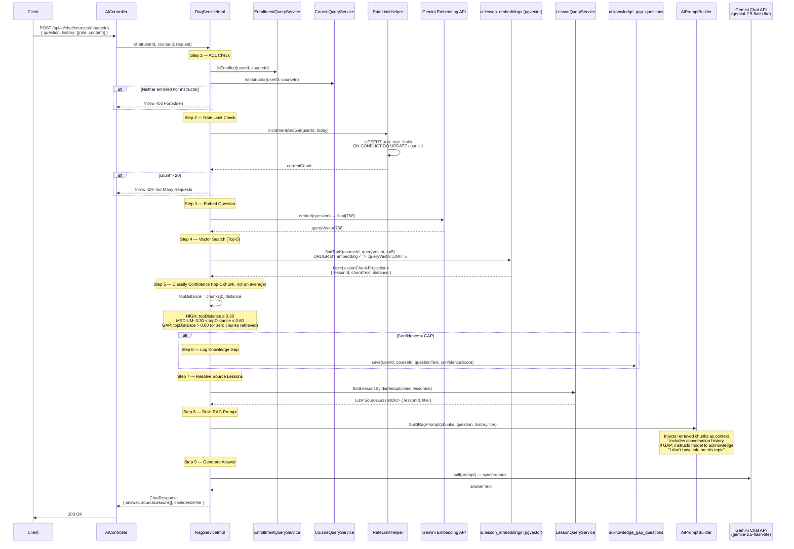

### 7.2 SSE Streaming Flow

`RagServiceImpl.chatStream()` returns a **`Flux<ServerSentEvent<String>>`** (Spring WebFlux reactive style) — not a classic `SseEmitter`. It's wrapped in `Flux.defer(...)` so that pre-checks (ACL, rate limit, missing `ChatClient`/`EmbeddingModel` beans) throw during *subscription* rather than at call time; this avoids a documented interaction problem where `ExceptionHandlerExceptionResolver` and a `text/event-stream` response otherwise produce a misleading result at the transport level.

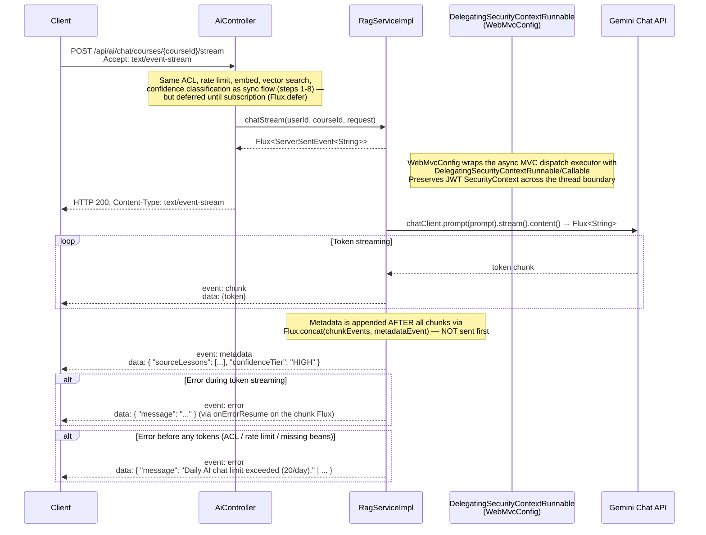

There is no `[DONE]` sentinel and no explicit `emitter.complete()` call in this implementation — the `Flux` simply completes when its underlying publisher completes, which is standard WebFlux behavior, not something the service code manages manually.

### 7.3 Confidence Tier Classification

Confidence is determined by the cosine distance of the **single closest (top-1) retrieved chunk**, not an average across the top-5 — the other four chunks retrieved in §7.1 step 4 are used as prompt context, but only the nearest one drives the tier decision. Cosine distance is in the range `[0, 2]` where `0` = identical vectors.

```
topDistance = chunks[0].distance   (chunks ordered by ascending distance; GAP if zero chunks retrieved)

┌─────────────────┬────────────────────┬───────────────────────────────────────┐
│ Tier            │ Condition          │ Behaviour                             │
├─────────────────┼────────────────────┼───────────────────────────────────────┤
│ HIGH            │ topDistance ≤ 0.30 │ Strong semantic match; answer is      │
│                 │                    │ grounded in course material            │
├─────────────────┼────────────────────┼───────────────────────────────────────┤
│ MEDIUM          │ 0.30 < dist ≤ 0.60 │ Partial match; answer may be relevant │
│                 │                    │ but user is warned                     │
├─────────────────┼────────────────────┼───────────────────────────────────────┤
│ GAP             │ topDistance > 0.60 │ No relevant content found; question   │
│                 │ or no chunks found │ logged to knowledge_gap_questions;     │
│                 │                    │ Gemini told to acknowledge the gap     │
└─────────────────┴────────────────────┴───────────────────────────────────────┘
```

Knowledge-gap logging happens identically in both the sync (`chat()`) and streaming (`chatStream()`) code paths whenever the tier resolves to `GAP` — the streaming path logs it before the metadata event is emitted.

### 7.4 Rate Limiting Detail

Rate limiting is enforced per user per day using a PostgreSQL UPSERT — atomic and race-condition-free. `RateLimitHelper.incrementAndGet()` runs in its own `@Transactional(propagation = REQUIRES_NEW)` transaction, so the increment commits immediately and survives even if the outer chat request later fails or rolls back — a user can't get a "free" retry by triggering a downstream error after the count was incremented.

```sql
-- RateLimitHelper.incrementAndGet(userId)
INSERT INTO ai.ai_rate_limits (user_id, limit_date, message_count, updated_at)
VALUES (?, CURRENT_DATE, 1, NOW())
ON CONFLICT (user_id, limit_date)
DO UPDATE SET message_count = ai_rate_limits.message_count + 1,
              updated_at = NOW()
RETURNING message_count;
```

| Setting | Value |
|---------|-------|
| Daily limit | 20 queries / user / day |
| Reset | Midnight (new `limit_date` row) |
| Enforcement | Pre-call; increments before Gemini call, in its own committed transaction |
| Error | `429 Too Many Requests` (sync) / `event: error` (stream) |

### 7.5 SSE Security Context Propagation

Spring async threads do not inherit the `SecurityContext` from the request thread by default. This causes `NullPointerException` when `RagServiceImpl` calls `SecurityContextHolder.getContext()` inside the SSE thread.

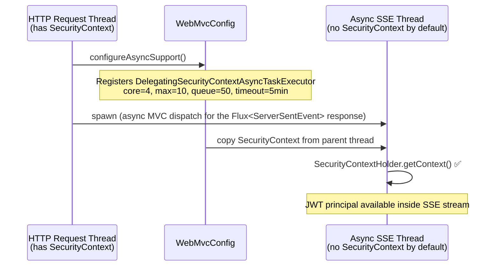

### 7.6 Frontend SSE Consumption (`apps/user`)

The RAG chat SSE stream is consumed by `chatStream()` in [`ai.service.ts`](../../frontend/apps/user/src/app/services/ai.service.ts) and rendered by [`AiChatPanel.tsx`](../../frontend/apps/user/src/app/components/learning/AiChatPanel.tsx). These are real, verified implementation details worth documenting since the streaming UX quality depends entirely on them:

- **Leading-whitespace-preserving token parsing**: `data:` lines are sliced with `.slice(5)` (cutting only the `"data:"` prefix), not the SSE-spec-typical `.slice(6)` which would also strip the single leading space — doing that would merge tokens like `" distinguishes"` into `"distinguishes"` when concatenated.
- **Multiline `data:` handling**: multiple `data:` lines within one event are accumulated and joined with `"\n"` before dispatch, per the SSE spec. A byte-buffer carries partial lines across `reader.read()` chunks so a split in the middle of a line is never lost.
- **Recognized event types**: `event: metadata` → parsed JSON `{ sourceLessons, confidenceTier }`; `event: error` → parsed JSON `{ message }`, surfaced as an `SseStreamError`; anything else with a `data:` line (including the backend's `event: chunk`) is treated as a raw token and passed to `onChunk`.
- **Typewriter buffering**: incoming tokens are appended to a ref (not React state) and drained into visible state by a single `setInterval` at **16ms (~60fps)**, revealing 3 characters per tick normally or up to 12/tick if the undisplayed backlog exceeds 80 characters — so a burst of tokens catches up instead of visibly lagging.
- **Sync fallback is narrowly scoped**: on a stream error, the client falls back to a one-shot non-streaming request **only if zero chunks were received before the error**. If any partial text had already streamed, it shows "Response may be incomplete. Please try again if needed." and stops — it does not retry or auto-resubmit.
- **No auto-resubmission of partial responses**: on `AbortError` (e.g. the user sends a new message or closes the panel mid-stream) or a post-partial-content error, whatever text had accumulated is committed as the final message and streaming stops. The user must manually resend to get a complete answer.
- **Completed-message memoization**: finished message bubbles are wrapped in `React.memo` so they don't re-render while a later message streams. The actively-streaming bubble is **deliberately excluded** from memoization — it re-renders every typewriter tick, but that's isolated to the one component, not the whole message list.
- **Partial Sentry instrumentation — a real gap, not full lifecycle coverage**: breadcrumbs are recorded on stream *start* and on a pre-stream `fetch()` network failure. There is **no** breadcrumb on a per-token basis, on a server-sent `event: error`, or on normal stream completion — anyone extending this instrumentation should not assume the full lifecycle is already covered.
- **Cancellation**: a single `AbortController` per chat panel is aborted before starting a new stream (so sending a new message cancels any in-flight one) and on panel close/unmount; its `signal` is forwarded into the underlying `fetch()` call.

---

## 8. Cross-Cutting Concerns

### 8.1 External provider data and privacy

AI features are optional at startup, but enabling and invoking them sends application data to external providers:

| Feature | Provider | Data submitted |
|---------|----------|----------------|
| RAG chat | Google Gemini | Current student question, recent question/answer history, matched lesson chunks, and a confidence hint |
| Summaries and quizzes | Google Gemini | Lesson title and lesson content, truncated by the prompt builder |
| Transcription | Groq | Extracted audio bytes, selected model, response format, and `en`/`vi` language code |

The application does not intentionally add profile fields such as name, email, or username to these requests. However, lesson content, questions, conversation history, and audio are free-form inputs and may themselves contain personal or confidential data. There is currently no automatic PII detection or redaction before submission. Deployments must account for provider retention, data-residency, access-control, and contractual requirements.

Internal numeric user IDs are used locally for authorization and rate-limit accounting; they are not added to provider prompts by the current implementation.

### 8.2 ACL Enforcement Matrix

| Feature | Endpoint | Instructor | Enrolled Student | Notes |
|---------|----------|:----------:|:----------------:|-------|
| Request transcription | `POST /transcribe/lessons/{id}` | ✅ | ❌ | Must own the lesson's course; TEACHER role |
| Generate quiz | `POST /quizzes/generate` | ✅ | ❌ | Must own the lesson's course |
| View all quizzes (with answers) | `GET /quizzes/lesson/{id}` | ✅ | ❌ | Full `correctIndex` + `explanation` |
| Take latest quiz | `GET /quizzes/lesson/{id}/take` | ❌ | ✅ | Answers stripped |
| Submit attempt | `POST /quizzes/attempts` | ❌ | ✅ | Returns answers after scoring |
| View my attempts | `GET /quizzes/lesson/{id}/my-attempts` | ❌ | ✅ | Own attempts only |
| Get lesson summary | `GET /summaries/lesson/{id}` | ✅ | ✅ | Either role |
| RAG chat (sync) | `POST /chat/courses/{id}` | ✅ | ✅ | Rate-limited |
| RAG chat (stream) | `POST /chat/courses/{id}/stream` | ✅ | ✅ | Rate-limited |
| Poll job status | `GET /jobs/{id}` | ✅ | — | Job owner only |
| Reindex embeddings | `POST /admin/reindex-embeddings` | — | — | Admin role |
| Reindex summaries | `POST /admin/reindex-summaries` | — | — | Admin role |

All ACL checks use cross-module API interfaces (`LessonQueryService`, `EnrollmentQueryService`, `CourseQueryService`) — no direct imports of other modules' repositories.

### 8.3 Thread Pool Configuration

```yaml
# application.yml — AI async executors
ai:
  executor:
    ai-core-pool-size: ${AI_CORE_POOL_SIZE:2}        # Base threads for Gemini jobs
    ai-max-pool-size: ${AI_MAX_POOL_SIZE:5}          # Max concurrent Gemini jobs
    ai-queue-capacity: ${AI_QUEUE_CAPACITY:50}       # Job queue depth before rejection
    whisper-queue-capacity: ${WHISPER_QUEUE_CAPACITY:10}  # Max queued transcription jobs
  groq:
    retry-delay-seconds: 60              # Seconds before retrying a DELAYED job

# whisperTaskExecutor — single thread, serialises Groq calls
# Configured in AsyncConfig: corePoolSize=1, maxPoolSize=1, queueCapacity=whisper-queue-capacity

# WebMvcConfig — SSE async executor
WebMvcConfig:
  core: 4
  max: 10
  queue: 50
  timeout: 300_000ms                     # 5 minutes max SSE connection
```

### 8.4 Gemini Configuration

```yaml
# application.yml
spring:
  ai:
    google:
      genai:
        api-key: ${GEMINI_API_KEY:}       # Optional at startup
        chat:
          model: gemini-2.5-flash-lite
          temperature: 0.3               # Low temperature for factual accuracy
          max-output-tokens: 4096
        embedding:
          model: gemini-embedding-001
          dimensions: 768
    retry:
      max-attempts: 1                    # No auto-retry; processors handle failures
```

### 8.5 Groq Configuration

```yaml
# application.yml
ai:
  groq:
    api-url: https://api.groq.com/openai/v1/audio/transcriptions
    api-key: ${GROQ_API_KEY:}            # Optional at startup
    model: whisper-large-v3-turbo
    language: en
    retry-delay-seconds: 60
  ytdlp:
    path: ${YTDLP_PATH:yt-dlp}           # Override with full path e.g. /usr/local/bin/yt-dlp
```

---

## 9. Database Schema

### `ai.lesson_embeddings`

```sql
CREATE TABLE ai.lesson_embeddings (
    id          BIGSERIAL PRIMARY KEY,
    lesson_id   BIGINT NOT NULL,
    course_id   BIGINT NOT NULL,
    chunk_index INT NOT NULL,
    chunk_text  TEXT NOT NULL,
    embedding   vector(768),
    created_at  TIMESTAMP DEFAULT now()
);

-- pgvector IVFFlat index for approximate nearest-neighbour search
CREATE INDEX ON ai.lesson_embeddings
    USING ivfflat (embedding vector_cosine_ops) WITH (lists = 100);
```

**Related column outside the `ai` schema**: `course.lessons.video_caption_url` (migration `V37__Add_video_caption_url_to_lessons.sql`) stores the WebVTT caption URL produced by transcription (§3.1.3). It lives in the `course` schema, not `ai`, because it's a lesson presentation attribute written via `LessonWriteService.updateCaptionUrl()`, not an AI-pipeline artifact.

### `ai.ai_rate_limits`

```sql
CREATE TABLE ai.ai_rate_limits (
    id            BIGSERIAL PRIMARY KEY,
    user_id       BIGINT    NOT NULL,
    limit_date    DATE      NOT NULL DEFAULT CURRENT_DATE,
    message_count INT       NOT NULL DEFAULT 0,
    created_at    TIMESTAMP NOT NULL DEFAULT NOW(),
    updated_at    TIMESTAMP NOT NULL DEFAULT NOW(),
    UNIQUE (user_id, limit_date)        -- Enforces one row per user per day
);
```

### `ai.ai_job_logs`

```sql
CREATE TABLE ai.ai_job_logs (
    id            BIGSERIAL PRIMARY KEY,
    job_type      VARCHAR(50),          -- EMBEDDING, LESSON_SUMMARY, QUIZ_GENERATION, TRANSCRIPTION
    status        VARCHAR(20),          -- PENDING, PROCESSING, COMPLETED, FAILED, DELAYED
    user_id       BIGINT,
    reference_id  BIGINT,              -- lessonId on create; updated to quizId on quiz completion
    error_message TEXT,
    started_at    TIMESTAMP,
    completed_at  TIMESTAMP,
    next_retry_at TIMESTAMP,           -- Set when status=DELAYED; TranscriptionRetryScheduler checks this
    metadata      TEXT,               -- Job-specific data: "<language>|<videoUrl>" for TRANSCRIPTION jobs (e.g. "vi|https://..."); legacy plain URL defaults to "en"
    created_at    TIMESTAMP,
    updated_at    TIMESTAMP
);
```

### `ai.knowledge_gap_questions`

```sql
CREATE TABLE ai.knowledge_gap_questions (
    id         BIGSERIAL PRIMARY KEY,
    course_id  BIGINT      NOT NULL,
    question   TEXT        NOT NULL,
    asked_at   TIMESTAMPTZ NOT NULL DEFAULT NOW()
);
```
No `user_id` or `confidence_score` column — the log is anonymous and only records that a `GAP`-tier question was asked in a given course (`RagServiceImpl` calls `KnowledgeGapQuestion.builder().courseId(courseId).question(question).build()`).

### `ai.lesson_summaries`

```sql
CREATE TABLE ai.lesson_summaries (
    id           BIGSERIAL PRIMARY KEY,
    lesson_id    BIGINT UNIQUE NOT NULL,   -- UNIQUE enables upsert idempotency
    summary_text TEXT,
    key_points   JSONB,                    -- String[]
    vocabulary   JSONB,                    -- [{term: String, definition: String}]
    updated_at   TIMESTAMP DEFAULT now()
);
```

### `ai.generated_quizzes`

```sql
CREATE TABLE ai.generated_quizzes (
    id                     BIGSERIAL PRIMARY KEY,
    lesson_id              BIGINT    NOT NULL,
    job_id                 BIGINT    NOT NULL REFERENCES ai.ai_job_logs(id),
    questions_json         JSONB     NOT NULL,             -- QuizQuestionDto[]
    source_lesson_ids_json TEXT,                           -- JSON array of source lesson IDs used for generation (added in V38); null = single-lesson (anchor only)
    created_at             TIMESTAMP NOT NULL DEFAULT NOW(),
    updated_at             TIMESTAMP NOT NULL DEFAULT NOW()
);
```
`id` and `job_id` are `BIGINT`/IDENTITY, not `UUID`.

### `ai.quiz_attempts`

```sql
CREATE TABLE ai.quiz_attempts (
    id           BIGSERIAL PRIMARY KEY,
    student_id   BIGINT    NOT NULL,
    lesson_id    BIGINT    NOT NULL,
    quiz_id      BIGINT    NOT NULL REFERENCES ai.generated_quizzes(id),
    score        INT       NOT NULL,
    total        INT       NOT NULL,
    answers_json JSONB     NOT NULL,                -- array of chosen answer indices
    completed_at TIMESTAMP NOT NULL DEFAULT NOW(),
    created_at   TIMESTAMP NOT NULL DEFAULT NOW()
);
```
`quiz_id` is a `BIGINT` FK, not `UUID`. There is no persisted `percentage` column — the percentage is computed on the fly from `score`/`total` in `AiQuizServiceImpl` and never stored.

---

## 10. API Reference

All endpoints are under `/api/ai/**` (proxied through API Gateway on port 8080).

### Job Management

| Method | Path | Auth | Response | Description |
|--------|------|------|----------|-------------|
| `GET` | `/ai/jobs/{id}` | Job owner | `AiJobResponse` | Poll async job status |

### Embeddings (Admin)

| Method | Path | Auth | Response | Description |
|--------|------|------|----------|-------------|
| `POST` | `/ai/admin/reindex-embeddings` | Admin | `202 Accepted` | Backfill embeddings for all lessons with article content |
| `POST` | `/ai/admin/reindex-summaries` | Admin | `202 Accepted` | Backfill summaries for all lessons with article content |

### Lesson Summaries

| Method | Path | Auth | Response | Description |
|--------|------|------|----------|-------------|
| `GET` | `/ai/summaries/lesson/{lessonId}` | Enrolled / Instructor | `LessonSummaryResponse` | Retrieve generated summary |

### Quiz Generation & Attempts

| Method | Path | Auth | Response | Description |
|--------|------|------|----------|-------------|
| `POST` | `/ai/quizzes/generate` | Instructor | `202 { jobId }` | Request quiz generation |
| `GET` | `/ai/quizzes/lesson/{lessonId}` | Instructor | `List<GeneratedQuizResponse>` | All quizzes with answers |
| `GET` | `/ai/quizzes/lesson/{lessonId}/take` | Student | `StudentQuiz` (no answers) | Latest quiz for student |
| `POST` | `/ai/quizzes/attempts` | Student | `QuizAttemptResponse` | Submit answers, get scored results |
| `GET` | `/ai/quizzes/lesson/{lessonId}/my-attempts` | Student | `List<QuizAttemptResponse>` | Student's attempt history |

### Auto-Transcription

| Method | Path | Auth | Response | Description |
|--------|------|------|----------|-------------|
| `POST` | `/ai/transcribe/lessons/{lessonId}` | Teacher (course owner) | `202 { jobId }` | Request transcription from a Cloudinary video URL (current production path, §3.1) or YouTube URL (Appendix A) |

Request body: `{ "videoUrl": "https://...", "language": "vi" | "en" }` — `language` is optional; defaults to `"en"` if omitted.

**Side effect**: on success, in addition to updating `articleContent`, this endpoint may also populate `lesson.video_caption_url` with a WebVTT caption (§3.1.3) — but only when the Groq/audio path is used; the YouTube auto-caption fast path never produces a caption URL.

### RAG Chat

| Method | Path | Auth | Response | Description |
|--------|------|------|----------|-------------|
| `POST` | `/ai/chat/courses/{courseId}` | Enrolled / Instructor | `ChatResponse` | Synchronous RAG Q&A |
| `POST` | `/ai/chat/courses/{courseId}/stream` | Enrolled / Instructor | `text/event-stream` | SSE streaming RAG Q&A |

---

## 11. Error Scenarios

### Job Processing Errors

| Error | Cause | Outcome |
|-------|-------|---------|
| Lesson content is blank | Lesson has no text content | Job → `FAILED("no content")` |
| Gemini API key missing | `GEMINI_API_KEY` not set | `AsyncEmbeddingProcessor` guards with null check; Job → `FAILED` |
| Gemini API error | Network or quota issue | Exception caught; Job → `FAILED(errorMessage)` |
| JSON parse failure | Gemini returns malformed JSON | `AiResponseParseException` thrown; Job → `FAILED` |
| Quiz count mismatch | Gemini returns fewer questions than requested | Validation throws; Job → `FAILED` |

### Transcription Errors

| Error | Cause | HTTP Status / Outcome |
|-------|-------|----------------------|
| Lesson not found | Invalid `lessonId` | `404 Not Found` (sync, before job created) |
| Not lesson owner | `userId != lesson.instructorId` | `403 Forbidden` (sync, before job created) |
| Unsupported URL type | URL is neither Cloudinary nor YouTube | Job → `FAILED("Unsupported URL type")` |
| Audio file > 25 MB | Cloudinary/yt-dlp audio exceeds Groq limit | `AudioFileTooLargeException`; Job → `FAILED` |
| Groq rate limit (429) | > 20 req/min to Groq API | `GroqRateLimitException`; Job → `DELAYED`, retried after 60s |
| Groq API key missing | `GROQ_API_KEY` not set | Groq `RestClient` sends no auth header; Job → `FAILED(401)` |
| yt-dlp not installed | Binary not found on PATH | `IOException("yt-dlp binary not found")`; Job → `FAILED` |
| yt-dlp timeout | Video download exceeds 10 minutes | `IOException("Command timed out")`; Job → `FAILED` |
| Scheduler queue full | `whisperTaskExecutor` queue at capacity | Job kept `DELAYED`, `nextRetryAt = now + 30s` |
| WebVTT upload to Cloudinary fails | Cloudinary raw-upload error while saving the caption | **Non-fatal** — caught and logged as a warning; `articleContent`/transcript save and job `COMPLETED` status are unaffected; `lesson.video_caption_url` simply stays unset |

### RAG Chat Errors

| Error | Cause | HTTP Status |
|-------|-------|-------------|
| User not enrolled and not instructor | ACL check fails | `403 Forbidden` |
| Daily rate limit exceeded | `message_count > 20` | `429 Too Many Requests` |
| Gemini embedding fails | API error on question embed | `500 Internal Server Error` |
| No embeddings for course | Lessons have never been indexed | GAP tier response (not an error) |

### Quiz Attempt Errors

| Error | Cause | HTTP Status |
|-------|-------|-------------|
| Quiz not found | Invalid `quizId` | `404 Not Found` |
| Quiz-lesson mismatch | `quizId` does not belong to `lessonId` | `400 Bad Request` |
| Student not enrolled | ACL check fails | `403 Forbidden` |

---

## 12. Key Implementation Details

### Idempotency

- **Embeddings**: `AsyncEmbeddingProcessor` calls `deleteByLessonId()` before re-inserting chunks. Re-triggering the same lesson is safe.
- **Summaries**: `LessonSummaryRepository.upsert()` uses `INSERT ... ON CONFLICT (lesson_id) DO UPDATE`. Re-triggering overwrites with the latest result.
- **Quizzes**: Each generation creates a new `GeneratedQuiz` row. Multiple generations accumulate; students always receive the most recent one.
- **Transcription**: Each call creates a new `AiJobLog`. Re-submitting the same lesson creates a new job but the end result is an `updateArticleContent` overwrite — safe to retry.

### Transcription Temp File Lifecycle

All transcription code paths write audio/subtitle files to the OS temp directory (`/tmp`) and **must** delete them in `finally` blocks to avoid disk leaks:

```
Cloudinary path:  cld_*.mp3           → deleted in WhisperTranscriptionServiceImpl finally
YouTube captions: ytdlp_sub_*.en.vtt  → deleted in YouTubeTranscriptExtractor finally
YouTube audio:    ytdlp_audio_*.mp3   → deleted in WhisperTranscriptionServiceImpl finally
```

The `Files.deleteIfExists(tempFile)` call is in `finally` so it runs even if the Groq call fails or throws `AudioFileTooLargeException`.

### Security Context in Async Threads

All async AI threads (SSE streaming via the `Flux<ServerSentEvent<String>>` response, §7.2) require access to the JWT `SecurityContext` to call cross-module services that check the current user. `WebMvcConfig` registers a `DelegatingSecurityContextAsyncTaskExecutor` that copies the parent thread's context into each spawned thread.

### Cross-Module API Contracts

The AI module never imports internal classes from the `course` module. It depends exclusively on interfaces in `course/api/`:

```
modules/course/api/
  ├── LessonQueryService       (getLessonInfo, findAllWithArticleContent)
  ├── LessonWriteService       (updateArticleContent, updateCaptionUrl) ← added for transcription
  ├── EnrollmentQueryService   (isStudentEnrolled, isStudentEnrolledExcludingDropped, isEnrolledAndActive, findEnrolledCourseIds, getEnrollmentInfo)
  └── CourseQueryService       (getCourseInfo, getCourseInfoBatch)
```
There is no `isInstructor`/`findCourse` method — instructor checks are done inline by callers via `courseQueryService.getCourseInfo(courseId).map(info -> info.instructorId().equals(userId))`, and similarly for `LessonQueryService.getLessonInfo(...).instructorId()`.

`LessonWriteService.updateArticleContent()` is the write-side contract. It saves the transcript, then publishes `LessonContentUpdatedEvent` (only if content changed), which drives the downstream embedding and summary pipelines. `updateCaptionUrl()` is a separate, narrower write path used only for the WebVTT caption URL (§3.1.3) — it does **not** publish `LessonContentUpdatedEvent`.

Implementations live in `course/api/impl/` — hidden behind the interface boundary.

### pgvector Cosine Similarity Query

```sql
-- LessonEmbeddingRepository.findTopK()
SELECT id, lesson_id, course_id, chunk_index, chunk_text,
       (embedding <=> CAST(:queryVector AS vector)) AS distance
FROM   ai.lesson_embeddings
WHERE  course_id = :courseId
ORDER  BY embedding <=> CAST(:queryVector AS vector)
LIMIT  :k
```

The `<=>` operator computes cosine distance (not similarity). A lower value = more similar. The ivfflat index with `lists=100` provides approximate nearest-neighbour search at scale.

---

## Appendix A — Historical Strategy: YouTube Extraction

> This path is fully implemented and still reachable through the same `POST /ai/transcribe/lessons/{id}` endpoint — `TranscriptionSourceResolver` still checks for `youtube.com`/`youtu.be` URLs and dispatches to it. It is documented here as an appendix, not the main flow, because it was superseded by the Cloudinary upload-first path (§3.2) after anti-bot blocking made it unreliable on the production VPS. It could be re-enabled without code changes if the deployment environment changes (residential IP, proxy, or a YouTube-approved API key).

### A.1 Source Resolution Strategy (Strategy Pattern)

`TranscriptionSourceResolver` detects the URL type and delegates to the appropriate `AudioExtractor` implementation — this is the same resolver used by the Cloudinary path in §3.1, shown here in full:

```
TranscriptionSourceResolver.resolve(url)
  │
  ├─ url.contains("res.cloudinary.com") ?
  │    └─→ CloudinaryAudioExtractor.extract(url)          [current production path, §3.1.1]
  │         └─→ TranscriptionInput.AudioFile(tempFile)
  │
  ├─ url.contains("youtube.com/watch") or "youtu.be/" ?
  │    └─→ YouTubeTranscriptExtractor.extract(url)
  │         ├─ [Phase A] yt-dlp --write-auto-sub --skip-download → .vtt file
  │         │    ├─ VTT found & non-empty → TranscriptionInput.DirectText(parsedText)
  │         │    └─ VTT empty / not found → fallback to Phase B
  │         └─ [Phase B] YtDlpAudioDownloader.download(url) → TranscriptionInput.AudioFile(mp3)
  │
  └─ else → BadRequestException("Unsupported URL type")
```

**`TranscriptionInput`** is a sealed interface with two permitted records:

| Variant | Type | Description |
|---------|------|-------------|
| `DirectText(String text)` | No Groq call | YouTube auto-captions extracted from `.vtt` — free, instant, **plain text only, no timestamps, no WebVTT caption generated** |
| `AudioFile(Path tempFile)` | Groq API call | Downloaded/extracted audio file requiring Whisper transcription — this is the only variant that can produce a WebVTT caption (§3.1.3) |

### A.2 YouTube Extraction Flow

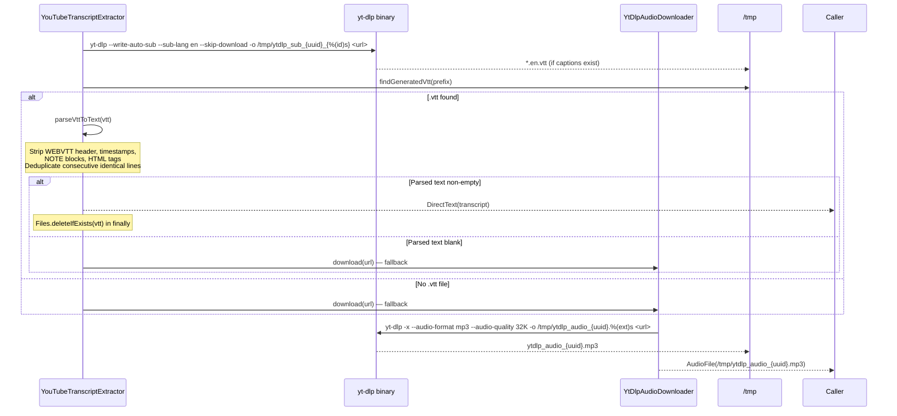

**Timeouts**:
- Caption download (Phase A): 5 minutes
- Audio download (Phase B): 10 minutes

Both `ProcessBuilder` invocations drain output on a virtual thread; a non-zero exit code or timeout throws `IOException`, and a missing `yt-dlp` binary produces a friendly "yt-dlp binary not found... brew install yt-dlp" message rather than a raw stack trace.

### A.3 Why This Is No Longer the Recommended Path

YouTube's anti-bot / IP-reputation protections block or throttle `yt-dlp` requests originating from common VPS/datacenter IP ranges. In production this manifests as `yt-dlp` silently returning no captions and no audio, or timing out — with no way to distinguish "video has no captions" from "YouTube blocked this request" from the job's `errorMessage` alone. The Cloudinary upload-first path (§3.1) has no equivalent failure mode since Cloudinary is the platform's own storage and transformation is done server-side by Cloudinary itself, not by scraping a third party.

---

**Last Updated**: 2026-08-09 — Corrected against actual implementation: documented WebVTT caption generation (§3.1.3, previously entirely undocumented); reordered Workflow 1 so the Cloudinary upload-first path leads and YouTube/yt-dlp moved to Appendix A; clarified that only `QUIZ_GENERATION`/`TRANSCRIPTION` return a client-pollable jobId while `EMBEDDING`/`LESSON_SUMMARY` are event-driven and internally tracked only; corrected the RAG SSE section to the real `Flux<ServerSentEvent<String>>` implementation (event types `chunk`/`metadata`/`error`, metadata sent after chunks, not before; removed unverified `SseEmitter`/`data: [DONE]` framing); corrected confidence-tier classification to use the top-1 chunk's distance, not an average of the top-5; added a Frontend SSE Consumption section (§7.6).
**Status**: Core functionality complete (Embedding, Summary, Quiz, RAG Chat, Auto-Transcription incl. WebVTT captions)
