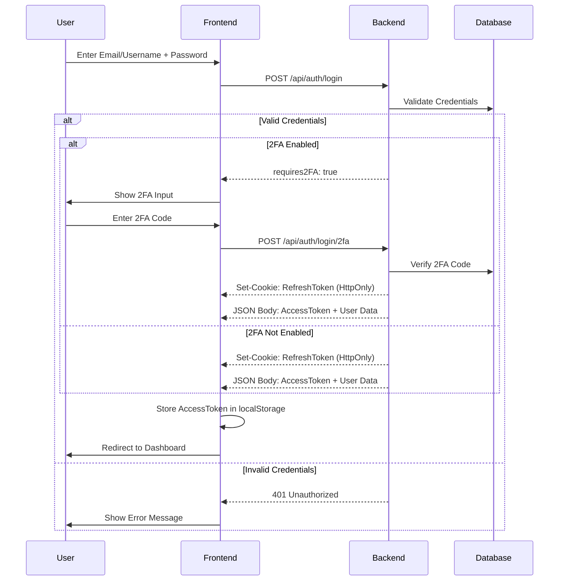
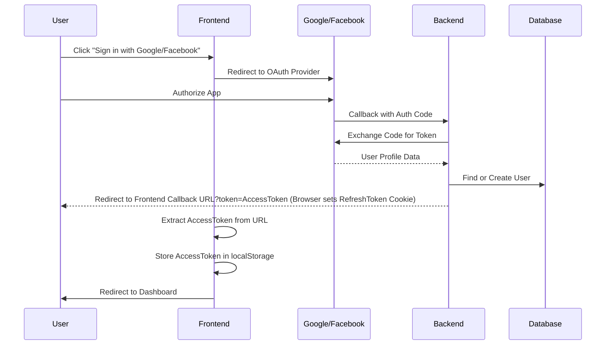
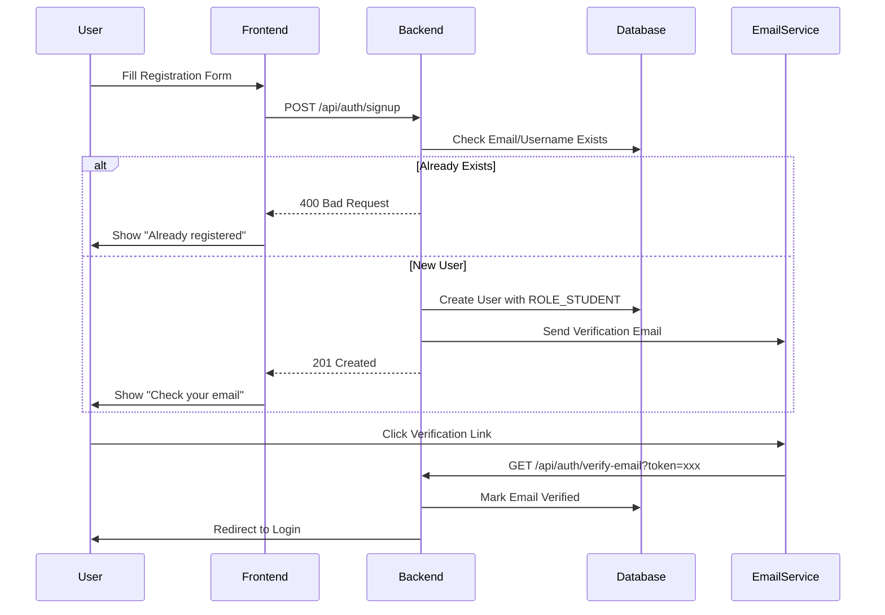
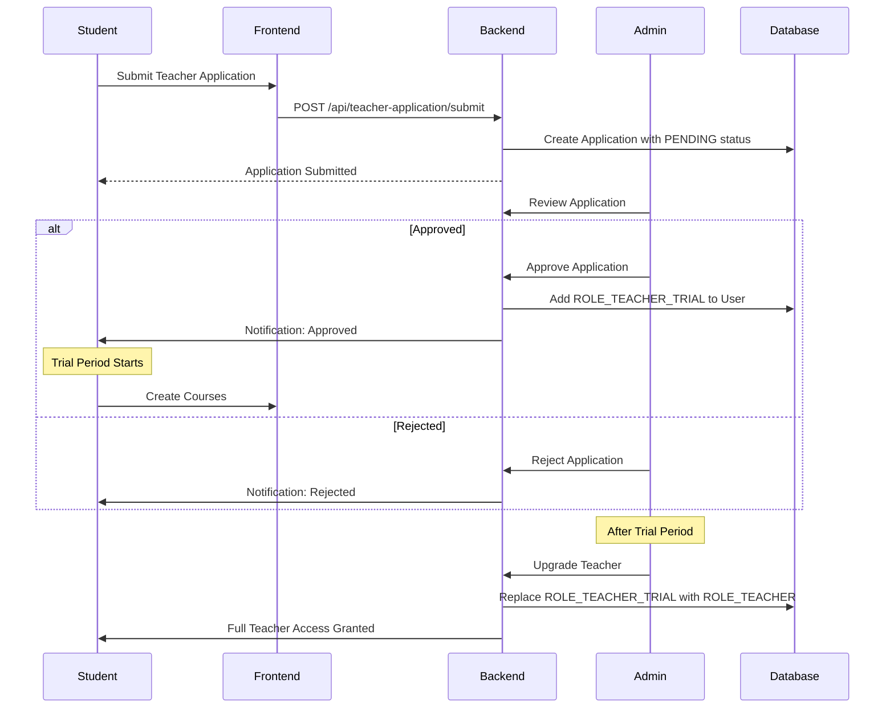
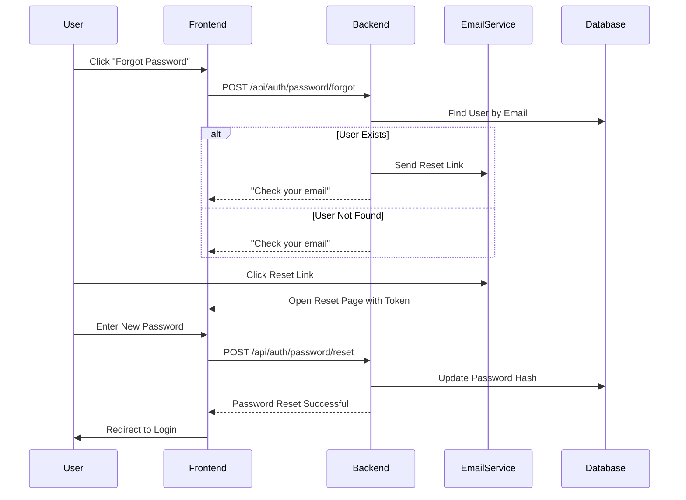

# Authentication Workflows

## System Roles

| Role | Description | Access Level |
|------|-------------|--------------|
| **GUEST** | Unauthenticated visitor | Browse courses, view public info |
| **STUDENT** | Registered learner | Enroll, purchase, take courses, review |
| **TEACHER_TRIAL** | Pending teacher application | Limited course creation, trial period |
| **TEACHER** | Verified instructor | Full course management, earnings, students |
| **ADMIN** | System administrator | Full system access, user management |

## 1. Standard Login Flow

## 2. OAuth2 Login Flow

## 3. User Registration Flow

## 4. Teacher Application Flow

## 5. Password Reset Flow

## 6. Role-Based Access Control

```mermaid
graph TD
    subgraph Public Access
        A[Browse Courses]
        B[View Course Details]
        C[View Teacher Profiles]
    end
    
    subgraph Student Access
        D[Enroll in Courses]
        E[Access Purchased Content]
        F[Write Reviews]
        G[Manage Cart/Wishlist]
    end
    
    subgraph Teacher Trial Access
        H[Create Courses - Limited]
        I[View Earnings - Limited]
    end
    
    subgraph Teacher Access
        J[Full Course Management]
        K[View All Earnings]
        L[Manage Students]
        M[Reply to Reviews]
    end
    
    subgraph Admin Access
        N[User Management]
        O[Review Applications]
        P[System Configuration]
        Q[Content Moderation]
    end
    
    GUEST --> A
    GUEST --> B
    GUEST --> C
    
    STUDENT --> D
    STUDENT --> E
    STUDENT --> F
    STUDENT --> G
    
    TEACHER_TRIAL --> H
    TEACHER_TRIAL --> I
    
    TEACHER --> J
    TEACHER --> K
    TEACHER --> L
    TEACHER --> M
    
    ADMIN --> N
    ADMIN --> O
    ADMIN --> P
    ADMIN --> Q
```

