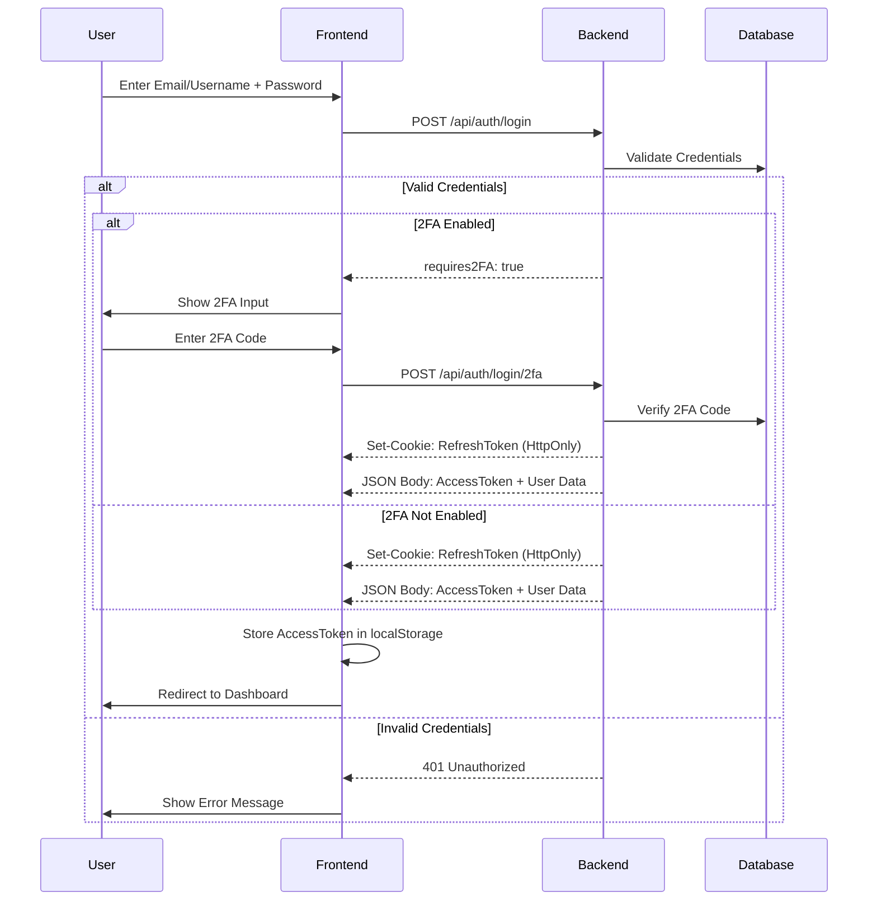
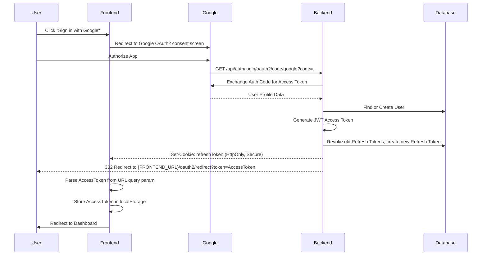
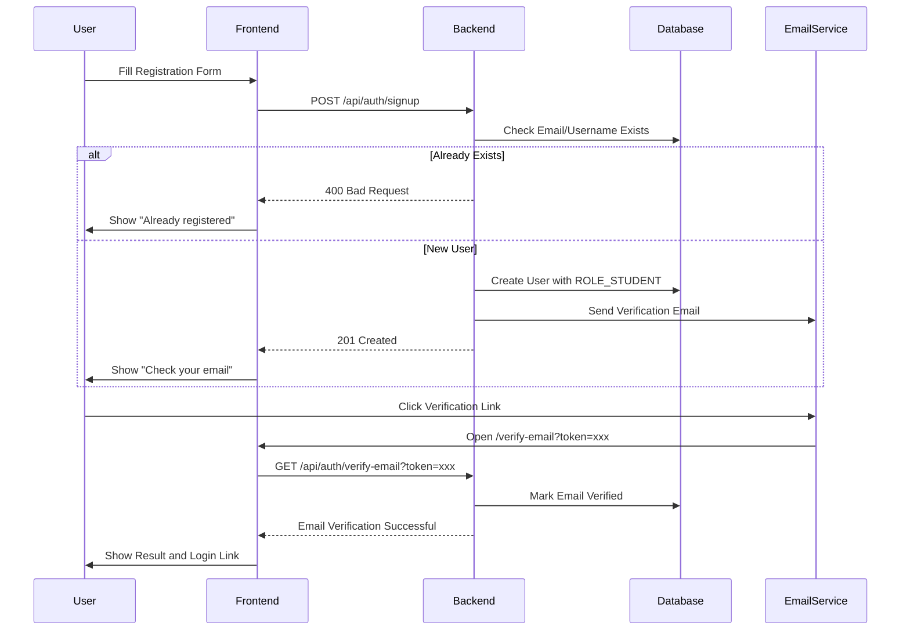
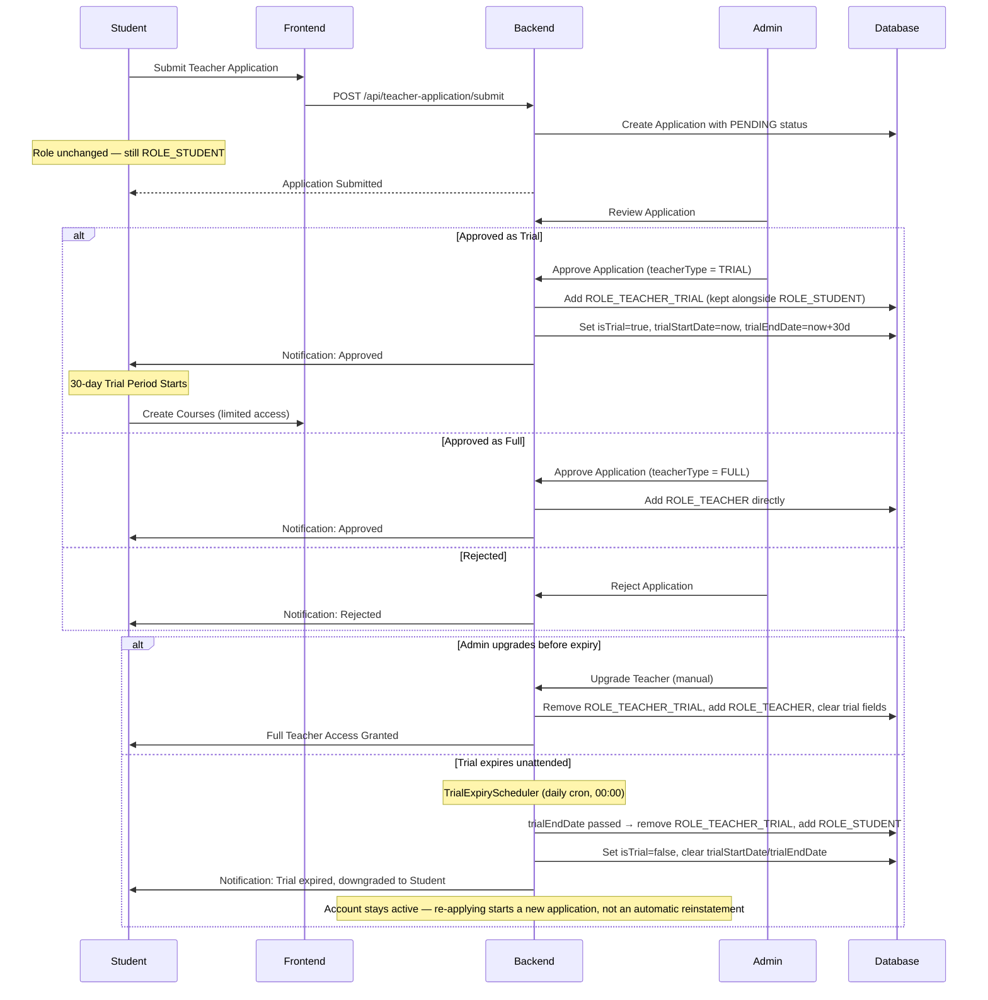
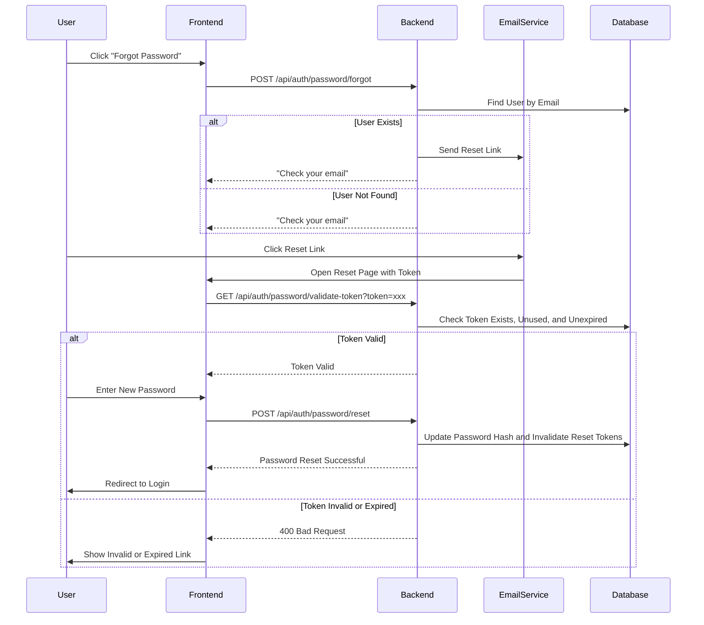
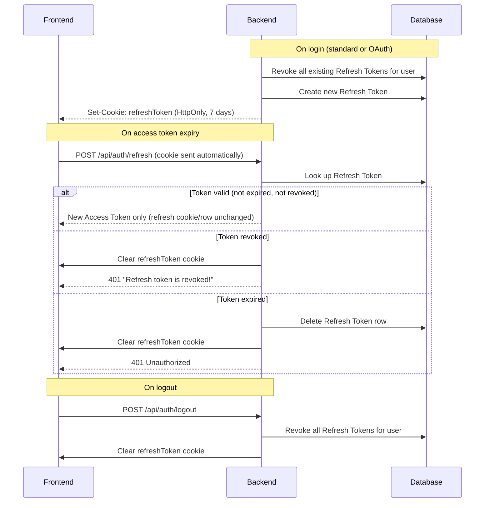
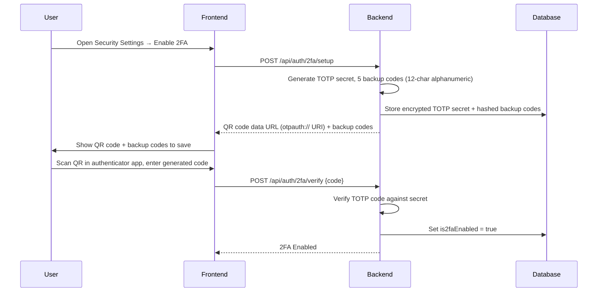
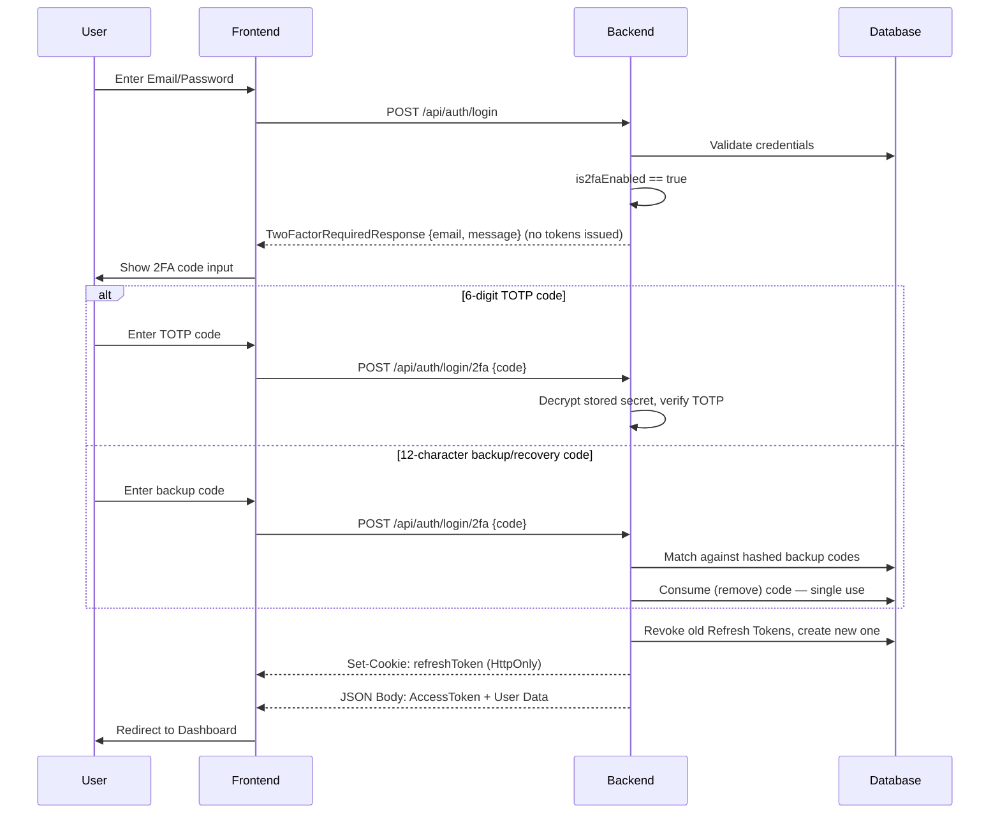
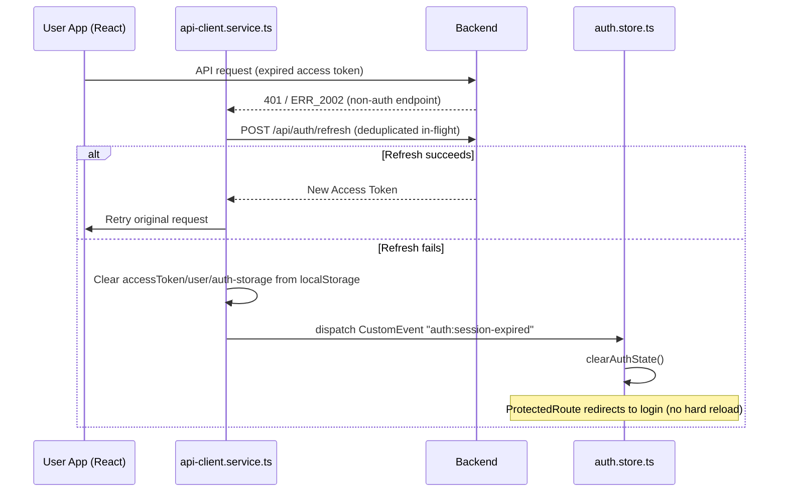

# Authentication Workflows

## System Roles

| Role | Description | Access Level |
|------|-------------|--------------|
| **Anonymous** | Unauthenticated visitor (no account, no session) | Browse courses, view public info |
| **STUDENT** | Registered learner | Enroll, purchase, take courses, review |
| **TEACHER_TRIAL** | Approved instructor in a time-limited evaluation period (30 days) | Limited course creation, trial period |
| **TEACHER** | Verified instructor | Full course management, earnings, students |
| **ADMIN** | System administrator | Full system access, user management |

> "Anonymous" above is a conceptual state, not a system role — it has no row in `roles` and is never assigned to a user. The `ROLE_GUEST` role that used to exist in the database was removed: no registration/login flow ever assigned it (`AuthService` always assigns `ROLE_STUDENT` to new accounts), so it was dead weight rather than a real "authenticated guest" tier.

> While a teacher application is `PENDING`, the applicant keeps their existing role (`STUDENT`) — `TEACHER_TRIAL` is only granted after admin approval, and is added on top of `STUDENT` rather than replacing it. If the trial period expires without a manual admin upgrade, `TrialExpiryScheduler` automatically downgrades the account back to `STUDENT` (the account stays active) rather than auto-upgrading it to `TEACHER` — see [Teacher Application Flow](#4-teacher-application-flow).

## 1. Standard Login Flow

## 2. OAuth2 Login Flow

> **Google only.** `Facebook` appears in the `AuthProvider` enum and the DB `provider` check constraint, but it is not a live feature: the frontend's Facebook button is commented out, and `OAuth2UserInfoFactory` only handles `registrationId == "google"` (throws `BadRequestException` for any other provider). No `application.yml` OAuth2 client registration exists for Facebook.

Only the access token ever appears in the URL (`OAuth2AuthenticationSuccessHandler.determineTargetUrl`); the refresh token is always delivered via an `HttpOnly` cookie (`Path=/`, `Max-Age=604800` — 7 days), never on the URL or in a JSON body.

## 3. User Registration Flow

## 4. Teacher Application Flow

> **Trial reminder**: 7 days before `trialEndDate`, `TrialExpiryScheduler` sends a reminder email only — no role or account-status change at that point.

## 5. Password Reset Flow

## 6. Refresh Token Flow

Refresh tokens are stored in the `refresh_tokens` table (JPA entity `RefreshToken`) — there is no Redis involvement. The mechanism is **revoke-on-new-login**, not rotation-on-every-refresh, and there is **no reuse-detection** (a used/revoked token presented again is simply rejected — it does not trigger revocation of the user's other sessions).

## 7. Two-Factor Authentication — Setup

Backup codes are hashed with the same password encoder used for user passwords before being persisted — plaintext codes are shown to the user only once, at generation time. `POST /api/auth/2fa/backup-codes` regenerates the set and requires re-entering the account password.

## 8. Two-Factor Authentication — Login & Recovery Codes

## 9. Session Expiration Propagation (Frontend)

The Angular admin app follows an equivalent pattern via `auth.interceptor.ts`: a 401 triggers `authService.refreshToken()`, and on failure `forceLogout()` clears auth state and explicitly navigates to the login route (`router.navigate`).

## 10. Role-Based Access Control

```mermaid
graph TD
    subgraph Public Access
        A[Browse Courses]
        B[View Course Details]
        C[View Teacher Profiles]
    end
    
    subgraph Student Access
        D[Enroll in Courses]
        E[Access Purchased Content]
        F[Write Reviews]
        G[Manage Cart/Wishlist]
    end
    
    subgraph Teacher Trial Access
        H[Create Courses - Limited]
        I[View Earnings - Limited]
    end
    
    subgraph Teacher Access
        J[Full Course Management]
        K[View All Earnings]
        L[Manage Students]
        M[Reply to Reviews]
    end
    
    subgraph Admin Access
        N[User Management]
        O[Review Applications]
        P[System Configuration]
        Q[Content Moderation]
    end
    
    Anonymous --> A
    Anonymous --> B
    Anonymous --> C
    
    STUDENT --> D
    STUDENT --> E
    STUDENT --> F
    STUDENT --> G
    
    TEACHER_TRIAL --> H
    TEACHER_TRIAL --> I
    
    TEACHER --> J
    TEACHER --> K
    TEACHER --> L
    TEACHER --> M
    
    ADMIN --> N
    ADMIN --> O
    ADMIN --> P
    ADMIN --> Q
```

