# Payment Workflows

This document describes the payment flows implemented in the EduMind LMS system. The system supports two production payment gateways:

- **PayPal** - International payments (USD, EUR, GBP, etc.)
- **SePay** - Vietnam QR Bank Transfer (VND only)

---

## 1. Successful Checkout Flow (PayPal)

PayPal uses a **two-phase flow**: Order creation → User approval on PayPal → Capture via API.

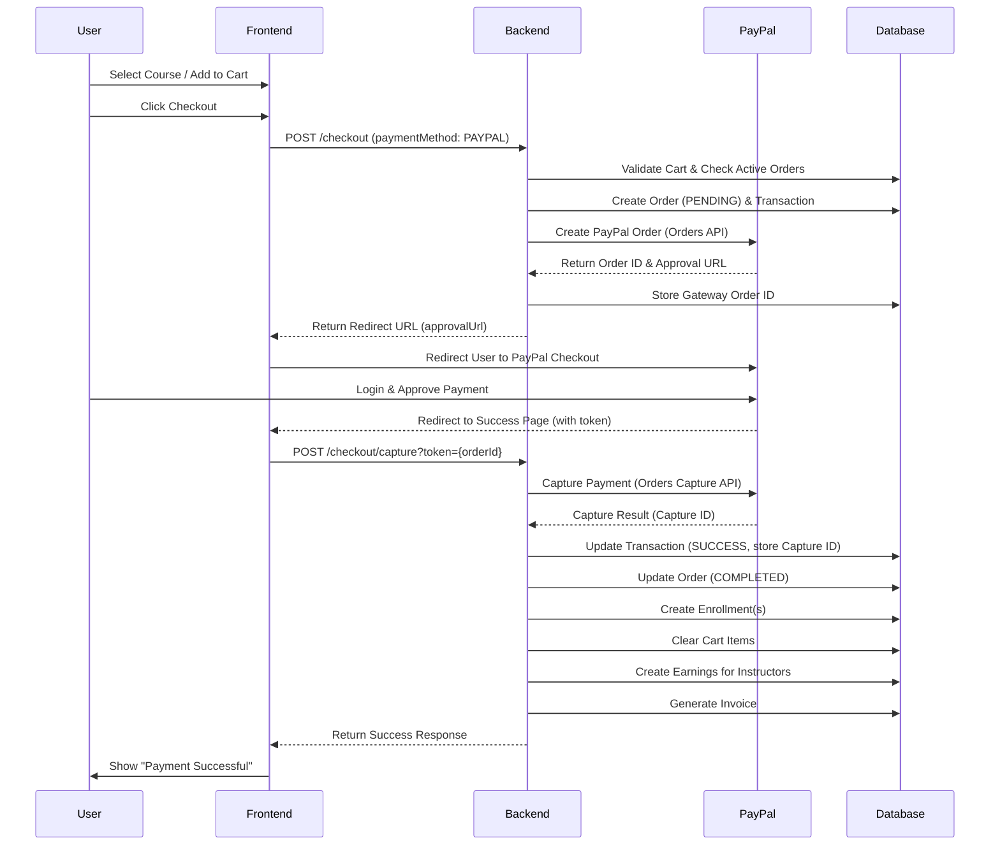

### PayPal Webhook (Backup Confirmation)

PayPal also sends webhooks for payment events. This serves as a **backup** to ensure payment completion even if the capture endpoint has issues.

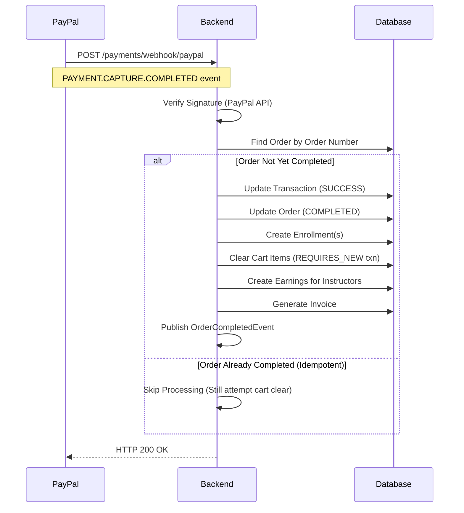

---

## 2. Successful Checkout Flow (SePay - QR Bank Transfer)

SePay uses a **webhook-driven flow** with **automatic USD→VND conversion**: Generate QR → User transfers via banking app → SePay detects transfer → Webhook confirms payment.

> [!IMPORTANT]
> **Currency Conversion**: Course prices are stored in **USD**, but Vietnamese bank transfers require **VND**. The backend automatically converts using a configured exchange rate (`payment.sepay.usd-to-vnd-rate`).

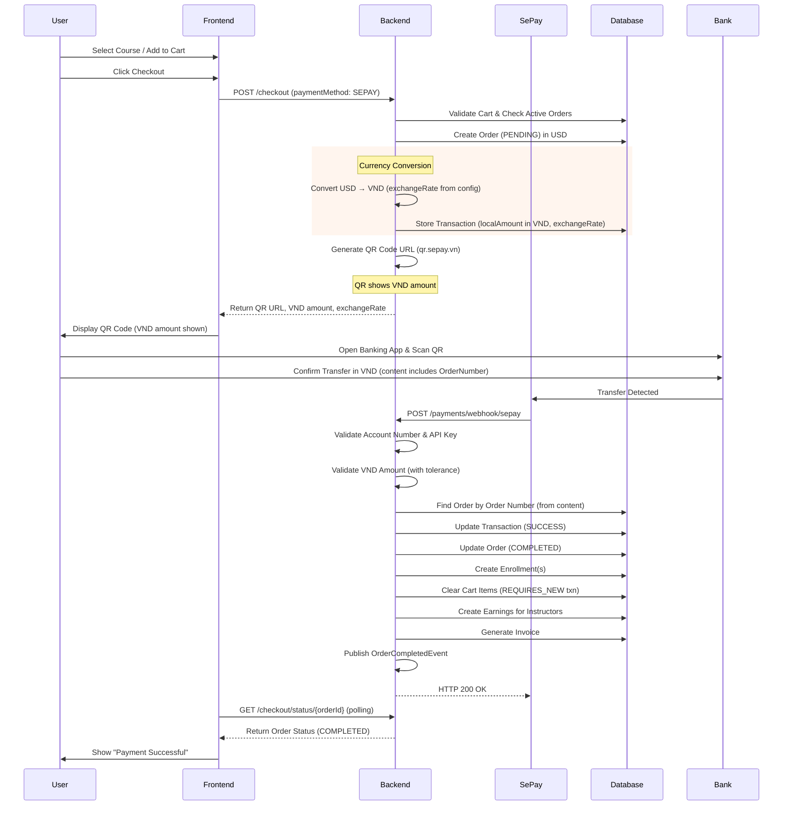

### SePay Currency Conversion Details

| Field | Source | Example |
|-------|--------|---------|
| `order.totalAmount` | Course price in USD | $19.99 |
| `transaction.exchangeRate` | Config: `payment.sepay.usd-to-vnd-rate` | 25,450 |
| `transaction.localAmount` | Calculated: amount × rate | 508,755 VND |
| `transaction.localCurrency` | Always "VND" for SePay | VND |

**Amount Validation (Webhook):**
- VND is rounded to whole numbers (no decimals)
- Tolerance: `maxAmountVarianceVnd` (configurable, for bank fees)
- **Underpayment** beyond tolerance → **REJECTED** (user retries with correct amount)
- **Overpayment** → Accepted with warning log

---

## 3. Direct Checkout Flow (Buy Now)

Users can bypass the cart and purchase a single course directly.

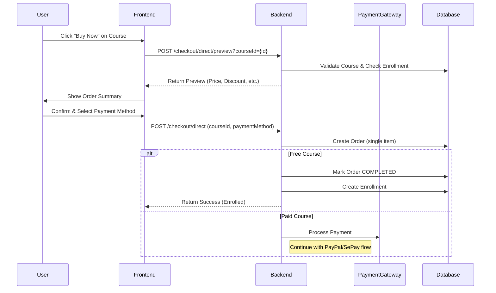

---

## 4. Free Order Flow

When total amount is zero (free courses or 100% discount).

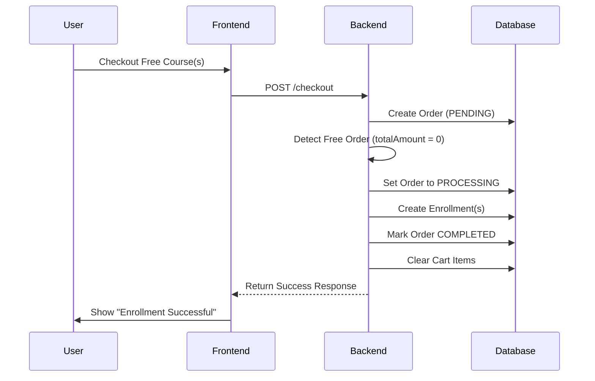

---

## 5. Failed Checkout Flow

Handles payment failures from various sources.

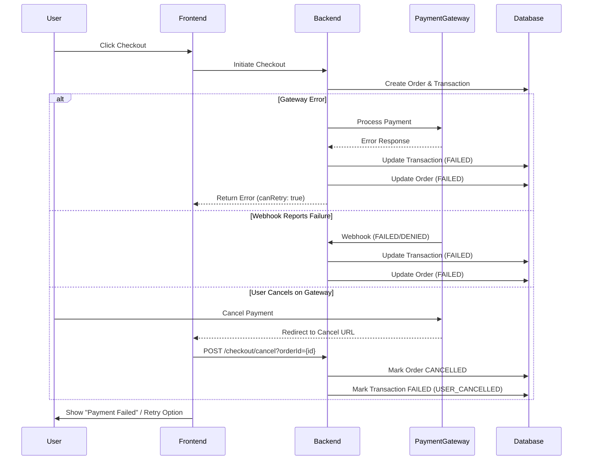

---

## 6. Payment Retry Flow

Users can retry failed payments (max 3 attempts).

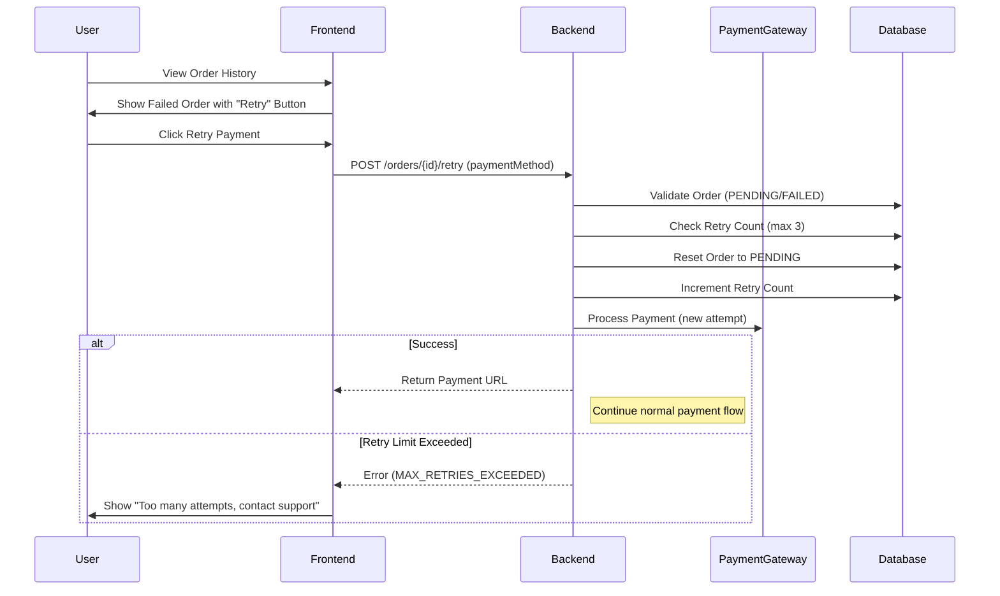

---

## 7. Order Expiration Flow

Orders expire if payment is not completed within the time limit.

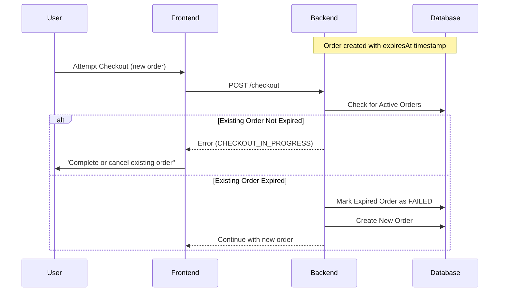

---

## 8. Order Cancellation Flow (User)

Users can cancel pending orders to start fresh.

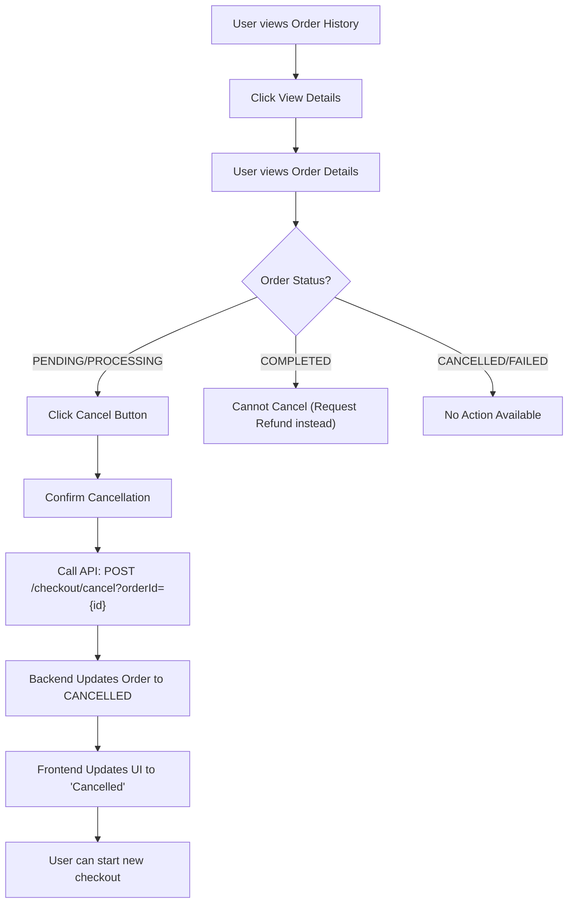

---

## 9. Order Refund Flow

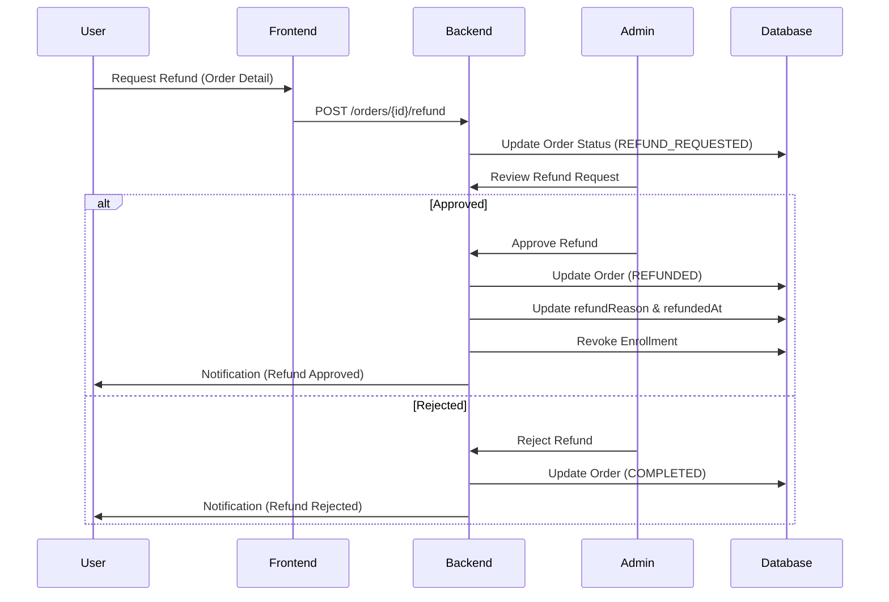

---

## 10. Webhook Security & Verification

### PayPal Webhook Verification

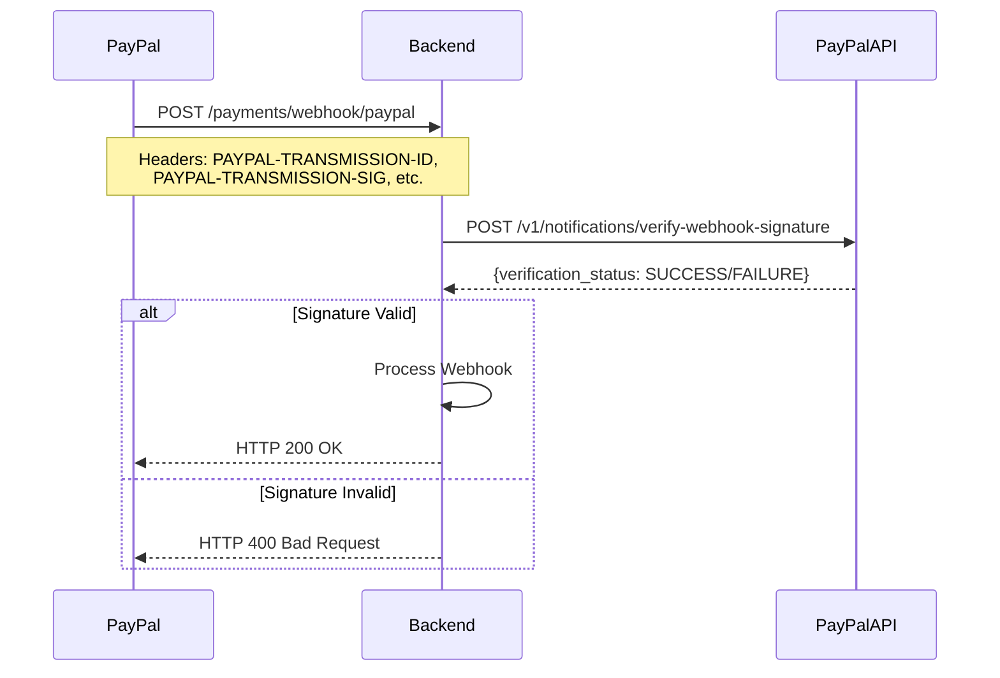

### SePay Webhook Verification

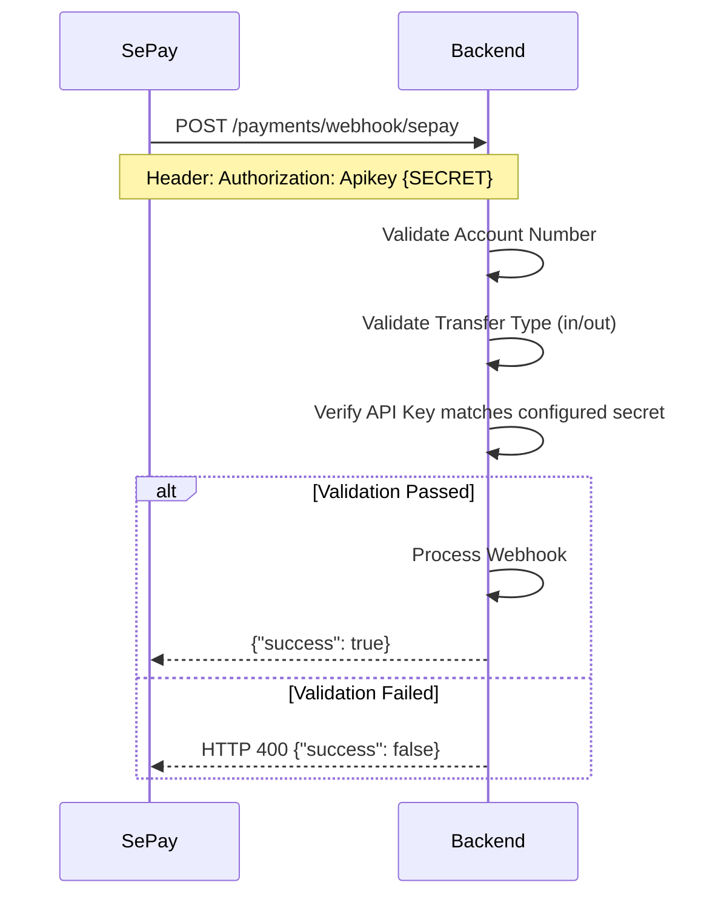

---

## API Endpoints Summary

| Endpoint | Method | Description |
|----------|--------|-------------|
| `/checkout/preview` | POST | Preview cart checkout |
| `/checkout` | POST | Process cart checkout |
| `/checkout/direct/preview` | POST | Preview single course checkout |
| `/checkout/direct` | POST | Process single course checkout |
| `/checkout/capture` | POST | Capture PayPal payment |
| `/checkout/cancel` | POST | Cancel pending order |
| `/checkout/status/{orderId}` | GET | Poll for payment status (SePay) |
| `/payments/webhook/paypal` | POST | PayPal webhook endpoint |
| `/payments/webhook/sepay` | POST | SePay webhook endpoint |
| `/payments/webhook/health` | GET | Webhook health check |

---

## Order Status State Machine

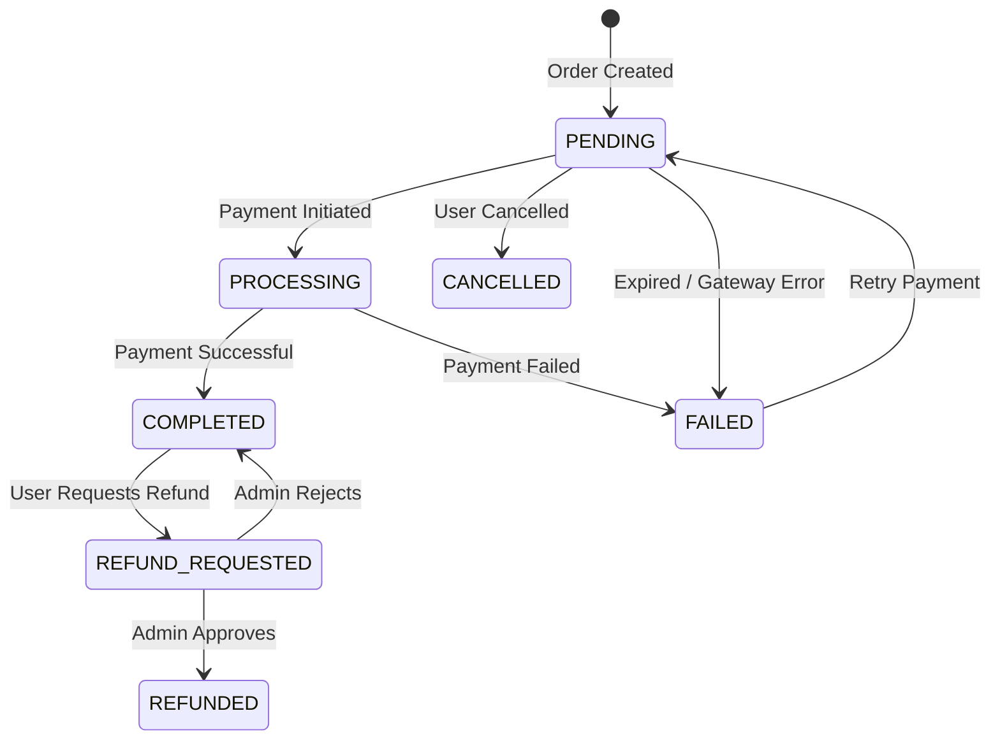

---

## Key Implementation Details

### Race Condition Handling

**PayPal only** uses pessimistic locking to prevent race conditions:

| Gateway | Race Condition? | Why |
|---------|-----------------|-----|
| **PayPal** | ✅ Yes | Capture endpoint (`/checkout/capture`) and webhook (`/webhook/paypal`) can fire simultaneously after user approval |
| **SePay** | ❌ No | Only webhook completes the order - no parallel capture endpoint exists |

**PayPal solution:** `TransactionRepository.findByGatewayIdForUpdate()` with `@Lock(PESSIMISTIC_WRITE)` ensures only one thread processes the capture.

- Idempotency checks prevent duplicate processing of completed orders

### Cart Clearing Transaction Strategy
Cart clearing uses different strategies depending on the flow:

| Flow | Strategy | Why |
|------|----------|-----|
| **Webhook** (PayPal/SePay) | `REQUIRES_NEW` transaction | Ensures cart is cleared even if invoice/event fails and causes rollback |
| **Checkout** (UI Capture) | Outside main transaction | Order commit happens first via `TransactionTemplate`, then cart clear runs in separate call |

This design ensures **cart is always cleared** regardless of downstream failures (invoice generation, event publishing).

### Cart Signature Validation
- Optional cart signature comparison detects cart changes between preview and checkout
- Returns `CART_CHANGED` error if prices or items have changed

### Active Order Prevention
- Only one active (PENDING/PROCESSING) order per user is allowed
- New checkout attempts check for existing orders and either:
  - Return the existing order if still valid
  - Mark as FAILED if expired, allowing new checkout

### Payment Method Policies
- **All course prices are stored in USD**
- Each payment method defines supported currencies and conversion behavior:
  - **PayPal**: USD, EUR, GBP, etc. (international currencies)
  - **SePay**: Accepts USD (converts to VND at checkout using configured exchange rate)

