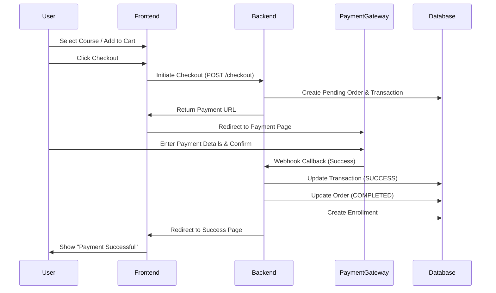
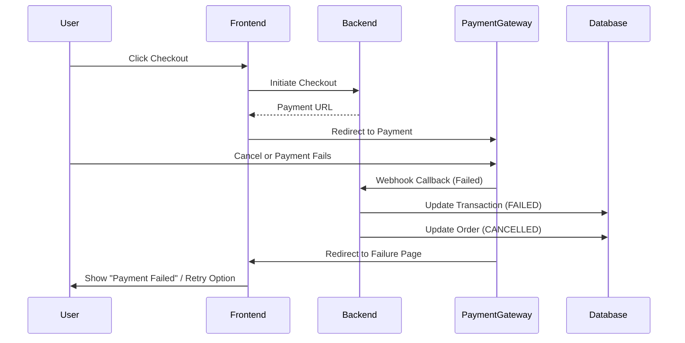
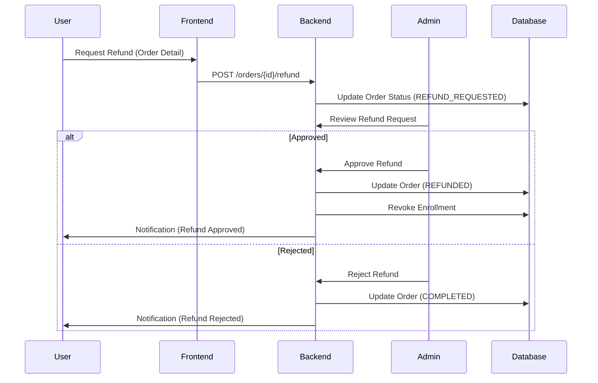
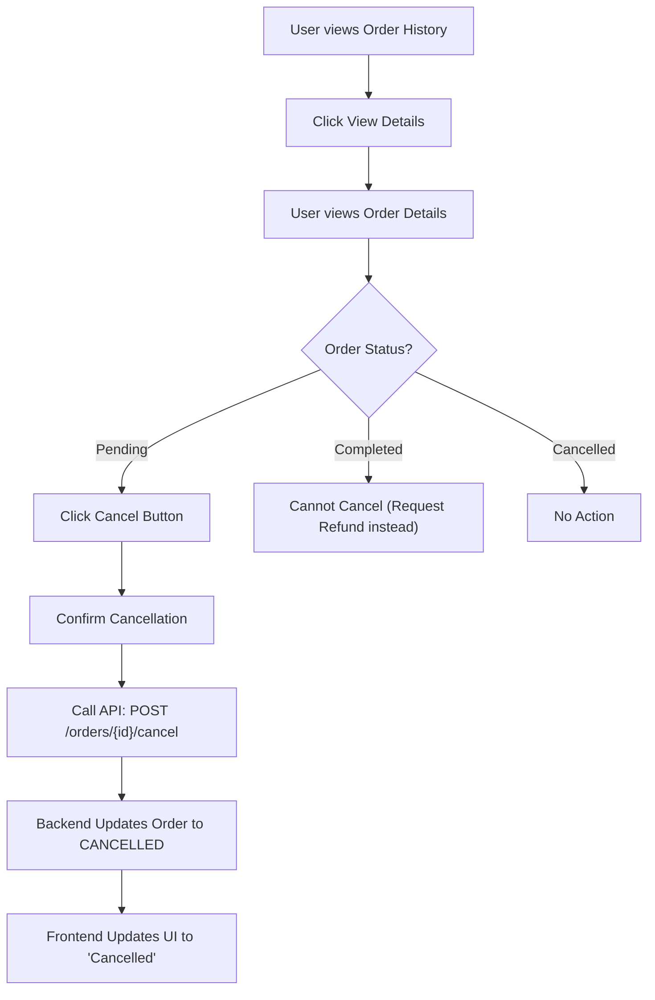

# Payment Workflows

## 1. Successful Checkout Flow

```mermaid
sequenceDiagram
    participant User
    participant Frontend
    participant Backend
    participant PaymentGateway
    participant Database

    User->>Frontend: Select Course / Add to Cart
    User->>Frontend: Click Checkout
    Frontend->>Backend: Initiate Checkout (POST /checkout)
    Backend->>Database: Create Pending Order & Transaction
    Backend->>Frontend: Return Payment URL
    Frontend->>PaymentGateway: Redirect to Payment Page
    User->>PaymentGateway: Enter Payment Details & Confirm
    PaymentGateway->>Backend: Webhook Callback (Success)
    Backend->>Database: Update Transaction (SUCCESS)
    Backend->>Database: Update Order (COMPLETED)
    Backend->>Database: Create Enrollment
    Backend->>Frontend: Redirect to Success Page
    Frontend->>User: Show "Payment Successful"
```

## 2. Failed Checkout Flow

```mermaid
sequenceDiagram
    participant User
    participant Frontend
    participant Backend
    participant PaymentGateway

    User->>Frontend: Click Checkout
    Frontend->>Backend: Initiate Checkout
    Backend-->>Frontend: Payment URL
    Frontend->>PaymentGateway: Redirect to Payment
    User->>PaymentGateway: Cancel or Payment Fails
    PaymentGateway->>Backend: Webhook Callback (Failed)
    Backend->>Database: Update Transaction (FAILED)
    Backend->>Database: Update Order (CANCELLED)
    PaymentGateway->>Frontend: Redirect to Failure Page
    Frontend->>User: Show "Payment Failed" / Retry Option
```

## 3. Order Refund Flow

```mermaid
sequenceDiagram
    participant User
    participant Frontend
    participant Backend
    participant Admin

    User->>Frontend: Request Refund (Order Detail)
    Frontend->>Backend: POST /orders/{id}/refund
    Backend->>Database: Update Order Status (REFUND_REQUESTED)
    Admin->>Backend: Review Refund Request
    alt Approved
        Admin->>Backend: Approve Refund
        Backend->>Database: Update Order (REFUNDED)
        Backend->>Database: Revoke Enrollment
        Backend->>User: Notification (Refund Approved)
    else Rejected
        Admin->>Backend: Reject Refund
        Backend->>Database: Update Order (COMPLETED)
        Backend->>User: Notification (Refund Rejected)
    end
```

## 4. Order Cancellation Flow (User)

```mermaid
graph TD
    A[User views Order History] --> A2[Click View Details]
    A2 --> A3[User views Order Details]
    A3 --> B{Order Status?}
    B -- Pending --> C[Click Cancel Button]
    C --> D[Confirm Cancellation]
    D --> E["Call API: POST /orders/{id}/cancel"]
    E --> F[Backend Updates Order to CANCELLED]
    F --> G["Frontend Updates UI to 'Cancelled'"]
    B -- Completed --> H["Cannot Cancel (Request Refund instead)"]
    B -- Cancelled --> I[No Action]
```

