# Payout Workflows

This document describes the payout flows implemented in the EduMind LMS system. The payout system manages instructor earnings, automated monthly payouts, and gateway integration.

---

## 1. Earnings Lifecycle Flow

Earnings progress through a lifecycle from creation to payout.

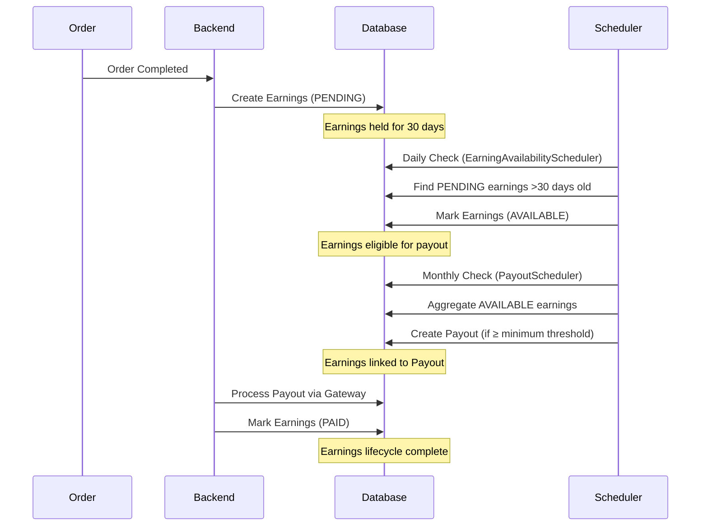

**Earnings Status Flow:**
- **PENDING**: Created when order completes, held for 30 days
- **AVAILABLE**: After hold period, eligible for payout
- **PAID**: After successful payout processing

---

## 2. Earning Availability Scheduler Flow

The scheduler runs daily to mark earnings as AVAILABLE after the hold period.

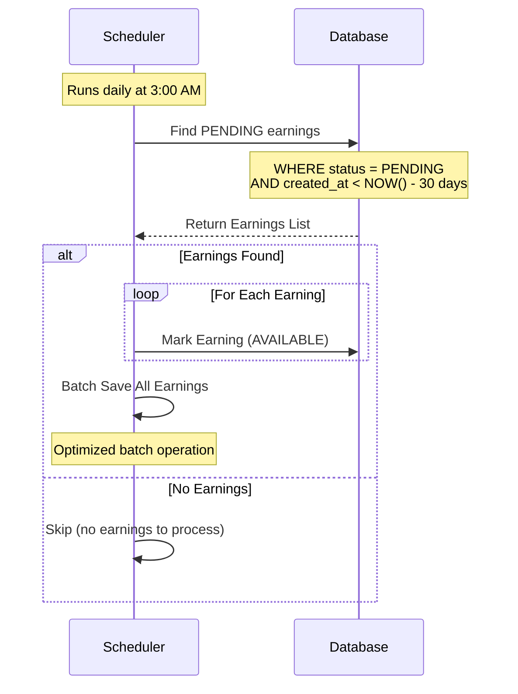

**Scheduler Configuration:**
- **Cron**: `0 0 3 * * ?` (3:00 AM daily)
- **Hold Period**: 30 days (configurable via `payment.payout.hold-period-days`)
- **Optimization**: Uses repository query with date filter, batch save

---

## 3. Monthly Payout Scheduler Flow

The scheduler runs monthly to automatically create payouts for instructors with available earnings.

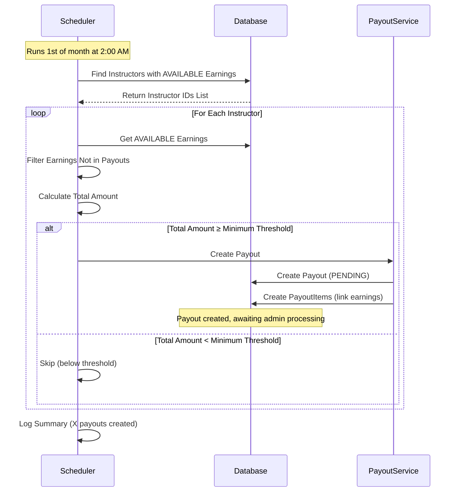

**Scheduler Configuration:**
- **Cron**: `0 0 2 1 * ?` (2:00 AM on 1st of month)
- **Minimum Threshold**: $50 (configurable via `payment.payout.minimum-amount`)
- **Default Payment Method**: BANK_TRANSFER (admin can update)

---

## 4. Manual Payout Creation Flow (Admin)

Admins can manually create payouts for specific instructors.

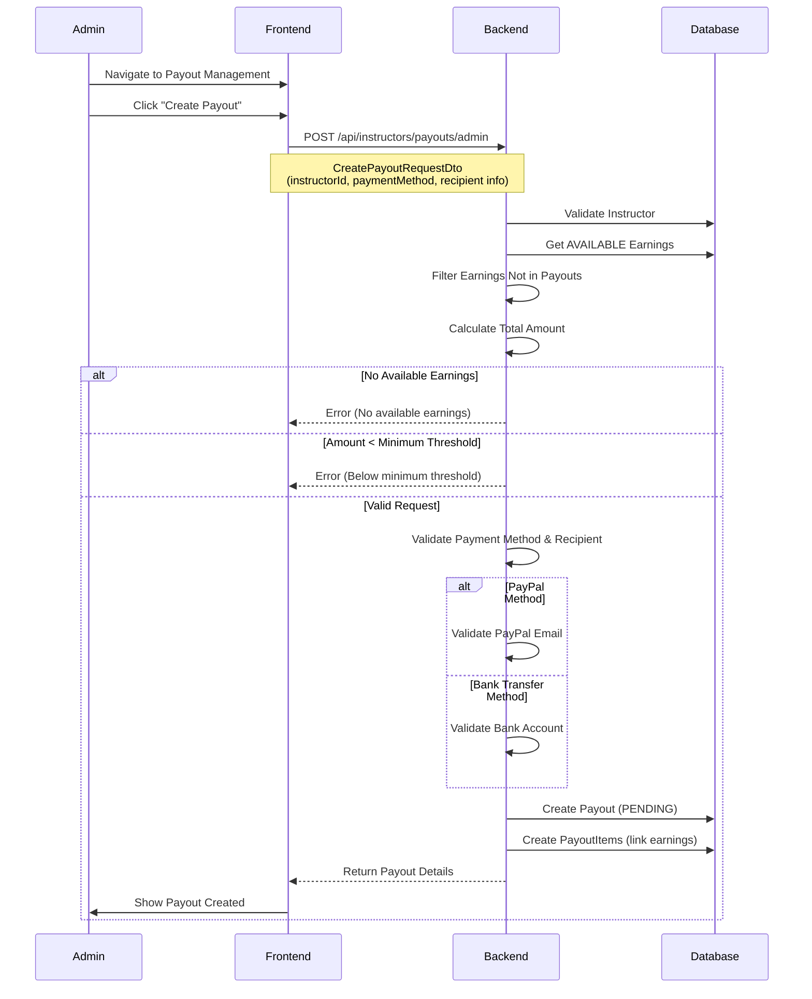

**Manual Payout Options:**
- **All Available Earnings**: Aggregate all AVAILABLE earnings for instructor
- **Specific Earnings**: Select specific earnings by ID (via `earningIds` in request)

---

## 5. Payout Processing Flow

Admins process payouts through payment gateways.

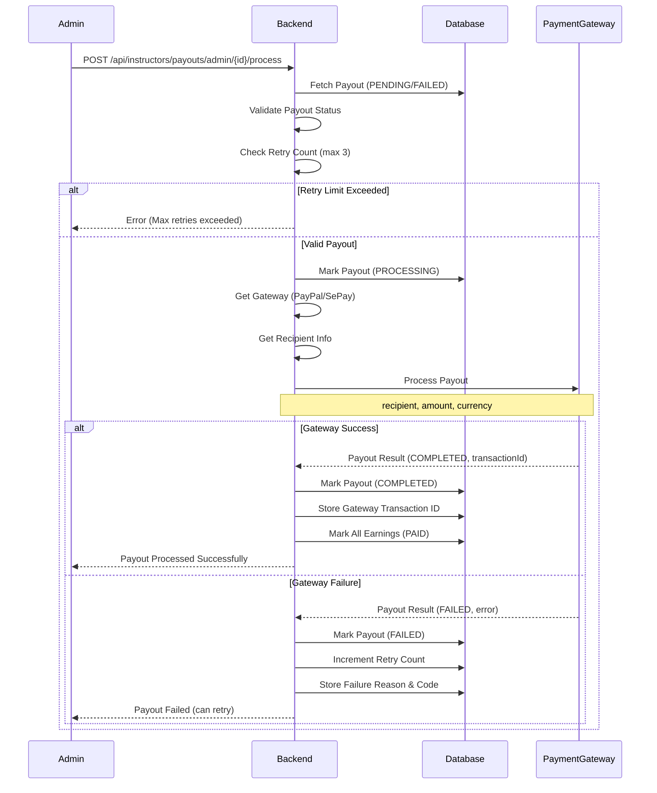

**Retry Mechanism:**
- **Max Retries**: 3 (configurable via `payment.payout.max-retries`)
- **Retry Count**: Tracked in `Payout.retryCount`
- **Status Reset**: FAILED payouts can be updated and reprocessed

---

## 6. Payout Recipient Update Flow

Admins can update payout recipient information before processing.

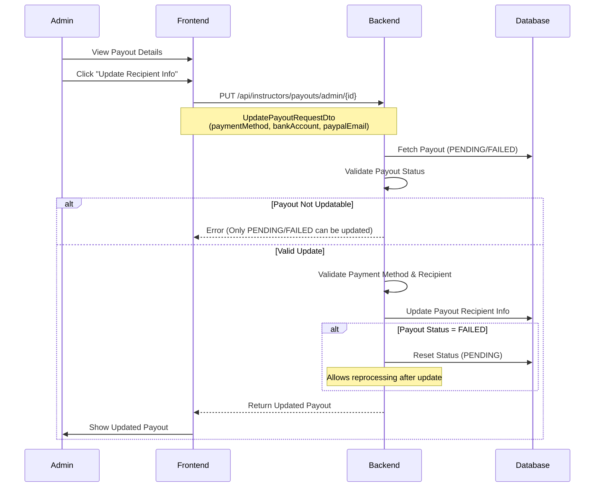

**Update Rules:**
- Only PENDING or FAILED payouts can be updated
- Updating FAILED payout resets status to PENDING
- Allows admin to fix recipient info and retry

---

## 7. Gateway Payout Processing

The system integrates with payment gateways to process payouts.

### PayPal Payout Processing

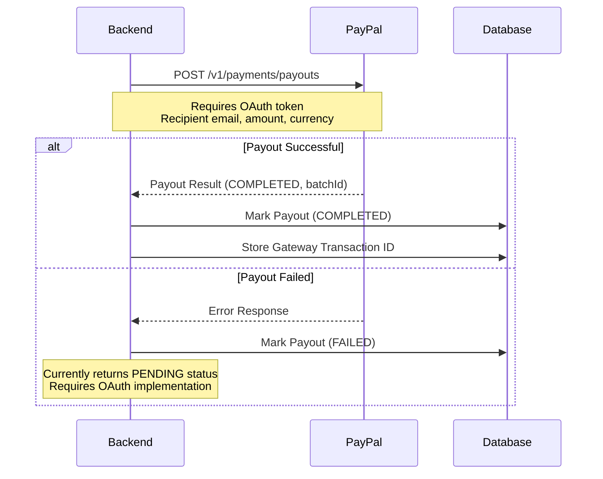

**PayPal Status:**
- ⚠️ Currently returns PENDING status (requires OAuth token implementation)
- **Next Step**: Implement OAuth flow and PayPal Payouts REST API

### SePay Payout Processing

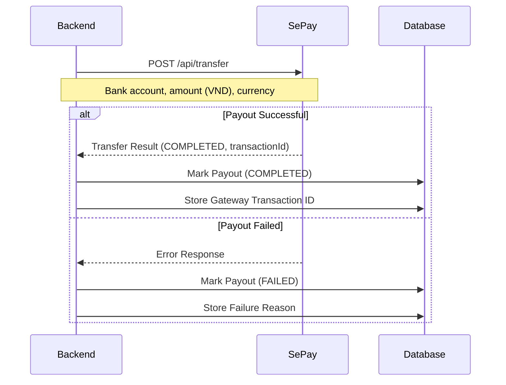

**SePay Features:**
- ✅ Fully implemented bank transfer payouts
- ✅ VND conversion support
- ✅ Error handling

---

## 8. Instructor Payout Summary Flow

Instructors can view their payout summary and history.

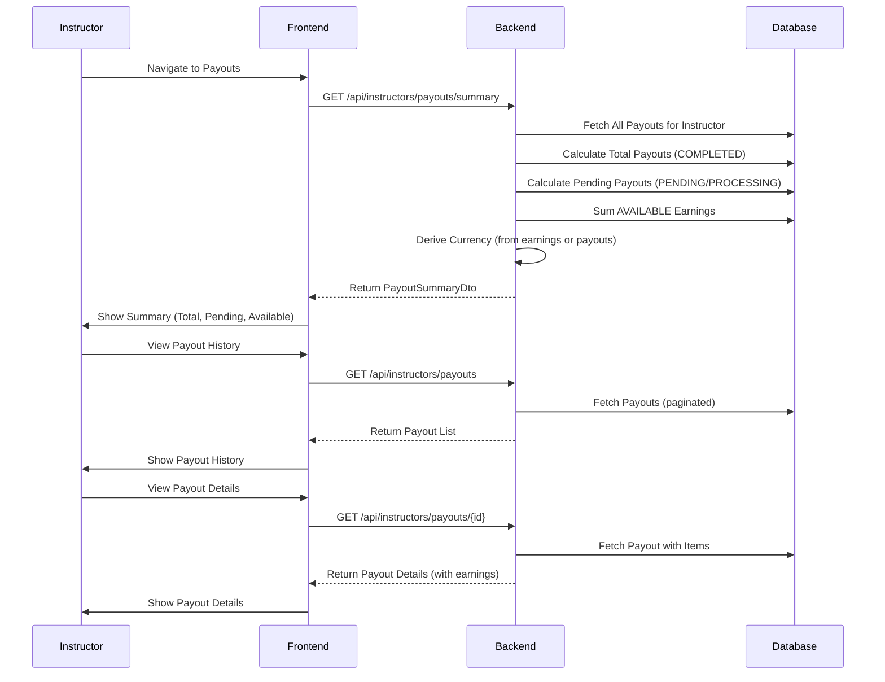

**Payout Summary Fields:**
- **Total Payouts**: Sum of COMPLETED payouts
- **Pending Payouts**: Sum of PENDING/PROCESSING payouts
- **Available for Payout**: Sum of AVAILABLE earnings
- **Total Payout Count**: Number of all payouts
- **Last Payout Date**: Date of most recent COMPLETED payout
- **Currency**: Derived from earnings or payout history

---

## 9. Admin Payout Management Flow

Admins can view and manage all payouts.

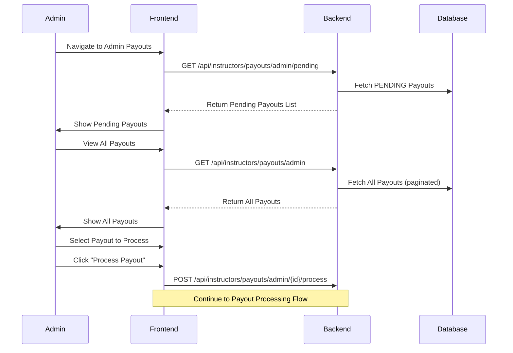

---

## 10. Payout Status State Machine

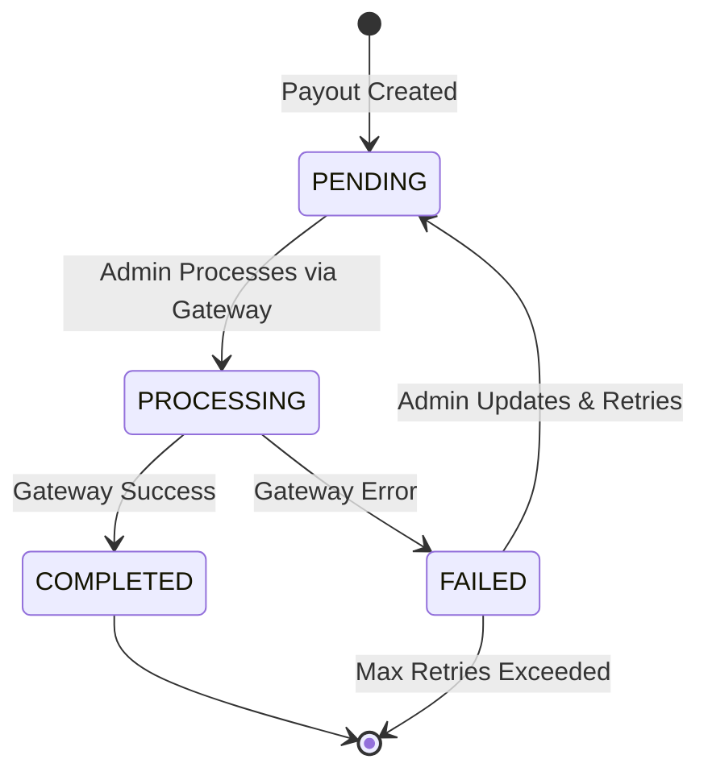

**Status Transitions:**
- **PENDING**: Initial state after payout creation
- **PROCESSING**: Payout being processed by gateway
- **COMPLETED**: Payout processed successfully, earnings marked as PAID
- **FAILED**: Gateway error or processing failure (can retry if < max retries)

**Status Transition Guards:**
- Only PENDING or FAILED payouts can be processed
- Only PROCESSING payouts can transition to COMPLETED or FAILED
- FAILED payouts can be updated and reset to PENDING for retry

---

## 11. Earnings Aggregation Flow

The system aggregates AVAILABLE earnings for payout creation.

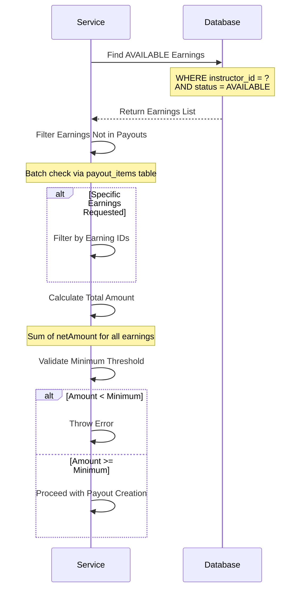

**Aggregation Rules:**
- Only AVAILABLE earnings are included
- Earnings already in payouts are excluded
- Multi-currency support (currency derived from first earning)
- Minimum threshold validation ($50 default)

---

## 12. Multi-Currency Payout Flow

The system supports multi-currency payouts with automatic currency derivation.

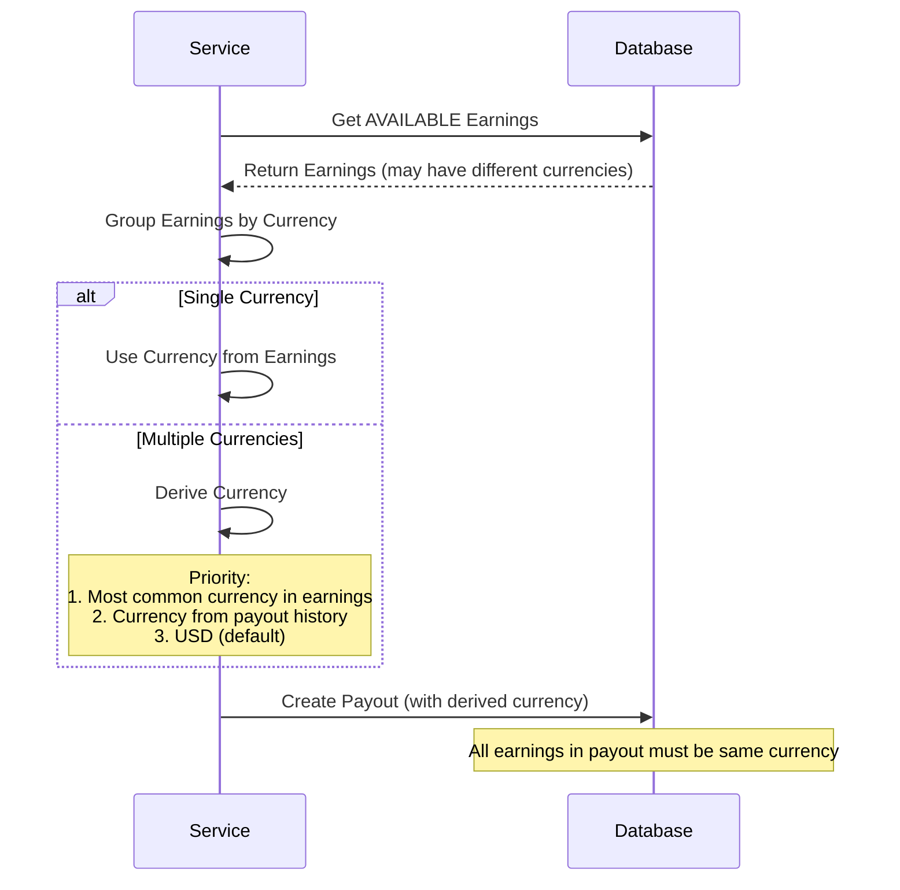

**Currency Derivation:**
- **Primary**: Currency from instructor's AVAILABLE earnings
- **Fallback**: Currency from most recent payout
- **Default**: USD if no earnings or payouts exist

---

## API Endpoints Summary

| Endpoint | Method | Description | Access |
|----------|--------|-------------|--------|
| `/api/instructors/payouts` | GET | Get instructor payout history | Instructor |
| `/api/instructors/payouts/{id}` | GET | Get payout details by ID | Instructor |
| `/api/instructors/payouts/summary` | GET | Get payout summary | Instructor |
| `/api/instructors/payouts/admin/pending` | GET | Get pending payouts | Admin |
| `/api/instructors/payouts/admin` | GET | Get all payouts | Admin |
| `/api/instructors/payouts/admin` | POST | Create payout manually | Admin |
| `/api/instructors/payouts/admin/{id}` | PUT | Update payout recipient info | Admin |
| `/api/instructors/payouts/admin/{id}/process` | POST | Process payout via gateway | Admin |

---

## Key Implementation Details

### Performance Optimizations

**Eager Loading:**
- `@EntityGraph` and `JOIN FETCH` prevent N+1 queries
- Payout items loaded with earnings in single query

**Batch Operations:**
- Payout items created via `saveAll()` instead of loop
- Earnings updates batched for performance
- Scheduler uses optimized repository queries

**Query Optimization:**
- Scheduler queries filter by status and date in database
- Batch checks for earnings already in payouts
- Efficient aggregation queries

### Earnings Hold Period

- **Default**: 30 days (configurable via `payment.payout.hold-period-days`)
- **Purpose**: Protects against refunds and chargebacks
- **Scheduler**: Runs daily at 3:00 AM to mark earnings as AVAILABLE

### Minimum Payout Threshold

- **Default**: $50 (configurable via `payment.payout.minimum-amount`)
- **Purpose**: Reduces transaction costs
- **Validation**: Applied during payout creation

### Retry Mechanism

- **Max Retries**: 3 (configurable via `payment.payout.max-retries`)
- **Tracking**: `Payout.retryCount` field
- **Enforcement**: Prevents processing if retry limit exceeded
- **Reset**: Updating FAILED payout allows reprocessing

### Status Transition Guards

- Only PENDING or FAILED payouts can be processed
- Only PROCESSING payouts can transition to COMPLETED or FAILED
- Prevents invalid state transitions

### Gateway Integration

- **PayPal**: Payout method added (requires OAuth for full implementation)
- **SePay**: Fully implemented bank transfer payouts with VND conversion
- Gateway selection based on payment method (PAYPAL → PayPal, BANK_TRANSFER → SePay)

---

## Configuration Reference

### Environment Variables

```yaml
payment:
  payout:
    minimum-amount: 50              # Minimum payout threshold
    hold-period-days: 30             # Earnings hold period
    schedule-day: 1                   # Day of month for scheduler
    schedule-hour: 2                  # Hour of day for scheduler
    max-retries: 3                    # Maximum retry attempts
    schedule-cron: "0 0 2 1 * ?"     # Monthly scheduler cron
```

### Scheduler Configuration

| Scheduler | Cron Expression | Description |
|-----------|----------------|-------------|
| `EarningAvailabilityScheduler` | `0 0 3 * * ?` | Daily at 3:00 AM |
| `PayoutScheduler` | `0 0 2 1 * ?` | 1st of month at 2:00 AM |

---

## Error Scenarios

### Payout Creation Errors

| Error | Cause | Resolution |
|-------|-------|------------|
| No available earnings | No AVAILABLE earnings found | Wait for earnings to become available |
| Amount below minimum | Total amount < minimum threshold | Wait for more earnings or adjust threshold |
| Invalid payment method | Missing recipient info | Provide bank account or PayPal email |
| Earnings already in payout | Earnings already linked to payout | Use different earnings or wait for payout completion |

### Payout Processing Errors

| Error | Cause | Resolution |
|-------|-------|------------|
| Payout not found | Invalid payout ID | Verify payout ID |
| Invalid status | Payout not PENDING or FAILED | Only PENDING/FAILED can be processed |
| Retry limit exceeded | Retry count >= max retries | Manual intervention required |
| Missing recipient info | No bank account or PayPal email | Update payout with recipient info |
| Gateway error | Payment gateway API failure | Retry or check gateway credentials |

---

## Testing Scenarios

### Payout Creation Tests

- ✅ Manual payout creation with all available earnings
- ✅ Manual payout creation with specific earnings
- ✅ Minimum threshold validation
- ✅ Multi-currency payout creation
- ✅ Duplicate earnings prevention

### Payout Processing Tests

- ✅ SePay payout processing
- ✅ PayPal payout processing (when implemented)
- ✅ Earnings marked as PAID after success
- ✅ Failed payout handling with retry count
- ✅ Retry limit enforcement

### Scheduler Tests

- ✅ Monthly payout scheduler execution
- ✅ Earning availability scheduler execution
- ✅ Batch processing optimization
- ✅ Minimum threshold filtering

### Payout Management Tests

- ✅ Payout recipient update
- ✅ Payout status transition guards
- ✅ Payout summary calculation
- ✅ Multi-currency summary

---

## Known Limitations

1. **PayPal Payouts**: Currently returns PENDING status - requires OAuth implementation
2. **Encryption**: Payout recipient data not yet encrypted (security enhancement needed)
3. **Webhooks**: Payout status webhooks not yet implemented
4. **Notifications**: Email notifications not yet implemented

---

**Last Updated**: Based on implementation in `PayoutServiceImpl`, `PayoutController`, and schedulers
**Status**: ✅ Core functionality complete, PayPal OAuth pending
