# Payout Workflows

This document describes the payout flows implemented in the EduMind LMS system. The payout system manages instructor earnings, automated monthly payouts, and gateway integration.

---

## 1. Earnings Lifecycle Flow

Earnings progress through a lifecycle from creation to payout.

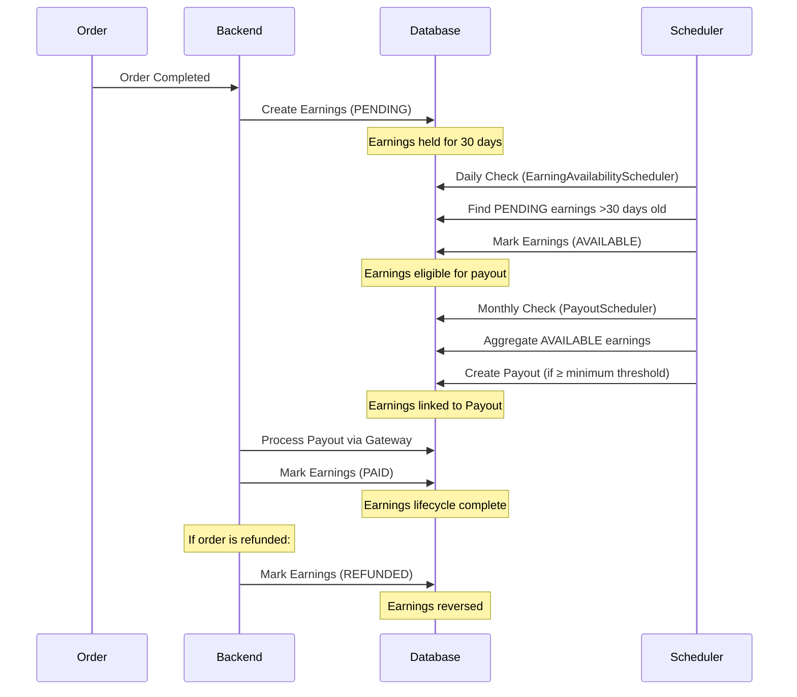
```mermaid
sequenceDiagram
    participant Order
    participant Backend
    participant Database
    participant Scheduler

    Order->>Backend: Order Completed
    Backend->>Database: Create Earnings (PENDING)
    Note over Database: Earnings held for 30 days
    
    Scheduler->>Database: Daily Check (EarningAvailabilityScheduler)
    Scheduler->>Database: Find PENDING earnings >30 days old
    Scheduler->>Database: Mark Earnings (AVAILABLE)
    Note over Database: Earnings eligible for payout
    
    Scheduler->>Database: Monthly Check (PayoutScheduler)
    Scheduler->>Database: Aggregate AVAILABLE earnings
    Scheduler->>Database: Create Payout (if ≥ minimum threshold)
    Note over Database: Earnings linked to Payout
    
    Backend->>Database: Process Payout via Gateway
    Backend->>Database: Mark Earnings (PAID)
    Note over Database: Earnings lifecycle complete

    Note over Backend: If order is refunded:
    Backend->>Database: Mark Earnings (REFUNDED)
    Note over Database: Earnings reversed
```

**Earnings Status Flow:**
- **PENDING**: Created when order completes, held for 30 days
- **AVAILABLE**: After hold period, eligible for payout
- **PAID**: After successful payout processing
- **REFUNDED**: Reversed due to order refund (via webhook or admin action)

---

## 2. Earning Availability Scheduler Flow

The scheduler runs daily to mark earnings as AVAILABLE after the hold period.

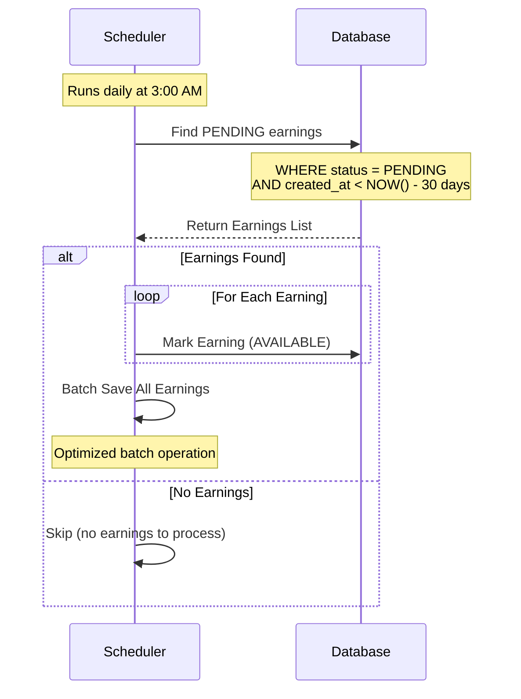
```mermaid
sequenceDiagram
    participant Scheduler
    participant Database

    Note over Scheduler: Runs daily at 3:00 AM
    
    Scheduler->>Database: Find PENDING earnings
    Note over Database: WHERE status = PENDING<br/>AND created_at < NOW() - 30 days
    Database-->>Scheduler: Return Earnings List
    
    alt Earnings Found
        loop For Each Earning
            Scheduler->>Database: Mark Earning (AVAILABLE)
        end
        Scheduler->>Scheduler: Batch Save All Earnings
        Note over Scheduler: Optimized batch operation
    else No Earnings
        Scheduler->>Scheduler: Skip (no earnings to process)
    end
```

**Scheduler Configuration:**
- **Cron**: `0 0 3 * * ?` (3:00 AM daily)
- **Hold Period**: 30 days (configurable via `payment.payout.hold-period-days`)
- **Optimization**: Uses repository query with date filter, batch save

---

## 3. Monthly Payout Scheduler Flow

The scheduler runs monthly to automatically create payouts for instructors with available earnings.

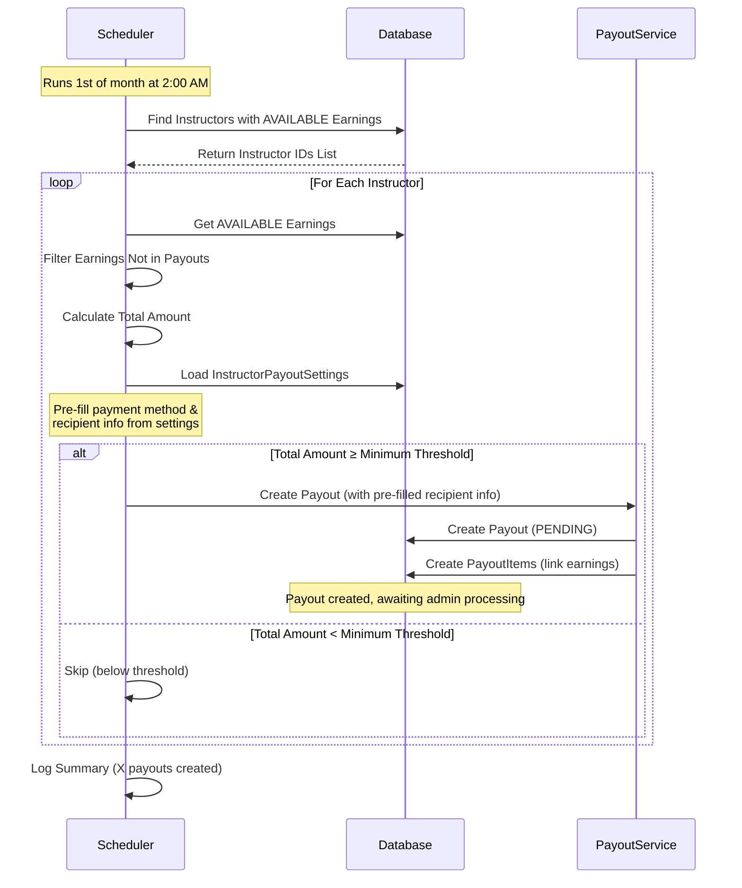
```mermaid
sequenceDiagram
    participant Scheduler
    participant Database
    participant PayoutService

    Note over Scheduler: Runs 1st of month at 2:00 AM
    
    Scheduler->>Database: Find Instructors with AVAILABLE Earnings
    Database-->>Scheduler: Return Instructor IDs List
    
    loop For Each Instructor
        Scheduler->>Database: Get AVAILABLE Earnings
        Scheduler->>Scheduler: Filter Earnings Not in Payouts
        Scheduler->>Scheduler: Calculate Total Amount
        
        Scheduler->>Database: Load InstructorPayoutSettings
        Note over Scheduler: Pre-fill payment method &<br/>recipient info from settings

        alt Total Amount ≥ Minimum Threshold
            Scheduler->>PayoutService: Create Payout (with pre-filled recipient info)
            PayoutService->>Database: Create Payout (PENDING)
            PayoutService->>Database: Create PayoutItems (link earnings)
            Note over Database: Payout created, awaiting admin processing
        else Total Amount < Minimum Threshold
            Scheduler->>Scheduler: Skip (below threshold)
        end
    end
    
    Scheduler->>Scheduler: Log Summary (X payouts created)
```

**Scheduler Configuration:**
- **Cron**: `0 0 2 1 * ?` (2:00 AM on 1st of month)
- **Minimum Threshold**: $50 (configurable via `payment.payout.minimum-amount`)
- **Default Payment Method**: BANK_TRANSFER (uses InstructorPayoutSettings if configured)
- **Recipient Auto-fill**: Bank/PayPal details pre-filled from `InstructorPayoutSettings`

---

## 4. Manual Payout Creation Flow (Admin)

Admins can manually create payouts for specific instructors.

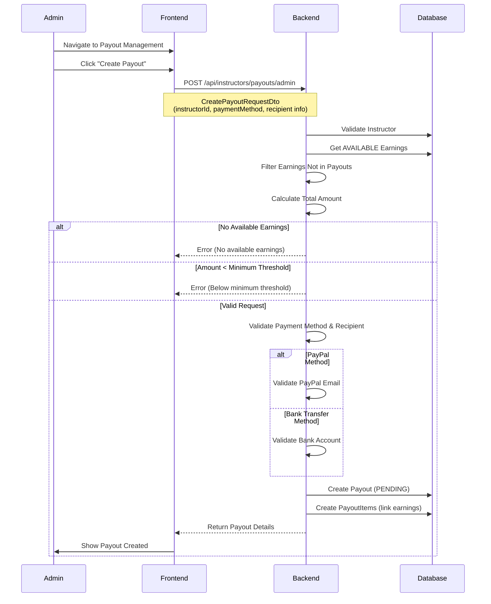
```mermaid
sequenceDiagram
    participant Admin
    participant Frontend
    participant Backend
    participant Database

    Admin->>Frontend: Navigate to Payout Management
    Admin->>Frontend: Click "Create Payout"
    Frontend->>Backend: POST /api/instructors/payouts/admin
    Note over Frontend,Backend: CreatePayoutRequestDto<br/>(instructorId, paymentMethod, recipient info)
    
    Backend->>Database: Validate Instructor
    Backend->>Database: Get AVAILABLE Earnings
    Backend->>Backend: Filter Earnings Not in Payouts
    Backend->>Backend: Calculate Total Amount
    
    alt No Available Earnings
        Backend-->>Frontend: Error (No available earnings)
    else Amount < Minimum Threshold
        Backend-->>Frontend: Error (Below minimum threshold)
    else Valid Request
        Backend->>Backend: Validate Payment Method & Recipient
        alt PayPal Method
            Backend->>Backend: Validate PayPal Email
        else Bank Transfer Method
            Backend->>Backend: Validate Bank Account
        end
        
        Backend->>Database: Create Payout (PENDING)
        Backend->>Database: Create PayoutItems (link earnings)
        Backend-->>Frontend: Return Payout Details
        Frontend->>Admin: Show Payout Created
    end
```

**Manual Payout Options:**
- **All Available Earnings**: Aggregate all AVAILABLE earnings for instructor
- **Specific Earnings**: Select specific earnings by ID (via `earningIds` in request)

---

## 5. Payout Processing Flow

Admins process payouts through payment gateways.

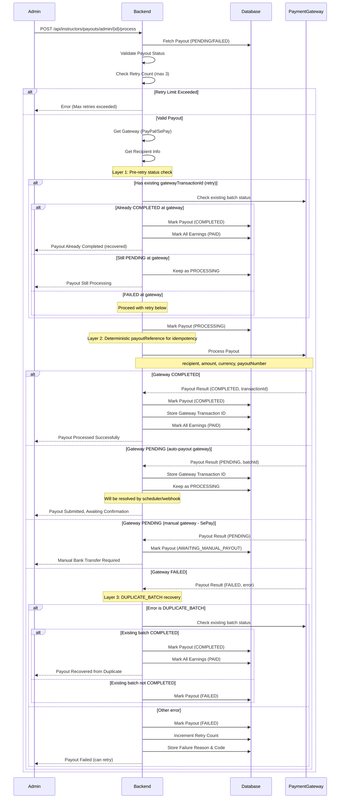
```mermaid
sequenceDiagram
    participant Admin
    participant Backend
    participant Database
    participant PaymentGateway

    Admin->>Backend: POST /api/instructors/payouts/admin/{id}/process
    Backend->>Database: Fetch Payout (PENDING/FAILED)
    Backend->>Backend: Validate Payout Status
    Backend->>Backend: Check Retry Count (max 3)

    alt Retry Limit Exceeded
        Backend-->>Admin: Error (Max retries exceeded)
    else Valid Payout
        Backend->>Backend: Get Gateway (PayPal/SePay)
        Backend->>Backend: Get Recipient Info

        Note over Backend: Layer 1: Pre-retry status check
        alt Has existing gatewayTransactionId (retry)
            Backend->>PaymentGateway: Check existing batch status
            alt Already COMPLETED at gateway
                Backend->>Database: Mark Payout (COMPLETED)
                Backend->>Database: Mark All Earnings (PAID)
                Backend-->>Admin: Payout Already Completed (recovered)
            else Still PENDING at gateway
                Backend->>Database: Keep as PROCESSING
                Backend-->>Admin: Payout Still Processing
            else FAILED at gateway
                Note over Backend: Proceed with retry below
            end
        end

        Backend->>Database: Mark Payout (PROCESSING)

        Note over Backend: Layer 2: Deterministic payoutReference for idempotency
        Backend->>PaymentGateway: Process Payout
        Note over Backend,PaymentGateway: recipient, amount, currency, payoutNumber

        alt Gateway COMPLETED
            PaymentGateway-->>Backend: Payout Result (COMPLETED, transactionId)
            Backend->>Database: Mark Payout (COMPLETED)
            Backend->>Database: Store Gateway Transaction ID
            Backend->>Database: Mark All Earnings (PAID)
            Backend-->>Admin: Payout Processed Successfully
        else Gateway PENDING (auto-payout gateway)
            PaymentGateway-->>Backend: Payout Result (PENDING, batchId)
            Backend->>Database: Store Gateway Transaction ID
            Backend->>Database: Keep as PROCESSING
            Note over Backend: Will be resolved by scheduler/webhook
            Backend-->>Admin: Payout Submitted, Awaiting Confirmation
        else Gateway PENDING (manual gateway - SePay)
            PaymentGateway-->>Backend: Payout Result (PENDING)
            Backend->>Database: Mark Payout (AWAITING_MANUAL_PAYOUT)
            Backend-->>Admin: Manual Bank Transfer Required
        else Gateway FAILED
            PaymentGateway-->>Backend: Payout Result (FAILED, error)

            Note over Backend: Layer 3: DUPLICATE_BATCH recovery
            alt Error is DUPLICATE_BATCH
                Backend->>PaymentGateway: Check existing batch status
                alt Existing batch COMPLETED
                    Backend->>Database: Mark Payout (COMPLETED)
                    Backend->>Database: Mark All Earnings (PAID)
                    Backend-->>Admin: Payout Recovered from Duplicate
                else Existing batch not COMPLETED
                    Backend->>Database: Mark Payout (FAILED)
                end
            else Other error
                Backend->>Database: Mark Payout (FAILED)
                Backend->>Database: Increment Retry Count
                Backend->>Database: Store Failure Reason & Code
                Backend-->>Admin: Payout Failed (can retry)
            end
        end
    end
```

**Idempotency Layers:**
- **Layer 1 (Pre-retry check)**: Before re-sending, queries gateway for existing batch status to prevent double payouts
- **Layer 2 (Deterministic reference)**: Uses `payoutNumber` as `senderBatchId` — PayPal rejects duplicate batches
- **Layer 3 (DUPLICATE_BATCH recovery)**: If PayPal rejects as duplicate, checks if existing batch already succeeded

**Retry Mechanism:**
- **Max Retries**: 3 (configurable via `payment.payout.max-retries`)
- **Retry Count**: Tracked in `Payout.retryCount`, incremented on failure
- **Status Reset**: FAILED payouts can be updated and reprocessed

---

## 6. Payout Recipient Update Flow

Admins can update payout recipient information before processing.

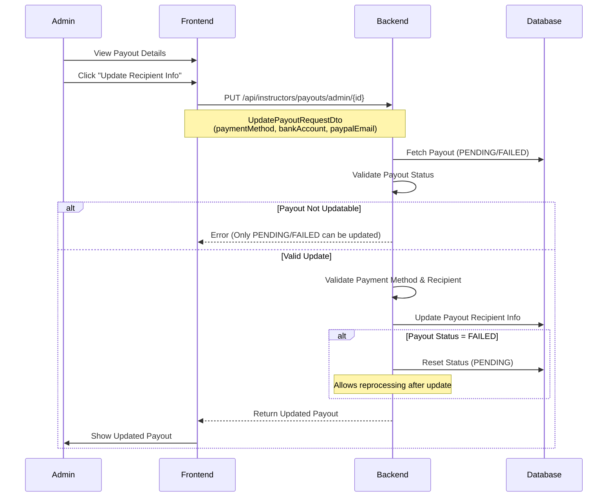
```mermaid
sequenceDiagram
    participant Admin
    participant Frontend
    participant Backend
    participant Database

    Admin->>Frontend: View Payout Details
    Admin->>Frontend: Click "Update Recipient Info"
    Frontend->>Backend: PUT /api/instructors/payouts/admin/{id}
    Note over Frontend,Backend: UpdatePayoutRequestDto<br/>(paymentMethod, bankAccount, paypalEmail)
    
    Backend->>Database: Fetch Payout (PENDING/FAILED)
    Backend->>Backend: Validate Payout Status
    alt Payout Not Updatable
        Backend-->>Frontend: Error (Only PENDING/FAILED can be updated)
    else Valid Update
        Backend->>Backend: Validate Payment Method & Recipient
        Backend->>Database: Update Payout Recipient Info
        alt Payout Status = FAILED
            Backend->>Database: Reset Status (PENDING)
            Note over Backend: Allows reprocessing after update
        end
        Backend-->>Frontend: Return Updated Payout
        Frontend->>Admin: Show Updated Payout
    end
```

**Update Rules:**
- Only PENDING or FAILED payouts can be updated
- Updating FAILED payout resets status to PENDING
- Allows admin to fix recipient info and retry

---

## 7. Gateway Payout Processing

The system integrates with payment gateways to process payouts.

### PayPal Payout Processing

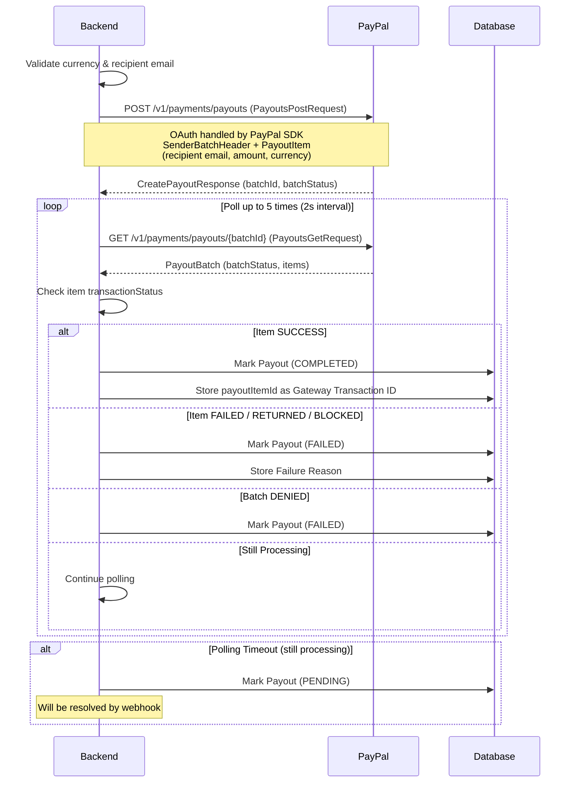
```mermaid
sequenceDiagram
    participant Backend
    participant PayPal
    participant Database

    Backend->>Backend: Validate currency & recipient email
    Backend->>PayPal: POST /v1/payments/payouts (PayoutsPostRequest)
    Note over Backend,PayPal: OAuth handled by PayPal SDK<br/>SenderBatchHeader + PayoutItem<br/>(recipient email, amount, currency)
    PayPal-->>Backend: CreatePayoutResponse (batchId, batchStatus)

    loop Poll up to 5 times (2s interval)
        Backend->>PayPal: GET /v1/payments/payouts/{batchId} (PayoutsGetRequest)
        PayPal-->>Backend: PayoutBatch (batchStatus, items)
        Backend->>Backend: Check item transactionStatus
        alt Item SUCCESS
            Backend->>Database: Mark Payout (COMPLETED)
            Backend->>Database: Store payoutItemId as Gateway Transaction ID
        else Item FAILED / RETURNED / BLOCKED
            Backend->>Database: Mark Payout (FAILED)
            Backend->>Database: Store Failure Reason
        else Batch DENIED
            Backend->>Database: Mark Payout (FAILED)
        else Still Processing
            Backend->>Backend: Continue polling
        end
    end

    alt Polling Timeout (still processing)
        Backend->>Database: Mark Payout (PENDING)
        Note over Backend: Will be resolved by webhook
    end
```

### PayPal Payout Webhook Processing

For payouts that are still processing after polling, PayPal sends webhook events to confirm the final status.

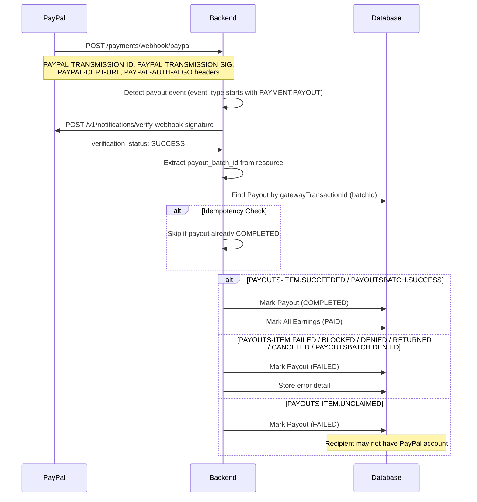
```mermaid
sequenceDiagram
    participant PayPal
    participant Backend
    participant Database

    PayPal->>Backend: POST /payments/webhook/paypal
    Note over PayPal,Backend: PAYPAL-TRANSMISSION-ID, PAYPAL-TRANSMISSION-SIG,<br/>PAYPAL-CERT-URL, PAYPAL-AUTH-ALGO headers

    Backend->>Backend: Detect payout event (event_type starts with PAYMENT.PAYOUT)
    Backend->>PayPal: POST /v1/notifications/verify-webhook-signature
    PayPal-->>Backend: verification_status: SUCCESS

    Backend->>Backend: Extract payout_batch_id from resource
    Backend->>Database: Find Payout by gatewayTransactionId (batchId)

    alt Idempotency Check
        Backend->>Backend: Skip if payout already COMPLETED
    end

    alt PAYOUTS-ITEM.SUCCEEDED / PAYOUTSBATCH.SUCCESS
        Backend->>Database: Mark Payout (COMPLETED)
        Backend->>Database: Mark All Earnings (PAID)
    else PAYOUTS-ITEM.FAILED / BLOCKED / DENIED / RETURNED / CANCELED / PAYOUTSBATCH.DENIED
        Backend->>Database: Mark Payout (FAILED)
        Backend->>Database: Store error detail
    else PAYOUTS-ITEM.UNCLAIMED
        Backend->>Database: Mark Payout (FAILED)
        Note over Database: Recipient may not have PayPal account
    end
```

**Supported Payout Webhook Events:**
- `PAYMENT.PAYOUTS-ITEM.SUCCEEDED` - Payout item completed successfully
- `PAYMENT.PAYOUTS-ITEM.FAILED` - Payout item failed
- `PAYMENT.PAYOUTS-ITEM.BLOCKED` - Payout item blocked
- `PAYMENT.PAYOUTS-ITEM.DENIED` - Payout item denied
- `PAYMENT.PAYOUTS-ITEM.RETURNED` - Payout item returned
- `PAYMENT.PAYOUTS-ITEM.CANCELED` - Payout item canceled
- `PAYMENT.PAYOUTS-ITEM.UNCLAIMED` - Recipient hasn't accepted payment
- `PAYMENT.PAYOUTSBATCH.SUCCESS` - Entire batch completed
- `PAYMENT.PAYOUTSBATCH.DENIED` - Entire batch denied

**PayPal Payout Features:**
- OAuth authentication handled automatically by PayPal SDK (`PayPalHttpClient`)
- Idempotent batch creation via deterministic `senderBatchId` (`EDUMIND-{payoutReference}`)
- Synchronous status polling: up to 5 attempts with 2-second intervals
- Asynchronous webhook confirmation for payouts that don't resolve during polling
- Webhook signature verification via PayPal's Verify Webhook Signature API
- Item-level status tracking (SUCCESS, FAILED, RETURNED, BLOCKED, UNCLAIMED)
- Batch-level status tracking (DENIED, CANCELED)
- Detailed error mapping: INSUFFICIENT_FUNDS, AUTHORIZATION_ERROR, DUPLICATE_BATCH, VALIDATION_ERROR
- Recipient validation: RECEIVER_UNREGISTERED, RECEIVER_UNCONFIRMED, REGULATORY_BLOCKED
- Supported currencies: USD, EUR, GBP, CAD, AUD, JPY, SGD

### SePay Payout Processing

The SePay product flow integrated by EduMind is used for QR collection and transaction lookup,
not outbound transfer initiation. `SepayGateway.payout()` only validates the
currency (VND/USD) and amount, then unconditionally returns `PENDING` with error code
`MANUAL_PAYOUT_REQUIRED` — no external call is made. The service layer treats this as a signal
to hand the payout off to an admin for manual bank transfer.

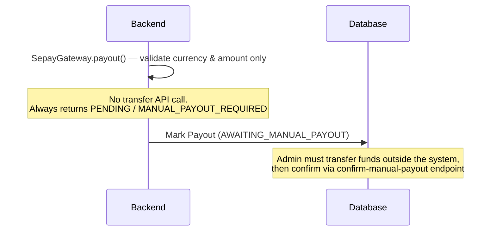
```mermaid
sequenceDiagram
    participant Backend
    participant Database

    Backend->>Backend: SepayGateway.payout() — validate currency & amount only
    Note over Backend: No transfer API call.<br/>Always returns PENDING / MANUAL_PAYOUT_REQUIRED
    Backend->>Database: Mark Payout (AWAITING_MANUAL_PAYOUT)
    Note over Database: Admin must transfer funds outside the system,<br/>then confirm via confirm-manual-payout endpoint
```

**SePay Payout Features:**
- ❌ No automatic outbound transfer in the current adapter — `payout()` never calls SePay
- ✅ Currency/amount validation (VND, USD)
- ✅ Manual payout workflow: `AWAITING_MANUAL_PAYOUT` → admin transfers externally → `confirm-manual-payout` → `COMPLETED`
- Note: SePay's QR/webhook integration (used for **payment collection**, not payouts) is separate — see Payment Workflows doc

---

## 8. Instructor Payout Summary Flow

Instructors can view their payout summary and history.

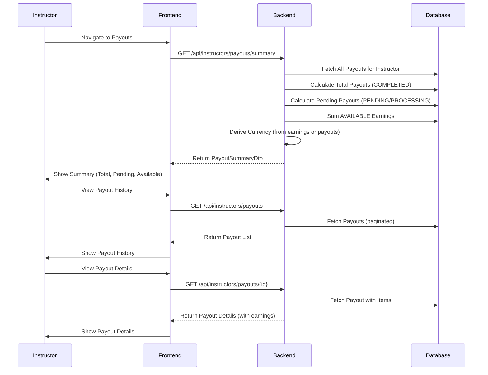
```mermaid
sequenceDiagram
    participant Instructor
    participant Frontend
    participant Backend
    participant Database

    Instructor->>Frontend: Navigate to Payouts
    Frontend->>Backend: GET /api/instructors/payouts/summary
    Backend->>Database: Fetch All Payouts for Instructor
    Backend->>Database: Calculate Total Payouts (COMPLETED)
    Backend->>Database: Calculate Pending Payouts (PENDING/PROCESSING)
    Backend->>Database: Sum AVAILABLE Earnings
    Backend->>Backend: Derive Currency (from earnings or payouts)
    Backend-->>Frontend: Return PayoutSummaryDto
    Frontend->>Instructor: Show Summary (Total, Pending, Available)
    
    Instructor->>Frontend: View Payout History
    Frontend->>Backend: GET /api/instructors/payouts
    Backend->>Database: Fetch Payouts (paginated)
    Backend-->>Frontend: Return Payout List
    Frontend->>Instructor: Show Payout History
    
    Instructor->>Frontend: View Payout Details
    Frontend->>Backend: GET /api/instructors/payouts/{id}
    Backend->>Database: Fetch Payout with Items
    Backend-->>Frontend: Return Payout Details (with earnings)
    Frontend->>Instructor: Show Payout Details
```

**Payout Summary Fields:**
- **Total Payouts**: Sum of COMPLETED payouts
- **Pending Payouts**: Sum of PENDING/PROCESSING payouts
- **Available for Payout**: Sum of AVAILABLE earnings
- **Total Payout Count**: Number of all payouts
- **Last Payout Date**: Date of most recent COMPLETED payout
- **Currency**: Derived from earnings or payout history

---

## 9. Admin Payout Management Flow

Admins can view and manage all payouts.

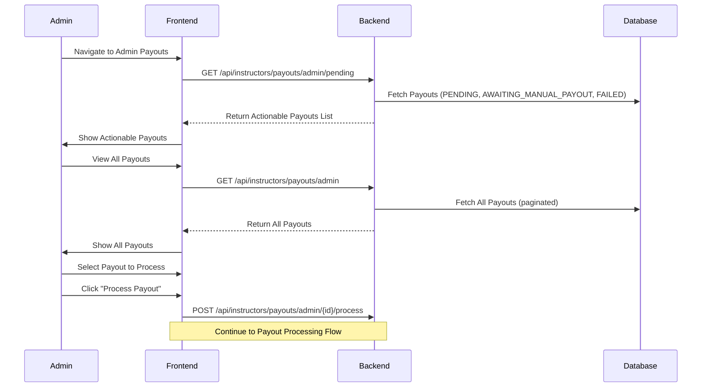
```mermaid
sequenceDiagram
    participant Admin
    participant Frontend
    participant Backend
    participant Database

    Admin->>Frontend: Navigate to Admin Payouts
    Frontend->>Backend: GET /api/instructors/payouts/admin/pending
    Backend->>Database: Fetch Payouts (PENDING, AWAITING_MANUAL_PAYOUT, FAILED)
    Backend-->>Frontend: Return Actionable Payouts List
    Frontend->>Admin: Show Actionable Payouts
    
    Admin->>Frontend: View All Payouts
    Frontend->>Backend: GET /api/instructors/payouts/admin
    Backend->>Database: Fetch All Payouts (paginated)
    Backend-->>Frontend: Return All Payouts
    Frontend->>Admin: Show All Payouts
    
    Admin->>Frontend: Select Payout to Process
    Admin->>Frontend: Click "Process Payout"
    Frontend->>Backend: POST /api/instructors/payouts/admin/{id}/process
    Note over Frontend,Backend: Continue to Payout Processing Flow
```

---

## 10. Manual Payout Confirmation Flow (Admin)

For gateways that cannot auto-process payouts (e.g., SePay bank transfers), admins manually transfer funds and then confirm in the system.

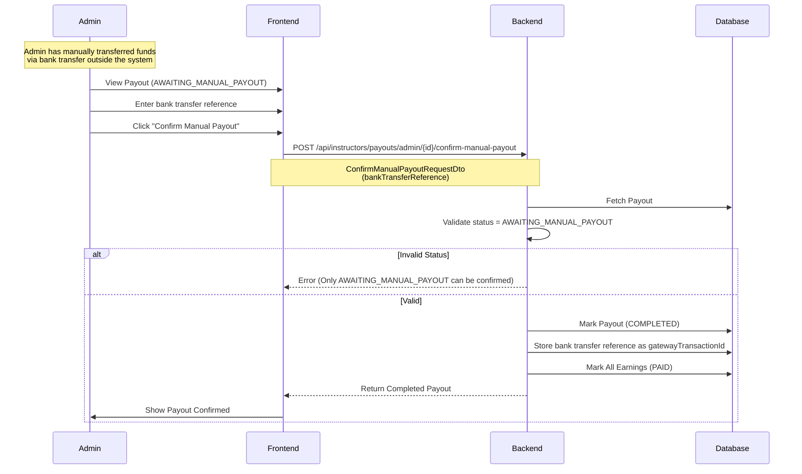
```mermaid
sequenceDiagram
    participant Admin
    participant Frontend
    participant Backend
    participant Database

    Note over Admin: Admin has manually transferred funds<br/>via bank transfer outside the system

    Admin->>Frontend: View Payout (AWAITING_MANUAL_PAYOUT)
    Admin->>Frontend: Enter bank transfer reference
    Admin->>Frontend: Click "Confirm Manual Payout"
    Frontend->>Backend: POST /api/instructors/payouts/admin/{id}/confirm-manual-payout
    Note over Frontend,Backend: ConfirmManualPayoutRequestDto<br/>(bankTransferReference)

    Backend->>Database: Fetch Payout
    Backend->>Backend: Validate status = AWAITING_MANUAL_PAYOUT

    alt Invalid Status
        Backend-->>Frontend: Error (Only AWAITING_MANUAL_PAYOUT can be confirmed)
    else Valid
        Backend->>Database: Mark Payout (COMPLETED)
        Backend->>Database: Store bank transfer reference as gatewayTransactionId
        Backend->>Database: Mark All Earnings (PAID)
        Backend-->>Frontend: Return Completed Payout
        Frontend->>Admin: Show Payout Confirmed
    end
```

**Confirmation Details:**
- Only payouts in `AWAITING_MANUAL_PAYOUT` status can be confirmed
- Admin provides the bank transfer reference for audit trail
- If no reference provided, system generates `MANUAL-{timestamp}` as fallback
- Records which admin confirmed the payout in gateway response

---

## 11. Instructor Payout Settings Flow

Instructors configure their preferred payment method and recipient details. These settings are auto-filled when creating payouts (both manual and scheduled).

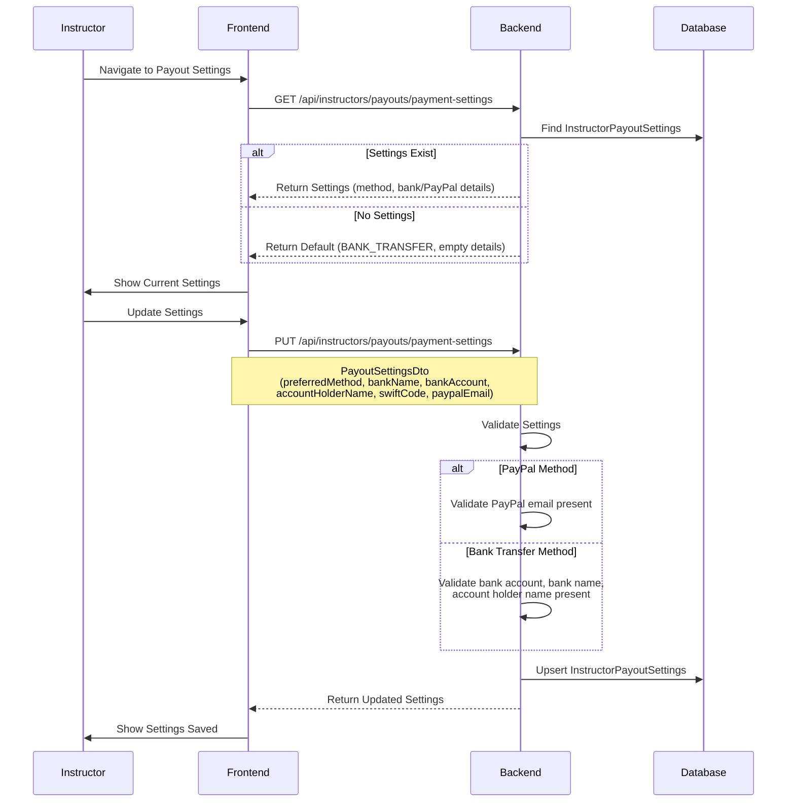
```mermaid
sequenceDiagram
    participant Instructor
    participant Frontend
    participant Backend
    participant Database

    Instructor->>Frontend: Navigate to Payout Settings
    Frontend->>Backend: GET /api/instructors/payouts/payment-settings
    Backend->>Database: Find InstructorPayoutSettings
    alt Settings Exist
        Backend-->>Frontend: Return Settings (method, bank/PayPal details)
    else No Settings
        Backend-->>Frontend: Return Default (BANK_TRANSFER, empty details)
    end
    Frontend->>Instructor: Show Current Settings

    Instructor->>Frontend: Update Settings
    Frontend->>Backend: PUT /api/instructors/payouts/payment-settings
    Note over Frontend,Backend: PayoutSettingsDto<br/>(preferredMethod, bankName, bankAccount,<br/>accountHolderName, swiftCode, paypalEmail)

    Backend->>Backend: Validate Settings
    alt PayPal Method
        Backend->>Backend: Validate PayPal email present
    else Bank Transfer Method
        Backend->>Backend: Validate bank account, bank name,<br/>account holder name present
    end

    Backend->>Database: Upsert InstructorPayoutSettings
    Backend-->>Frontend: Return Updated Settings
    Frontend->>Instructor: Show Settings Saved
```

**Settings Usage:**
- **Manual Payout Creation**: If admin doesn't provide recipient info, auto-fills from settings
- **Monthly Scheduler**: Pre-fills payment method and recipient details from settings
- **Upsert Pattern**: Creates settings if not exist, updates if exist

---

## 12. Processing Payouts Scheduler Flow

A background scheduler periodically checks payouts stuck in PROCESSING state and resolves them by querying the gateway.

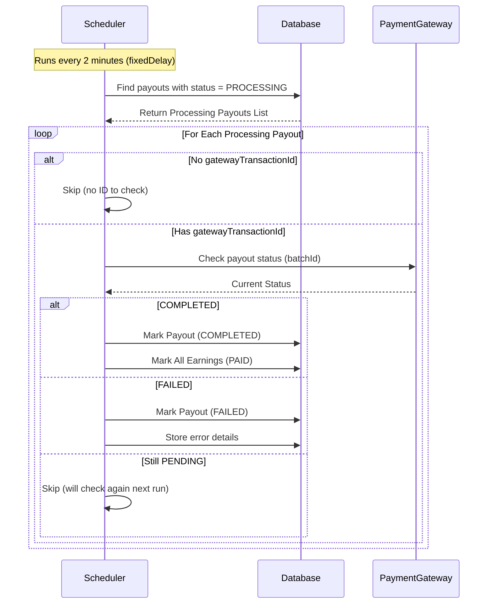
```mermaid
sequenceDiagram
    participant Scheduler
    participant Database
    participant PaymentGateway

    Note over Scheduler: Runs every 2 minutes (fixedDelay)

    Scheduler->>Database: Find payouts with status = PROCESSING
    Database-->>Scheduler: Return Processing Payouts List

    loop For Each Processing Payout
        alt No gatewayTransactionId
            Scheduler->>Scheduler: Skip (no ID to check)
        else Has gatewayTransactionId
            Scheduler->>PaymentGateway: Check payout status (batchId)
            PaymentGateway-->>Scheduler: Current Status

            alt COMPLETED
                Scheduler->>Database: Mark Payout (COMPLETED)
                Scheduler->>Database: Mark All Earnings (PAID)
            else FAILED
                Scheduler->>Database: Mark Payout (FAILED)
                Scheduler->>Database: Store error details
            else Still PENDING
                Scheduler->>Scheduler: Skip (will check again next run)
            end
        end
    end
```

**Scheduler Configuration:**
- **Interval**: Every 2 minutes (configurable via `payment.payout.processing-check-interval`)
- **Purpose**: Resolves payouts that were accepted by the gateway but didn't complete within initial polling
- **Complementary to**: Webhooks (provides redundancy if webhook is missed)

---

## 13. Payout Status State Machine

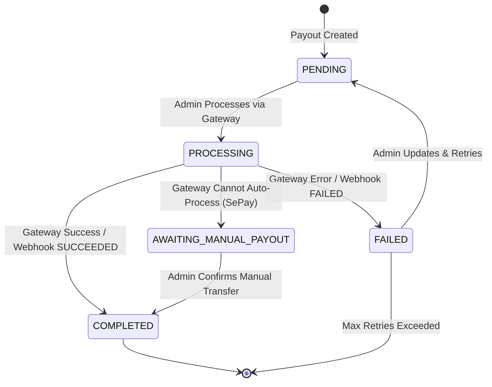
```mermaid
stateDiagram-v2
    [*] --> PENDING: Payout Created
    PENDING --> PROCESSING: Admin Processes via Gateway
    PROCESSING --> COMPLETED: Gateway Success / Webhook SUCCEEDED
    PROCESSING --> FAILED: Gateway Error / Webhook FAILED
    PROCESSING --> AWAITING_MANUAL_PAYOUT: Gateway Cannot Auto-Process (SePay)
    AWAITING_MANUAL_PAYOUT --> COMPLETED: Admin Confirms Manual Transfer
    FAILED --> PENDING: Admin Updates & Retries
    COMPLETED --> [*]
    FAILED --> [*]: Max Retries Exceeded
```

**Status Transitions:**
- **PENDING**: Initial state after payout creation
- **PROCESSING**: Payout being processed by gateway
- **AWAITING_MANUAL_PAYOUT**: Gateway cannot auto-process (e.g., SePay bank transfer), admin must manually transfer and confirm
- **COMPLETED**: Payout processed successfully, earnings marked as PAID
- **FAILED**: Gateway error or processing failure (can retry if < max retries)

**Status Transition Guards:**
- Only PENDING or FAILED payouts can be processed
- Only PROCESSING payouts can transition to COMPLETED, FAILED, or AWAITING_MANUAL_PAYOUT
- Only AWAITING_MANUAL_PAYOUT payouts can be confirmed via `confirmManualPayout`
- FAILED payouts can be updated and reset to PENDING for retry

---

## 14. Earnings Aggregation Flow

The system aggregates AVAILABLE earnings for payout creation.

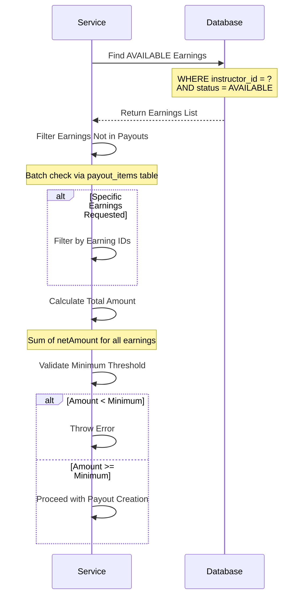
```mermaid
sequenceDiagram
    participant Service
    participant Database

    Service->>Database: Find AVAILABLE Earnings
    Note over Database: WHERE instructor_id = ?<br/>AND status = AVAILABLE
    Database-->>Service: Return Earnings List
    
    Service->>Service: Filter Earnings Not in Payouts
    Note over Service: Batch check via payout_items table
    
    alt Specific Earnings Requested
        Service->>Service: Filter by Earning IDs
    end
    
    Service->>Service: Calculate Total Amount
    Note over Service: Sum of netAmount for all earnings
    
    Service->>Service: Validate Minimum Threshold
    alt Amount < Minimum
        Service->>Service: Throw Error
    else Amount >= Minimum
        Service->>Service: Proceed with Payout Creation
    end
```

**Aggregation Rules:**
- Only AVAILABLE earnings are included
- Earnings already in payouts are excluded
- Single-currency-per-payout assumption (currency label derived from first earning, not validated)
- Minimum threshold validation ($50 default)

---

## 15. Payout Currency Derivation (No Real Multi-Currency Handling)

The system does **not** group or reconcile earnings by currency. Each payout's currency is simply copied from the first earning in the batch; if an instructor's available earnings ever spanned multiple currencies, they would be silently summed together into one `totalAmount` and mislabeled with a single currency — no conversion, grouping, or validation occurs.

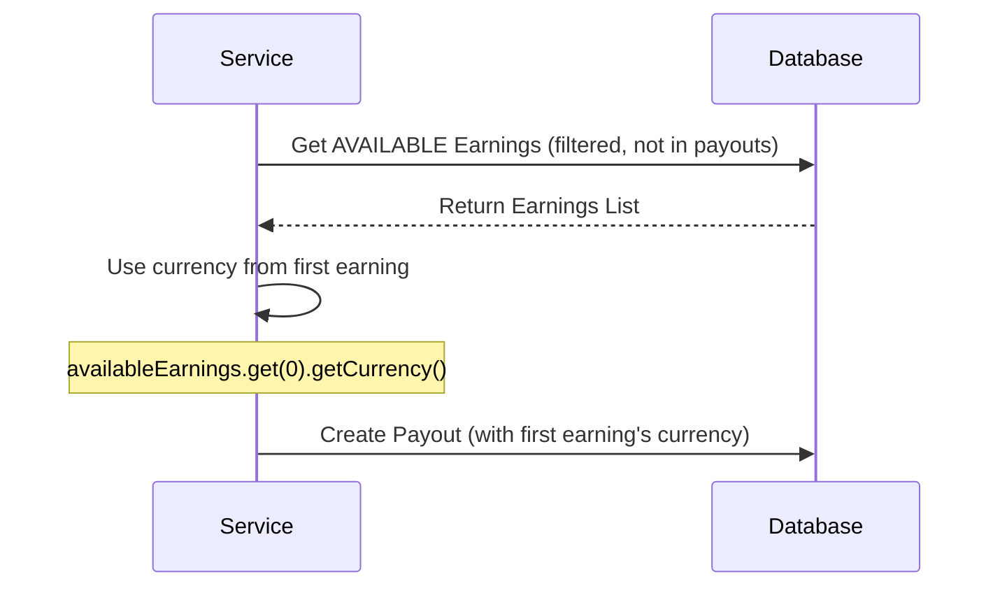
```mermaid
sequenceDiagram
    participant Service
    participant Database

    Service->>Database: Get AVAILABLE Earnings (filtered, not in payouts)
    Database-->>Service: Return Earnings List

    Service->>Service: Use currency from first earning
    Note over Service: availableEarnings.get(0).getCurrency()

    Service->>Database: Create Payout (with first earning's currency)
```

**Currency Derivation (in `createPayout` and `scheduleMonthlyPayouts`):**
- Uses the currency of the **first available earning** in the list (`availableEarnings.get(0).getCurrency()`)
- No currency grouping (`Collectors.groupingBy`) or per-currency aggregation is performed
- No validation/exception exists if earnings have mismatched currencies — the assumption that all earnings in a payout share the same currency is implicit and unenforced

**Currency Derivation (in `getPayoutSummary`):**
- **Primary**: Top currency from instructor's earnings via `findTopCurrencyByInstructorId`
- **Fallback**: Currency from most recent payout
- **Default**: USD if no earnings or payouts exist

---

## API Endpoints Summary

| Endpoint | Method | Description | Access |
|----------|--------|-------------|--------|
| `/api/instructors/payouts` | GET | Get instructor payout history | Instructor |
| `/api/instructors/payouts/{id}` | GET | Get payout details by ID | Instructor |
| `/api/instructors/payouts/summary` | GET | Get payout summary | Instructor |
| `/api/instructors/payouts/payment-settings` | GET | Get instructor payout settings | Instructor |
| `/api/instructors/payouts/payment-settings` | PUT | Update instructor payout settings | Instructor |
| `/api/instructors/payouts/admin/pending` | GET | Get actionable payouts (PENDING, AWAITING, FAILED) | Admin |
| `/api/instructors/payouts/admin` | GET | Get all payouts (optional `?status=` filter) | Admin |
| `/api/instructors/payouts/admin` | POST | Create payout manually | Admin |
| `/api/instructors/payouts/admin/{id}` | PUT | Update payout recipient info | Admin |
| `/api/instructors/payouts/admin/{id}/process` | POST | Process payout via gateway | Admin |
| `/api/instructors/payouts/admin/{id}/confirm-manual-payout` | POST | Confirm manual bank transfer payout | Admin |

---

## Key Implementation Details

### Performance Optimizations

**Eager Loading:**
- `@EntityGraph` and `JOIN FETCH` prevent N+1 queries
- Payout items loaded with earnings in single query

**Batch Operations:**
- Payout items created via `saveAll()` instead of loop
- Earnings updates batched for performance
- Scheduler uses optimized repository queries

**Query Optimization:**
- Scheduler queries filter by status and date in database
- Batch checks for earnings already in payouts
- Efficient aggregation queries

### Earnings Hold Period

- **Default**: 30 days (configurable via `payment.payout.hold-period-days`)
- **Purpose**: Protects against refunds and chargebacks
- **Scheduler**: Runs daily at 3:00 AM to mark earnings as AVAILABLE

### Minimum Payout Threshold

- **Default**: $50 (configurable via `payment.payout.minimum-amount`)
- **Purpose**: Reduces transaction costs
- **Validation**: Applied during payout creation

### Retry Mechanism

- **Max Retries**: 3 (configurable via `payment.payout.max-retries`)
- **Tracking**: `Payout.retryCount` field
- **Enforcement**: Prevents processing if retry limit exceeded
- **Reset**: Updating FAILED payout allows reprocessing

### Status Transition Guards

- Only PENDING or FAILED payouts can be processed
- Only PROCESSING payouts can transition to COMPLETED or FAILED
- Prevents invalid state transitions

### Gateway Integration

- **PayPal**: Fully implemented via PayPal Payouts SDK with OAuth, batch creation, status polling, and error handling
- **SePay**: No automatic payout API — `payout()` validates currency/amount then always returns `PENDING`/`MANUAL_PAYOUT_REQUIRED`, routing the payout to the manual bank-transfer workflow (`AWAITING_MANUAL_PAYOUT` → admin confirms)
- Gateway selection based on payment method (PAYPAL → PayPal, BANK_TRANSFER → SePay)

---

## Configuration Reference

### Environment Variables

```yaml
payment:
  payout:
    minimum-amount: 50                        # Minimum payout threshold
    hold-period-days: 30                       # Earnings hold period
    schedule-day: 1                             # Day of month for scheduler
    schedule-hour: 2                            # Hour of day for scheduler
    max-retries: 3                              # Maximum retry attempts
    schedule-cron: "0 0 2 1 * ?"               # Monthly scheduler cron
    processing-check-interval: 120000          # ms (2 min) - check PROCESSING payouts
```

### Scheduler Configuration

| Scheduler | Schedule | Description |
|-----------|---------|-------------|
| `EarningAvailabilityScheduler` | `0 0 3 * * ?` (daily 3:00 AM) | Mark PENDING earnings as AVAILABLE after hold period |
| `PayoutScheduler.scheduleMonthlyPayouts` | `0 0 2 1 * ?` (1st of month 2:00 AM) | Create payouts for instructors with available earnings |
| `PayoutScheduler.checkProcessingPayouts` | Every 2 min (`fixedDelay=120000`) | Check and resolve PROCESSING payouts via gateway |

---

## Error Scenarios

### Payout Creation Errors

| Error | Cause | Resolution |
|-------|-------|------------|
| No available earnings | No AVAILABLE earnings found | Wait for earnings to become available |
| Amount below minimum | Total amount < minimum threshold | Wait for more earnings or adjust threshold |
| Invalid payment method | Missing recipient info | Provide bank account or PayPal email |
| Earnings already in payout | Earnings already linked to payout | Use different earnings or wait for payout completion |

### Payout Processing Errors

| Error | Cause | Resolution |
|-------|-------|------------|
| Payout not found | Invalid payout ID | Verify payout ID |
| Invalid status | Payout not PENDING or FAILED | Only PENDING/FAILED can be processed |
| Retry limit exceeded | Retry count >= max retries | Manual intervention required |
| Missing recipient info | No bank account or PayPal email | Update payout with recipient info |
| Gateway error | Payment gateway API failure | Retry or check gateway credentials |

---

## Testing Scenarios

### Payout Creation Tests

- ✅ Manual payout creation with all available earnings
- ✅ Manual payout creation with specific earnings
- ✅ Minimum threshold validation
- ✅ Payout creation with currency derived from first earning
- ✅ Duplicate earnings prevention

### Payout Processing Tests

- ✅ SePay payout routes to `AWAITING_MANUAL_PAYOUT` (no automatic transfer)
- ✅ PayPal payout processing (batch creation, polling, error handling)
- ✅ Earnings marked as PAID after success
- ✅ Failed payout handling with retry count
- ✅ Retry limit enforcement

### Scheduler Tests

- ✅ Monthly payout scheduler execution
- ✅ Earning availability scheduler execution
- ✅ Batch processing optimization
- ✅ Minimum threshold filtering

### Payout Management Tests

- ✅ Payout recipient update
- ✅ Payout status transition guards
- ✅ Payout summary calculation
- ✅ Payout summary currency fallback (top currency → most recent payout → USD default)

---

## Known Limitations

1. **Encryption**: Payout recipient data not yet encrypted (security enhancement needed)
2. **Notifications**: Email notifications not yet implemented
3. **Currency handling**: No real multi-currency support — payout currency is derived from the first earning in the batch with no grouping or validation; mixed-currency earnings for one instructor would be silently summed and mislabeled (see [Section 15](#15-payout-currency-derivation-no-real-multi-currency-handling))

---

**Last Updated**: Based on implementation in `PayoutServiceImpl`, `PayoutController`, `PayPalGateway`, and schedulers
**Status**: ✅ Core functionality complete, PayPal Payouts fully integrated
