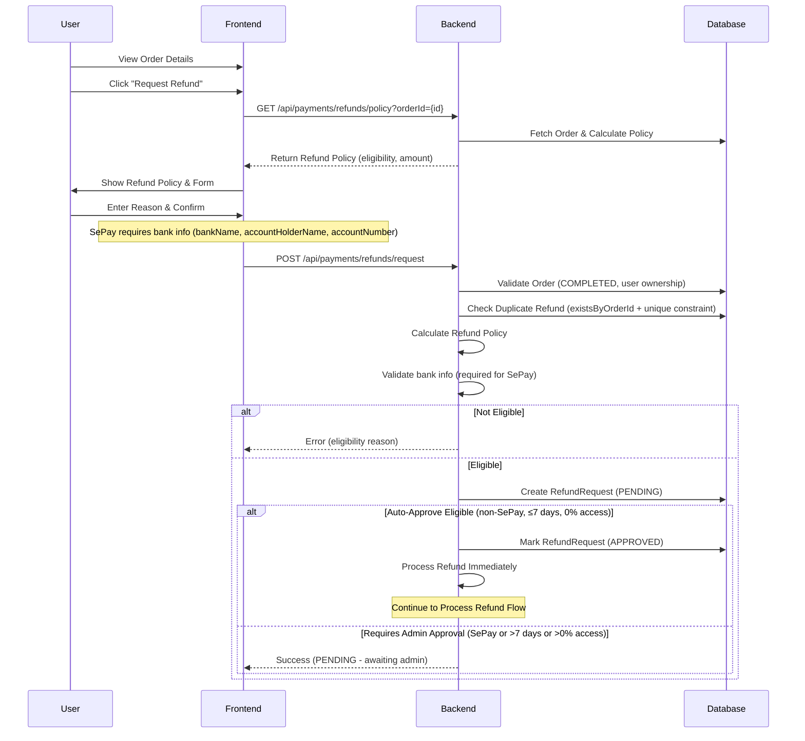
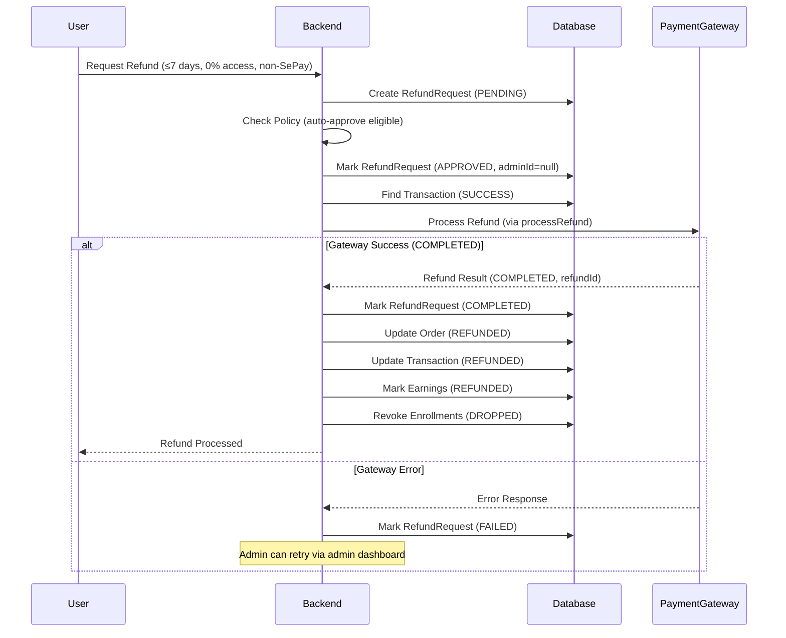
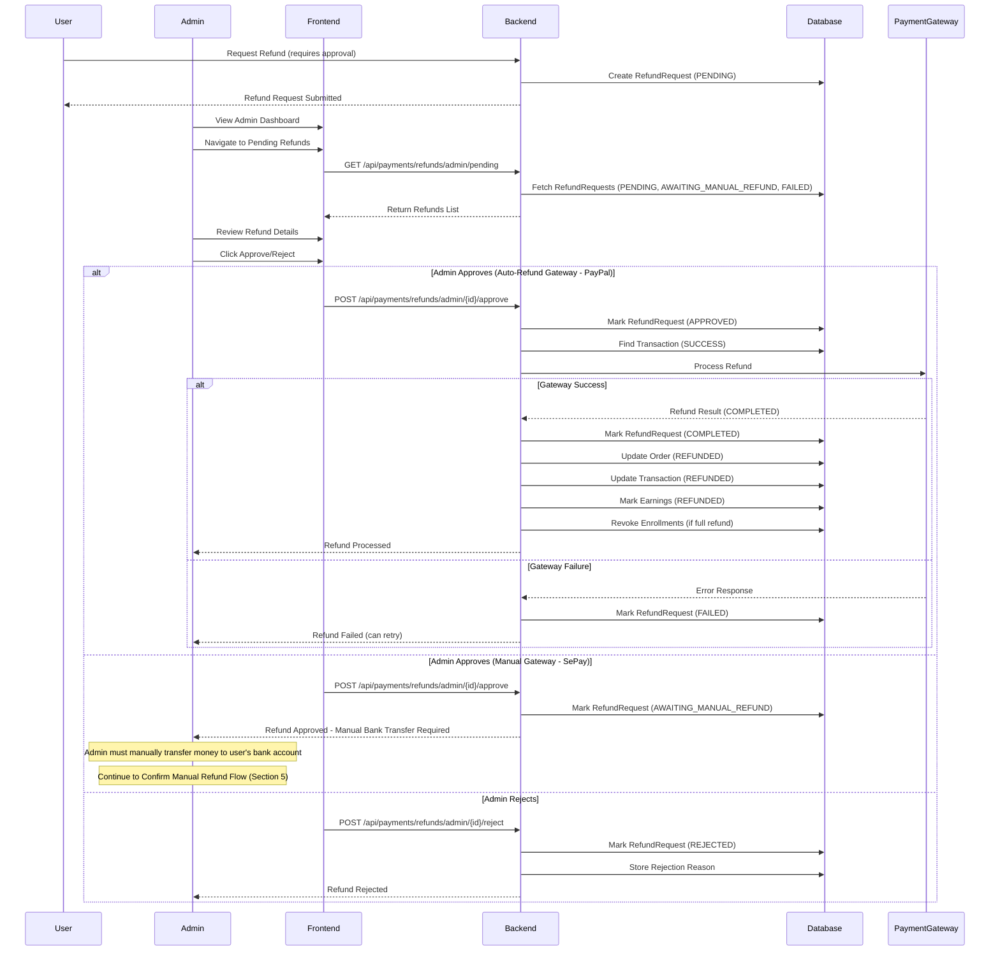
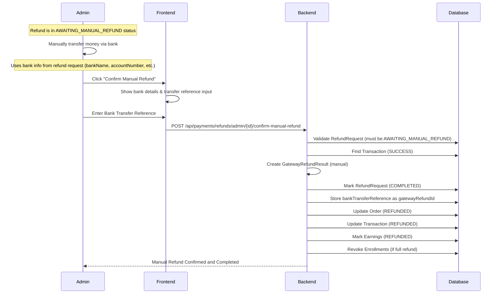
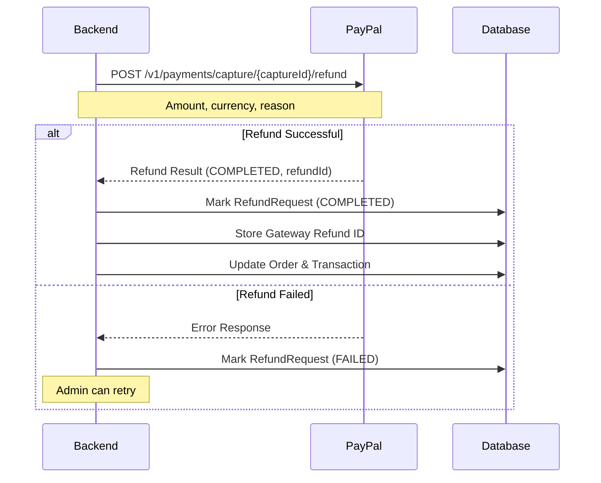
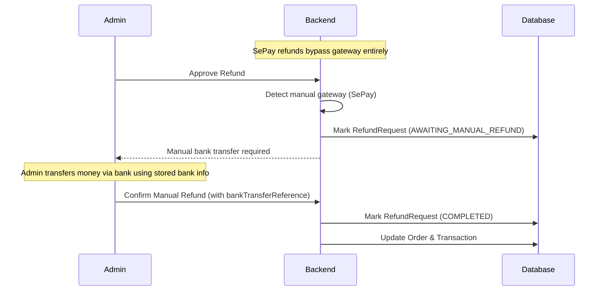
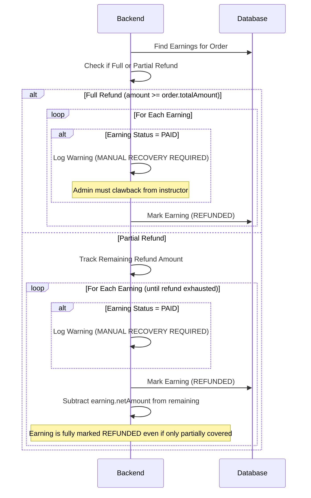
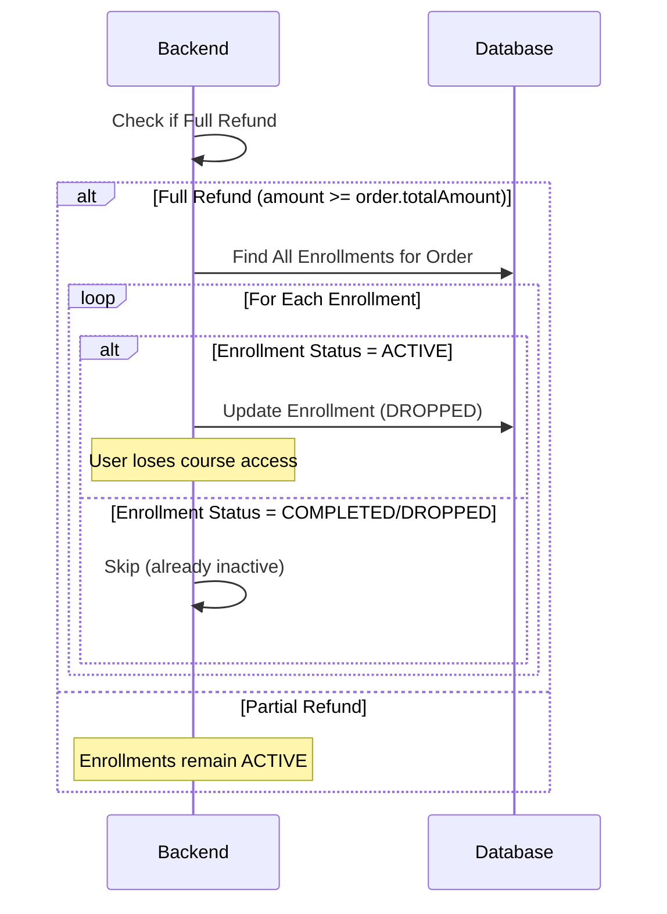
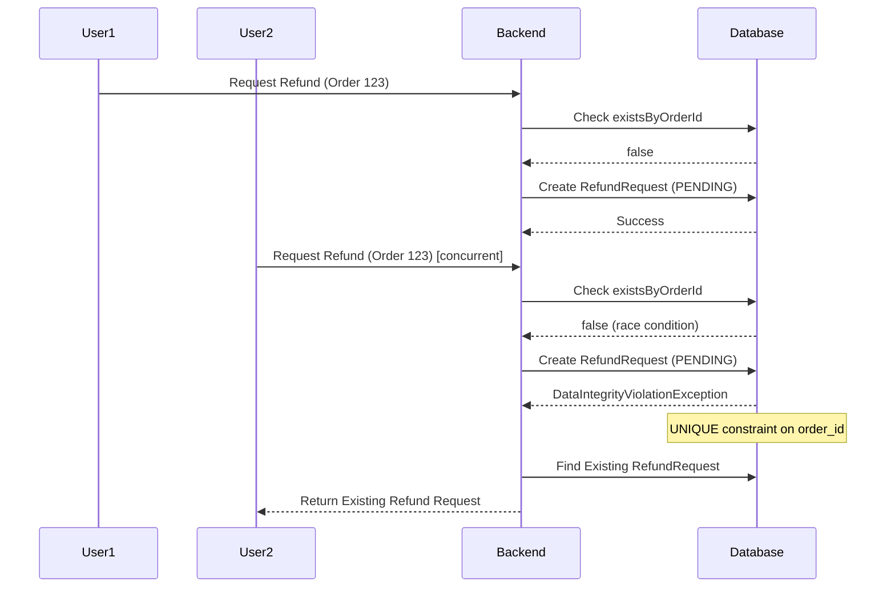
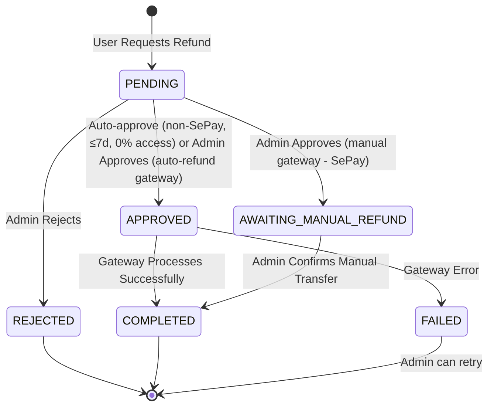

# Refund Workflows

This document describes the refund flows implemented in the EduMind LMS system. The refund system supports automatic and manual approval workflows with gateway integration.

---

## 1. Refund Request Flow (User)

Users can request refunds for completed orders within the 30-day refund window.

### Refund Policy Calculation

The system calculates refund eligibility based on:
- **Days since purchase**: Must be ≤ 30 days (from `order.completedAt`)
- **Course access percentage**: Calculated from enrollments (ACTIVE, COMPLETED, DROPPED)
- **Payment method**: SePay (manual gateway) always requires admin approval

**Policy Rules:**

For **auto-refund gateways** (PayPal):
- **Auto-approve**: ≤7 days AND 0% course access → Full refund (no admin needed)
- **Admin approval**: ≤30 days AND ≤50% course access → Full refund
- **Partial refund**: ≤30 days AND >50% course access → Prorated refund
- **Rejected**: >30 days since purchase

For **manual gateways** (SePay):
- **Admin approval**: ≤30 days AND ≤50% course access → Full refund (always requires admin)
- **Partial refund**: ≤30 days AND >50% course access → Prorated refund (always requires admin)
- **Rejected**: >30 days since purchase

**Course Access Calculation:**
- COMPLETED enrollments: Counted as 100% access
- All other enrollments (ACTIVE, DROPPED): Uses `progressPercentage` (or 0 if null)
- Average calculated across all courses in the order

---

## 2. Auto-Approval Refund Flow

Refunds that meet auto-approval criteria are processed immediately without admin intervention. This flow only applies to **auto-refund gateways** (PayPal). SePay orders always require admin approval and never enter this flow.

---

## 3. Admin Approval Refund Flow

Refunds requiring admin approval go through a review process. The approval outcome depends on the payment gateway type.

---

## 4. Partial Refund Flow

When course access exceeds 50%, users receive a prorated refund based on access percentage.

**Partial Refund Calculation:**
- Access ratio = `courseAccessPercentage / 100`
- Refund ratio = `1 - accessRatio`
- Refund amount = `order.totalAmount × refundRatio`

**Earnings Adjustment:**
- For partial refunds, earnings are marked as REFUNDED sequentially (one at a time) until the refund amount is exhausted
- Each earning is fully marked as REFUNDED regardless of how much of its value is covered by the remaining refund amount
- If earnings are already PAID, system logs warning for manual recovery

---

## 5. Confirm Manual Refund Flow (SePay)

After admin approves a SePay refund (status becomes `AWAITING_MANUAL_REFUND`), the admin must manually transfer money to the user's bank account and then confirm completion.

**SePay Manual Refund Details:**
- Bank transfers cannot be automatically reversed
- User provides bank info at refund request time: bankName, accountHolderName, accountNumber, swiftCode (optional), bankAddress (optional)
- Admin reviews bank info, manually transfers funds, then confirms via the endpoint
- The `bankTransferReference` is stored as the `gatewayRefundId` for tracking

---

## 6. Gateway Refund Processing

The system integrates with payment gateways to process refunds automatically or manually.

### PayPal Refund Processing

### SePay Refund Processing

SePay (bank transfer) does **not** go through gateway processing. Instead, the refund follows a manual approval workflow:

**SePay Limitation:**
- Bank transfers cannot be automatically reversed
- System routes SePay refunds to `AWAITING_MANUAL_REFUND` status (not FAILED)
- Admin must manually transfer funds and confirm completion via `/admin/{id}/confirm-manual-refund`

---

## 7. Refund Processing with Earnings Recovery

When processing refunds, the system handles earnings that may already be paid out to instructors.

**PAID Earnings Handling:**
- System logs warning: "MANUAL RECOVERY REQUIRED"
- Admin must manually recover funds from instructor
- Earnings are still marked as REFUNDED regardless of PAID status (warning is logged for admin action)

**Partial Refund Earnings Note:**
- Earnings are marked as REFUNDED sequentially, not proportionally
- Each earning in the sequence is fully marked REFUNDED
- The loop stops when the remaining refund amount reaches zero

---

## 8. Enrollment Revocation Flow

Full refunds automatically revoke course enrollments.

**Enrollment Revocation Rules:**
- Only ACTIVE enrollments are revoked
- COMPLETED enrollments are not revoked (already finished)
- DROPPED enrollments are not changed (already inactive)

---

## 9. Duplicate Refund Prevention

The system prevents duplicate refund requests using database constraints and optimistic locking.

**Protection Mechanisms:**
- **Pre-check** via `existsByOrderId()` before attempting insert
- **Database UNIQUE constraint** on `order_id` as fallback for concurrent requests
- **Optimistic locking** via `@Version` prevents concurrent updates
- Concurrent requests return existing refund request instead of error

---

## 10. Refund Status State Machine

**Status Transitions:**
- **PENDING**: Initial state after refund request created
- **APPROVED**: Auto-approved or admin-approved for auto-refund gateways (PayPal), ready for gateway processing
- **AWAITING_MANUAL_REFUND**: Admin-approved for manual gateways (SePay), waiting for admin to transfer money and confirm
- **REJECTED**: Admin rejected the refund request (with reason)
- **COMPLETED**: Refund processed successfully (via gateway or manual bank transfer)
- **FAILED**: Gateway error during processing (admin can retry)

---

## 11. Refund Policy Details

### Policy Configuration

| Configuration | Default | Description |
|--------------|---------|-------------|
| `payment.refund.auto-approve-days` | 7 | Days within which refunds auto-approve (if 0% access, non-SePay only) |
| `payment.refund.max-refund-days` | 30 | Maximum days since purchase for refund eligibility |
| `payment.refund.partial-refund-threshold` | 50 | Course access percentage threshold for partial refunds |

### Policy Calculation Examples

**Auto-refund gateways (PayPal):**

| Days Since Purchase | Course Access | Refund Amount | Approval Required |
|---------------------|---------------|---------------|-------------------|
| 5 days | 0% | 100% (Full) | Auto-approve |
| 15 days | 30% | 100% (Full) | Admin approval |
| 20 days | 60% | 40% (Partial) | Admin approval |
| 35 days | Any | 0% (Not eligible) | N/A |

**Manual gateways (SePay):**

| Days Since Purchase | Course Access | Refund Amount | Approval Required |
|---------------------|---------------|---------------|-------------------|
| 5 days | 0% | 100% (Full) | Admin approval (always) |
| 15 days | 30% | 100% (Full) | Admin approval |
| 20 days | 60% | 40% (Partial) | Admin approval |
| 35 days | Any | 0% (Not eligible) | N/A |

### Policy Amount Validation

- User-requested amount is automatically clamped to policy-eligible maximum
- System prevents policy bypass by validating against `eligibleRefundAmount`
- If user requests more than eligible, system uses eligible amount

---

## API Endpoints Summary

| Endpoint | Method | Description | Access |
|----------|--------|-------------|--------|
| `/api/payments/refunds/request` | POST | Request refund for an order | User |
| `/api/payments/refunds/policy` | GET | Get refund policy for an order | User |
| `/api/payments/refunds/my-refunds` | GET | Get user's refund history (paginated) | User |
| `/api/payments/refunds/{id}` | GET | Get refund details by ID | User |
| `/api/payments/refunds/by-order/{orderId}` | GET | Get refund for a specific order | User |
| `/api/payments/refunds/admin/pending` | GET | Get actionable refunds (PENDING, AWAITING_MANUAL_REFUND, FAILED) | Admin |
| `/api/payments/refunds/admin/{id}/approve` | POST | Approve refund request | Admin |
| `/api/payments/refunds/admin/{id}/reject` | POST | Reject refund request | Admin |
| `/api/payments/refunds/admin/{id}/confirm-manual-refund` | POST | Confirm manual bank transfer completed | Admin |

---

## Key Implementation Details

### Optimistic Locking

- `RefundRequest` entity uses `@Version` for concurrent update protection
- Prevents race conditions when multiple admins process the same refund

### Transaction Isolation

- Refund processing uses proper transaction boundaries (`@Transactional`)
- `processRefund()` is called via self-proxy to ensure `@Transactional` is respected for auto-approval
- Earnings updates and enrollment revocation are atomic within `completeRefund()`

### Gateway Integration

- **PayPal**: Automatic refund processing via REST API (`processRefund()`)
- **SePay**: Manual approval workflow → AWAITING_MANUAL_REFUND → admin confirms via `confirmManualRefund()`
- Gateway failures are tracked with FAILED status for admin retry

### Course Access Calculation

- COMPLETED enrollments: counted as 100% access
- All other enrollments (ACTIVE, DROPPED): uses `progressPercentage` (or 0 if null)
- Average calculated across all courses in the order via `calculateCourseAccessPercentage()`

### Earnings Recovery

- PAID earnings trigger manual recovery warnings (logged with earning ID, instructor ID, amount)
- Earnings are marked as REFUNDED regardless of PAID status
- Admin must manually recover funds from instructors for PAID earnings

### Duplicate Prevention

- Pre-check via `existsByOrderId()` before attempting insert
- Database UNIQUE constraint on `order_id` as fallback
- Concurrent requests return existing refund instead of error
- Optimistic locking prevents concurrent status updates

### Bank Account Information (SePay)

- SePay refunds require: `bankName`, `accountHolderName`, `accountNumber`
- Optional fields: `swiftCode`, `bankAddress`
- Validated server-side in `requestRefund()` when payment method is SePay
- Frontend conditionally shows bank info form based on payment method

---

## Error Scenarios

### Refund Request Errors

| Error | Cause | Resolution |
|-------|-------|------------|
| Order not found | Invalid order ID or user mismatch | Verify order ownership |
| Order not completed | Order status is not COMPLETED | Only completed orders can be refunded |
| Completion date not available | `order.completedAt` is null | Verify order completion |
| Refund window expired | >30 days since purchase | Refund not eligible |
| Duplicate refund | Refund already exists for order | Return existing refund request |
| Amount exceeds eligible | Requested amount > policy maximum | System clamps to eligible amount |
| Missing bank info | SePay refund without required bank details | Provide bankName, accountHolderName, accountNumber |

### Refund Processing Errors

| Error | Cause | Resolution |
|-------|-------|------------|
| No transaction found | Order has no successful transaction | Verify order payment status |
| No gateway transaction ID | Transaction missing gateway reference | Check transaction data |
| Gateway error | Payment gateway API failure | Admin can retry |
| Earnings already paid | Instructor already received payout | Manual recovery required (logged as warning) |
| Invalid status transition | Attempting action on wrong status | Check current refund status |

---

## Testing Scenarios

### Refund Request Tests

- Auto-approve refund (≤7 days, 0% access, PayPal)
- SePay refund always requires admin approval (even ≤7 days, 0% access)
- Admin approval refund (≤30 days, ≤50% access)
- Partial refund (≤30 days, >50% access)
- Refund rejection (>30 days)
- Duplicate refund prevention (pre-check + unique constraint)
- Policy amount validation and clamping
- Bank info validation for SePay

### Refund Processing Tests

- PayPal automatic refund (approve → gateway → COMPLETED)
- SePay manual refund workflow (approve → AWAITING_MANUAL_REFUND → confirm → COMPLETED)
- Enrollment revocation on full refund
- Enrollments remain ACTIVE on partial refund
- Partial refund sequential earnings marking
- PAID earnings recovery warning logging
- Failed refund status tracking
- Admin confirm manual refund with bank transfer reference

---

**Last Updated**: Based on implementation in `RefundServiceImpl` and `RefundController`
**Status**: Core functionality complete
