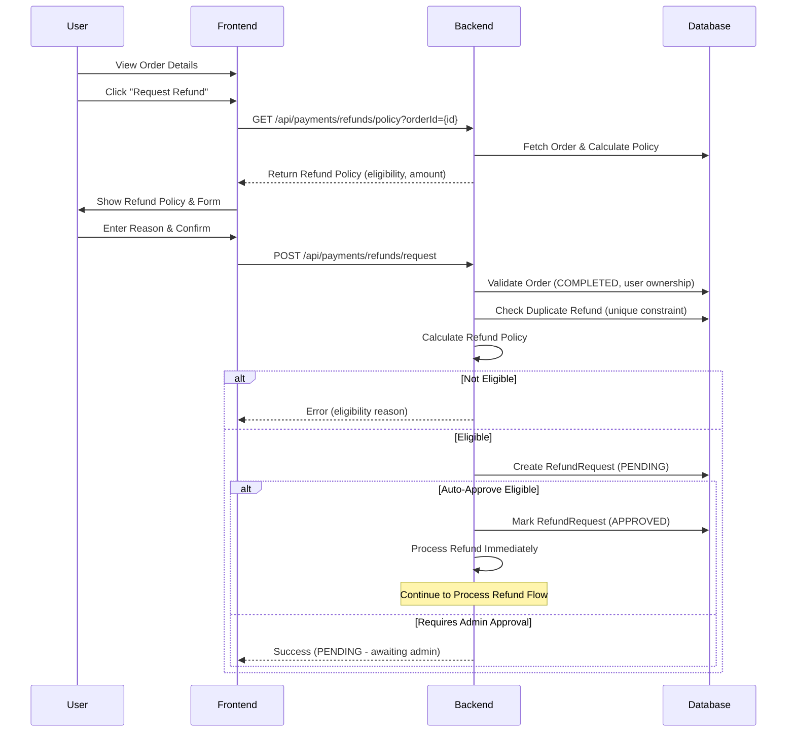
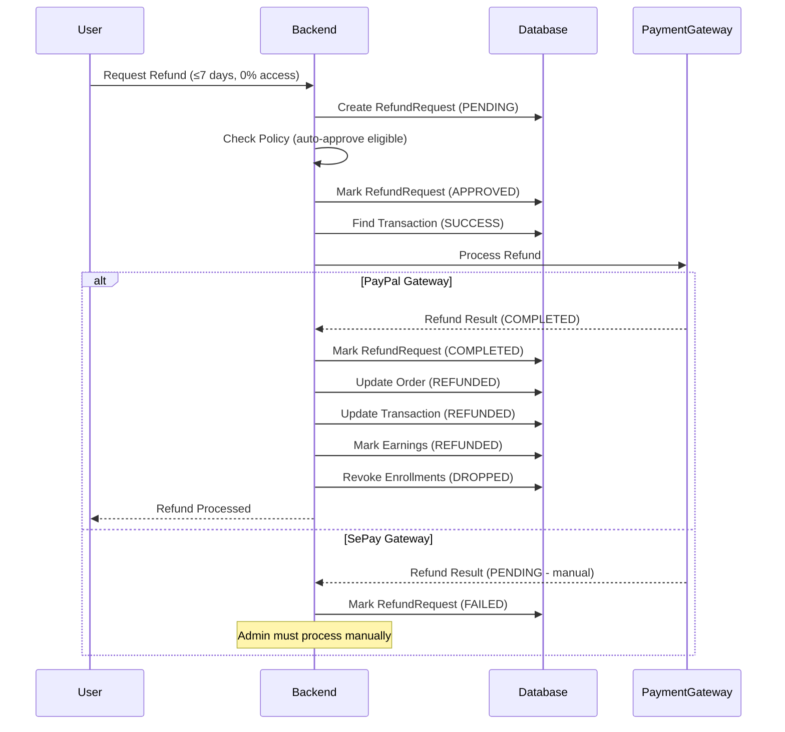
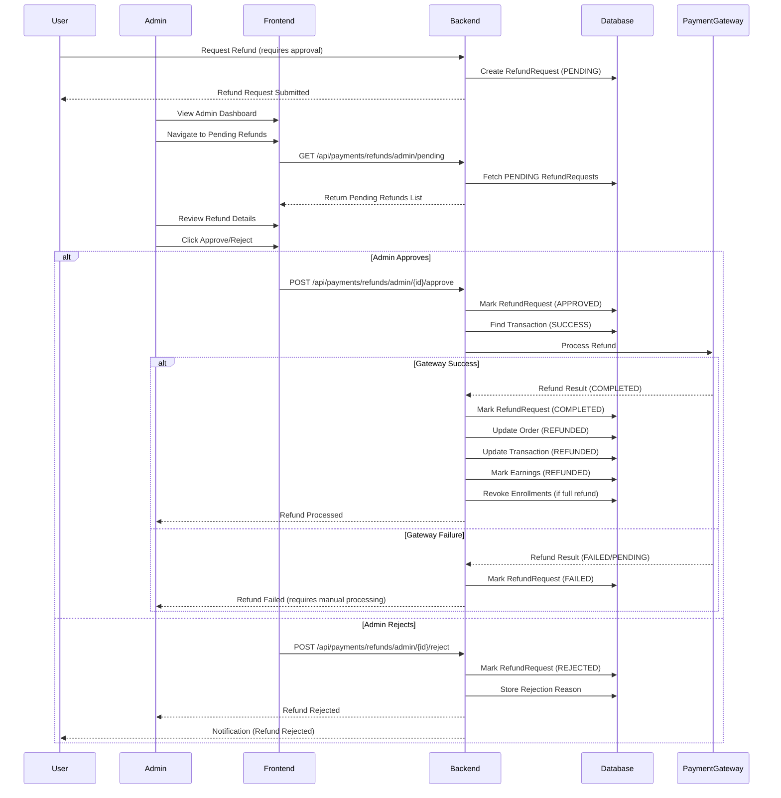
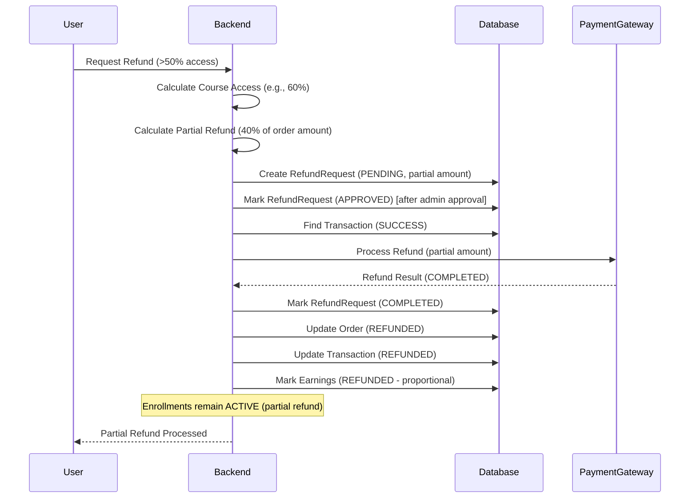
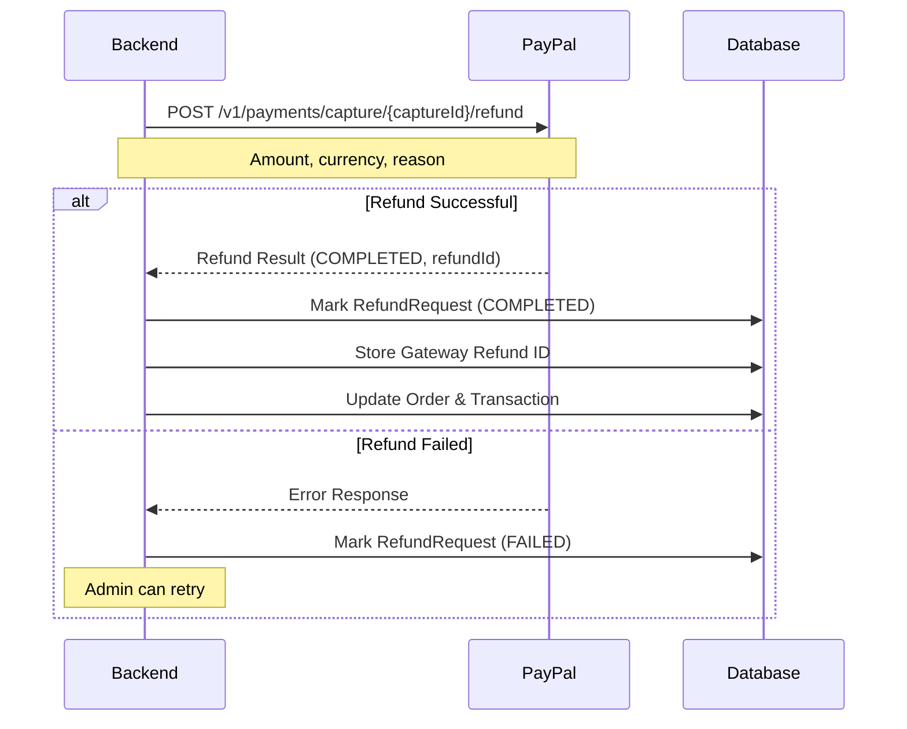
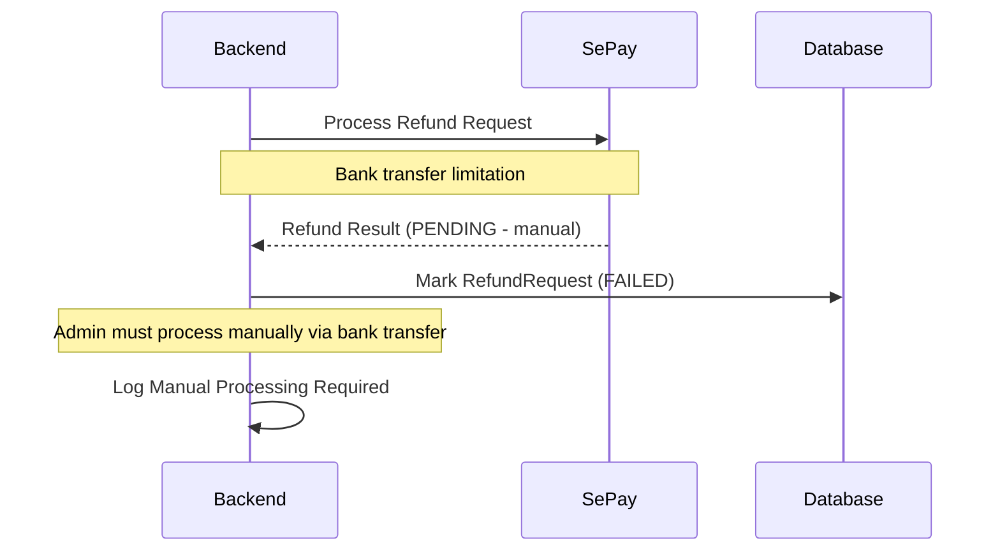
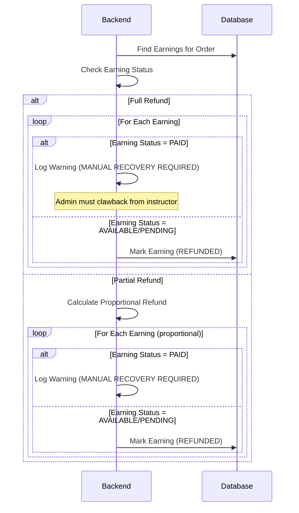
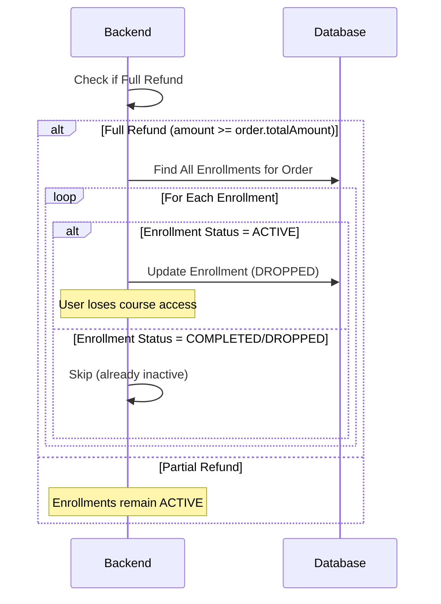
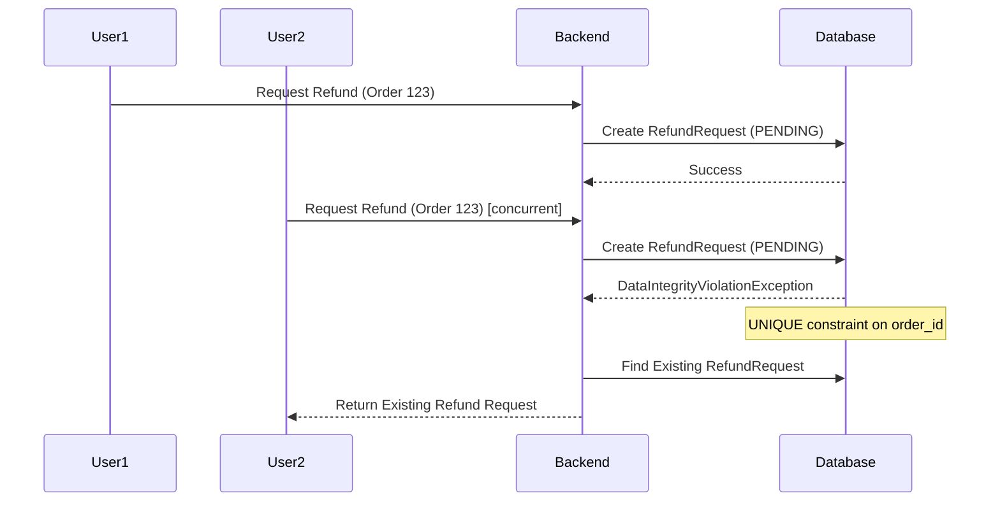
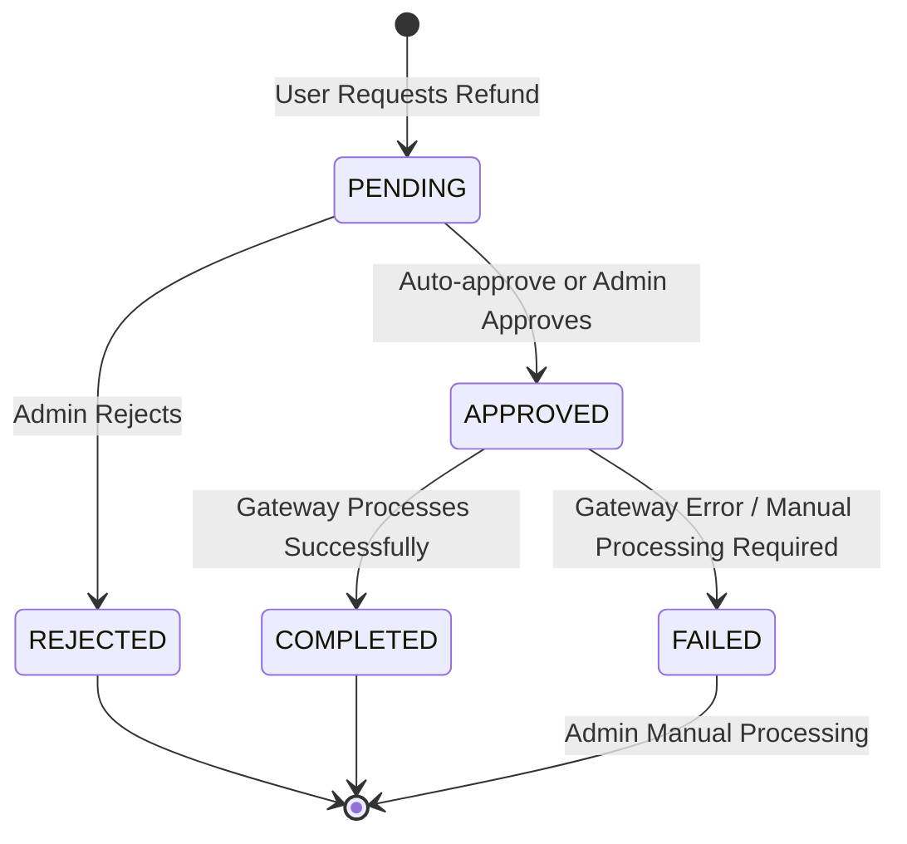

# Refund Workflows

This document describes the refund flows implemented in the EduMind LMS system. The refund system supports automatic and manual approval workflows with gateway integration.

---

## 1. Refund Request Flow (User)

Users can request refunds for completed orders within the 30-day refund window.

### Refund Policy Calculation

The system calculates refund eligibility based on:
- **Days since purchase**: Must be ≤ 30 days
- **Course access percentage**: Calculated from enrollments (ACTIVE, COMPLETED, DROPPED)

**Policy Rules:**
- **Auto-approve**: ≤7 days AND 0% course access → Full refund
- **Admin approval**: ≤30 days AND ≤50% course access → Full refund
- **Partial refund**: ≤30 days AND >50% course access → Prorated refund
- **Rejected**: >30 days since purchase

**Course Access Calculation:**
- ACTIVE enrollments: Uses `progressPercentage`
- COMPLETED enrollments: Counted as 100% access
- DROPPED enrollments: Uses recorded progress percentage
- Average across all courses in the order

---

## 2. Auto-Approval Refund Flow

Refunds that meet auto-approval criteria are processed immediately without admin intervention.

---

## 3. Admin Approval Refund Flow

Refunds requiring admin approval go through a review process.

---

## 4. Partial Refund Flow

When course access exceeds 50%, users receive a prorated refund based on access percentage.

**Partial Refund Calculation:**
- Access ratio = `courseAccessPercentage / 100`
- Refund ratio = `1 - accessRatio`
- Refund amount = `order.totalAmount × refundRatio`

**Earnings Adjustment:**
- For partial refunds, earnings are marked as REFUNDED proportionally
- If earnings are already PAID, system logs warning for manual recovery

---

## 5. Gateway Refund Processing

The system integrates with payment gateways to process refunds automatically or manually.

### PayPal Refund Processing

### SePay Refund Processing

**SePay Limitation:**
- Bank transfers cannot be automatically reversed
- System marks refund as FAILED with "Manual refund required" message
- Admin must process refund manually via bank transfer

---

## 6. Refund Processing with Earnings Recovery

When processing refunds, the system handles earnings that may already be paid out to instructors.

**PAID Earnings Handling:**
- System logs warning: "MANUAL RECOVERY REQUIRED"
- Admin must manually recover funds from instructor
- Refund still processes, but earnings remain marked as PAID

---

## 7. Enrollment Revocation Flow

Full refunds automatically revoke course enrollments.

**Enrollment Revocation Rules:**
- Only ACTIVE enrollments are revoked
- COMPLETED enrollments are not revoked (already finished)
- DROPPED enrollments are not changed (already inactive)

---

## 8. Duplicate Refund Prevention

The system prevents duplicate refund requests using database constraints and optimistic locking.

**Protection Mechanisms:**
- **Database UNIQUE constraint** on `order_id` prevents duplicates
- **Optimistic locking** via `@Version` prevents concurrent updates
- Concurrent requests return existing refund request instead of error

---

## 9. Refund Status State Machine

**Status Transitions:**
- **PENDING**: Initial state after refund request
- **APPROVED**: Auto-approved or admin-approved, ready for processing
- **REJECTED**: Admin rejected the refund request
- **COMPLETED**: Refund processed successfully via gateway
- **FAILED**: Gateway error or manual processing required (SePay)

---

## 10. Refund Policy Details

### Policy Configuration

| Configuration | Default | Description |
|--------------|---------|-------------|
| `payment.refund.auto-approve-days` | 7 | Days within which refunds auto-approve (if 0% access) |
| `payment.refund.max-refund-days` | 30 | Maximum days since purchase for refund eligibility |
| `payment.refund.partial-refund-threshold` | 50 | Course access percentage threshold for partial refunds |

### Policy Calculation Examples

| Days Since Purchase | Course Access | Refund Amount | Approval Required |
|---------------------|---------------|---------------|-------------------|
| 5 days | 0% | 100% (Full) | Auto-approve |
| 15 days | 30% | 100% (Full) | Admin approval |
| 20 days | 60% | 40% (Partial) | Admin approval |
| 35 days | Any | 0% (Not eligible) | N/A |

### Policy Amount Validation

- User-requested amount is automatically clamped to policy-eligible maximum
- System prevents policy bypass by validating against `eligibleRefundAmount`
- If user requests more than eligible, system uses eligible amount

---

## API Endpoints Summary

| Endpoint | Method | Description | Access |
|----------|--------|-------------|--------|
| `/api/payments/refunds/request` | POST | Request refund for an order | User |
| `/api/payments/refunds/policy` | GET | Get refund policy for an order | User |
| `/api/payments/refunds/my-refunds` | GET | Get user's refund history | User |
| `/api/payments/refunds/{id}` | GET | Get refund details by ID | User |
| `/api/payments/refunds/admin/pending` | GET | Get pending refunds | Admin |
| `/api/payments/refunds/admin/{id}/approve` | POST | Approve refund request | Admin |
| `/api/payments/refunds/admin/{id}/reject` | POST | Reject refund request | Admin |

---

## Key Implementation Details

### Optimistic Locking

- `RefundRequest` entity uses `@Version` for concurrent update protection
- Prevents race conditions when multiple admins process the same refund

### Transaction Isolation

- Refund processing uses proper transaction boundaries
- Gateway calls are made within transactions to ensure data consistency
- Earnings updates and enrollment revocation are atomic

### Gateway Integration

- **PayPal**: Automatic refund processing via REST API
- **SePay**: Manual processing workflow (bank transfer limitation)
- Gateway failures are tracked with FAILED status for admin retry

### Course Access Calculation

- Includes ACTIVE enrollments with progress percentage
- Includes COMPLETED enrollments (counted as 100% access)
- Includes DROPPED enrollments with recorded progress
- Average calculated across all courses in the order

### Earnings Recovery

- PAID earnings trigger manual recovery warnings
- System logs detailed information for admin intervention
- Refund still processes, but earnings remain marked as PAID

### Duplicate Prevention

- Database UNIQUE constraint on `order_id`
- Concurrent requests return existing refund instead of error
- Optimistic locking prevents concurrent status updates

---

## Error Scenarios

### Refund Request Errors

| Error | Cause | Resolution |
|-------|-------|------------|
| Order not found | Invalid order ID or user mismatch | Verify order ownership |
| Order not completed | Order status is not COMPLETED | Only completed orders can be refunded |
| Refund window expired | >30 days since purchase | Refund not eligible |
| Duplicate refund | Refund already exists for order | Return existing refund request |
| Amount exceeds eligible | Requested amount > policy maximum | System clamps to eligible amount |

### Refund Processing Errors

| Error | Cause | Resolution |
|-------|-------|------------|
| No transaction found | Order has no successful transaction | Verify order payment status |
| Gateway error | Payment gateway API failure | Retry or process manually |
| Manual processing required | SePay bank transfer limitation | Admin processes via bank transfer |
| Earnings already paid | Instructor already received payout | Manual recovery required |

---

## Testing Scenarios

### Refund Request Tests

- ✅ Auto-approve refund (≤7 days, 0% access)
- ✅ Admin approval refund (≤30 days, ≤50% access)
- ✅ Partial refund (≤30 days, >50% access)
- ✅ Refund rejection (>30 days)
- ✅ Duplicate refund prevention
- ✅ Completed course refund prevention
- ✅ Policy amount validation

### Refund Processing Tests

- ✅ PayPal automatic refund
- ✅ SePay manual refund workflow
- ✅ Enrollment revocation on full refund
- ✅ Partial refund earnings adjustment
- ✅ PAID earnings recovery handling
- ✅ Failed refund status tracking

---

**Last Updated**: Based on implementation in `RefundServiceImpl` and `RefundController`
**Status**: ✅ Core functionality complete
