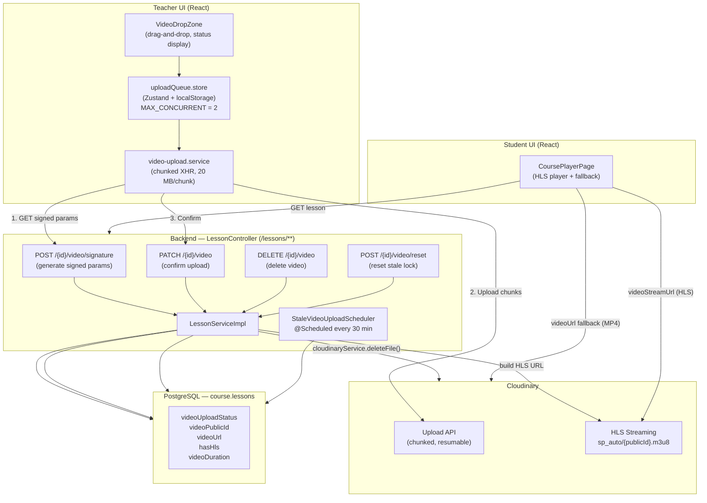
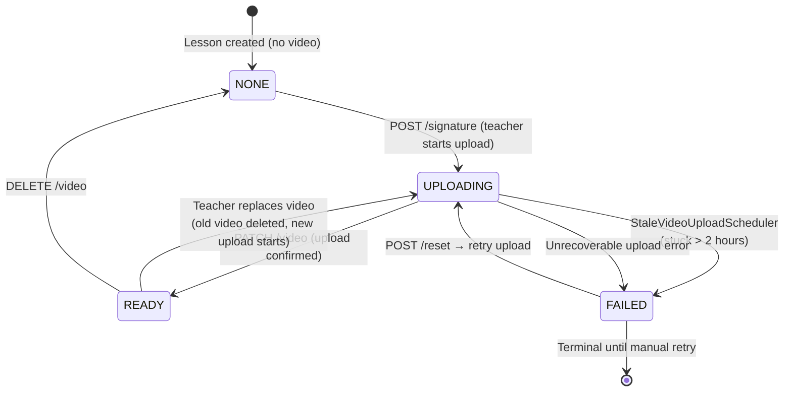
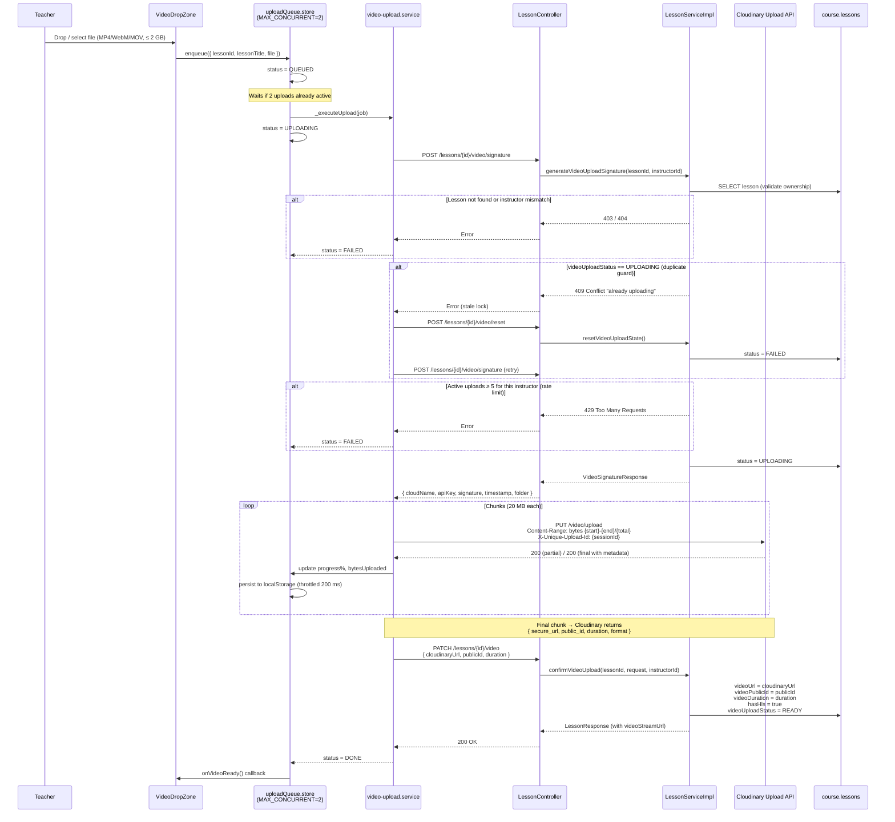
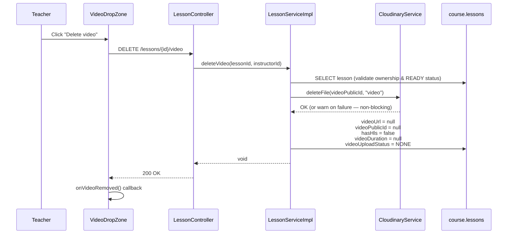
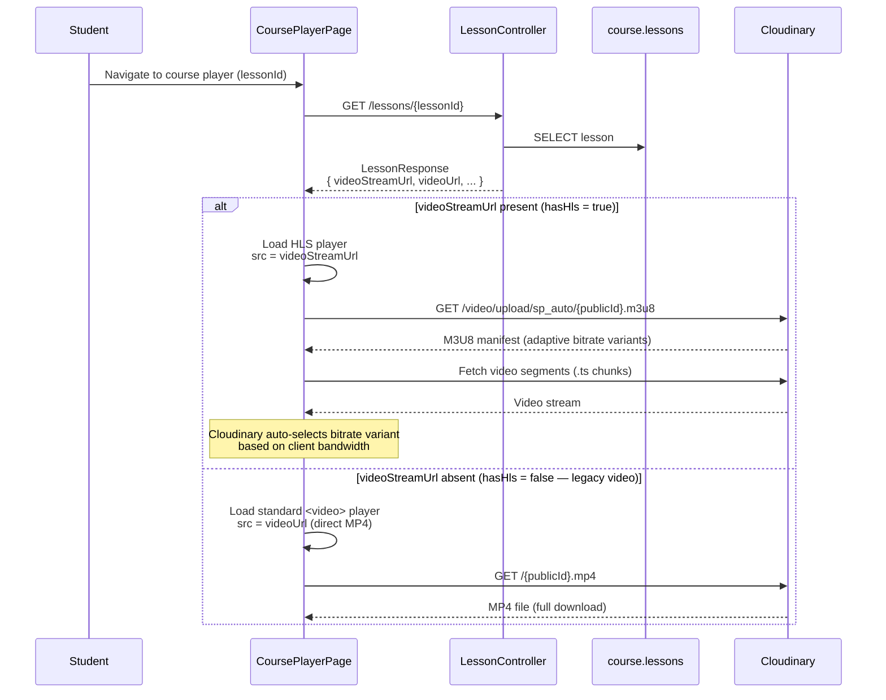

# Video Upload & Streaming Workflows

This document describes the complete video management pipeline in EduMind LMS — from a teacher uploading a video file to a student streaming it. The system uses **Cloudinary** as the video host with direct browser-to-Cloudinary chunked uploads (signed by the backend) and HLS adaptive-bitrate streaming.

---

## 1. Architecture Overview



### Key Design Principles

- **Browser-to-Cloudinary Direct Upload**: The backend never proxies video bytes. It only issues signed upload parameters; the browser uploads directly to Cloudinary. This keeps VPS bandwidth and RAM usage near zero.
- **Signed Upload Params**: Each upload is authorized via a backend-generated HMAC-SHA1 signature (Cloudinary upload preset + timestamp). Signatures expire; the frontend requests a fresh signature per upload.
- **Chunked & Resumable**: Videos are split into 20 MB chunks using the `Content-Range` header. If a session is interrupted (network drop, page reload), the `bytesUploaded` cursor stored in localStorage allows resuming from the last confirmed chunk.
- **HLS Adaptive Streaming**: After upload, the backend stores `hasHls=true` and builds a Cloudinary HLS URL (`sp_auto`). Cloudinary transcodes and serves adaptive bitrate streams — no server-side transcoding on the VPS.
- **Graceful Fallback**: If `videoStreamUrl` is absent (e.g., `hasHls=false` for legacy lessons), the player falls back to direct MP4 via `videoUrl`.

---

## 2. Video Upload Status State Machine



| Status | Description |
|--------|-------------|
| `NONE` | No video attached. Lesson has no `videoPublicId` or `videoUrl`. |
| `UPLOADING` | Backend issued signature; browser is uploading chunks to Cloudinary. |
| `READY` | Upload confirmed. `videoUrl`, `videoPublicId`, `hasHls=true`, and `videoDuration` are set. |
| `FAILED` | Upload did not complete. Caused by timeout, network error, or scheduler cleanup. |

**Stale upload cleanup**: `StaleVideoUploadScheduler` runs every **30 minutes**. It finds all lessons with `videoUploadStatus = UPLOADING` where `updatedAt < now − 2 hours` and marks them `FAILED`. This prevents a crashed browser session from permanently blocking new uploads on that lesson.

---

## 3. Teacher Upload Flow

### 3.1 High-Level Upload Sequence



### 3.2 Chunked Upload Details

```
File:  video.mp4 (e.g., 150 MB)
Chunk size: 20 MB

Chunk 1:  Content-Range: bytes 0-20971519/157286400
Chunk 2:  Content-Range: bytes 20971520-41943039/157286400
...
Chunk 8:  Content-Range: bytes 146800640-157286399/157286400  ← final chunk
          Response: { secure_url, public_id, duration, bytes, format }
```

- **Session ID** (`X-Unique-Upload-Id`): UUID generated per upload session. Stored in `localStorage` alongside `bytesUploaded`. Allows resuming from the exact byte offset if the browser is closed and reopened.
- **Range mismatch**: If Cloudinary reports a different byte offset than expected (e.g., after a partial retry), the frontend detects this, clears the saved session, and **restarts the upload from byte 0** with a new `uploadSessionId`.

### 3.3 Retry & Error Handling

```
Chunk upload fails (network error / 5xx)
  └─→ Attempt 1: wait 2s, retry same chunk
  └─→ Attempt 2: wait 4s, retry same chunk
  └─→ Attempt 3: wait 8s, retry same chunk
  └─→ All 3 attempts fail → status = FAILED

Stale lock error (409 on /signature)
  └─→ POST /lessons/{id}/video/reset  (backend: UPLOADING → FAILED)
  └─→ Retry full upload flow from /signature

Range mismatch from Cloudinary
  └─→ Generate new uploadSessionId
  └─→ Reset bytesUploaded = 0
  └─→ Restart upload from chunk 0
```

### 3.4 Pause / Resume

```
Teacher clicks Pause
  └─→ AbortController.abort()  (cancels in-flight XHR)
  └─→ status = PAUSED
  └─→ { bytesUploaded, uploadSessionId } persisted in localStorage

Teacher clicks Resume (or browser comes back online)
  └─→ status = UPLOADING (activity = RESUMING)
  └─→ _executeUpload() called again
  └─→ GET /signature (new signed params from backend)
  └─→ Resume from chunk at bytesUploaded offset
  └─→ X-Unique-Upload-Id: same uploadSessionId
```

**Auto-pause/resume**: The store listens to `window.offline` and `window.online` events. All active uploads are paused on network loss and automatically resumed when connectivity is restored.

### 3.5 Video Deletion



**Cascade delete**: When a lesson is deleted entirely (`DELETE /lessons/{id}`), `CourseEventListener.handleLessonDeleted()` fires asynchronously after the transaction commits. It calls `cloudinaryService.deleteFile(videoPublicId, "video")` if the lesson had a video — preventing orphaned files in Cloudinary.

---

## 4. Student Streaming Flow

### 4.1 HLS Streaming (Primary Path)



### 4.2 HLS URL Pattern

```
Template:  https://res.cloudinary.com/{cloudName}/video/upload/sp_auto/{publicId}.m3u8
                                                              ───────
                                                              sp_auto = Streaming Profile "auto"
                                                              Cloudinary generates adaptive bitrate variants

Example:   https://res.cloudinary.com/edumind/video/upload/sp_auto/courses/lesson_42_abc123.m3u8
```

| Parameter | Value | Notes |
|-----------|-------|-------|
| `sp_auto` | Streaming profile | Cloudinary auto-transcodes on first request; cached thereafter |
| Format | `.m3u8` | HLS manifest pointing to `.ts` segment chunks |
| Fallback | `.mp4` via `videoUrl` | Used when `hasHls = false` |

### 4.3 Progress Tracking & Resume Playback

```
On video timeupdate (throttled):
  └─→ Save { lessonId, currentTime } to localStorage every ~10 seconds
  └─→ POST /enrollments/{enrollmentId}/progress (background)

On video metadata loaded:
  └─→ Read savedTime from localStorage
  └─→ If savedTime > 0: player.currentTime = savedTime (seek to last position)

On video ended:
  └─→ Mark lesson as COMPLETED
  └─→ Auto-advance to next lesson (if available)

Manual "Mark Complete" button:
  └─→ POST /enrollments/{enrollmentId}/lessons/{lessonId}/complete
```

---

## 5. Database Schema (course.lessons — video fields)

| Column | Type | Default | Description |
|--------|------|---------|-------------|
| `video_url` | `VARCHAR` | `null` | Cloudinary secure URL (MP4) — set on confirm |
| `video_duration` | `INTEGER` | `null` | Duration in seconds — from Cloudinary metadata |
| `video_upload_status` | `VARCHAR` | `NONE` | Enum: `NONE`, `UPLOADING`, `READY`, `FAILED` |
| `video_public_id` | `VARCHAR` | `null` | Cloudinary public ID (used for deletion & HLS URL) |
| `has_hls` | `BOOLEAN` | `false` | Whether HLS stream URL should be built — set `true` on confirm |

`videoStreamUrl` is a **computed field** — it is not stored in the database. `LessonController.buildStreamUrl()` constructs it on every response:

```java
// Built at response time only if hasHls = true AND videoPublicId is set
"https://res.cloudinary.com/" + cloudName + "/video/upload/sp_auto/" + publicId + ".m3u8"
```

---

## 6. Configuration Reference

| Setting | Location | Value |
|---------|----------|-------|
| Max concurrent uploads per instructor (backend) | `LessonServiceImpl` | 5 |
| Max concurrent uploads (frontend queue) | `uploadQueue.store.ts` | `MAX_CONCURRENT = 2` |
| Chunk size | `video-upload.service.ts` | 20 MB |
| Max retries per chunk | `video-upload.service.ts` | 3 |
| Retry backoff | `video-upload.service.ts` | 2s → 4s → 8s |
| Stale upload cutoff | `StaleVideoUploadScheduler` | 2 hours |
| Scheduler interval | `StaleVideoUploadScheduler` | Every 30 minutes |
| Max file size (frontend) | `VideoDropZone.tsx` | 2 GB |
| Accepted formats | `VideoDropZone.tsx` | MP4, WebM, MOV |
| Progress persistence | `uploadQueue.store.ts` | localStorage (merge strategy) |
| Progress save throttle | `uploadQueue.store.ts` | 200 ms |
