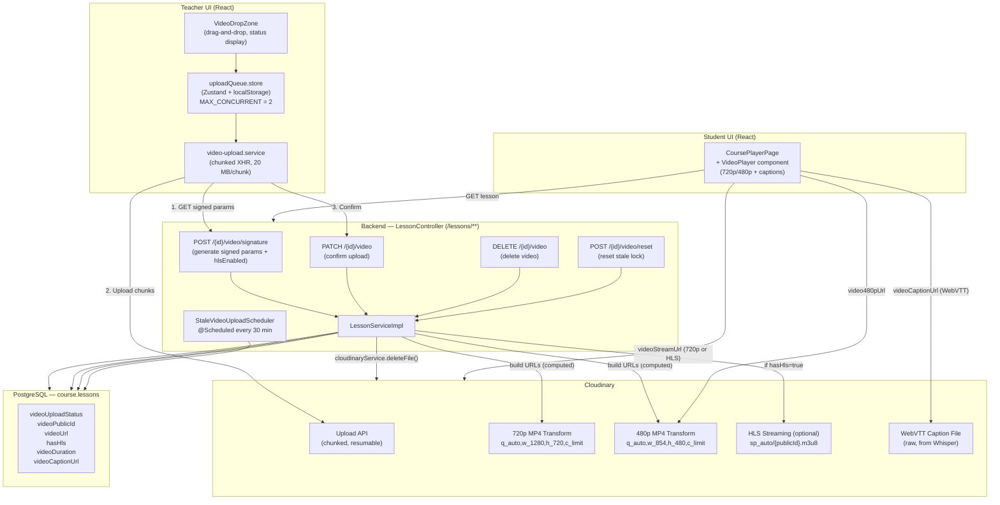
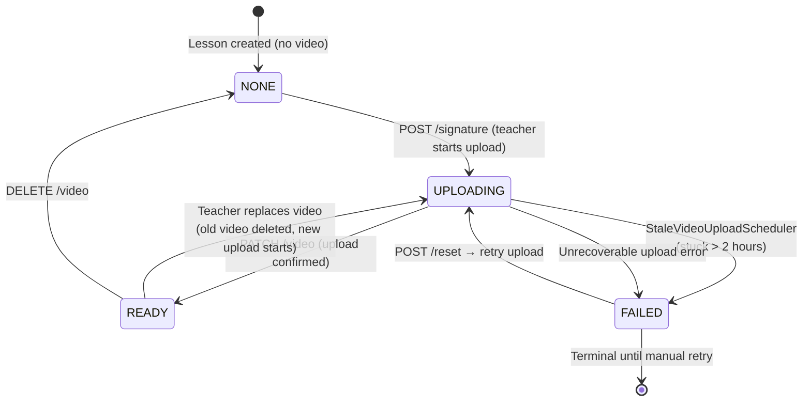
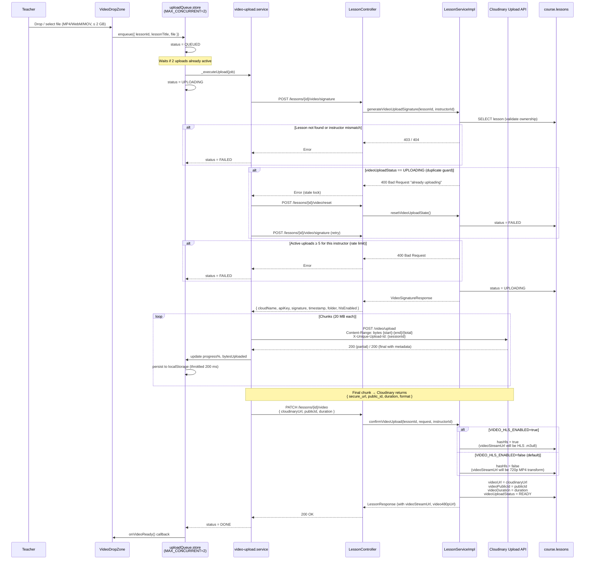
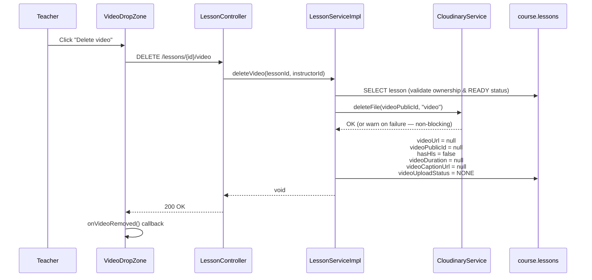
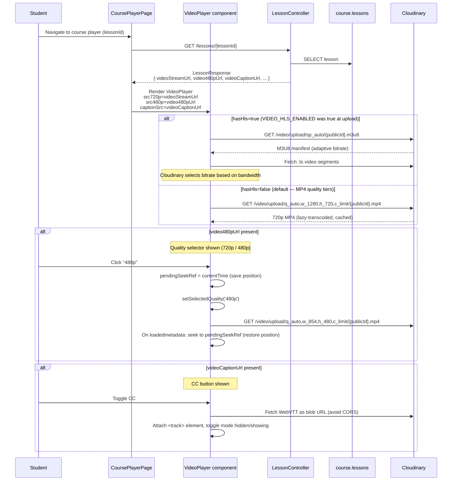

# Video Upload & Streaming Workflows

This document describes the complete video management pipeline in EduMind LMS — from a teacher uploading a video file to a student streaming it. The system uses **Cloudinary** as the video host with direct browser-to-Cloudinary chunked uploads (signed by the backend) and on-demand quality-tier streaming (720p / 480p MP4). HLS adaptive streaming is supported but **disabled by default** (opt-in via `VIDEO_HLS_ENABLED`).

---

## 1. Architecture Overview



### Key Design Principles

- **Browser-to-Cloudinary Direct Upload**: The backend never proxies video bytes. It only issues signed upload parameters; the browser uploads directly to Cloudinary. This keeps VPS bandwidth and RAM usage near zero.
- **Signed Upload Params**: Each upload is authorized via a backend-generated HMAC-SHA1 signature (Cloudinary upload preset + timestamp). Signatures expire; the frontend requests a fresh signature per upload. The response also includes `hlsEnabled` — a flag the frontend can use to anticipate whether HLS URLs will be returned.
- **Chunked & Resumable (within a session)**: Videos are split into 20 MB chunks using the `Content-Range` header. If a chunk fails or the network drops mid-session, the upload resumes from the last confirmed `bytesUploaded` offset using the same `uploadSessionId` — the `File` object is still held in memory. This does **not** survive a full page reload (see §3.4).
- **On-Demand Quality Tiers**: After upload, `LessonController` computes two quality URLs at response time using Cloudinary on-demand transformations — `videoStreamUrl` (720p) and `video480pUrl` (480p). Cloudinary lazy-transcodes and caches them on first access. No server-side processing on the VPS.
- **HLS Adaptive Streaming (Optional)**: When `VIDEO_HLS_ENABLED=true`, `hasHls` is set to `true` on confirm and `videoStreamUrl` instead returns a Cloudinary HLS URL (`sp_auto`). Off by default — MP4 quality tiers are used instead.
- **Quality Selection (Not Error-Based Fallback)**: Students can actively switch between 720p and 480p. The `VideoPlayer` component saves the current playback position before switching and restores it after the new quality loads. The quality selector is only shown when both URLs are present.
- **Caption Support**: `videoCaptionUrl` stores the Cloudinary raw URL of a WebVTT file generated by Whisper transcription. The `VideoPlayer` fetches it as a blob URL (to avoid CORS) and attaches it as a `<track>` element. A CC button is shown only when a caption URL is available.

---

## 2. Video Upload Status State Machine



| Status | Description |
|--------|-------------|
| `NONE` | No video attached. Lesson has no `videoPublicId` or `videoUrl`. |
| `UPLOADING` | Backend issued signature; browser is uploading chunks to Cloudinary. |
| `READY` | Upload confirmed. `videoUrl`, `videoPublicId`, `hasHls`, and `videoDuration` are set. |
| `FAILED` | Upload did not complete. Caused by timeout, network error, or scheduler cleanup. |

**Stale upload cleanup**: `StaleVideoUploadScheduler` runs every **30 minutes**. It finds all lessons with `videoUploadStatus = UPLOADING` where `updatedAt < now − 2 hours` and marks them `FAILED`. This prevents a crashed browser session from permanently blocking new uploads on that lesson.

---

## 3. Teacher Upload Flow

### 3.1 High-Level Upload Sequence



### 3.2 Chunked Upload Details

```
File:  video.mp4 (e.g., 150 MB)
Chunk size: 20 MB

Chunk 1:  Content-Range: bytes 0-20971519/157286400
Chunk 2:  Content-Range: bytes 20971520-41943039/157286400
...
Chunk 8:  Content-Range: bytes 146800640-157286399/157286400  ← final chunk
          Response: { secure_url, public_id, duration, bytes, format }
```

- **Session ID** (`X-Unique-Upload-Id`): UUID generated per upload session. Stored in `localStorage` alongside `bytesUploaded`. After a page reload, the queue restores the session ID and byte cursor from `localStorage`, but the browser cannot persist the `File` object itself. The teacher must re-select the original file before the upload can resume from that byte offset — see §3.4.
- **Range mismatch**: If Cloudinary reports a different byte offset than expected (e.g., after a partial retry), the frontend detects this, clears the saved session, and **restarts the upload from byte 0** with a new `uploadSessionId`.

### 3.3 Retry & Error Handling

```
Chunk upload fails (network error / 5xx)
  └─→ Attempt 1: wait 2s, retry same chunk
  └─→ Attempt 2: wait 4s, retry same chunk
  └─→ Attempt 3: wait 8s, retry same chunk
  └─→ All 3 attempts fail → status = FAILED

Stale lock error (409 on /signature)
  └─→ POST /lessons/{id}/video/reset  (backend: UPLOADING → FAILED)
  └─→ Retry full upload flow from /signature

Range mismatch from Cloudinary
  └─→ Generate new uploadSessionId
  └─→ Reset bytesUploaded = 0
  └─→ Restart upload from chunk 0
```

### 3.4 Pause / Resume

```
Teacher clicks Pause
  └─→ AbortController.abort()  (cancels in-flight XHR)
  └─→ status = PAUSED
  └─→ { bytesUploaded, uploadSessionId } persisted in localStorage

Teacher clicks Resume (or browser comes back online)
  └─→ status = UPLOADING (activity = RESUMING)
  └─→ _executeUpload() called again
  └─→ GET /signature (new signed params from backend)
  └─→ Resume from chunk at bytesUploaded offset
  └─→ X-Unique-Upload-Id: same uploadSessionId
```

**Auto-pause/resume (same session only)**: The store listens to `window.offline` and `window.online` events. All active uploads are paused on network loss and automatically resumed when connectivity is restored — this works because the `File` object is still held in memory for the duration of the page session.

**Resume after a page reload requires re-selecting the file**: `localStorage` only persists `uploadSessionId`, `bytesUploaded`, `status`, and `progress` — never the `File` itself (`File` objects are not serializable). On rehydration, every restored job gets `file: null`, and a job that was `PAUSED` is shown the message "Page was refreshed. Please re-select the file to resume." Neither the manual Resume action nor the automatic `online` handler will attempt to resume a job with `file === null`. In practice: after a page reload, the queue restores the session ID and byte cursor, but the browser cannot persist the `File` object — the teacher must re-select the original file before the upload can resume.

### 3.5 Video Deletion



**Cascade delete**: When a lesson is deleted entirely (`DELETE /lessons/{id}`), `CourseEventListener.handleLessonDeleted()` fires asynchronously after the transaction commits. It calls `cloudinaryService.deleteFile(videoPublicId, "video")` if the lesson had a video — preventing orphaned files in Cloudinary.

---

## 4. Student Streaming Flow

### 4.1 Video Streaming Flow



### 4.2 Computed URL Patterns

All video URLs returned by `LessonController` are **computed at response time** from `videoPublicId`. None are stored in the database except `videoUrl` (original Cloudinary secure URL) and `videoCaptionUrl`.

| Field | URL Template | When Present |
|-------|-------------|--------------|
| `videoStreamUrl` (HLS) | `.../video/upload/sp_auto/{publicId}.m3u8` | `hasHls=true` (opt-in) |
| `videoStreamUrl` (720p MP4) | `.../video/upload/q_auto,w_1280,h_720,c_limit/{publicId}.mp4` | `hasHls=false` (default) |
| `video480pUrl` | `.../video/upload/q_auto,w_854,h_480,c_limit/{publicId}.mp4` | Always, if `videoPublicId` is set |
| `videoCaptionUrl` | Cloudinary raw file URL (`.vtt`) | Set by Whisper transcription |

```java
// LessonController.buildStreamUrl() — called for every lesson response
if (lesson.getHasHls()) {
    // HLS mode (VIDEO_HLS_ENABLED=true was active at upload time)
    return "https://res.cloudinary.com/" + cloudName + "/video/upload/sp_auto/" + publicId + ".m3u8";
} else {
    // Default: on-demand 720p MP4 transform
    return "https://res.cloudinary.com/" + cloudName + "/video/upload/q_auto,w_1280,h_720,c_limit/" + publicId + ".mp4";
}

// LessonController.build480pUrl() — always computed if videoPublicId is set
return "https://res.cloudinary.com/" + cloudName + "/video/upload/q_auto,w_854,h_480,c_limit/" + publicId + ".mp4";
```

### 4.3 VideoPlayer Component

`VideoPlayer.tsx` (`frontend/apps/user/src/app/components/learning/VideoPlayer.tsx`) is a dedicated player component used by `CoursePlayerPage`. It replaces the previously inline `ReactPlayer` approach.

**Props:**

| Prop | Type | Description |
|------|------|-------------|
| `src720p` | `string?` | 720p MP4 URL (or HLS `.m3u8` if `hasHls=true`) — primary quality |
| `src480p` | `string?` | 480p MP4 URL — lower quality option |
| `fallbackSrc` | `string?` | Direct MP4 `videoUrl` — last-resort fallback |
| `captionSrc` | `string?` | Cloudinary WebVTT URL — fetched as blob to avoid CORS |

**Features:**
- **Quality switching**: 720p/480p toggle shown only when both `src720p` and `src480p` are present. Saves `currentTime` to `pendingSeekRef` before switching; restores position on `loadedmetadata`.
- **Captions**: CC button shown only when `captionSrc` is provided. Fetches VTT as a blob URL to work around Cloudinary CORS. Attaches a `<track>` element and toggles `mode` between `hidden` / `showing`.
- **Playback controls**: Play/pause, seek bar with buffered indicator, volume with mute, playback speed (0.5×–2×), quality selector, fullscreen.
- **Keyboard shortcuts**: `Space`/`k` (play/pause), `←`/`→` (seek ±5s), `↑`/`↓` (volume), `f` (fullscreen), `m` (mute).
- **Auto-hide controls**: Controls fade after 3 seconds of inactivity (fullscreen mode).
- **`forwardRef`**: Exposes the underlying `HTMLVideoElement` to parent components.

### 4.4 Progress Tracking & Resume Playback

```
On video timeupdate (throttled):
  └─→ Save { lessonId, currentTime } to localStorage every ~10 seconds
  └─→ POST /enrollments/{enrollmentId}/progress (background)

On video metadata loaded:
  └─→ If pendingSeekRef set (quality switch): seek to pendingSeekRef (priority 1)
  └─→ Else read savedTime from localStorage: seek to last position (priority 2)

On video ended:
  └─→ Mark lesson as COMPLETED
  └─→ Auto-advance to next lesson (if available)

Manual "Mark Complete" button:
  └─→ POST /enrollments/{enrollmentId}/lessons/{lessonId}/complete
```

---

## 5. Database Schema (course.lessons — video fields)

| Column | Type | Default | Description |
|--------|------|---------|-------------|
| `video_url` | `VARCHAR` | `null` | Cloudinary secure URL (original MP4) — set on confirm |
| `video_duration` | `INTEGER` | `null` | Duration in seconds — from Cloudinary metadata |
| `video_upload_status` | `VARCHAR` | `NONE` | Enum: `NONE`, `UPLOADING`, `READY`, `FAILED` |
| `video_public_id` | `VARCHAR` | `null` | Cloudinary public ID — used for deletion and computing quality URLs |
| `has_hls` | `BOOLEAN` | `false` | Whether to build HLS URL — set `true` on confirm only if `VIDEO_HLS_ENABLED=true` |
| `video_caption_url` | `TEXT` | `null` | Cloudinary URL of WebVTT caption file (generated by Whisper transcription) |

**Computed fields** (not stored, built on every `LessonController.toResponse()` call):

- `videoStreamUrl` — 720p MP4 transform (`hasHls=false`) **or** HLS `.m3u8` (`hasHls=true`)
- `video480pUrl` — 480p MP4 transform, always present if `videoPublicId` is set

---

## 6. Configuration Reference

| Setting | Location | Value |
|---------|----------|-------|
| HLS enabled flag | `application.yml` → `video.hls.enabled` / `VIDEO_HLS_ENABLED` env var | `false` (default) |
| HLS streaming profile | `LessonController.buildStreamUrl()` | `sp_auto` |
| 720p MP4 transform | `LessonController.buildStreamUrl()` | `q_auto,w_1280,h_720,c_limit` |
| 480p MP4 transform | `LessonController.build480pUrl()` | `q_auto,w_854,h_480,c_limit` |
| Max concurrent uploads per instructor (backend) | `LessonServiceImpl` | 5 (hard-coded literal — not in `application.yml`/env) |
| Max concurrent uploads (frontend queue) | `uploadQueue.store.ts` | `MAX_CONCURRENT = 2` |
| Chunk size | `video-upload.service.ts` | 20 MB |
| Max retries per chunk | `video-upload.service.ts` | 3 |
| Retry backoff | `video-upload.service.ts` | 2s → 4s → 8s |
| Stale upload cutoff | `StaleVideoUploadScheduler` | 2 hours (hard-coded literal — not in `application.yml`/env) |
| Scheduler interval | `StaleVideoUploadScheduler` | Every 30 minutes (hard-coded literal — not in `application.yml`/env) |
| Max file size (frontend) | `VideoDropZone.tsx` | 2 GB |
| Accepted formats | `VideoDropZone.tsx` | MP4, WebM, MOV |
| Progress persistence | `uploadQueue.store.ts` | localStorage (merge strategy) |
| Progress save throttle | `uploadQueue.store.ts` | 200 ms |
